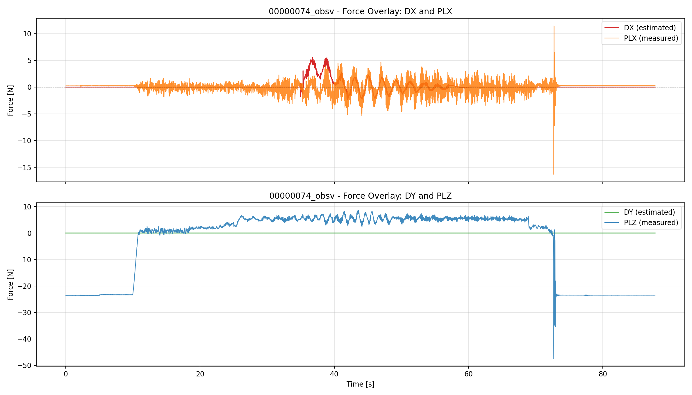
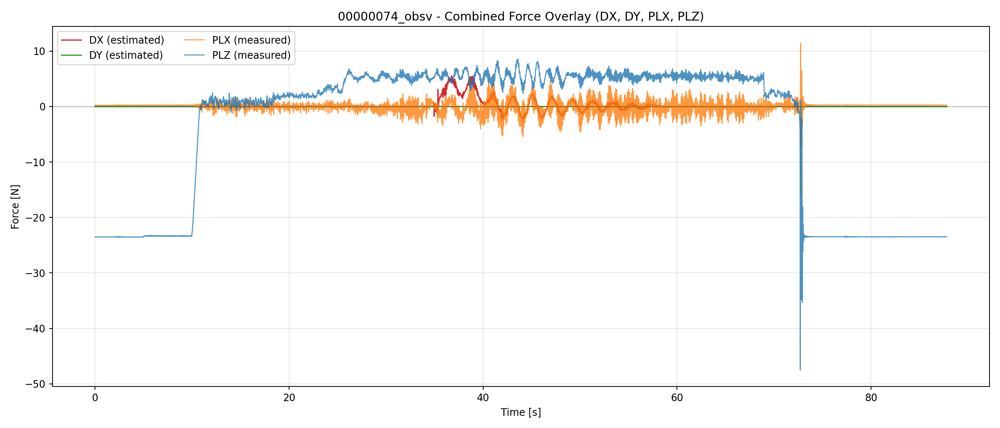
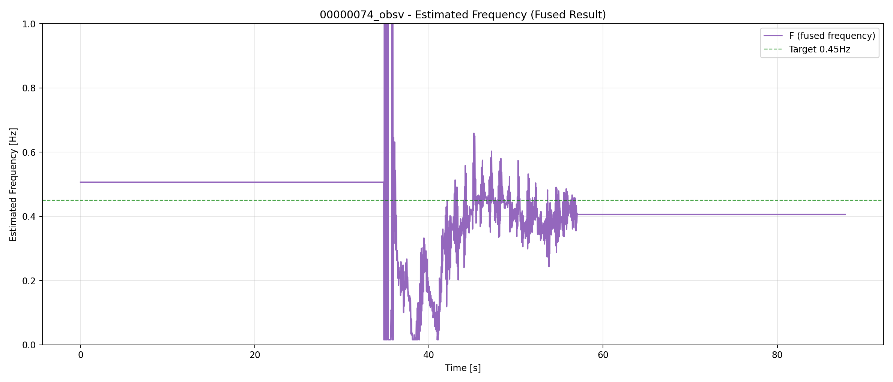
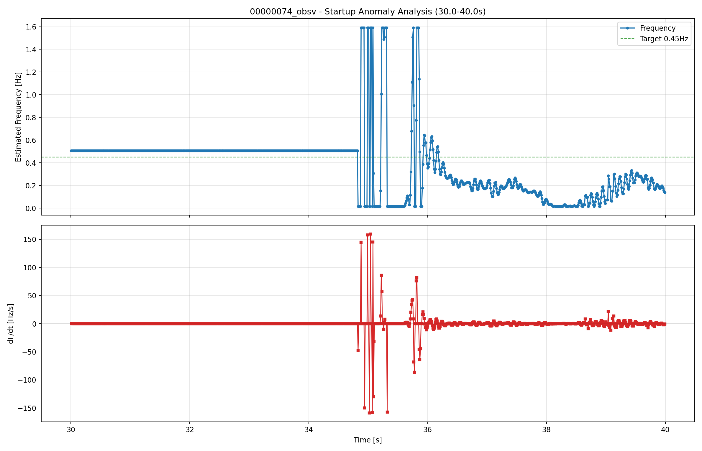
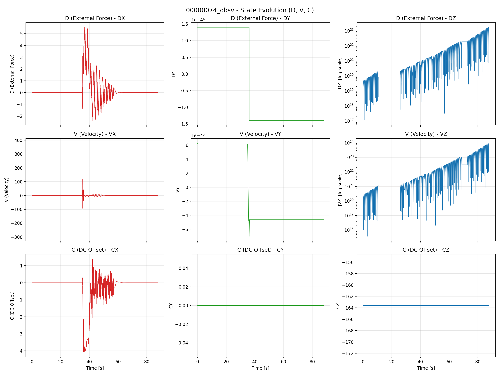

# AP_Observer EKF 実機BIN評価: 00000074

## 入力情報
- 元BIN: analysis/ekf_eval/flight/data/bin/00000074.BIN
- サンプル数: 8781
- 記録時間: 87.80秒
- サンプリングレート: 100.00 Hz

## 状態変数の定義
- **D (DX, DY, DZ)**: EKFが推定した外力（予測時刻=0）。各軸ごとの推定ペイロード力 [N]
- **V (VX, VY, VZ)**: 推定外力の変化率（Dの時間微分）[N/s]
- **C (CX, CY, CZ)**: DCオフセット成分 [N]
- **F**: 融合周波数推定値 [Hz]（各軸の周波数推定を統合したもの）

## 主要指標
- sw_active_ratio: 0.0（SW常時OFF・本テスト条件で正常）
- sw_transitions: 0
- F_mean: 0.4315 Hz
- F_std: 0.1199 Hz
- F_min: 0.0159 Hz
- F_max: 1.5915 Hz
- freq_p95_step_hz: 0.0300 Hz/s
- plx_dom_freq_hz: 0.4783 Hz
- ply_dom_freq_hz: 0.4669 Hz
- freq_mean_vs_dom_abs_err_hz: 0.0468 Hz
- DZ_max: 1.717e+23（⚠️異常）
- VZ_max: 8.836e+23（⚠️異常）
- CY_std: 0.0（⚠️変動なし）

## 詳細解析結果

### 推定外力の時系列（予測時刻=0s）
- **DX**: 平均約0.18N、標準偏差約0.88Nで正常に追従（PLXとの重ね合わせ表示）
- **DY**: 変動小（本図ではPLZとの重ね合わせ表示）
- **DZ**: 1e23オーダーまで発散（Z軸状態破綻）

#### 図: 推定外力

### 周波数推定の解析

#### F値（融合周波数）の推移
- 平均: 0.431 Hz（目標0.45Hzに近い）
- 標準偏差: 0.120 Hz
- p95ステップ: 0.030 Hz/s（ジッター小、平滑）

※OBSVログでは軸別周波数（X/Y別）は記録されておらず、融合周波数 `F` のみが記録されています。

#### 起動時異常（30-40秒）
ウィンドウ解析（30s-40s）:
- 平均: 0.373 Hz
- 標準偏差: 0.285 Hz
- 最大変化率: 159 Hz/s（非常に大きい・推定不安定）

主な要因:
1. **エネルギーゲートのヒステリシス**: RMSが閾値付近で振動しON/OFFを繰り返す
2. **初期化ノイズ**: 観測履歴が不足し小さな入力変動で大きく振れる
3. **軸ごとのゲートタイミング不一致**: X/Y軸の判定タイミングがずれ、融合値が振動

### 状態変数の推移
Z軸の発散は下記図で明確:
- DZが1e23まで発散
- VZも同様に発散
- CZは-163.6で固定

XY軸は有界で正常

**原因仮説**: Z軸EKF状態が初期化されていない、または軸マスク設定によりZ軸のみ更新されず発散した可能性

## リプレイベースライン比較（既存レポート）
| source | sw_active_ratio | sw_transitions | freq_mean_hz | freq_std_hz |
| --- | --- | --- | --- | --- |
| analysis/replay/results/runs/00000443/00000443_bin_result.csv | 0.4878 | 2 | 0.5392 | 0.0645 |
| analysis/replay/results/runs/00000444/00000444_bin_result.csv | 0.3554 | 2 | 0.5435 | 0.0819 |

※リプレイログはSWのON/OFF遷移あり。本実機ログはSW常時OFF（本テスト条件で正常）。

## 主な所見
- [情報] **SW常時OFFは正常**: SW=0が全期間で正しいテスト条件
- [中] **SW OFF時も周波数推定は良好**: 平均0.43Hz（目標0.45Hz）、ジッター小
- [高] **起動時異常（35秒付近）**: 最大変化率159Hz/s。エネルギーゲート境界や初期化ノイズが主因
- [重大] **Z軸状態発散**: DZ, VZが1e23まで発散。SW制御とは無関係にZ軸EKFが破綻
- [中] **CYが0で固定**: Y軸DCオフセットに変動なし

## 総合評価
✅ **XY軸は正常に推定**
- D, V, C状態はX/Y軸で有界かつ妥当
- 周波数推定もジッター小で安定

⚠️ **Z軸状態破綻**
- Z軸EKF状態が初期化・更新されていない可能性
- SW制御とは無関係に発散
- AP_Observerの初期化・軸別ロジック要確認

⚠️ **起動時トランジェント（35秒付近）**
- エネルギーゲートのヒステリシスで周波数が振動
- ヒステリシス幅の拡大や応答平滑化を検討

## 付属ファイル
- `analysis_summary.json`: 起動時異常の指標
- `DETAILED_ANALYSIS.md`: 詳細状態解析
- `estimated_force_per_axis.png`: D状態（外力）各軸
- `estimated_force_combined.png`: D状態（外力）全軸
- `frequency_fused.png`: 融合周波数（OBSV:F）
- `frequency_startup_anomaly.png`: 起動時異常（ズーム・変化率）
- `state_evolution.png`: D, V, C状態の推移（発散可視化）
- `obsv_csv`: analysis/ekf_eval/flight/data/csv/00000074_obsv.csv
- `overview_png`: analysis/ekf_eval/flight/reports/00000074_20260427_131945/overview.png
- `summary_json`: analysis/ekf_eval/flight/reports/00000074_20260427_131945/summary.json

