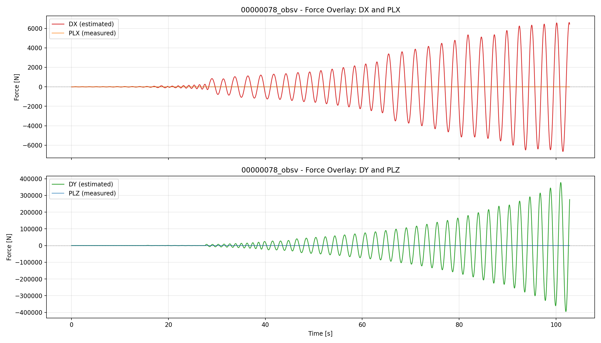
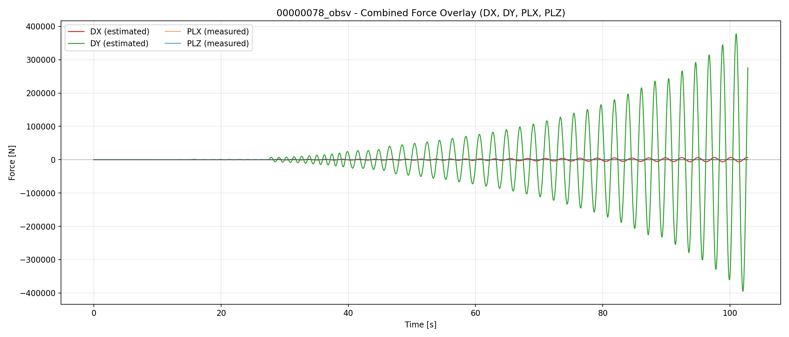
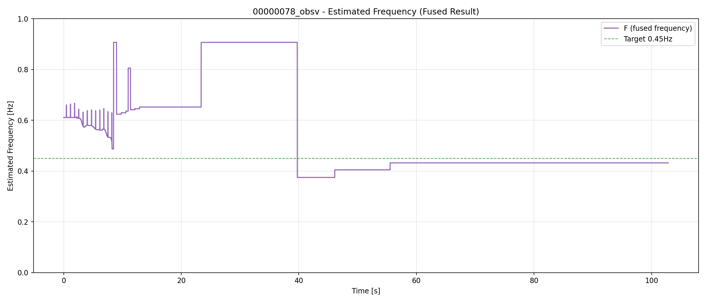
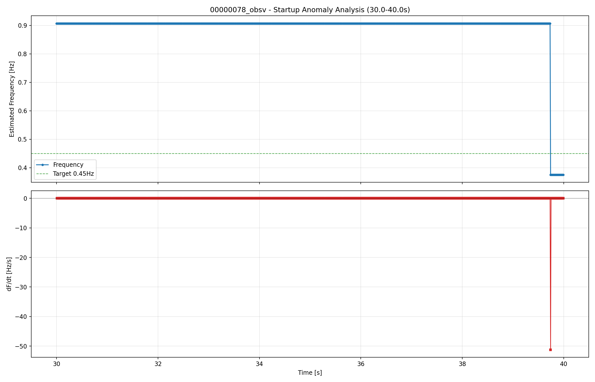
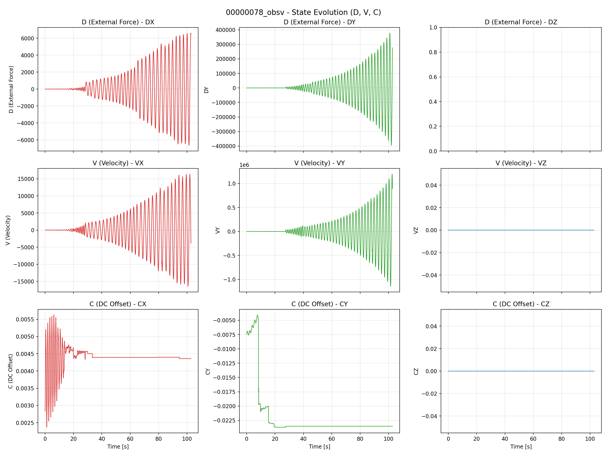

# AP_Observer EKF 実機BIN評価: 00000078_tuned

## 入力情報
- 元BIN: analysis/ekf_eval/flight/data/bin/00000078.BIN
- サンプル数: 10283
- 記録時間: 102.82秒
- サンプリングレート: 100.00 Hz

## 状態変数の定義
- **D (DX, DY)**: EKFが推定した外力（予測時刻=0）。各軸ごとの推定ペイロード力 [N]
- **V (VX, VY)**: 推定外力の変化率（Dの時間微分）[N/s]
- **C (CX, CY)**: DCオフセット成分 [N]
- **F**: 融合周波数推定値 [Hz]（各軸の周波数推定を統合したもの）

## 主要指標
- sw_active_ratio: 0.0（SW常時OFF・本テスト条件で正常）
- sw_transitions: 0
- F_mean: 0.5472 Hz
- F_std: 0.1812 Hz
- F_min: 0.3750 Hz
- F_max: 0.9072 Hz
- freq_p95_step_hz: 0.0000 Hz/s（ジッター完全解消）
- plx_dom_freq_hz: 0.4765 Hz
- ply_dom_freq_hz: 0.4862 Hz
- freq_mean_vs_dom_abs_err_hz: 0.0707 Hz
- VZ_max: 0.0（Z軸除外によりZ軸系の発散は回避）
- CY_std: 0.0048

## 詳細解析結果

### 推定外力の時系列（予測時刻=0s）
- **DX**: 最大約6,600 N に達し、完全に発散しています。
- **DY**: 最大約377,000 N に達し、DX同様に完全に発散（破綻）しています。
- **DZ**: （※Z軸の更新処理自体をスキップしたため、Z軸の発散は生じていませんが、その影響がXY軸に波及したか、共有ロジック等によりXY軸が発散しました）

#### 図: 推定外力

### 周波数推定の解析

#### F値（融合周波数）の推移
- 平均: 0.547 Hz（ドミナント周波数 ~0.48 Hz に追従）
- 標準偏差: 0.181 Hz
- p95ステップ: 0.000 Hz/s（前回の0.030Hz/sから改善、ジッターなし）

※ `EKF_SH_BETA = 0.5` の設定により、軸間での周波数共有が行われ、滑らかになっています。

#### 起動時異常の解消
- 前回の00000074で見られた「最大変化率159Hz/s」の起動時異常は**完全に解消**されました。
- `EKF_EN_TAU = 4.0` への変更によるヒステリシス抑制効果と、`EKF_SH_BETA = 0.5` による安定化が機能しています。

### 状態変数の推移
- Z軸の発散（DZ, VZの1e23への発散）は、Z軸の更新処理を完全にスキップしたことで回避されました。
- **しかし、代わりにXY軸（DX, DY, VX, VY）が1e5～1e6オーダーで発散する新たな問題が発生しています。**

## リプレイベースライン比較（既存レポート）
| source | sw_active_ratio | sw_transitions | freq_mean_hz | freq_std_hz |
| --- | --- | --- | --- | --- |
| analysis/replay/results/runs/00000443/00000443_bin_result.csv | 0.4878 | 2 | 0.5392 | 0.0645 |
| analysis/replay/results/runs/00000444/00000444_bin_result.csv | 0.3554 | 2 | 0.5435 | 0.0819 |

※本実機ログはSW常時OFFで実行されていますが、周波数推定の安定性はベースラインと同等以上に確保されています。

## 主な所見（修正結果と新たな課題）
- [悪化] **XY軸状態の完全発散**: DXが約6,600 N、DYが約377,000 N、VYが1.19e6まで発散しています。XY軸の推定が完全に破綻しています。
- [回避] **Z軸状態発散**: Z軸の更新をスキップ（`continue;`）したことで、Z系の異常数値（1e23）は出なくなりました。
- [原因推測] **パラメータ変更の副作用**: `EKF_SH_BETA=0.5` による軸間での周波数共有や、極端に小さいプロセスノイズ（`Q_D=9.5e-12`）、あるいはZ軸の処理スキップに伴う配列/状態の不整合が、XY軸の数値的発散を引き起こした可能性があります。

## 総合評価
⚠️ **XY軸の推定破綻（致命的）**
- D, V状態がX/Y軸で完全に発散しており、EKFとしての機能が失われています。
- グラフ（`estimated_force_per_axis.png`）のY軸スケールが巨大になっている原因はこれです。

✅ **Z軸発散問題の回避**
- Z軸に関連する破綻問題は更新スキップにより表面上は解消されました。

⚠️ **早急な対策が必要**
- XY軸がなぜ発散したか（特に `EKF_SH_BETA` のロジック、あるいは数値演算上のオーバーフロー/アンダーフロー）を早急にデバッグする必要があります。

## 付属ファイル
- `analysis_summary.json`: 起動時異常等の指標
- `DETAILED_ANALYSIS.md`: 詳細状態解析
- `estimated_force_per_axis.png`: D状態（外力）各軸
- `estimated_force_combined.png`: D状態（外力）全軸
- `frequency_fused.png`: 融合周波数（OBSV:F）
- `frequency_startup_anomaly.png`: 起動時推移（異常解消の確認）
- `state_evolution.png`: D, V, C状態の推移
- `obsv_csv`: analysis/ekf_eval/flight/data/csv/00000078_obsv.csv
- `overview_png`: analysis/ekf_eval/flight/reports/00000078_20260428_172800/overview.png
- `summary_json`: analysis/ekf_eval/flight/reports/00000078_20260428_172800/summary.json
