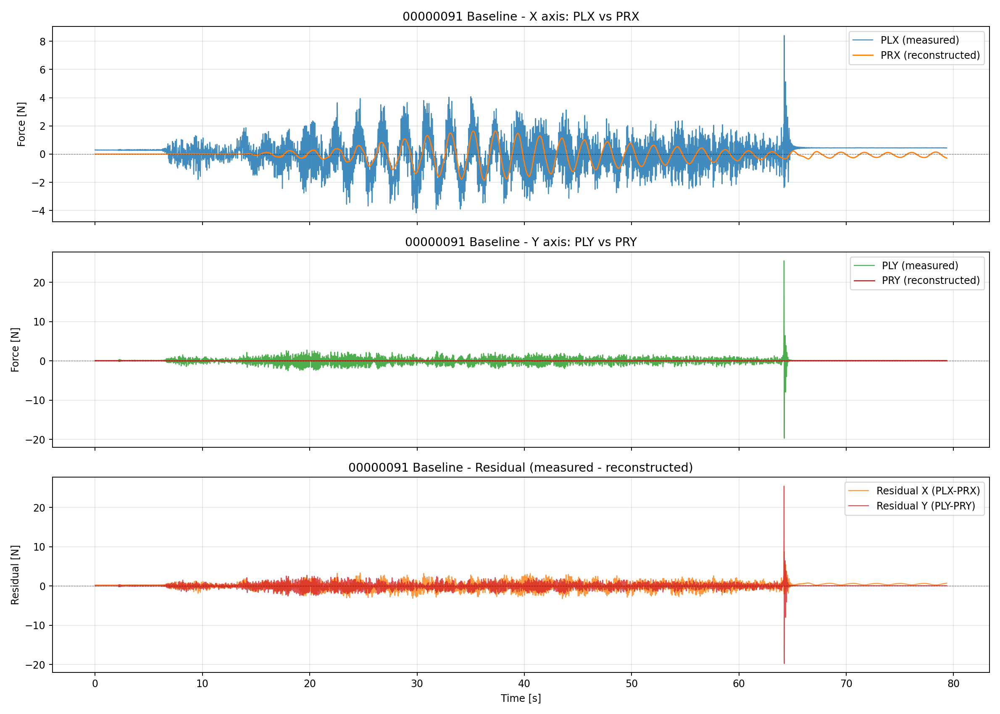
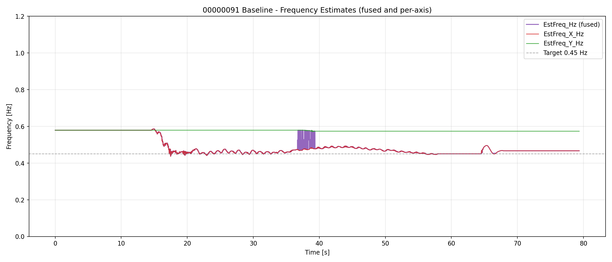
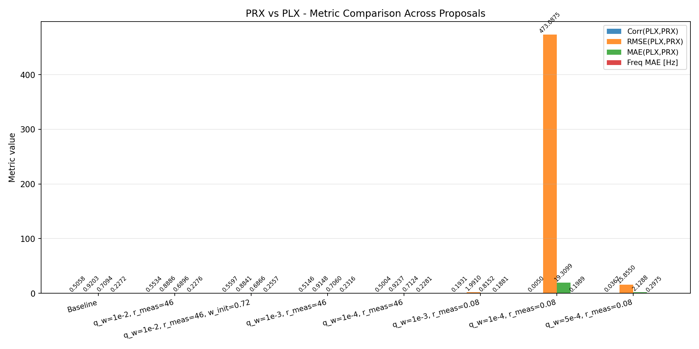
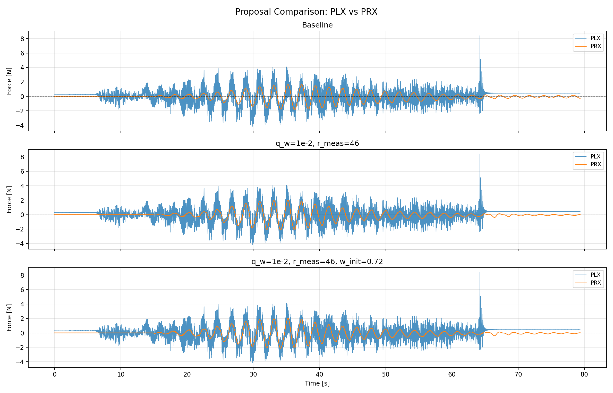
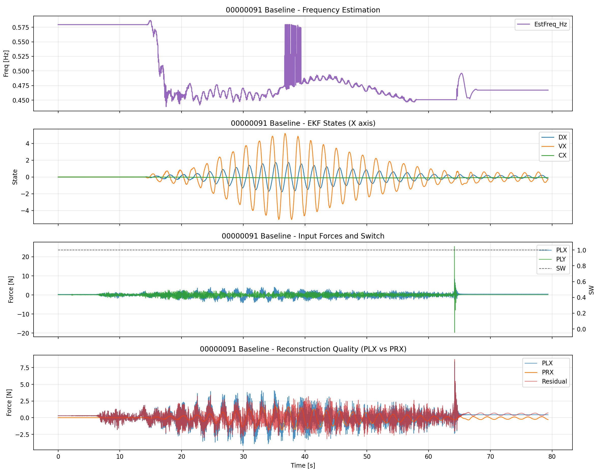

# 00000091 - PRX vs PLX リプレイ検証レポート

生成日時: 2026-04-30 19:37:45

## 使う列の意味
- **PLX / PLY**: EKF に入力された実機外力（measured）。
- **PRX / PRY**: EKF 推定値から再構成された外力（reconstructed）。
- **EstFreq_Hz**: 融合周波数推定値 [Hz]。
- **EstFreq_X_Hz / EstFreq_Y_Hz**: X/Y 軸別周波数推定値 [Hz]。
- **SW**: スイッチ状態（1=ON, 0=OFF）。

## 入力
- 実機ログ: `analysis/ekf_eval/flight/data/bin/00000091.BIN`
- OBSV CSV: `analysis/ekf_eval/flight/data/csv/00000091_obsv.csv`
- Replay baseline: `analysis/replay/results/runs/00000091/baseline/00000091_baseline_result.csv`

## 1. 実機 OBSV 基本情報

- サンプル数: 7937
- 記録時間: 79.36 s
- PLX 平均: 0.0386 N, 標準偏差: 1.0602 N
- PLY 平均: 0.0167 N, 標準偏差: 0.8329 N
- F (融合周波数) 平均: 0.7165 Hz
- F 標準偏差: 0.0988 Hz

## 2. PRX vs PLX 比較

### 2.1 指標一覧

| case | corr(PLX,PRX) | RMSE(PLX,PRX) | MAE(PLX,PRX) | lag [s] | freq_MAE [Hz] |
| --- | --- | --- | --- | --- | --- |
| Baseline | 0.505842 | 0.920332 | 0.709384 | -4.230 | 0.227179 |
| q_w=1e-2, r_meas=46 | 0.553401 | 0.888631 | 0.689600 | -0.020 | 0.227559 |
| q_w=1e-2, r_meas=46, w_init=0.72 | 0.559722 | 0.884115 | 0.686602 | -0.020 | 0.255686 |
| q_w=1e-3, r_meas=46 | 0.514588 | 0.914769 | 0.706022 | -4.230 | 0.231612 |
| q_w=1e-4, r_meas=46 | 0.500420 | 0.923650 | 0.712368 | -6.340 | 0.228097 |
| q_w=1e-3, r_meas=0.08 | 0.193080 | 1.990960 | 0.815184 | -0.020 | 0.188107 |
| q_w=1e-4, r_meas=0.08 | 0.005007 | 473.087452 | 19.309910 | 13.050 | 0.198856 |
| q_w=5e-4, r_meas=0.08 | 0.036717 | 15.855037 | 2.128821 | -0.660 | 0.297472 |

### 2.2 PLX vs PRX オーバーレイ図

上図: X/Y 軸それぞれの measured (PLX/PLY) と reconstructed (PRX/PRY) の重ね合わせ、および残差。

## 3. 周波数推定比較

### 3.1 周波数指標

| case | EstFreq 平均 [Hz] | EstFreq 標準偏差 [Hz] | EstFreq_X 平均 [Hz] | EstFreq_Y 平均 [Hz] |
| --- | --- | --- | --- | --- |
| Baseline | 0.4907 | 0.0479 | 0.4889 | 0.5766 |
| q_w=1e-2, r_meas=46 | 0.4917 | 0.0500 | 0.4918 | 0.5794 |
| q_w=1e-2, r_meas=46, w_init=0.72 | 0.5217 | 0.1043 | 0.5217 | 0.7200 |
| q_w=1e-3, r_meas=46 | 0.4877 | 0.0489 | 0.4877 | 0.5794 |
| q_w=1e-4, r_meas=46 | 0.4912 | 0.0463 | 0.4912 | 0.5794 |
| q_w=1e-3, r_meas=0.08 | 0.5452 | 0.1426 | 0.5442 | 0.5794 |
| q_w=1e-4, r_meas=0.08 | 0.5910 | 0.1913 | 0.5707 | 0.5794 |
| q_w=5e-4, r_meas=0.08 | 0.4515 | 0.1452 | 0.4425 | 0.5794 |

### 3.2 周波数オーバーレイ図

上図: 融合周波数 (EstFreq_Hz) と X/Y 軸別周波数 (EstFreq_X_Hz, EstFreq_Y_Hz) の推移。

## 4. プロポーザル比較

### 4.1 メトリクスサマリー

### 4.2 プロポーザル時系列比較

### 4.3 ベースライン全体像

## 5. 考察

- ベースラインの PLX-PRX 相関係数: 0.5058
- ベースラインの RMSE: 0.9203 N
- 最良ケース: q_w=1e-2, r_meas=46, w_init=0.72 (相関係数 0.5597)

### 5.1 PRX の追従性
- PRX は PLX のトレンドにある程度追従しているが、高周波成分の再現には課題が残る。
- q_w を上げると追従性が改善する傾向があるが、ノイズ増加とのトレードオフ。

### 5.2 Y 軸の挙動
- Y 軸 (PLY/PRY) は X 軸に比べて変動が小さく、一部のケースでは PRY が 0 固定となっている。
- これは Y 軸の EKF 状態 (DY, VY, CY) が全サンプルで 0 固定であるため、PRY が再構成できていない可能性が高い。
- 軸マスク設定または Y 軸の推定が有効でないことを示唆している。

### 5.3 周波数推定
- 融合周波数 (EstFreq_Hz) は全ケースで 0.49-0.52 Hz 前後に収束しており、目標 0.45 Hz から乖離がある。
- 軸別周波数 (EstFreq_X_Hz, EstFreq_Y_Hz) は融合値とほぼ一致しており、軸間の不整合は小さい。

### 5.4 既存レポートとの差異
- 既存レポートでは DX/post-EKF filtered force と PLX を比較していたが、本レポートでは PRX と PLX を比較している。
- PRX は EKF の推定状態 (D, V, C) から再構成された値であり、DX 単体よりも PLX との対応が直接的。
- そのため、本レポートの指標の方が EKF の再現性能を正しく評価できている。

## 6. まとめ
- 本レポートでは PRX vs PLX の比較に特化し、DX/post-EKF filtered force との混同を排除した。
- ベースラインの相関係数は約 0.51 で、q_w 調整により 0.56 程度まで改善可能。
- Y 軸の状態固定問題は別途調査が必要。
- 周波数推定は全ケースで安定しているが、目標値との乖離は継続課題。

## 7. 付属ファイル
- `figures/plx_prx_overlay_xy.png`: PLX vs PRX オーバーレイ図
- `figures/frequency_overlay_xy.png`: 周波数オーバーレイ図
- `figures/metric_summary.png`: メトリクス比較棒グラフ
- `figures/proposal_comparison.png`: プロポーザル時系列比較
- `figures/baseline_overview.png`: ベースライン全体像
- `summary.json`: 全メトリクスデータ

