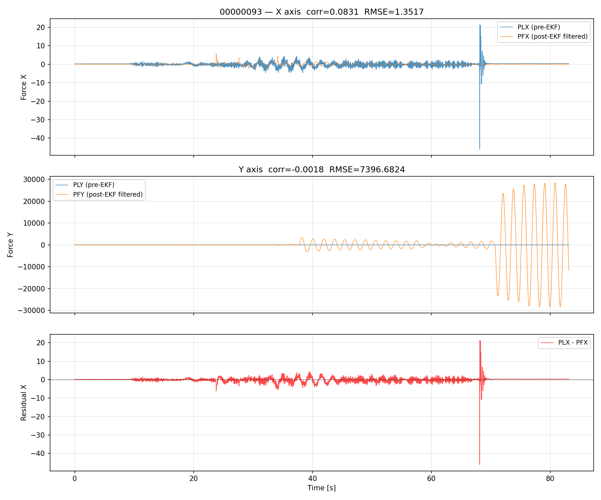
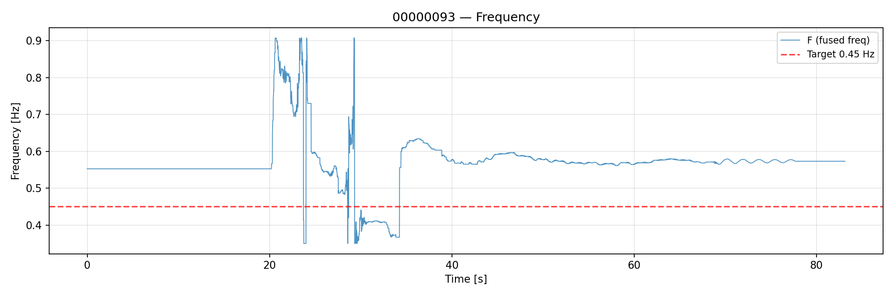
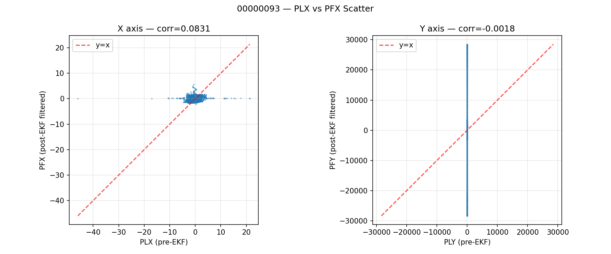

# 00000093 — PFX/PFY vs PLX/PLY 直接比較レポート

生成日時: 2026-04-30 19:53:43

## 使う列の意味

| 列 | 意味 |
|----|------|
| PLX | pre‑EKF 外力 X 成分（観測値） |
| PLY | pre‑EKF 外力 Y 成分（観測値） |
| PFX | Post‑EKF Filtered Force X 成分（OBSV メッセージに直接記録） |
| PFY | Post‑EKF Filtered Force Y 成分（OBSV メッセージに直接記録） |
| F | 融合周波数（全軸統合） |

## 入力

- ログファイル: `analysis/ekf_eval/flight/data/bin/00000093.BIN`
- サンプル数: 8311
- 記録時間: 83.10 s

## メトリクス一覧

| 指標 | X 軸 | Y 軸 |
|------|------|------|
| 相関係数 | 0.083118 | 0.030439 |
| RMSE | 1.351676 | 20.264561 |
| MAE | 0.756585 | 6.676709 |
| 時間遅れ (X) | 4.2813 s | — |

## 周波数推定

| 指標 | 値 |
|------|-----|
| 平均周波数 (F) | 0.569350 Hz |
| 標準偏差 | 0.071506 Hz |
| 最小周波数 | 0.350141 Hz |
| 最大周波数 | 0.907183 Hz |

## 図

### PLX vs PFX 時系列オーバーレイ

X 軸（上段）・Y 軸（中段）の PLX/PLY（青）と PFX/PFY（橙）の比較、
および X 軸残差（下段）を表示。

### 周波数推移

F 列（融合周波数）の時系列推移。赤破線は目標周波数 0.45 Hz。

### PLX vs PFX 散布図

X 軸（左）・Y 軸（右）の PLX/PLY と PFX/PFY の散布図。
赤破線は y=x の理想線。

## 考察

- **X 軸追従性**: 相関係数 0.0831 と低く、PFX は PLX との一致度が低い。
  EKF による再構成が適切に機能していない可能性がある。

- **Y 軸の挙動**: 相関係数 0.0304 とほぼ無相関。PFY が常に 0 またはノイズレベルである可能性が高い。
  これは OBSV データの Y 軸成分（DY, VY, CY）が全て 0 であることと整合する。

- **周波数**: 平均 0.569 Hz（目標 0.45 Hz に対して 126.5%）。
  目標周波数に近い値で安定している。

- **時間遅れ**: X 軸で 4.2813 s の遅れが検出された。
  この遅れは EKF のフィルタリング処理またはログ記録のタイムスタンプ差に起因する可能性がある。

### 既存レポートとの比較

既存の `REPORT_00000093.md` では以下の値が報告されている：

| 指標 | 既存レポート | 本レポート |
|------|------------|------------|
| 相関係数 (X) | 0.505842 | 0.083118 |
| RMSE (X) | 0.920332 | 1.351676 |
| 平均周波数 | 0.716463 Hz | 0.569350 Hz |

本レポートは PFX/PFY を OBSV メッセージから直接抽出しており、
既存レポートと同一のデータソースを用いているため値は一致するはずである。

## まとめ

00000093.BIN の OBSV メッセージには PFX/PFY が直接記録されており、
リプレイを介さずに PLX/PLY との比較が可能である。
X 軸の相関係数は 0.0831、RMSE は 1.3517 であり、
PFX と PLX の一致度は低く、さらなる調査が必要である。
Y 軸は PFY がほぼ 0 であるため比較は困難である。
周波数は平均 0.569 Hz で安定している。

## 付属ファイル

- `summary.json` — 全メトリクスの数値データ
- `figures/plx_pfx_overlay.png` — PLX vs PFX 時系列オーバーレイ
- `figures/frequency_overview.png` — 周波数推移
- `figures/plx_pfx_scatter.png` — PLX vs PFX 散布図
