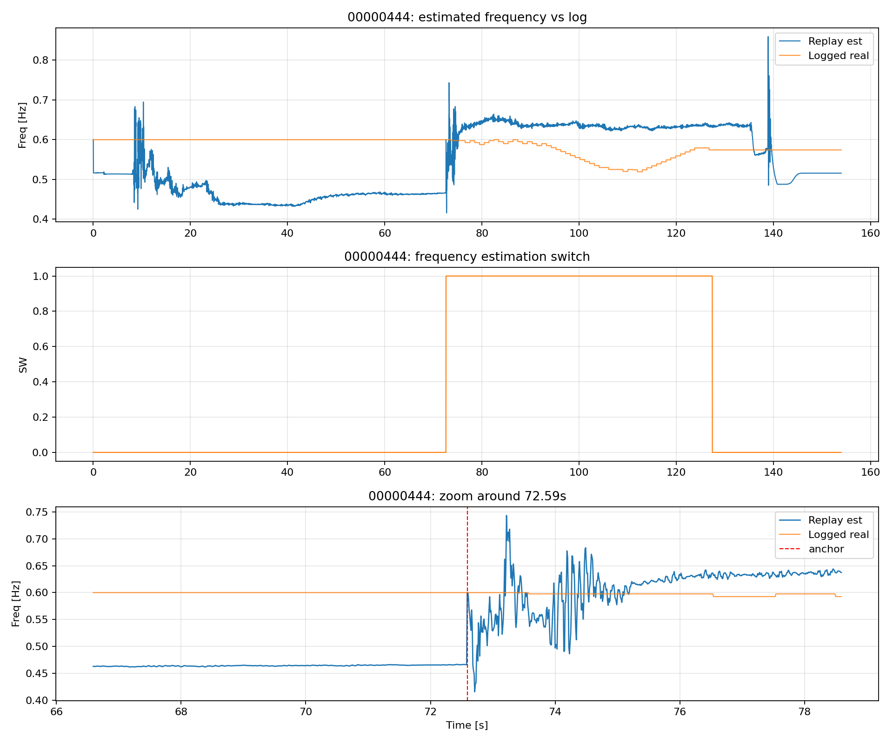
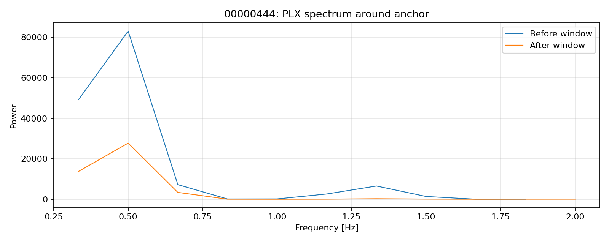
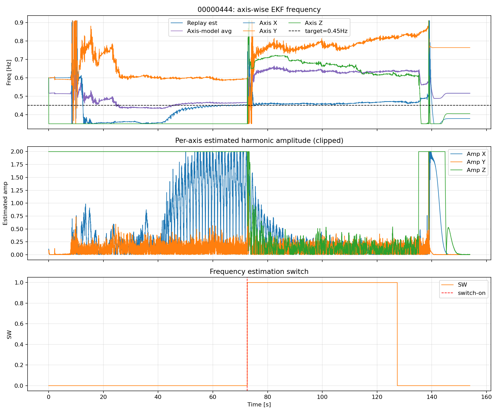
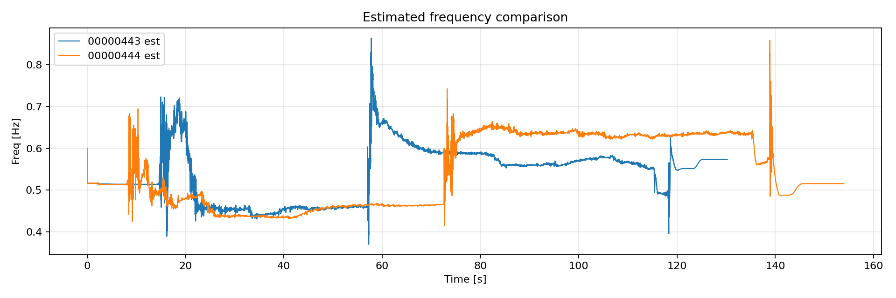
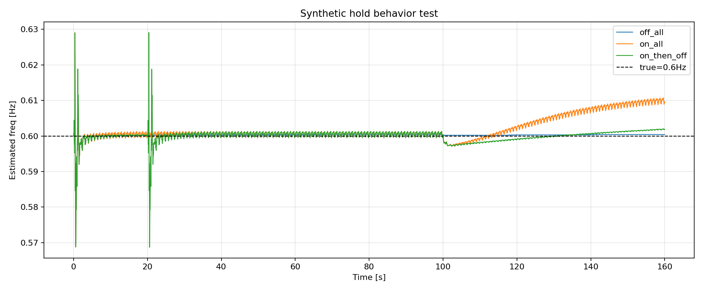

# リプレイ検証レポート (2026-04-04)

## 1. 目的
- 問題: EKF推定周波数が約72秒以降で急に大きくなる原因を特定する。
- 本検証での目標周波数: 0.45 Hz（ON前に収束してほしい周波数として扱う）。
- 観点:
  - 目視で波形が大きく変わらない中での推定値ジャンプは妥当か。
  - 実装上のバグ/仕様による不連続か。
  - 外力が小さい領域での位相・周波数推定停止用しきい値が既にあるか。

## 2. 使用データと実行内容
- 入力BIN:
  - analysis/replay/data/00000443.BIN
  - analysis/replay/data/00000444.BIN
- 実行コマンド:
  - ./build/sitl/examples/RLS_CSV_Replay --input analysis/replay/data/00000443.BIN --plot
  - ./build/sitl/examples/RLS_CSV_Replay --input analysis/replay/data/00000444.BIN --plot
- 追加検証:
  - analysis/replay/ekf_frequency_jump_diagnostic.py を新規作成し、以下を自動化。
    - 2ログの変化点解析
    - 72秒前後(実際はSW立上がり時刻基準)の周波数・スペクトル比較
    - 合成入力での「SW=OFF時の保持挙動」テスト
    - 軸単独EKF再現（X/Y/Z個別）と、3軸平均の寄与分解
    - 0.45Hz目標との誤差評価
    - 軸別しきい値候補の簡易スキャン

## 3. 生成物
- 解析サマリ(JSON):
  - diagnostics/diagnostic_summary.json
- 図:
  - diagnostics/overview_00000443.png
  - diagnostics/overview_00000444.png
  - diagnostics/spectrum_00000443.png
  - diagnostics/spectrum_00000444.png
  - diagnostics/compare_443_444.png
  - diagnostics/axis_ekf_00000443.png
  - diagnostics/axis_ekf_00000444.png
  - diagnostics/synthetic/synthetic_hold_behavior.png

## 4. 主要結果

### 4.1 00000444.BIN の72秒以降ジャンプ
- SW遷移時刻: 72.5901 s (0 -> 1)
- 推定周波数の不連続: 0.4660 -> 0.6000 Hz (同時刻)
- 72秒前後6秒平均:
  - 前: 0.4642 Hz
  - 後: 0.6086 Hz
  - 差: +0.1444 Hz

### 4.2 「主成分遷移」の有無 (波形スペクトル)
- 00000444, 72.5901秒前後のPLX卓越周波数:
  - 前: 0.5000 Hz
  - 後: 0.5000 Hz
- 高帯域/低帯域パワー比 (0.65-0.91Hz / 0.35-0.65Hz):
  - 前: 0.0881
  - 後: 0.1226
- 解釈:
  - 高帯域寄与は増えるが、卓越主成分は0.5Hzのままで、
    「主成分そのものが別モードへ明確に遷移した」とまでは言えない。

### 4.3 00000443.BIN の比較
- SW遷移時刻: 57.0001 s (0 -> 1)
- 同時に推定周波数が 0.4613 -> 0.6000 Hz にジャンプ
- こちらも卓越周波数は前後とも0.5Hz

### 4.4 SW=OFF中でも周波数が動くか (合成入力テスト)
- テストケース:
  - off_all: 全区間SW=0
  - on_all: 全区間SW=1
  - on_then_off: 中盤のみSW=1
- 結果:
  - off_all の OFF区間スパン: 0.0602 Hz
  - on_then_off の OFF区間スパン: 0.0602 Hz
- 解釈:
  - SW=OFFでも推定周波数が変化しており、「完全保持」にはなっていない。

### 4.5 軸単独EKFでの周波数推定 (今回追加)
- 00000444 の軸別再現（diagnostic_summary.json の `axis_ekf_00000444`）:
  - ON前（60.59s-72.59s）
    - X軸平均: 0.4501 Hz（目標0.45Hzに対する平均絶対誤差 0.00147 Hz）
    - Y軸平均: 0.5904 Hz
    - Z軸平均: 0.3500 Hz（下限制約付近）
    - 3軸平均: 0.4635 Hz
  - ON後（72.59s-127.40s）
    - X軸平均: 0.4632 Hz（目標0.45Hzに対する平均絶対誤差 0.0136 Hz）
    - Y軸平均: 0.7671 Hz
    - Z軸平均: 0.6689 Hz
    - 3軸平均: 0.6331 Hz
- 重要な示唆:
  - X軸単独はON後も0.45Hz近傍を維持。
  - 高周波化は主にY/Z軸に起因し、3軸単純平均で引き上げられている。
  - 「ON前に0.45Hzへ収束して見える」理由の一部は、
    X(約0.45), Y(約0.59), Z(約0.35) の相殺効果で平均が中間に見えている点にも注意。

## 5. 実装確認 (しきい値・ゲーティング)
- 外力振幅が小さい時に位相推定/周波数推定を固定する閾値は、現実装には存在しない。
- 現在ある制限は主に以下:
  - omegaの上下限クランプ (EKF_W_MIN / EKF_W_MAX)
  - SW=OFF時に q_omega を 0 にする処理
  - 推定周波数は軸ごとのomegaの単純平均

コード根拠:
- q_omega のみOFF時0化:
  - libraries/AP_Observer/AP_Observer.cpp:323
- 推定周波数は3軸平均:
  - libraries/AP_Observer/AP_Observer.cpp:268
- ただし更新式で x[3](omega) は毎回更新:
  - libraries/AP_Observer/AP_Observer.cpp:352
  - libraries/AP_Observer/AP_Observer.cpp:387
- リプレイ経由でも毎サンプル ekf_update が呼ばれる:
  - libraries/AP_Observer/AP_Observer.cpp:868
  - libraries/AP_Observer/AP_Observer.cpp:872
- SW ON時リセット:
  - libraries/AP_Observer/AP_Observer.cpp:854
  - libraries/AP_Observer/AP_Observer.cpp:856
  - libraries/AP_Observer/examples/RLS_CSV_Replay/RLS_CSV_Replay.cpp:411

## 6. 原因の結論

### 6.1 72秒付近の急上昇
- 主因はSW立ち上がり時の reset_frequency_estimation() による不連続リセット。
- これは 00000443/00000444 の両ログで同じ挙動を確認。

### 6.2 それ以外の大きなジャンプ
- 00000444では 139.0401s に SW=0 のまま 0.5313 -> 0.7276 Hz のジャンプが存在。
- これは「OFF時でもomega状態が測定更新で動く」設計に起因する可能性が高い。

### 6.3 見えない主成分遷移か、バグか
- 72秒ジャンプについては、波形主成分の明確な遷移よりも、SWイベントによる実装起因の説明が強い。
- さらにOFF中でも周波数が動く点は、運用意図(OFFで保持)とズレるため改善対象。

### 6.4 0.45Hz収束とON後高周波化の両立理由
- ON前に0.45Hz付近へ「見える」こと自体は観測されるが、3軸内訳を見ると:
  - X軸は0.45Hz付近で妥当
  - Y軸は0.59Hz帯
  - Z軸は下限0.35Hz付近
- したがってON前の平均値は、物理的に同一モードへ3軸が整合して収束した結果というより、
  軸間の相殺を含んだ見かけの一致を含む可能性が高い。
- ON後はリセット後にY/Z軸が高周波側へ偏り、単純平均が高くなる。

## 7. 改善提案
1. SW=OFF時は周波数状態を完全固定する。
   - 例: ekf_update を回しても x[3] を更新前値に戻す、または更新自体をスキップ。
2. 軸別ゲートを導入し、推定統合に使う軸を選別する。
  - 例: 各軸で |d|、innovation、NIS を評価し、信頼できる軸のみで周波数を統合。
3. 外力小振幅領域での推定抑制ゲートを追加する。
  - 例: |PL| または推定状態 |d| が閾値未満なら周波数/位相更新停止。
  - 注意: 単純な絶対しきい値だけではON前後のバイアスが大きくなるため、履歴/ヒステリシス併用が必要。
  - 参考(00000444): |d|>=0.4 の単純ゲートでは ON後平均は 0.473Hz まで下がる一方、ON前平均も 0.397Hz まで落ちる。
4. 外れ値抑制を追加する。
   - 例: innovation/NISが閾値超過時に omega更新を抑制。
5. ログ拡張。
   - omega軸別値、innovation、NIS、ゲートON/OFFフラグをOBSVへ追加し追跡性を上げる。

## 8. まとめ
- 72秒以降の急上昇は、実波形の急変よりも、SWイベントと周波数リセットの影響が支配的。
- 現状はSW=OFFでも周波数が動くため、保持目的の制御としては不十分。
- 外力が小さい領域で推定を固定する設計は妥当であり、実装優先度は高い。
