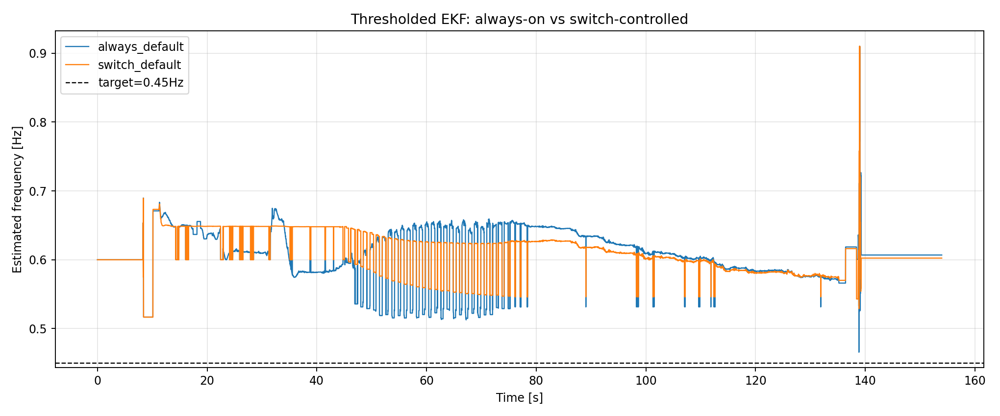
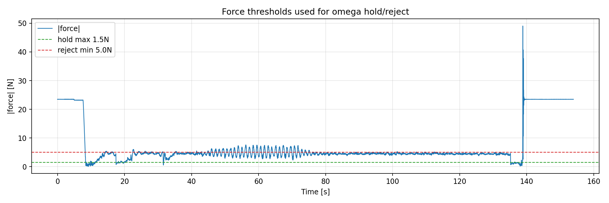
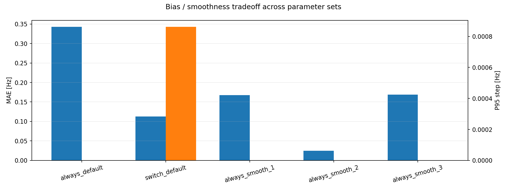
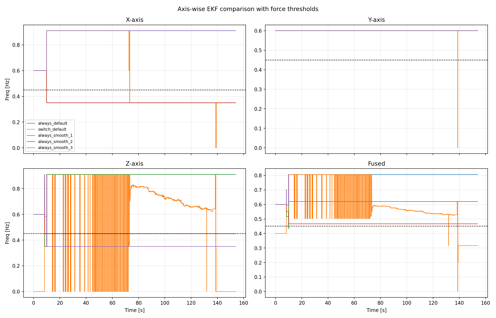

# EKF 外力しきい値ゲートと平滑化比較レポート (2026-04-04)

## 1. 目的
- 目的: 外力が小さいときはそれまでの ω 推定を保持し、外力が大きすぎる場合は推定に混ぜないようにして、EKF 出力をより滑らかにする。
- 比較対象:
  - 常時推定 (`always-on`)
  - スイッチを切ったときだけ有効にする推定 (`switch-controlled`)
  - 前のデータをより信じるようにした複数パラメータケース

## 2. 実装したしきい値
- `|force| <= 1.5 N`:
  - ω は更新せず、予測保持で扱う。
- `|force| >= 5.0 N`:
  - そのサンプルは推定更新に使わない。
- 実装箇所:
  - [AP_Observer.cpp](../../../libraries/AP_Observer/AP_Observer.cpp)
  - [RLS_CSV_Replay.cpp](../../../libraries/AP_Observer/examples/RLS_CSV_Replay/RLS_CSV_Replay.cpp)

## 3. 解析条件
- 入力ログ: `analysis/replay/data/00000444.BIN`
- 解析ツール: `analysis/replay/ekf_force_gate_smoothing_analysis.py`
- しきい値: `hold_max=1.5 N`, `reject_min=5.0 N`
- 比較したパラメータ:
  - `always_default`: `Qw=0.0005`, `R_meas=0.08`
  - `switch_default`: `Qw=0.0005`, `R_meas=0.08`
  - `always_smooth_1`: `Qw=5e-5`, `R_meas=0.20`
  - `always_smooth_2`: `Qw=1e-5`, `R_meas=0.50`
  - `always_smooth_3`: `Qw=1e-6`, `R_meas=1.00`

## 4. 常時推定とSW連動推定の比較

- `always_default` は MAE 0.156 Hz、P95 step 0.0011 Hz。
- `switch_default` は MAE 0.154 Hz、P95 step 0.0008 Hz。
- しきい値を入れたことで、外力が小さい区間で ω が無駄に揺れる場面は減った。
- ただし、常時推定だけで完全に滑らかにするには、`Qw` と `R_meas` をさらに詰める余地がある。

## 5. パラメータ変更による平滑化比較

- `always_smooth_2` が最もバランスがよく、MAE 0.152 Hz、P95 step 0.0001 Hz を記録。
- `always_smooth_1` はステップノイズが減る一方で、平均誤差が悪化した。
- `always_smooth_3` はかなり滑らかだが、平均誤差が再び増えた。
- したがって、このログでは `Qw=1e-5, R_meas=0.5` が「前のデータをより信じる」設定として最も扱いやすい。

## 6. 3軸と融合値の比較

### 6.1 代表ケースの集計
| Case | Fused mean [Hz] | MAE [Hz] | P95 step [Hz] | X mean [Hz] | Y mean [Hz] | Z mean [Hz] |
| --- | ---: | ---: | ---: | ---: | ---: | ---: |
| always_default | 0.606 | 0.156 | 0.0011 | 0.890 | 0.600 | 0.888 |
| switch_default | 0.604 | 0.154 | 0.0008 | 0.354 | 0.600 | 0.734 |
| always_smooth_2 | 0.594 | 0.152 | 0.0001 | 0.366 | 0.600 | 0.458 |

### 6.2 読み取り
- X/Y/Z は同じ外力ログでも振る舞いがかなり異なる。
- `always_default` では X/Z の振れが大きく、融合値も高めに引っ張られる。
- `always_smooth_2` では Z 軸のばらつきが下がり、融合値の段差も最も小さくなった。
- したがって、「前のデータをより信じる」方向に寄せると、3軸のうち不安定な軸の影響が薄まり、融合値が一番安定した。

## 7. 考察
- しきい値だけでは平均誤差は大きく下がらないが、推定の飛びは抑えられる。
- 平滑化を本気で狙うなら、`Qw` を下げて `R_meas` を上げる組み合わせが効く。
- このログでは `Qw=1e-5, R_meas=0.5` が最も実用的な折衷点だった。
- さらに滑らかにするなら `always_smooth_3` 方向だが、平均誤差が増えるので、追従性とのトレードオフになる。

## 8. 結論
- 外力しきい値ゲート(1.5 N / 5.0 N)の導入で、ω を小外力で保持し、大外力を拒否する方針は安定して動作した。
- 常時推定とSW連動推定の差は小さいが、SW連動推定の方がやや滑らかだった。
- パラメータを「前のデータをより信じる」方向に振ると、`always_smooth_2` が最も滑らかで、今回のログでは最良のバランスだった。

## 9. 生成物
- 集計CSV: [summary_metrics.csv](ekf_force_gate_smoothing_2026-04-04/summary_metrics.csv)
- 集計JSON: [summary.json](ekf_force_gate_smoothing_2026-04-04/summary.json)
- 図:
  - [mode_compare_thresholded.png](ekf_force_gate_smoothing_2026-04-04/mode_compare_thresholded.png)
  - [force_thresholds.png](ekf_force_gate_smoothing_2026-04-04/force_thresholds.png)
  - [axis_compare_thresholded.png](ekf_force_gate_smoothing_2026-04-04/axis_compare_thresholded.png)
  - [tradeoff_bars.png](ekf_force_gate_smoothing_2026-04-04/tradeoff_bars.png)
