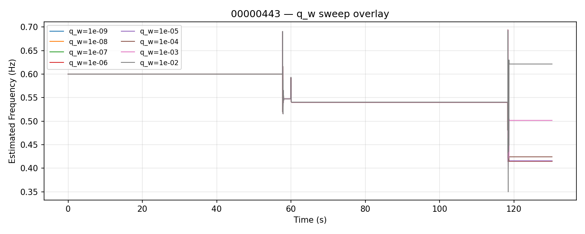
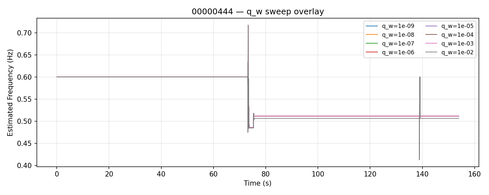
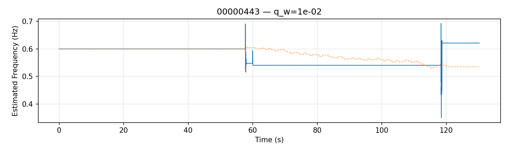
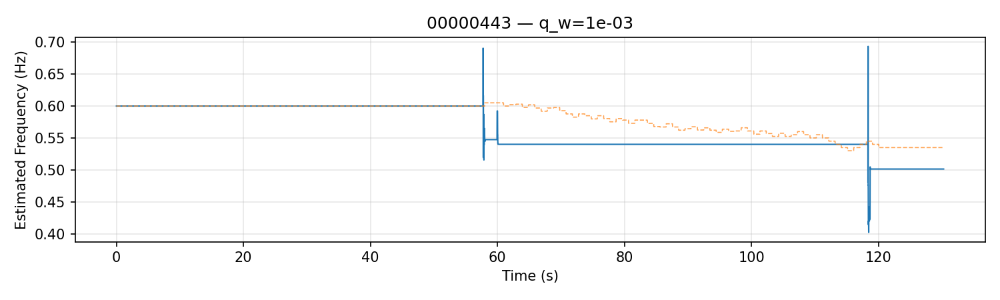
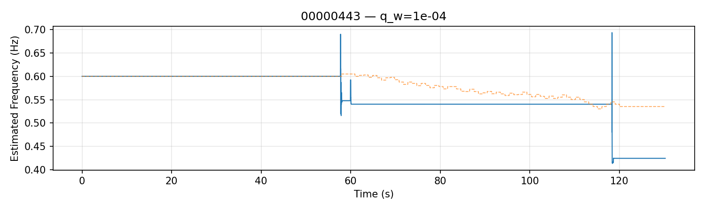
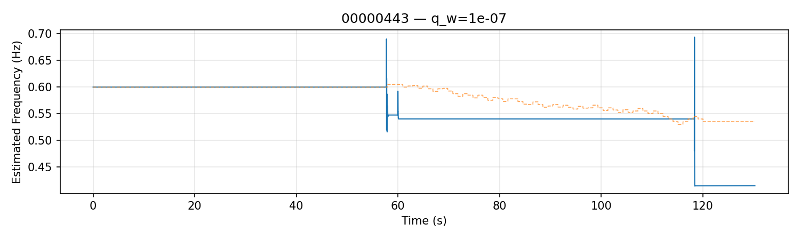
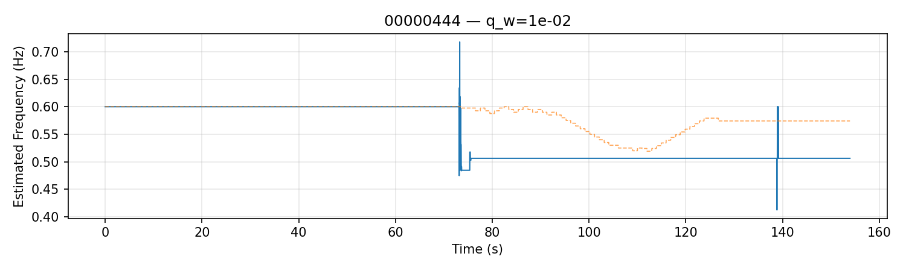
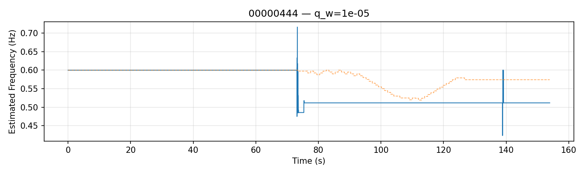

# FIXED INIT 0.60Hz — q_w sweep: Frequency vs Time

This report shows estimated frequency (EstFreq_Hz) vs time for each run in the q_w sweep.

## 00000443_overlay_qw

## 00000444_overlay_qw

## 00000443_init_0p60Hz_qw_1e-02_result

## 00000443_init_0p60Hz_qw_1e-03_result

## 00000443_init_0p60Hz_qw_1e-04_result

## 00000443_init_0p60Hz_qw_1e-05_result

## 00000443_init_0p60Hz_qw_1e-06_result

## 00000443_init_0p60Hz_qw_1e-07_result

## 00000443_init_0p60Hz_qw_1e-08_result

## 00000443_init_0p60Hz_qw_1e-09_result

## 00000444_init_0p60Hz_qw_1e-02_result

## 00000444_init_0p60Hz_qw_1e-03_result

## 00000444_init_0p60Hz_qw_1e-04_result

## 00000444_init_0p60Hz_qw_1e-05_result

## 00000444_init_0p60Hz_qw_1e-06_result

## 00000444_init_0p60Hz_qw_1e-07_result

## 00000444_init_0p60Hz_qw_1e-08_result

## 00000444_init_0p60Hz_qw_1e-09_result

Source summary: `summary.json`
