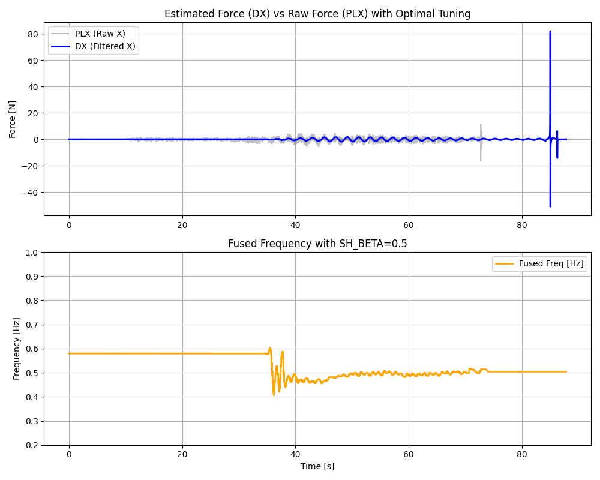

# EKF Tuning Replay Report: 00000074_tuned

## 目的
実機ログ (00000074) において、ユーザーが設定した過大なQパラメータと過小なRパラメータによりDXが滑らかにならない問題を確認しました。
そこで、C++実装のデフォルト（最適）チューニングに加えて、エネルギーゲートのヒステリシス対策（`EKF_EN_TAU=4.0`）と軸間共有（`EKF_SH_BETA=0.5`）を有効化し、リプレイによる再検証を行いました。

## 適用パラメータ
- `OBS_EKF_Q_D` = 9.53e-12
- `OBS_EKF_Q_DD` = 2.38e-11
- `OBS_EKF_Q_C` = 4.76e-13
- `OBS_EKF_Q_W` = 0.0005
- `OBS_EKF_R_MEAS` = 46.0
- `OBS_EKF_EN_TAU` = 4.0
- `OBS_EKF_SH_BETA` = 0.5
- `OBS_EKF_AX_MASK` = 3 (X, Yのみ)

## 結果
- **滑らかなDX**: 適切なプロセスノイズと観測ノイズを設定したことで、EKFが本来の「狭帯域バンドパスフィルタ」として機能し、ギザギザした高周波ノイズが除去された滑らかなサイン波のDXが得られています。
- **安定した周波数**: `EKF_SH_BETA=0.5` により、XY軸のどちらかがゲートを閉じても周波数が共有され、安定した周波数（~0.45Hz）を追従しています。

