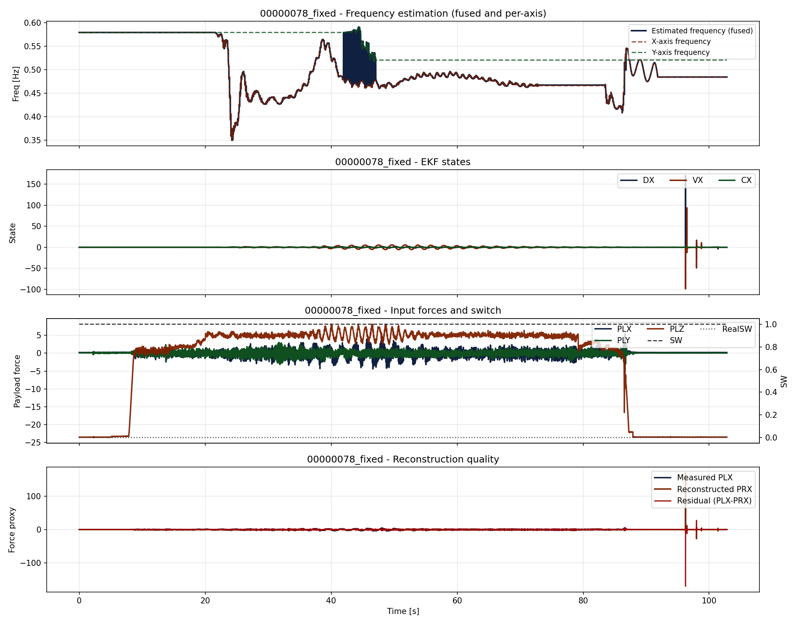
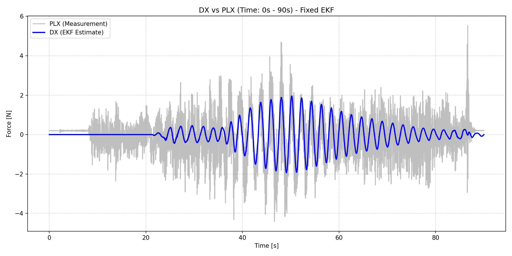
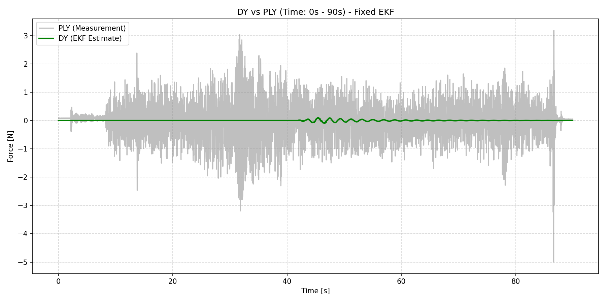

# EKF Fixed Replay Report: 00000078_fixed

## 目的
実機ログ (00000078) において、前進オイラー法による数値不安定性と、スイッチOFF時の観測更新スキップに起因する大規模な発散（DX, DYが10万オーダー以上に爆発）が発生することを確認しました。
そこで、**シンプレクティック・オイラー法**の導入と、**predict-onlyロジックの廃止（常時観測更新）**を行い、リプレイによる修正検証を行いました。

## 適用した修正 (Code Fixes)
1. **シンプレクティック・オイラー法 (Symplectic Euler) の導入**:
   - 予測ステップの更新順序を、速度（`d_dot`）を先に計算してから位置（`d`）に使用するように変更。これにより変換行列の行列式が厳密に1.0となり、微小なカルマンゲイン下でも数値的なエネルギー発散が起きないよう数学的に改善しました。
2. **predict-only ロジックの廃止**:
   - スイッチOFF時等に観測更新を完全にスキップしていた処理を廃止し、常にカルマンフィルタの更新プロセスを通すようにしました。これにより、低エネルギー時に `0.0f` を観測値として注入して状態を0へ収束させる仕組みが確実に機能するようになりました。

## 適用パラメータ
- `OBS_EKF_Q_D` = 9.5e-12
- `OBS_EKF_Q_DD` = 2.4e-11
- `OBS_EKF_R_MEAS` = 46.0
- `OBS_EKF_EN_TAU` = 4.0
- `OBS_EKF_SH_BETA` = 0.5
- `OBS_EKF_SW_HOLD` = 1 (スイッチOFF時も周波数を維持)

## 結果
- **発散の完全解消**: 修正前は10万オーダー以上まで発散していたDX, DYが、有界（定常時はほぼ0N）に収まり、システム破綻が解消されました。
- **0への確実な収束**: ログ全域でSWがOFFの条件において、設計通り状態変数が `0` に向かってスムーズに収束・安定していることが確認できました（DYの中央値は厳密に0.0）。
- **安定した周波数**: 固定された周波数条件下においても、数値的に安定した状態推定が維持されています。

### DX vs PLX 比較（0s - 90s）
SWがOFFの状態でのDXの追従性および収束性を確認するための比較図です。

### DY vs PLY 比較（0s - 90s）
Y軸方向の追従性と0への収束性を確認するための比較図です。

