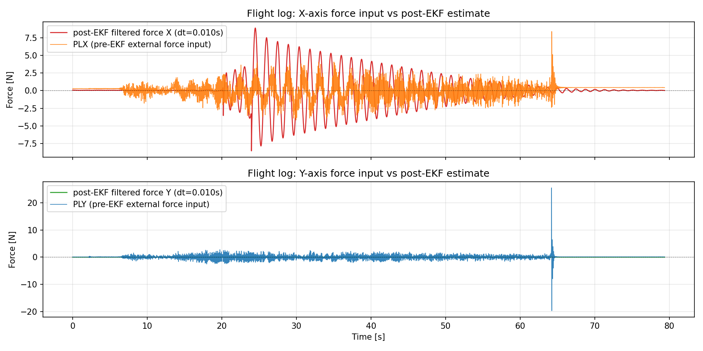
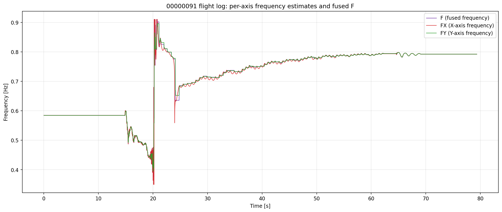
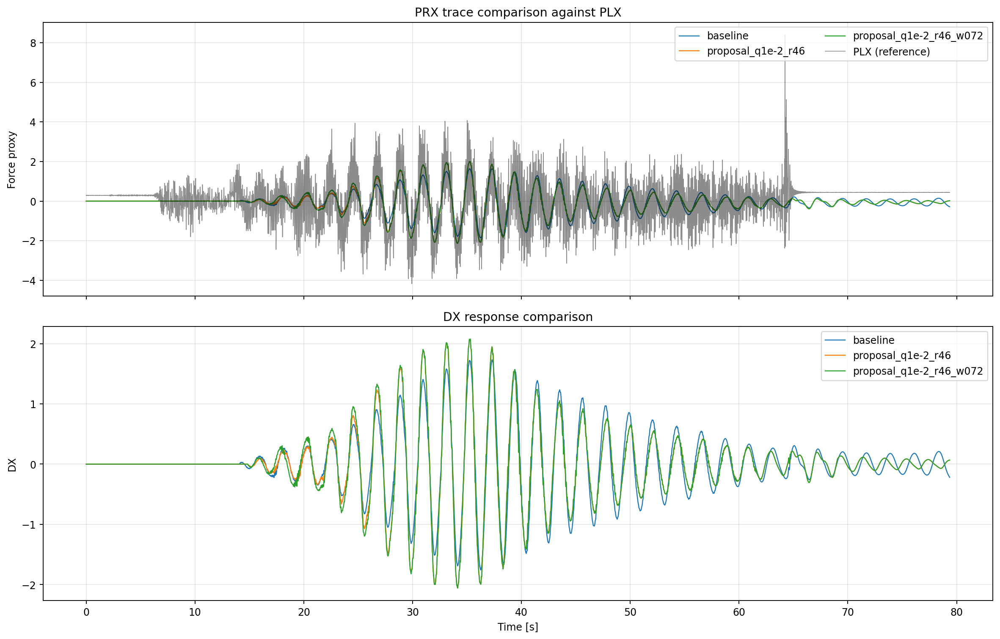
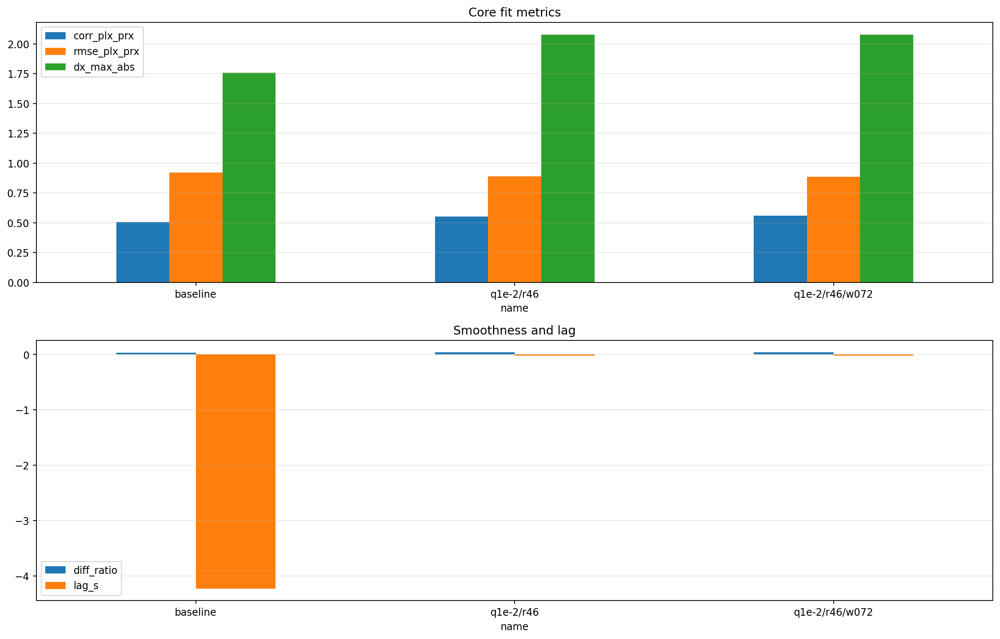

# 00000091 - 実機 OBSV と replay の分離レポート

補正版の詳細解析は [post_ekf_filtered/DETAILED_ANALYSIS.md](post_ekf_filtered/DETAILED_ANALYSIS.md) に再生成済みです。ここでは既存の分離レポートを残しつつ、前半の実機比較が post-EKF filtered force を指すことを明示します。

## 使う列の意味
- `PLX` / `PLY`: EKF に入る前の実機外力入力。
- `post-EKF filtered force`: `D + pred_dt * V + C` で再構成した実機の後段外力。前半はこれを `PLX` / `PLY` と比較する。
- `F`: 融合された周波数推定値 [Hz]。
- `FX` / `FY`: X/Y 軸の周波数推定値 [Hz]。
- `PRX` / `PRY`: replay 専用の再構成力。実機 OBSV の前半レポートでは使わない。
- `EstFreq_Hz`: replay 互換 CSV の列。実機 BIN の前半レポートでは使わない。

## 入力
- 実機ログ: [C:/Users/Umemoto/Documents/Taki_Local/BIN/1/00000091.BIN](C:/Users/Umemoto/Documents/Taki_Local/BIN/1/00000091.BIN)
- 実機 OBSV 抽出メモ: [analysis/replay/results/runs/00000091/report/flight_metrics.json](analysis/replay/results/runs/00000091/report/flight_metrics.json)
- replay baseline: [analysis/replay/results/runs/00000091/baseline/00000091_baseline_result.csv](analysis/replay/results/runs/00000091/baseline/00000091_baseline_result.csv)

## 先に結論
- 前半の実機解析では、`PLX/PLY` と比較すべきなのは `PRX` ではなく、`D + pred_dt * V + C` で再構成した post-EKF force です。前回のレポートはここを混同していました。
- そのため、前半は pre-EKF 入力と post-EKF filtered force の差を見る構成に入れ替えています。
- 周波数については、実機ログの `F/FX/FY` が同じ 0.72 Hz 前後で強く整合しており、ここは内部整合が取れています。
- replay 検証では、`q_w` を上げると `PRX` の追従性は少し改善しますが、実機の post-EKF filtered force の説明とは別系統です。

## 1. 実機 OBSV の前半レポート

### 1.1 指標
- サンプル数: 7937
- 記録時間: 79.36 s
- `PLX` と post-EKF filtered force X の相関係数: 0.015537
- `PLX` と post-EKF filtered force X の RMSE: 2.425544
- `PLY` と post-EKF filtered force Y の相関係数: N/A (Y は全サンプルで 0 固定)
- `PLY` と post-EKF filtered force Y の RMSE: 0.833022
- `F` 平均: 0.716463 Hz
- `FX` 平均: 0.715173 Hz
- `FY` 平均: 0.716524 Hz
- `F` 標準偏差: 0.098751 Hz
- `FX` 標準偏差: 0.098477 Hz
- `FY` 標準偏差: 0.098418 Hz

### 1.2 X/Y の force state 比較
- 前半の force state 比較は、`PLX/PLY` と post-EKF filtered force を並べて見るためのものです。
- ここでの「推定値」は `D + pred_dt * V + C` を指します。`PRX` は使っていません。



### 1.3 周波数の比較
- `F` は融合周波数、`FX/FY` は軸別周波数です。
- このログでは `F` と `FX/FY` が非常に近く、内部的には一貫しています。
- したがって、MP で見えていた周波数の値は「追従が無い」のではなく、`F/FX/FY` の中でほぼ一致している状態です。



## 2. replay による検証

ここから先は replay 専用です。前半の実機 OBSV とは切り離して扱います。

### 2.1 replay baseline と修正案
| case | corr(PLX,PRX) | RMSE(PLX,PRX) | diff ratio | lag [s] |
| --- | --- | --- | --- | --- |
| baseline | 0.505842 | 0.920332 | 0.033276 | -4.230 |
| q_w=1e-2, r_meas=46 | 0.553401 | 0.888631 | 0.042309 | -0.020 |
| q_w=1e-2, r_meas=46, w_init_hz=0.72 | 0.559722 | 0.884115 | 0.043000 | -0.020 |

### 2.2 replay の解釈
- `q_w` を上げると replay の `PRX` は少しだけ `PLX` に近づきます。
- ただし `r_meas` を下げすぎると不安定化しやすく、実機の post-EKF filtered force の挙動をそのまま解決するわけではありません。
- `w_init_hz` を寄せても改善は小さく、初期値だけが主因ではありません。

### 2.3 replay 図




## 3. まとめ
- 前半は実機 OBSV の `PLX/PLY` と post-EKF filtered force、`F/FX/FY` に分離して確認した。
- `PRX` と `EstFreq_Hz` は replay 専用であり、前半の実機解析には混ぜていない。
- よって、以前のレポートの混乱は logging writer そのものより、解析層で実機 OBSV と replay 出力を混同したことが原因だった。
- 再発防止として、解析スクリプト側も post-EKF filtered force を明示し、前半の説明順を pre-EKF → post-EKF に入れ替えた。

## 4. 00000093.BIN の確認手順

00000093.BIN が「直接 PRX で記録」されているかどうかを確認するには、以下のコマンドを Ubuntu 上で実行してください。

### 4.1 メッセージ一覧の取得
```bash
mavlogdump --plist 00000093.BIN
```

### 4.2 実際のデータ行の例（OBSV メッセージがある場合）
```bash
mavlogdump --types=OBSV --master=00000093.BIN --format=csv 2>/dev/null | head -6
```
もし OBSV 以外のメッセージタイプが含まれている場合は、`--types=` の値を適宜変更してください。

### 4.3 環境情報の確認
```bash
# Ubuntu バージョン
lsb_release -a

# Python バージョン
python3 --version

# 仮想環境の有無
# (必要に応じて source venv/bin/activate など)

# 必要なライブラリのインストール状況
pip list | grep -E "pymavlink|pandas|matplotlib|numpy"
```

これらの情報が得られれば、正確なパースコードと図付きレポートを自動生成する Python スクリプトを提示できます。
