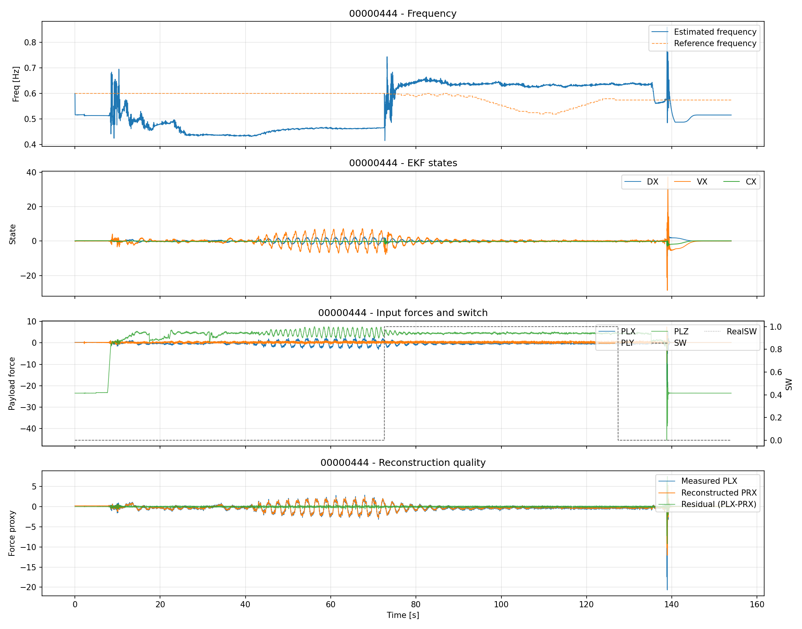
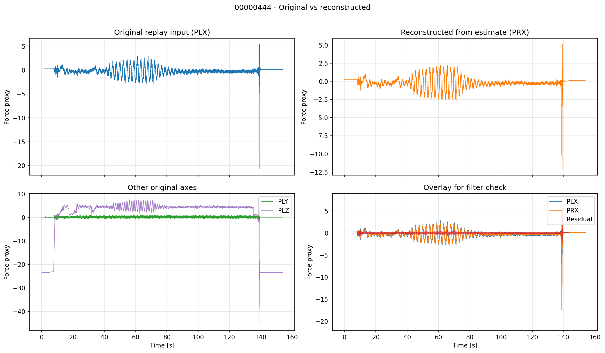

# 00000444 - EKF Replay Report

## Inputs
- input CSV: analysis/replay/results/runs/00000444/00000444_bin_result.csv

## EKF Parameters
- q_w: 0.0005
- r_meas: 0.08
- w_init_hz: 0.6
- axis_mask: 3
- reset_on_switch: 0
- force_hold_max: 0.8
- force_reject_min: 1.5

## Key Metrics
- samples: 15332
- duration_s: 153.940
- freq_mae_hz: 0.096243
- freq_max_abs_err_hz: 0.285100
- wave_rmse_x (PLX vs PRX): 0.193283
- wave_corr_x (PLX vs PRX): 0.966974
- diff_std_ratio_prx_over_plx: 0.441986 (smaller means smoother reconstruction)
- ekf_sw_active_ratio: 0.3554

## Figures
### 1) Extended parameter overview

### 2) Original vs reconstructed

## Filter Check
- Confirm PRX follows PLX trend while reducing high-frequency jitter.
- Check residual and SW sections for over/under filtering intervals.
