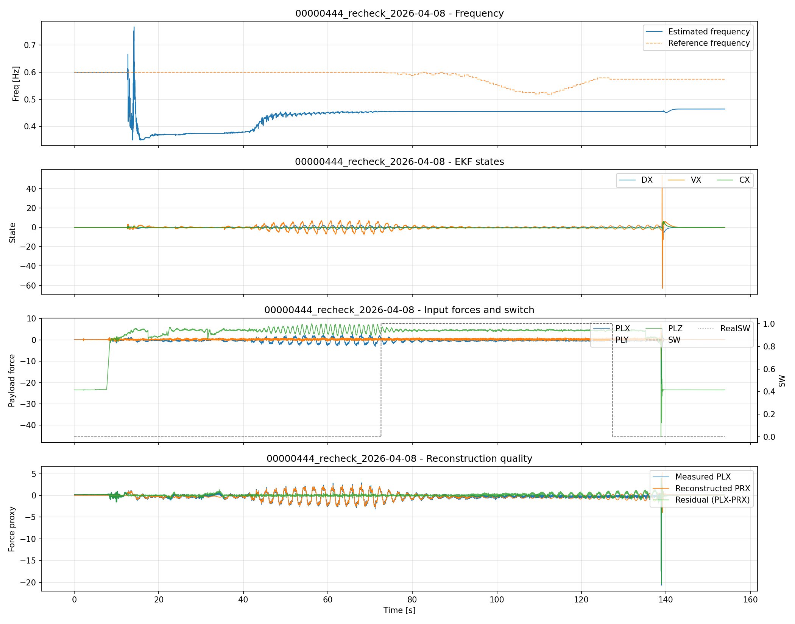
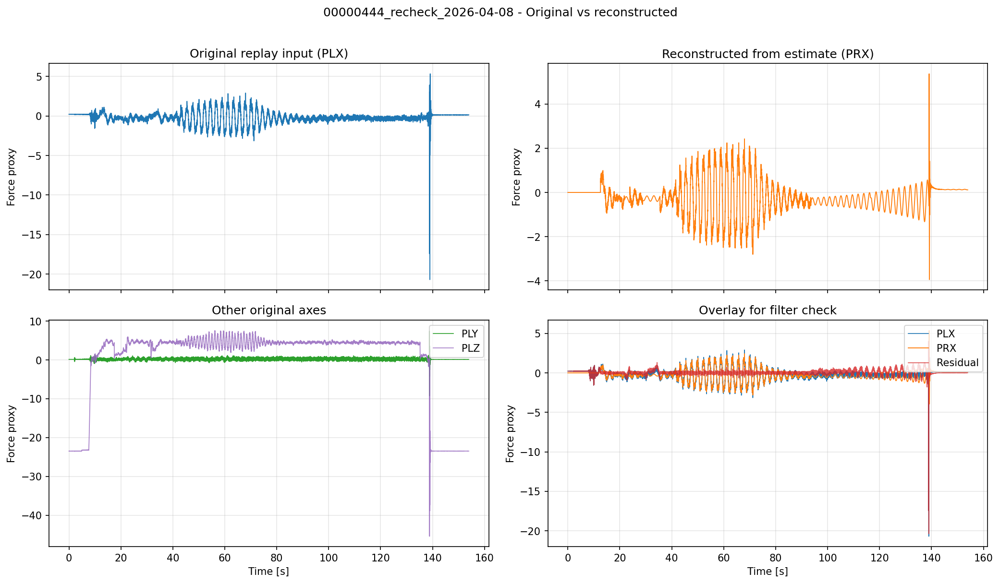

# 00000444_recheck_2026-04-08 - EKF Replay Report

## Inputs
- input CSV: analysis/replay/results/runs/00000444_recheck_2026-04-08/00000444_recheck_result.csv

## EKF Parameters
- q_w: 1e-09
- w_init_hz: 0.6
- axis_mask: 3
- axis_gate: 0
- reset_on_switch: 0
- force_hold_max: 1.5
- force_reject_min: 5.0
- sw_mode: log
- ekf_energy_gate: 1
- ekf_energy_rms_on: 0.20
- ekf_energy_rms_off: 0.16
- ekf_energy_tau: 2.0

## Key Metrics
- samples: 15332
- duration_s: 153.940
- freq_mae_hz: 0.132381
- freq_max_abs_err_hz: 0.250000
- wave_rmse_x (PLX vs PRX): 0.391049
- wave_corr_x (PLX vs PRX): 0.862844
- diff_std_ratio_prx_over_plx: 0.233334 (smaller means smoother reconstruction)
- ekf_sw_active_ratio: 0.3554

## Figures
### 1) Extended parameter overview

### 2) Original vs reconstructed

## Filter Check
- Confirm PRX follows PLX trend while reducing high-frequency jitter.
- Check residual and SW sections for over/under filtering intervals.
