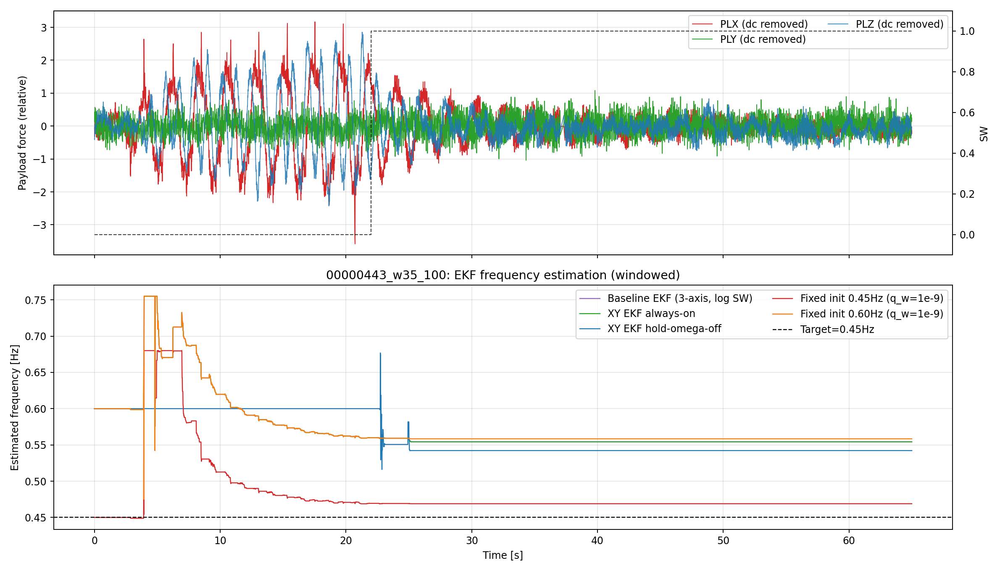
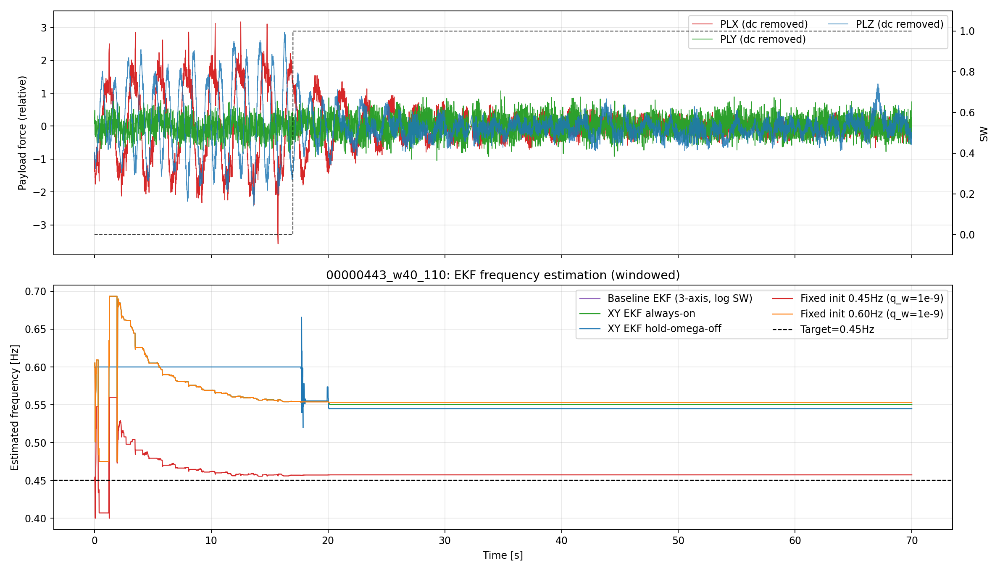

# EKFアルゴリズム比較レポート (2026-04-06, 時間窓版)

## 目的
- 指定された時間区間で再度リプレイを実行し、EKFの周波数推定性能を比較する。
- 既存レポート形式に合わせて、上段に生データ揺れ + SW、下段に推定周波数を表示する。

## 今回の比較条件
- 対象ログ: 00000443.BIN
- 時間窓1: 35秒 - 100秒
- 時間窓2: 40秒 - 130秒
- 目標周波数: 0.45Hz
- 時間基準: OBSV先頭サンプルを0秒として窓抽出

## 比較したEKF方式
1. Baseline EKF (3-axis, log SW)
2. XY EKF always-on
3. XY EKF hold-omega-off
4. Fixed init 0.45Hz (q_w=1e-9)
5. Fixed init 0.60Hz (q_w=1e-9)

### 方式の違い
- Baseline EKF (3-axis, log SW): X/Y/Zの3軸をそのまま融合し、SW状態に応じて通常運用する基準実装。
- XY EKF always-on: Z軸を使わず、XYのみで周波数を推定する構成。観測がある限り常時更新する。
- XY EKF hold-omega-off: XYのみを使う点は同じだが、SW OFF中は周波数状態の変化を抑えてドリフトを減らす。
- Fixed init 0.45Hz (q_w=1e-9): 初期周波数を 0.45Hz に固定し、`q_w` を極小にして推定値の動きを最小限にする。
- Fixed init 0.60Hz (q_w=1e-9): 初期周波数を 0.60Hz に置いた固定初期値版。初期値依存の残り方を見るための比較条件。

## 図 (上段: 生データ揺れ + SW, 下段: 推定周波数)

### 00000443 (35s-100s)

### 00000443 (40s-110s)

## 指標比較 (windowed_metrics.csvより)

### 時間窓1: 35s-100s
| method_label | mean_hz | std_hz | mae_hz | p95_step_hz |
| --- | ---: | ---: | ---: | ---: |
| Fixed init 0.45Hz (q_w=1e-9) | 0.4689 | 0.0001 | **0.0189** | 0.0000 |
| XY EKF hold-omega-off | 0.5438 | 0.0086 | 0.0938 | 0.0000 |
| Baseline EKF (3-axis, log SW) | 0.5547 | 0.0013 | 0.1047 | 0.0000 |
| XY EKF always-on | 0.5547 | 0.0013 | 0.1047 | 0.0000 |

### 時間窓2: 40s-110s
| method_label | mean_hz | std_hz | mae_hz | p95_step_hz |
| --- | ---: | ---: | ---: | ---: |
| Fixed init 0.45Hz (q_w=1e-9) | 0.4574 | 0.0001 | **0.0074** | 0.0000 |
| XY EKF hold-omega-off | 0.5462 | 0.0075 | 0.0962 | 0.0000 |
| Baseline EKF (3-axis, log SW) | 0.5507 | 0.0009 | 0.1007 | 0.0000 |
| XY EKF always-on | 0.5507 | 0.0009 | 0.1007 | 0.0000 |
| Fixed init 0.60Hz (q_w=1e-9) | 0.5533 | 0.0002 | 0.1033 | 0.0000 |

## 結論
1. 指定2区間の両方で、Fixed init 0.45Hz (q_w=1e-9) が最小MAEで最良。
2. Fixed init 0.60Hz は 0.45Hz より目標値から遠く、初期値依存がそのまま残ることを確認できた。
3. XY hold-omega-off は Baseline / XY always-on より改善するが、目標0.45Hzからの誤差は残る。
4. Baseline 3-axis と XY always-on は今回の2区間でも同等挙動となった。
5. 時間窓抽出は「OBSV先頭=0秒」基準で再生成し、w35開始=35.0秒、w40開始=40.00003秒を確認した。

## 生成物
- [windowed metrics CSV](../../../analysis/replay/results/diagnostics/ekf_windowed_comparison_2026-04-06/windowed_metrics.csv)
- [windowed figure directory](../../../analysis/replay/results/diagnostics/ekf_windowed_comparison_2026-04-06/figures)
- [windowed replay script](../../../analysis/replay/generate_ekf_algorithm_comparison_windowed.py)
