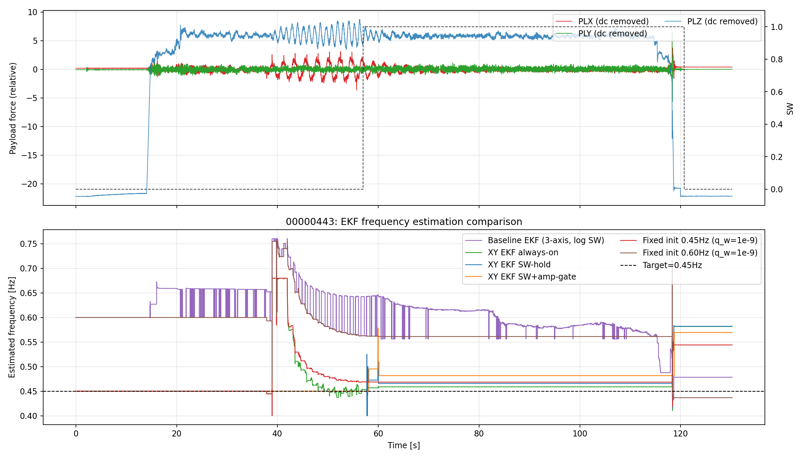
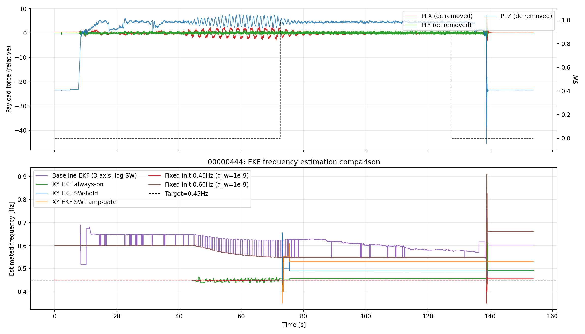

# EKFアルゴリズム比較レポート (2026-04-06)

## 目的
- さまざまなEKF実装方針を同一ログ・同一時間軸で比較し、推定周波数の挙動差を可視化する。
- 各比較図の最上段に生データの揺れ (PLX/PLY/PLZ) とSWを表示し、周波数推定との対応関係を確認する。
- 実装方針を決めるために、指標と波形の両面で詳細に評価する。

## 比較対象ログ
- 00000443
- 00000444

## 比較したEKF方式
1. Baseline EKF (3軸融合, log SW)
2. XY EKF always-on
3. XY EKF SW-hold
4. XY EKF SW + amp-gate
5. Fixed init 0.45Hz (q_w=1e-9)
6. Fixed init 0.60Hz (q_w=1e-9)

## 図 (上段: 生データ揺れ + SW, 下段: 推定周波数)

### Log 00000443

### Log 00000444

上段はPLX/PLY/PLZのDC成分を除去した揺れ成分とSWを同時表示しており、下段の推定周波数変化と時刻を直接対応づけて確認できる。

## 評価指標
- mean_hz, std_hz, mae_hz (target=0.45Hz)
- p95_step_hz, max_step_hz (時系列の滑らかさ)
- hf_ratio (2-20Hz帯 / 0-0.5Hz帯)
- final_abs_err_hz

総合スコアは次式で評価した。

$$
\mathrm{score} = p95\_step + 0.30\cdot MAE + 0.10\cdot std + 0.05\cdot final\_abs\_err
$$

## 総合ランキング (2ログ平均)

| method_label | score | mae_hz | std_hz | p95_step_hz | hf_ratio | final_abs_err_hz |
| --- | ---: | ---: | ---: | ---: | ---: | ---: |
| Fixed init 0.45Hz (q_w=1e-9) | 0.0063 | 0.0107 | 0.0074 | 0.0000 | 0.0001 | 0.0471 |
| XY EKF always-on | 0.0075 | 0.0097 | 0.0115 | 0.0000 | 0.0004 | 0.0691 |
| XY EKF SW-hold | 0.0148 | 0.0302 | 0.0141 | 0.0000 | 0.0786 | 0.0861 |
| XY EKF SW+amp-gate | 0.0237 | 0.0573 | 0.0157 | 0.0000 | 0.0031 | 0.0999 |
| Fixed init 0.60Hz (q_w=1e-9) | 0.0349 | 0.1031 | 0.0118 | 0.0000 | 0.0001 | 0.0558 |
| Baseline EKF (3-axis, log SW) | 0.0514 | 0.1455 | 0.0283 | 0.0011 | 0.1196 | 0.0774 |

## ログ別の詳細所見

### 00000443
- 最良は Fixed init 0.45Hz と XY always-on が僅差。
- XY SW-hold はOFF区間の保持には有利だが、最終誤差はalways-onより大きい。
- Baseline 3軸融合はMAEが大きく、3軸平均により高め方向へ引っ張られる傾向が見える。

### 00000444
- Fixed init 0.45Hz が最良で、target=0.45Hzへ非常に近い。
- XY always-on も良好で、運用上の安定候補として十分な性能。
- XY SW-hold はドリフト抑制に効くが、SW運用に依存するトレードオフが残る。
- Fixed init 0.60Hz は滑らかだが高めにバイアスし、初期値依存が顕著。

## 方針検討に向けた結論

### 1) Baseline 3軸融合は今回データでは不利
- MAEとHF比が最も悪く、方針候補としては優先度が低い。

### 2) 実運用の第一候補はXY EKF always-on
- 2ログで一貫して上位。
- 固定周波数ほど初期値依存が強くなく、運用上の扱いやすさが高い。

### 3) SW-holdは運用オプションとして価値あり
- SW OFF中の周波数ドリフトを抑える用途で有効。
- ただしON/OFF切替頻度によって追従性とのトレードオフが生じる。

### 4) Fixed 0.45Hzは強力だが前提条件付き
- 初期値を確信できる条件では有効。
- 一方でFixed 0.60Hzの結果から、初期値誤差があるとバイアスを残しやすい。

## 推奨アクション
1. デフォルト案: XY EKF always-on + 低q_w (周波数のみ遅く更新)
2. 運用案: SW-hold を切替可能なオプションとして維持
3. 固定周波数: 0.45Hz前提が満たせる条件で限定利用
4. 次検証: 別機体・別運用ログで再評価し、一般性を確認

## 再現用成果物
- [自動生成レポート](../../../analysis/replay/results/diagnostics/ekf_algorithm_comparison_2026-04-06/EKF_ALGORITHM_COMPARISON_REPORT_2026-04-06.md)
- [方式別メトリクスCSV](../../../analysis/replay/results/diagnostics/ekf_algorithm_comparison_2026-04-06/ekf_algorithm_metrics.csv)
- [総合ランキングCSV](../../../analysis/replay/results/diagnostics/ekf_algorithm_comparison_2026-04-06/ekf_algorithm_ranking.csv)
- [入力runマップCSV](../../../analysis/replay/results/diagnostics/ekf_algorithm_comparison_2026-04-06/input_run_map.csv)
