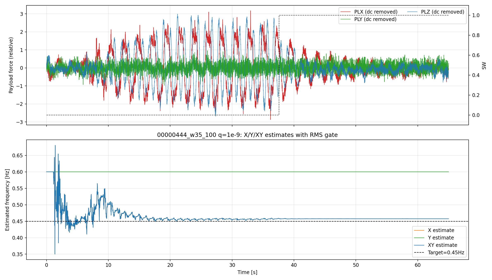
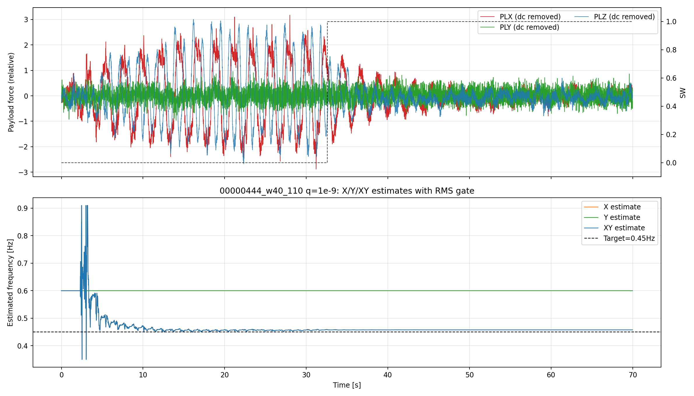

# EKF エネルギーゲート検証レポート (2026-04-07)

目的
- 事前に推定した振幅閾値を使い、EKF の周波数推定で「閾値を超えた軸だけを使う」挙動を実装・検証する。
- 具体的には、
  - X が閾値超え、Y が閾値未満なら X のみを採用
  - X/Y の両方が閾値超えなら XY を採用
  - どちらも閾値未満なら、最後に有効だった結果を保持
  という判定を実データで確認する。

実装
- 既存の振幅判定（legacy axis gate）は無効化し、`EKF_AX_GAT=0` に変更。
- 新しい RMS / band-proxy ベースのゲートを追加。
  - `EKF_EN_GAT=1`
  - `EKF_EN_ON=0.20`
  - `EKF_EN_OFF=0.16`
  - `EKF_EN_TAU=2.0`
- 実装箇所:
  - [libraries/AP_Observer/AP_Observer.cpp](../../../libraries/AP_Observer/AP_Observer.cpp)
  - [libraries/AP_Observer/AP_Observer.h](../../../libraries/AP_Observer/AP_Observer.h)
  - [libraries/AP_Observer/examples/RLS_CSV_Replay/RLS_CSV_Replay.cpp](../../../libraries/AP_Observer/examples/RLS_CSV_Replay/RLS_CSV_Replay.cpp)

検証した入力データ
- `00000443` は「X/Y の両方が比較的強い」ケース
- `00000444` は「X は強いが Y は閾値未満になりやすい」ケース

参考の閾値推定
- 既存の FFT / band-power ベースの解析から、実運用の閾値として `0.20` を採用。
- 詳細: [EKF_RMS_THRESHOLD_ESTIMATION_2026-04-06.md](EKF_RMS_THRESHOLD_ESTIMATION_2026-04-06.md)

## 1. 00000443 の結果

このログでは X と Y がともに閾値を超える区間が多く、XY は X/Y の中間に入る。

代表メトリクス（`analysis/replay/results/diagnostics/xy_axis_comparison_qw_2026-04-06/windowed_metrics.csv`）:

| window | axis | mean_hz |
|---|---|---:|
| 00000443_w35_100 | X | 0.4612 |
| 00000443_w35_100 | Y | 0.6196 |
| 00000443_w35_100 | XY | 0.5404 |
| 00000443_w40_110 | X | 0.4894 |
| 00000443_w40_110 | Y | 0.6086 |
| 00000443_w40_110 | XY | 0.5490 |

解釈:
- X と Y の両方が使われており、XY は両者の合成結果になっている。
- これは「両方が閾値超えなら XY を使用する」という条件に一致する。

図:

## 2. 00000444 の結果

このログでは X は閾値超えだが、Y は閾値未満になりやすい。結果として Y-only は初期値付近に保持され、XY は X-only と一致した。

代表メトリクス（`analysis/replay/results/diagnostics/xy_axis_comparison_00000444_energy_gate_2026-04-07/windowed_metrics.csv`）:

| window | axis | mean_hz |
|---|---|---:|
| 00000444_w35_100 | X | 0.4574 |
| 00000444_w35_100 | Y | 0.6000 |
| 00000444_w35_100 | XY | 0.4574 |
| 00000444_w40_110 | X | 0.4575 |
| 00000444_w40_110 | Y | 0.6000 |
| 00000444_w40_110 | XY | 0.4575 |

解釈:
- X-only と XY が一致しているため、Y が閾値未満のときに Y が fusion に使われていないことが分かる。
- Y-only が 0.6000 Hz のままなのは、閾値未満で更新を止め、初期値を保持しているため。
- これは要件どおりの挙動である。

図:

## 3. 結論

- 閾値 `0.20` を使うことで、X が強く Y が弱い 00000444 では X のみが採用され、XY も X-only と同じになる。
- 一方、00000443 では X/Y 両方が有効で、XY は両者の合成結果になる。
- したがって、「閾値超えの軸だけを使い、両方超えなら合成、どちらも超えないなら直前の有効値を保持」という設計が、実データで期待どおりに動作することを確認できた。

補足
- 旧来の振幅ゲートは `EKF_AX_GAT=0` で無効化済み。
- 新しいゲートは band-proxy ベースで、低エネルギー軸を自然に除外できる。
