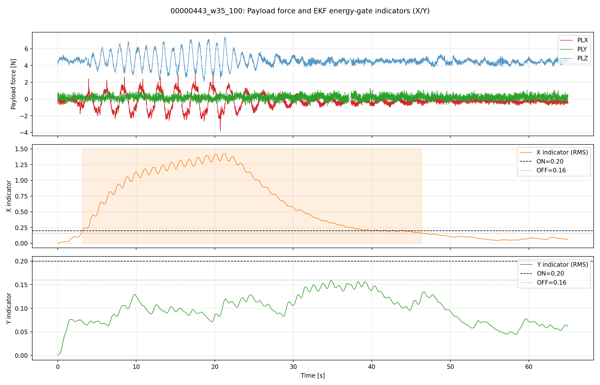
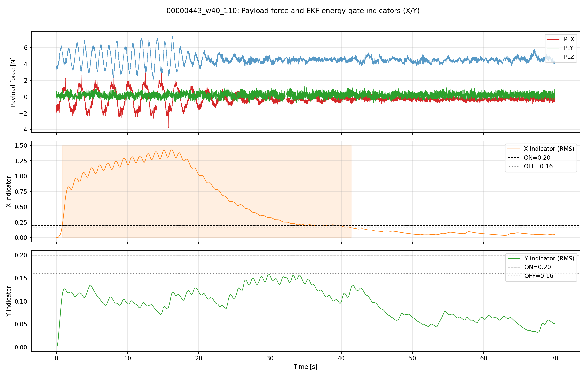
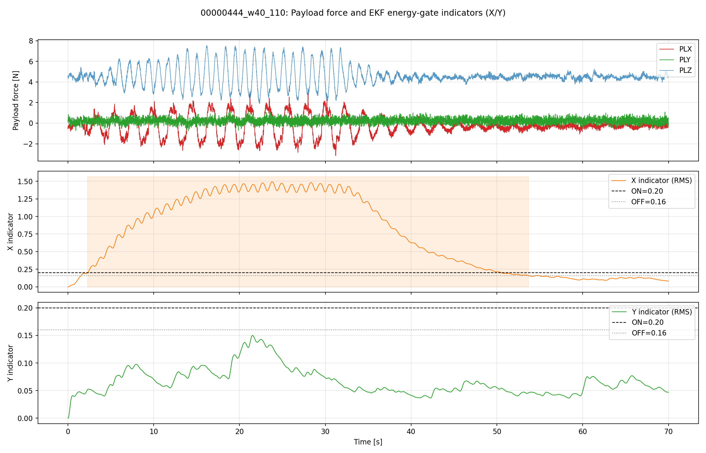

# EKF エネルギー閾値判定レポート（現行実装ベース）

目的
  - 上段: ペイロードフォース
  - 下段: X/Y 各軸の判定指標と閾値
  を可視化する。

対象実装（現在の判定）
  - 現在OFFなら `power >= EKF_EN_ON^2` でON
  - 現在ONなら `power <= EKF_EN_OFF^2` でOFF

採用パラメータ

入力データ

生成物

## 1. 00000443（X/Y 判定時系列）

観測

## 2. 00000444（X/Y 判定時系列）

観測

## 3. 443/444 横断の要約

`indicator_summary.csv` 抜粋:

| tag | x_trust_ratio | y_trust_ratio | x_rms_mean | y_rms_mean |
|---|---:|---:|---:|---:|
| 00000443_w35_100 | 0.6639 | 0.0000 | 0.5231 | 0.0966 |
| 00000443_w40_110 | 0.5773 | 0.0000 | 0.4738 | 0.0944 |
| 00000444_w35_100 | 0.8860 | 0.0000 | 0.7736 | 0.0723 |
| 00000444_w40_110 | 0.7343 | 0.0000 | 0.7165 | 0.0663 |

結論
