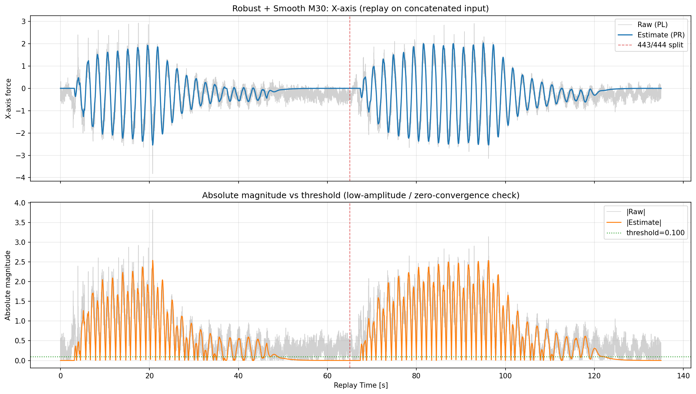
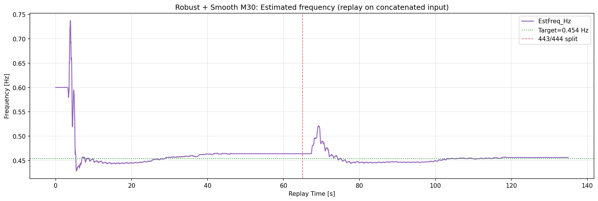

# 2026-04-15 Robust + Smooth M30 連結ログ直接リプレイ検証（443 -> 444）

**作成日時（JST）: 2026-04-15 02:39:01**

## 目的
- 2ログを後処理で連結するのではなく、入力ログを先に連結した上で1回のリプレイを実施する。
- `Robust + Smooth M30` 条件で、X/Yの推定と低振幅時の0収束、および周波数推定を検証する。

## 入力ログ連結
- 入力A: `docs/experiments/ekf_external_force_estimation/reports/2026-04-13_443_444リプレイ検証_model_strong/00000443_w35_100_input.csv`
- 入力B: `docs/experiments/ekf_external_force_estimation/reports/2026-04-13_443_444リプレイ検証_model_strong/00000444_w40_110_input.csv`
- 連結入力CSV: `docs/experiments/ekf_external_force_estimation/reports/results/2026-04-15_robust_smooth_m30_concat_direct_replay/concat_input/00000443_00000444_concat_input.csv`
- サンプル数: A=6465, B=7000, Total=13465
- 境界時刻: t=65.000312s （この時刻で443区間と444区間が切り替わる）

## リプレイ設定（Robust + Smooth M30）
- robust update: ON (`--ekf-robust-update 1`) / NIS reject: 3.0
- Q_D=9.5367432e-12, Q_DD=2.3841858e-11, Q_C=4.7683716e-13, R_MEAS=46.000
- 結果CSV: `docs/experiments/ekf_external_force_estimation/reports/results/2026-04-15_robust_smooth_m30_concat_direct_replay/replay/00000443_00000444_concat_robust_smooth_m30_result.csv`

## 指標サマリ

| segment | X RMSE | X MAE | X Corr | Y RMSE | Y MAE | Y Corr | Freq MAE [Hz] |
|---|---:|---:|---:|---:|---:|---:|---:|
| all | 0.305962 | 0.235555 | 0.942630 | 0.346814 | 0.279042 | N/A | 0.126242 |
| first (443) | 0.301877 | 0.232422 | 0.928957 | 0.346601 | 0.278573 | N/A | 0.121061 |
| second (444) | 0.309688 | 0.238450 | 0.950752 | 0.347011 | 0.279477 | N/A | 0.131027 |

## 閾値以下での0収束性（全区間）

評価条件: `|PL| <= 0.10`

| axis | low-amp samples | low-amp ratio | RMS(PR) in low-amp | MAE(PR,0) in low-amp | ratio(|PR|<=thr) |
|---|---:|---:|---:|---:|---:|
| X | 1527 | 0.1134 | 0.129193 | 0.080964 | 0.6798 |
| Y | 2999 | 0.2227 | 0.000000 | 0.000000 | 1.0000 |

注記:
- `RMS(PR) in low-amp` と `MAE(PR,0)` が小さいほど0収束性が高い。
- `ratio(|PR|<=thr)` が高いほど、低振幅区間で推定が閾値内に留まる。

## 図

### X軸: 生データと推定値（連結ログを直接リプレイ）

### Y軸: 生データと推定値（連結ログを直接リプレイ）

### 周波数推定: EstFreq_Hz と RealFreq_Hz（連結ログを直接リプレイ）

