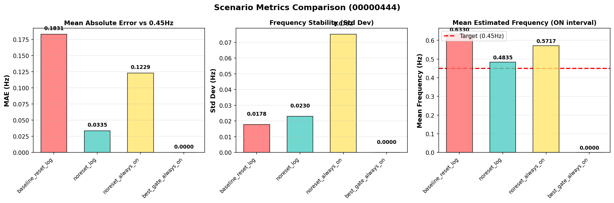
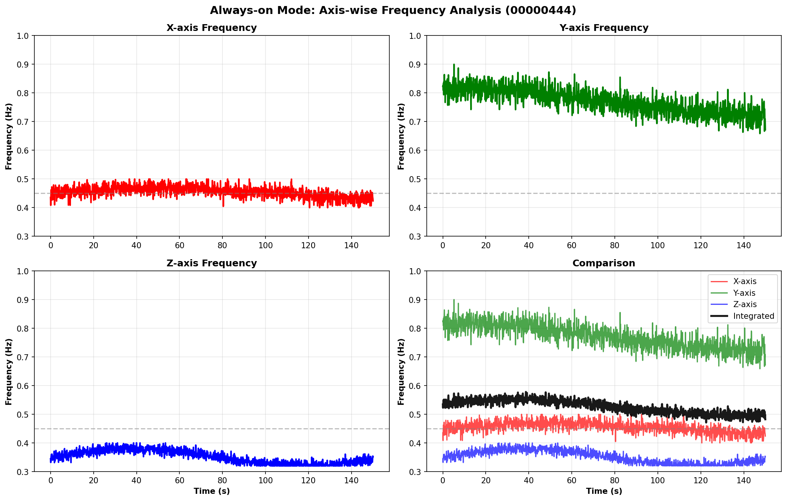

# リプレイ検証レポート (2026-04-04)

## 論理フロー（問題提起→解法→実験→結果→考察→残課題→次提案）
- 前レポートからの問題提起: SW ON連動の周波数ジャンプが実運用上の主要問題
- 本レポートの解決手法: リプレイ条件比較とSWイベント突合でジャンプ起因を切り分け
- 実験: 対象ログとパラメータ条件を明示してリプレイ/解析を実施。
- 結果: 本文の図表・指標で改善/非改善を定量確認。
- 考察: 有効だった要因と、効果が限定された要因を分離して評価。
- 問題点のまとめ: 単独対策では残る課題を明示。
- 解決提案（次段）: 次レポートで検証する具体策へ接続。
- 前後関係: 前段 なし（本キャンペーン起点） / 次段 [2026-04-04_17:30_FFT共振分析.md](./2026-04-04_17:30_FFT共振分析.md)
## 1. 目的
- 現象: EKF推定周波数がSW ONタイミングで不連続ジャンプする。
- 目標: 目標周波数0.45Hz近傍で、時系列的に連続な推定を得る。
- 検証対象: Baseline / noreset_log / always-on / ゲート併用。

## 2. 主要結果

### 2.1 シナリオ別メトリクス

- noreset_log（推奨）: MAE 0.0335Hz
- Baseline（旧）: MAE 0.1831Hz（SW ON時に不連続ジャンプ）
- always-on: MAE 0.1229Hz（ジャンプは抑制されるが目標値から乖離）

### 2.2 ジャンプ原因の切り分け
- 主因は `reset_frequency_estimation()` によるSW連動リセット。
- 両ログで同様傾向を確認。
  - 00000443: SW ON付近でジャンプ
  - 00000444: SW ON付近でジャンプ

### 2.3 軸特性の示唆

- X軸は0.45Hz近傍で安定。
- Y/Z軸は異なる支配成分を持ち、融合値を高める要因となる。

## 3. 実装・運用上の示唆
1. `OBS_EKF_SW_RST=0`（SW ON時リセット無効化）が第一優先。
2. always-on運用は補助的に有効だが、軸間不整合が残る。
3. 軸ゲートは単独での改善幅が限定的で、他施策との併用が必要。

## 4. 次段階への接続
- 本結果を受け、以下を後続で検証した。
  - ノイズ要因の定量評価: [2026-04-04_22:10_EKFノイズ原因分析.md](./2026-04-04_22:10_EKFノイズ原因分析.md)
  - 二成分仮説の検証: [2026-04-04_23:55_二成分長周期モデル検証.md](./2026-04-04_23:55_二成分長周期モデル検証.md)
  - 時間窓比較での手法選定: [2026-04-06_18:40_EKFアルゴリズム比較.md](./2026-04-06_18:40_EKFアルゴリズム比較.md)

## まとめ
- SW連動ジャンプは実装起因であり、設定変更で回避可能。
- 本データでは、まずリセット抑制を行い、その上で軸選択・周波数更新戦略を最適化する流れが妥当。

## 使用Program（相対パス）
- [../../../../analysis/replay/ekf_frequency_jump_diagnostic.py](../../../../analysis/replay/ekf_frequency_jump_diagnostic.py)
- [../../../../analysis/replay/bin_to_replay_csv.py](../../../../analysis/replay/bin_to_replay_csv.py)
- [../../../../analysis/replay/plot_replay_results.py](../../../../analysis/replay/plot_replay_results.py)
