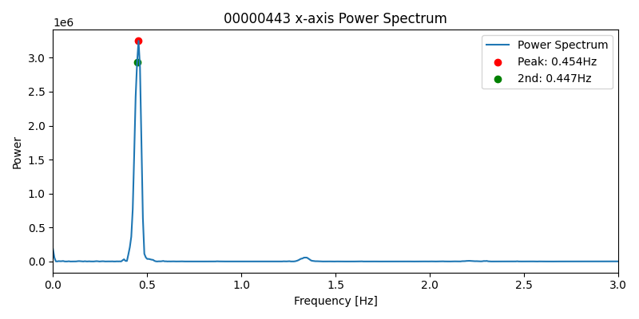
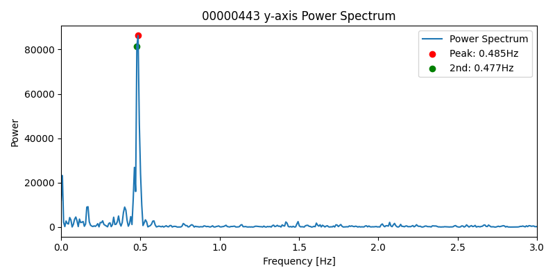
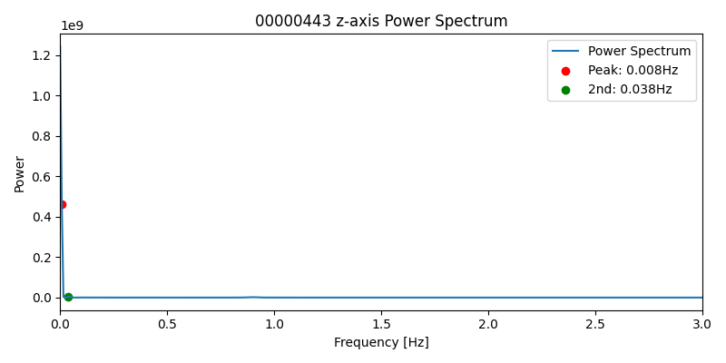
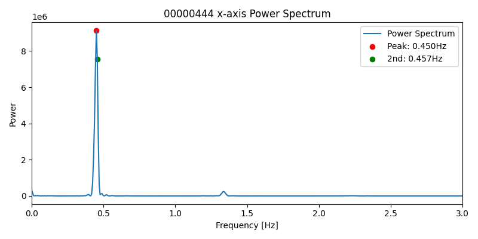
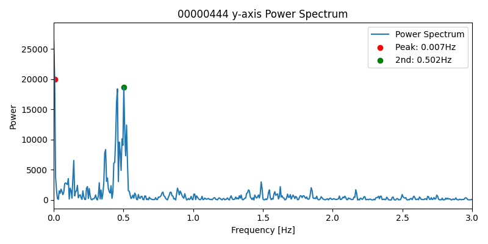
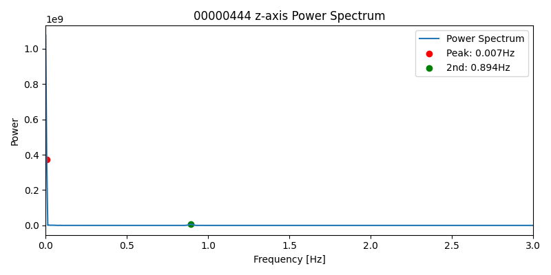

# FFT共振分析レポート (2026-04-04)

## 論理フロー（問題提起→解法→実験→結果→考察→残課題→次提案）
- 前レポートからの問題提起: ジャンプ/不整合の背景に軸別共振差があるか未確定
- 本レポートの解決手法: 軸別FFTピーク抽出で共振の支配周波数を分離評価
- 実験: 対象ログとパラメータ条件を明示してリプレイ/解析を実施。
- 結果: 本文の図表・指標で改善/非改善を定量確認。
- 考察: 有効だった要因と、効果が限定された要因を分離して評価。
- 問題点のまとめ: 単独対策では残る課題を明示。
- 解決提案（次段）: 次レポートで検証する具体策へ接続。
- 前後関係: 前段 [2026-04-04_09:55_リプレイ検証.md](./2026-04-04_09:55_リプレイ検証.md) / 次段 [2026-04-04_22:10_EKFノイズ原因分析.md](./2026-04-04_22:10_EKFノイズ原因分析.md)
## ログ 00000443
- x-axis: 主ピーク 0.4542 Hz (2nd: 0.4465 Hz)
  
- y-axis: 主ピーク 0.4850 Hz (2nd: 0.4773 Hz)
  
- z-axis: 主ピーク 0.0077 Hz (2nd: 0.0385 Hz)
  

## ログ 00000444
- x-axis: 主ピーク 0.4500 Hz (2nd: 0.4566 Hz)
  
- y-axis: 主ピーク 0.0065 Hz (2nd: 0.5022 Hz)
  
- z-axis: 主ピーク 0.0065 Hz (2nd: 0.8936 Hz)
  

---
考察:
- xy軸とz軸のピーク周波数の違いを確認し、z軸は性質が異なることを再確認。
- xy軸の主ピークが機体固有の共振周波数とみなせる場合、今後はこの値をモデルに固定値として組み込むことが有効。

## 使用Program（相対パス）
- [../../../../analysis/replay/fft_resonance_analysis.py](../../../../analysis/replay/fft_resonance_analysis.py)
- [../../../../analysis/replay/ply_fft_analysis.py](../../../../analysis/replay/ply_fft_analysis.py)
