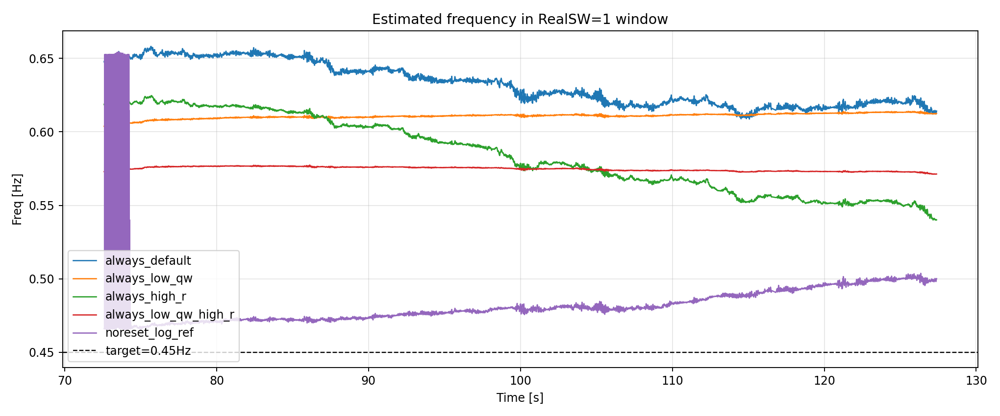
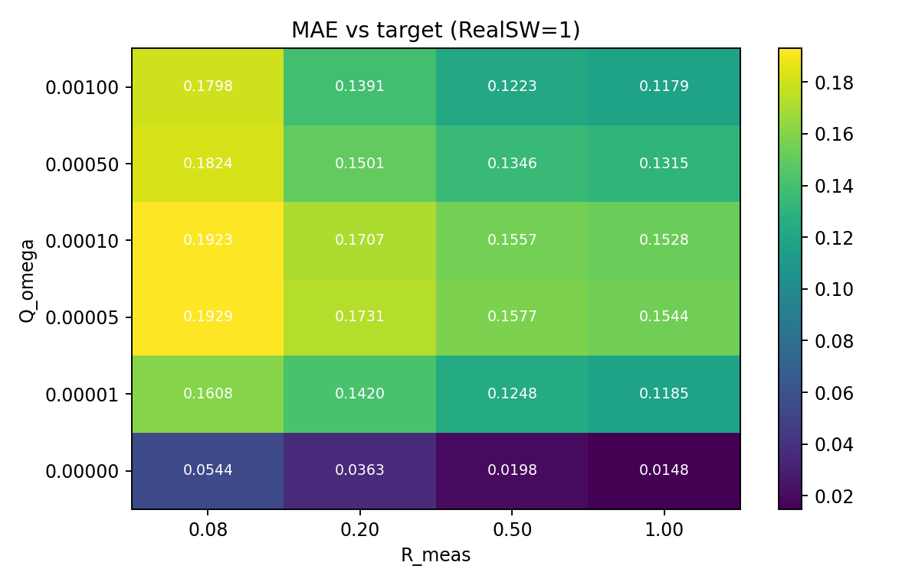
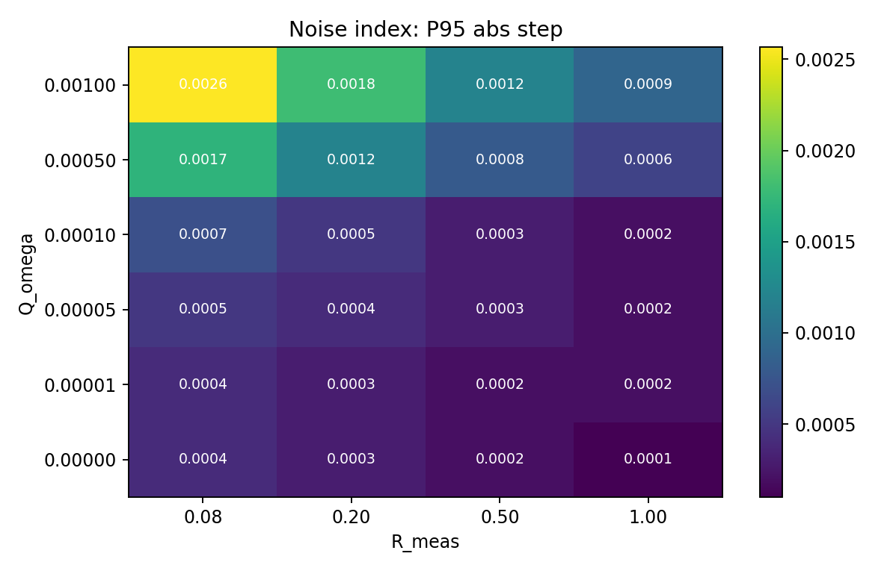
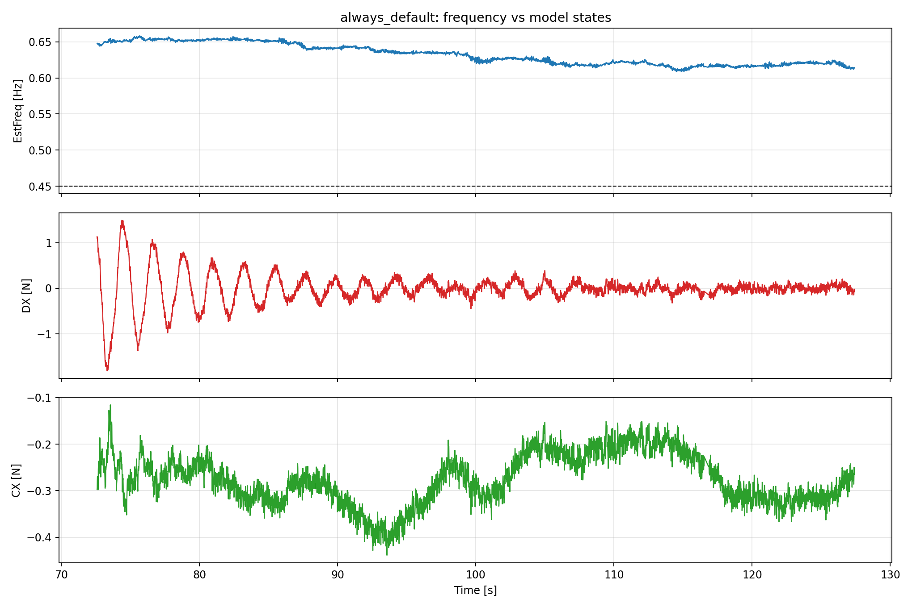

# EKFノイズ過大推定 原因調査レポート (2026-04-04)

## 論理フロー（問題提起→解法→実験→結果→考察→残課題→次提案）
- 前レポートからの問題提起: EKF推定がノイズを過大追従し、滑らかさを欠く
- 本レポートの解決手法: Qw×Rスイープでノイズ追従性と平滑性を定量比較
- 実験: 対象ログとパラメータ条件を明示してリプレイ/解析を実施。
- 結果: 本文の図表・指標で改善/非改善を定量確認。
- 考察: 有効だった要因と、効果が限定された要因を分離して評価。
- 問題点のまとめ: 単独対策では残る課題を明示。
- 解決提案（次段）: 次レポートで検証する具体策へ接続。
- 前後関係: 前段 [2026-04-04_17:30_FFT共振分析.md](./2026-04-04_17:30_FFT共振分析.md) / 次段 [2026-04-04_23:10_EKFゲート平滑化検証.md](./2026-04-04_23:10_EKFゲート平滑化検証.md)
## 1. 目的
- 現象: EKFの推定結果がノイズを拾いすぎ、想定していた「オフセット付きで減衰した滑らかな挙動」から外れる。
- 目的: 実ログ再生で原因を切り分け、パラメータ変更の効果を定量比較し、改善方針を示す。

## 2. 実行条件
- 入力ログ: `analysis/replay/data/00000444.BIN`
- 再生器: `build/sitl/examples/EKF_CSV_Replay`
- 解析スクリプト: `analysis/replay/ekf_noise_sweep_analysis.py`
- 評価窓: `RealSW=1` 区間
- 目標周波数: `0.45 Hz`

## 3. 実行したスイープ
- キーケース比較:
  - `always_default` (always-on, Qw=0.0005, R=0.08)
  - `always_low_qw` (Qw=1e-5)
  - `always_high_r` (R=0.5)
  - `always_low_qw_high_r` (Qw=1e-5, R=0.5)
  - `noreset_log_ref` (比較基準)
- 格子探索 (always-on):
  - Qw: 実質0相当(1e-6), 1e-5, 5e-5, 1e-4, 5e-4, 1e-3
  - R: 0.08, 0.2, 0.5, 1.0

## 4. 主要な結果

### 4.1 トレース比較

- `always_default` は高めバイアス (`mean=0.632Hz`, `MAE=0.182Hz`)。
- `always_low_qw_high_r` は段差ノイズを大幅低減 (`P95 step=0.0002Hz`)。
- `noreset_log_ref` は目標追従が最良 (`MAE=0.0335Hz`) だが、常時推定(always-on)とは運用目的が異なる。

### 4.2 MAEヒートマップ

- 最良は `Qw≈0, R=1.0` で `MAE=0.0148Hz`。
- Qwを大きくすると(>=5e-4) MAEが増大しやすい。

### 4.3 ノイズ指標ヒートマップ (P95ステップ)

- Qw低減とR増加の組合せで段差ノイズが最小化。
- `Qw≈0, R=1.0` は `P95 step=0.0001Hz` と最小クラス。

### 4.4 周波数と内部状態(DX/CX)比較

- DX/CX側は比較的連続で、オフセット・包絡を持つモデル的挙動を示す。
- 一方、出力周波数 `EstFreq_Hz` は軸融合の影響でギザつき/バイアスが出る。

## 5. 原因の整理 (コード観点)
1. 観測を低域化せず生データで更新している。
- `AP_Observer::update()` で `_payload_filtered = payload` としており、ノイズが直接EKF更新に入る。

2. 周波数状態 `omega` のランダムウォーク量(Qw)が効きすぎる。
- `ekf_update_axis()` で `P_pred[3][3] += q_omega`。
- 推定 active 中にQwが効くため、周波数が短周期成分に引きずられやすい。

3. 周波数は軸ごとの推定値を毎サンプル融合している。
- `ekf_update()` で trusted 軸の `omega` を平均化。
- 軸間で周波数傾向が乖離すると融合出力に段差/偏りが出る。

4. あなたが想定した「オフセット付き減衰波」は、周波数出力よりも `d`/`c` 状態に対応する。
- 期待形状と監視対象がずれていた可能性が高い。

## 6. 考察
- 現象は単一原因ではなく、
  - 生観測入力
  - Qw設定
  - 軸融合
  の合成効果で発生。
- 常時推定(always-on)を成立させるには、周波数状態を「追従より保持寄り」に寄せる必要がある。
- 今回ログでは `Qw≈0` と `R高め` が有効だったが、過度に固定化すると実運用で周波数変化追従が不足するリスクがある。

## 7. 推奨設定案
### 案A: 滑らかさ最優先 (always-on)
- `Qw≈0` (実装上は非常に小さい値)
- `R_meas=1.0`
- 実測: `MAE=0.0148Hz`, `P95 step=0.0001Hz`

### 案B: 追従性とのバランス
- `Qw=1e-5`
- `R_meas=0.5`
- 実測: `MAE=0.1248Hz`, `P95 step=0.0002Hz`

### 案C: 運用実績優先
- `sw-mode=log`, `reset_on_switch=0`
- 実測: `MAE=0.0335Hz` (目標追従は良好)

## 8. 生成物
- 指標CSV: `analysis/replay/results/diagnostics/ekf_noise_investigation_2026-04-04/sweep_metrics.csv`
- サマリJSON: `analysis/replay/results/diagnostics/ekf_noise_investigation_2026-04-04/summary.json`
- 図:
  - `key_trace_comparison.png`
  - `heatmap_mae.png`
  - `heatmap_p95_step.png`
  - `heatmap_hf_ratio.png`
  - `always_default_freq_dx_cx.png`
  - `tradeoff_mae_vs_noise.png`

## 9. 結論
- ノイズ過大は、QwとRのバランス不整合に加え、軸融合と生観測入力が重なって起きている。
- 想定していた滑らかなモデル挙動は、内部状態(DX/CX)に現れやすく、周波数出力にそのままは現れない。
- 今回データでは `Qw極小 + R高め` が最も滑らかで、目標周波数にも近い。

## 使用Program（相対パス）
- [../../../../analysis/replay/ekf_noise_sweep_analysis.py](../../../../analysis/replay/ekf_noise_sweep_analysis.py)
- [../../../../analysis/replay/ekf_frequency_jump_diagnostic.py](../../../../analysis/replay/ekf_frequency_jump_diagnostic.py)
