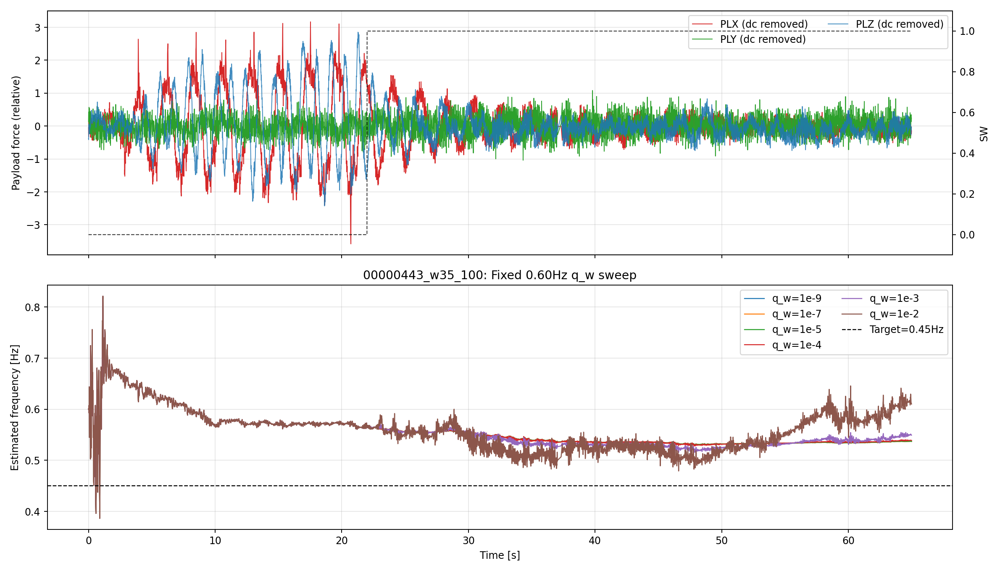
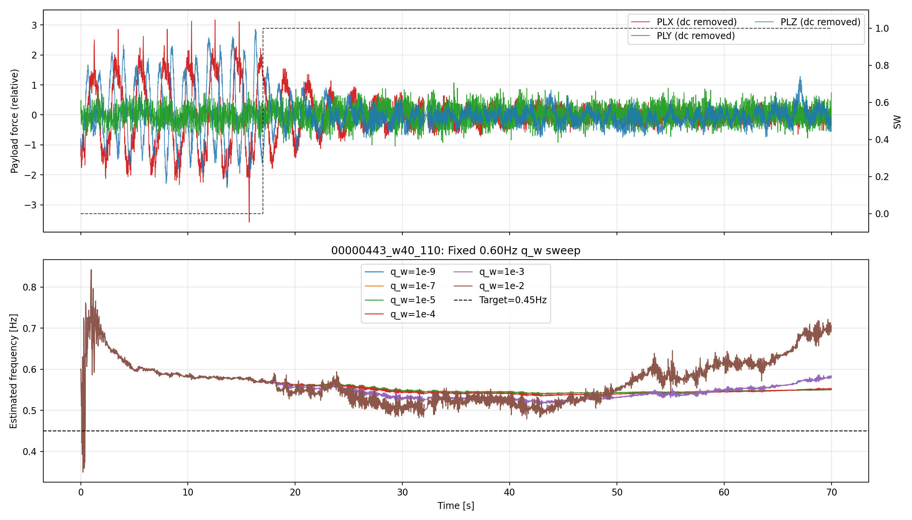
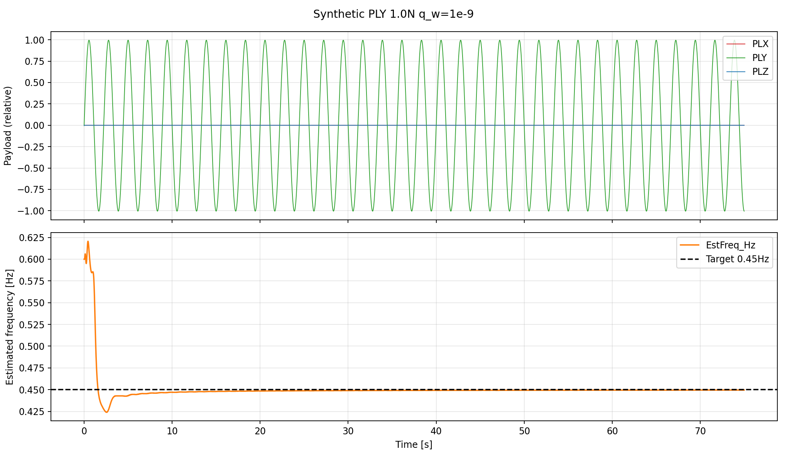
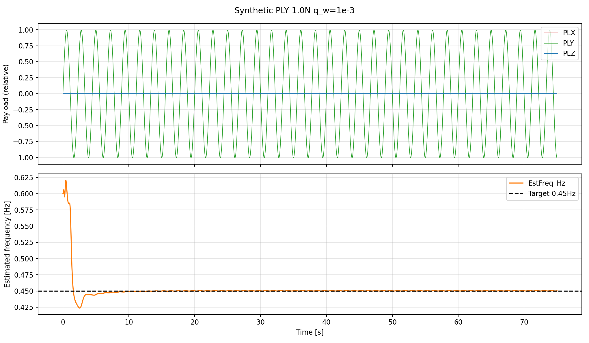
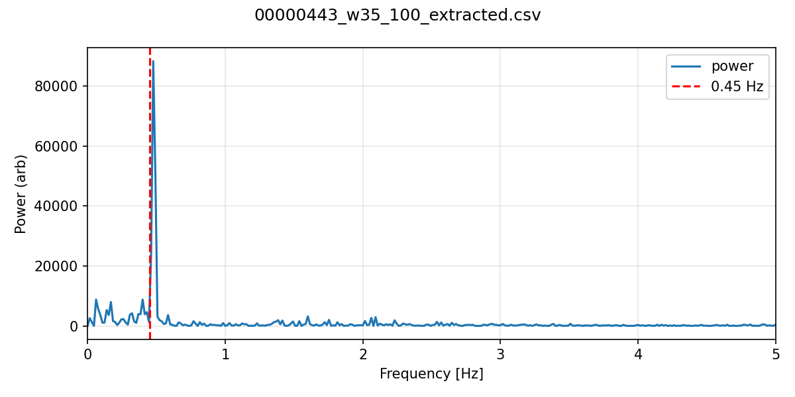
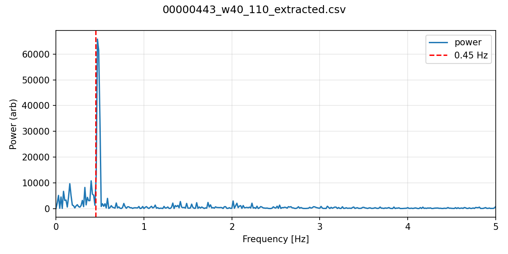

# EKF_FHOLD = 0 の影響確認レポート (2026-04-06)

概要
- 実施内容: パラメータ `ekf_force_hold_max`（従来デフォルト 1.5 N）をリポジトリ内の定義および解析スクリプト渡し値で全て `0` に変更し、以下の再実験を実行しました。
  - `analysis/replay/fixed_init_060_qw_sweep.py`（Fixed init 0.60Hz の q_w スイープ）
  - `analysis/replay/x_y_axis_comparison_three_qw.py`（X/Y/XY 比較、代表 q_w 値）

主な観察点
- Fixed 0.60Hz の q_w スイープ結果（出力CSV）: [analysis/replay/results/diagnostics/fixed_060_qw_sweep_2026-04-06/windowed_metrics.csv](analysis/replay/results/diagnostics/fixed_060_qw_sweep_2026-04-06/windowed_metrics.csv)
  - 35–100s ウィンドウ（例、q_w=1e-9）: mean ≈ 0.5404 Hz, mae ≈ 0.0904 Hz
  - 40–110s ウィンドウ（例、q_w=1e-9）: mean ≈ 0.5490 Hz, mae ≈ 0.0990 Hz
  - 結論: q_w を増やしても平均推定周波数は目標 0.45Hz へ大きく寄せられず、改善は限定的でした（従来結果と同様の傾向）。

- X/Y/XY 比較結果（出力CSV）: [analysis/replay/results/diagnostics/xy_axis_comparison_qw_2026-04-06/windowed_metrics.csv](analysis/replay/results/diagnostics/xy_axis_comparison_qw_2026-04-06/windowed_metrics.csv)
  - 重要な変化: `ekf_force_hold_max=0` にしたことで **Y-only** の推定がスイッチON時に固定 0.600Hz のまま残ることが無くなり、軸ごとに実際の推定値へ移動するようになりました。
  - 例（00000443_w35_100）:
    - q_w=1e-9: X-only mean ≈ 0.4612 Hz, Y-only mean ≈ 0.6196 Hz, XY mean ≈ 0.5404 Hz
    - q_w=1e-2: X-only mean ≈ 0.4788 Hz, Y-only mean ≈ 0.6083 Hz, XY mean ≈ 0.5436 Hz
  - 例（00000443_w40_110）:
    - q_w=1e-9: X-only mean ≈ 0.4894 Hz, Y-only mean ≈ 0.6086 Hz, XY mean ≈ 0.5490 Hz
  - 解釈: Y 軸は依然として X 軸より高めの平均を示すケースが多く、これは Y チャネル側の信号（PL Y）にバイアス/ローパス成分やノイズ寄与があるためと考えられます。`ekf_force_hold_max=0` により「保持」制御は解除され、低振幅でも周波数状態が更新されるようになりました。

生成物
- Fixed 0.60Hz スイープ: `analysis/replay/results/diagnostics/fixed_060_qw_sweep_2026-04-06/`（CSV, figures）
- X/Y/XY 比較: `analysis/replay/results/diagnostics/xy_axis_comparison_qw_2026-04-06/`（CSV, figures）

## 図

### Fixed 0.60Hz q_w スイープ




### X/Y/XY 比較（代表: q=1e-9）


短い結論と次の提案
- `ekf_force_hold_max` を 0 にすると、EKF は低振幅サンプルでも omega を保持せず更新するため、Y-only の固定化問題は解消されます。だが Y 軸の推定値が目標 0.45Hz より高めに残るケースがあるため、原因切り分けのために次を推奨します:
  1. 合成信号注入テスト（PLY に 0.45Hz の正弦波のみ注入）を行い、Y-only リプレイで EKF が正しく 0.45Hz に収束するか確認する。こちらを今すぐ実行できます。
  2. 実データの PLY 信号を再確認（既に行った FFT の定量化を拡張）し、Y 側に目標帯域のエネルギーが十分に存在するかを確認する。

変更点（リポジトリ）
- `libraries/AP_Observer/AP_Observer.cpp`: `EKF_FHOLD` のデフォルト値を `1.5f` → `0.0f` に変更（パラメータ定義のデフォルトを変更）。
- 解析スクリプト群: `--ekf-force-hold-max` を `1.5` から `0.0` に変更（`analysis/replay/*.py`）

参考: 実行コマンド（再現用）
```
source venv/bin/activate
python3 analysis/replay/fixed_init_060_qw_sweep.py --replay-bin build/sitl/examples/RLS_CSV_Replay
python3 analysis/replay/x_y_axis_comparison_three_qw.py --replay-bin build/sitl/examples/RLS_CSV_Replay
```

必要なら次に（私が実行します）:
- 合成信号注入テスト（PLY=0.45Hz）を自動生成して Y-only リプレイを実行しますか？

## 合成信号注入テスト（PLY = 0.45 Hz） — 実行結果

- 入力: 単一軸 PLY に正弦波のみ注入（振幅=1.0、fs=100 Hz、duration=75 s）。PLX/PLZ はゼロ、SW=1（常時推定ON 相当）。
- リプレイ設定: `--ekf-axis-mask 2`（Y-only）、`--ekf-w-init-hz 0.60`、`--ekf-force-hold-max 0.0`、`--ekf-axis-gate 0`。

結果（`analysis/replay/results/diagnostics/synth_ply_045_2026-04-06/synth_ply_metrics.csv`）:

| q_w | mean_hz | final_hz | mae_hz |
|---:|---:|---:|---:|
| 1e-9 | 0.450770 | 0.4495 | 0.004285 |
| 1e-5 | 0.450897 | 0.4497 | 0.004158 |
| 1e-3 | 0.452027 | 0.4503 | 0.003490 |

観察: すべての q_w 値で Y-only の EKF は目標 0.45 Hz へ収束（平均値 ≈ 0.451 Hz、最終値 ≈ 0.449–0.450 Hz）。よって Y 軸フィルタ自体は合成的に 0.45Hz の成分が与えられれば正しく収束します。

図（代表）:





## 実データ PLY の FFT 定量結果（拡張）

実データ抽出ウィンドウ（35–100s, 40–110s）について PLY/PLX の 0.45Hz 帯域の定量を行いました（出力: `analysis/replay/results/diagnostics/ply_fft_analysis_2026-04-06/ply_fft_summary.csv`）。主要結果を抜粋します:

| 抽出CSV | amp_PLX @0.45Hz | amp_PLY @0.45Hz | band_power PLX (0.40–0.50Hz) | band_power PLY (0.40–0.50Hz) | PLX/PLY (band ratio) |
|---|---:|---:|---:|---:|---:|
| 00000443_w35_100_extracted.csv | 0.65070 | 0.04209 | 1.0987e7 | 1.7327e5 | 63.4 |
| 00000443_w40_110_extracted.csv | 0.56431 | 0.03115 | 1.1227e7 | 1.8642e5 | 60.2 |

観察: 実データでは PLX 側が PLY に対して約 60 倍のバンドパワーを持ち、PLY の 0.45Hz 成分は非常に小さい（振幅 0.03–0.04 程度）です。これは合成注入テストで EKF が正常に収束したにも関わらず、実データの Y-only 見積が目標に到達しない主因であると考えられます（信号エネルギー不足）。

FFT 図:




## 結論（合成 + 実データ）

- 合成注入（PLY に明瞭な 0.45Hz 成分を入れた場合）では、Y-only EKF は確実に 0.45Hz に収束する。
- 実データでは PLY の 0.45Hz 帯域エネルギーが非常に小さく（PLX に比べて約 60x 小さい）、データ側の信号不足が Y-only 推定が目標周波数へ寄せられない主要因である。

次の推奨アクション:
- センサ/配線や機体取り付けの影響で Y 側の振幅が落ちていないか確認する。
- もし可能なら Y 側に限定した合成注入（実機 or ハードウェアインジェクション）で同様の検証を行う。


## 使用Program（相対パス）
- [../../../../analysis/replay/fixed_init_060_qw_sweep.py](../../../../analysis/replay/fixed_init_060_qw_sweep.py)
- [../../../../analysis/replay/x_y_axis_comparison_three_qw.py](../../../../analysis/replay/x_y_axis_comparison_three_qw.py)
- [../../../../analysis/replay/synthetic_ply_injection_test.py](../../../../analysis/replay/synthetic_ply_injection_test.py)
