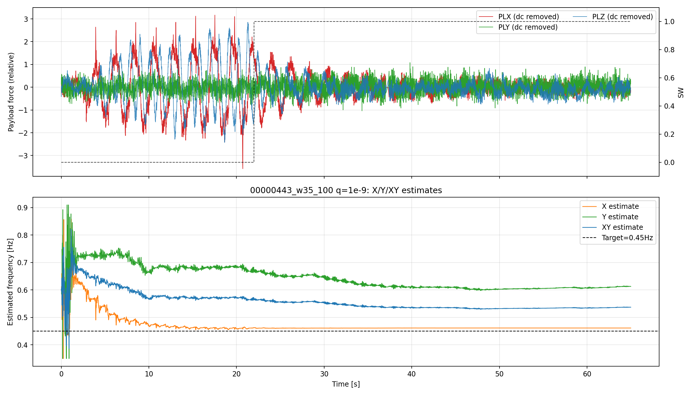
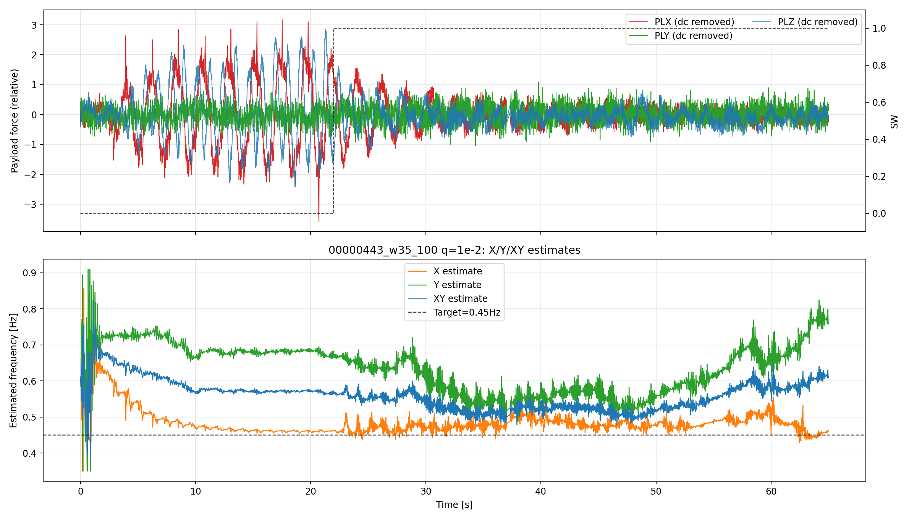
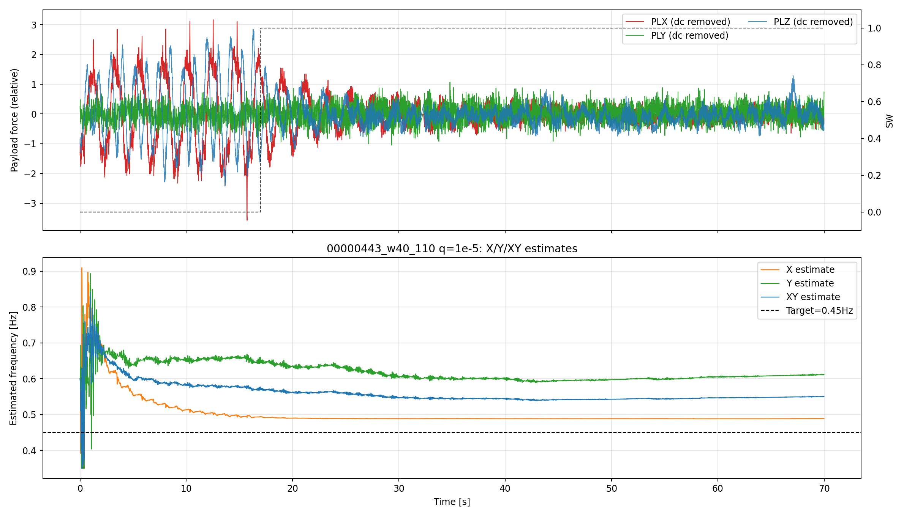
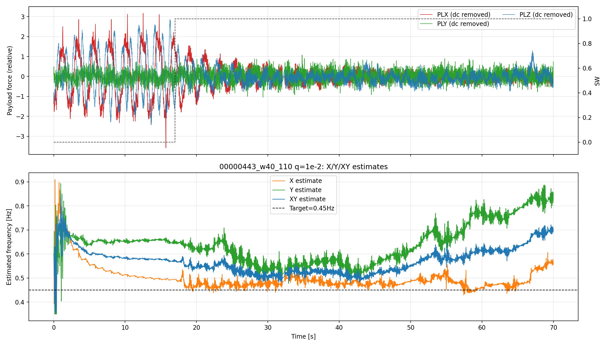

# X/Y 別推定と合計（XY）比較レポート (2026-04-06)

## 目的
- X軸のみ、Y軸のみ、及び両軸を同時に用いた合成（XY）で得られる周波数推定の違いを比較する。
- 各 q_w の代表値について、PL 系信号（上段）と推定周波数（下段）を同一図で示し、挙動の違いを可視化する。

## 実行概要
- 対象ログ: `00000443.BIN`
- ウィンドウ:
  - 35s–100s
  - 40s–110s
- 初期周波数: 0.60Hz（固定）
- 使用した代表 `q_w`: 1e-9, 1e-5, 1e-2
- 軸モード: `x` (axis mask=1), `y` (axis mask=2), `xy` (axis mask=3)
- 実行スクリプト: analysis/replay/x_y_axis_comparison_three_qw.py
- 出力:
  - metrics CSV: analysis/replay/results/diagnostics/xy_axis_comparison_qw_2026-04-06/windowed_metrics.csv
  - figures: analysis/replay/results/diagnostics/xy_axis_comparison_qw_2026-04-06/figures

## 図（各 q_w ごと）

### 35s–100s
- q_w = 1e-9
  
- q_w = 1e-5
  
- q_w = 1e-2
  

### 40s–110s
- q_w = 1e-9
  
- q_w = 1e-5
  
- q_w = 1e-2
  

## 指標（windowed_metrics.csv より）

### 35s–100s
| q_w | axis | mean_hz | std_hz | mae_hz | p95_step_hz |
| --- | --- | ---: | ---: | ---: | ---: |
| 1e-9 | x | 0.5169169285 | 0.0004459372 | 0.0669169285 | 0.0 |
| 1e-9 | y | 0.6000000000 | 0.0000000000 | 0.1500000000 | 0.0 |
| 1e-9 | xy | 0.5584610785 | 0.0002324743 | 0.1084610785 | 0.0 |
| 1e-5 | x | 0.5167312544 | 0.0004947091 | 0.0667312544 | 0.0 |
| 1e-5 | y | 0.6000000000 | 0.0000000000 | 0.1500000000 | 0.0 |
| 1e-5 | xy | 0.5583686049 | 0.0002576411 | 0.1083686049 | 0.0 |
| 1e-2 | x | 0.4902687691 | 0.0086036283 | 0.0402687691 | 0.0 |
| 1e-2 | y | 0.6000000000 | 0.0000000000 | 0.1500000000 | 0.0 |
| 1e-2 | xy | 0.5451791559 | 0.0042843885 | 0.0951791559 | 0.0 |

### 40s–110s
| q_w | axis | mean_hz | std_hz | mae_hz | p95_step_hz |
| --- | --- | ---: | ---: | ---: | ---: |
| 1e-9 | x | 0.5066778538 | 0.0003310227 | 0.0566778538 | 0.0 |
| 1e-9 | y | 0.6000000000 | 0.0000000000 | 0.1500000000 | 0.0 |
| 1e-9 | xy | 0.5533370180 | 0.0001600422 | 0.1033370180 | 0.0 |
| 1e-5 | x | 0.5065837227 | 0.0003534110 | 0.0565837227 | 0.0 |
| 1e-5 | y | 0.6000000000 | 0.0000000000 | 0.1500000000 | 0.0 |
| 1e-5 | xy | 0.5532431339 | 0.0001825192 | 0.1032431339 | 0.0 |
| 1e-2 | x | 0.4881773789 | 0.0064501295 | 0.0381773789 | 0.0 |
| 1e-2 | y | 0.6000000000 | 0.0000000000 | 0.1500000000 | 0.0 |
| 1e-2 | xy | 0.5440887749 | 0.0032256889 | 0.0940887749 | 0.0 |

## 考察・結論（簡潔）
- Y 単独の推定は今回のデータで初期値 0.60Hz を保持する傾向が強く、ほとんど動いていない（mean ≈ 0.60）。
- X 単独は q_w によって多少変化し、q_w を大きくすると mean が目標 0.45Hz 方向に近づく傾向があるが、今回の範囲では完全な収束は確認できない。
- 合成（XY）は X と Y の影響を受けた中間的な挙動を示し、固定初期値 0.60Hz からの偏差は残る。

## 生成物へのリンク
- metrics CSV: ../../../../analysis/replay/results/diagnostics/xy_axis_comparison_qw_2026-04-06/windowed_metrics.csv
- figures: ../../../../analysis/replay/results/diagnostics/xy_axis_comparison_qw_2026-04-06/figures

## 使用Program（相対パス）
- [../../../../analysis/replay/x_y_axis_comparison_three_qw.py](../../../../analysis/replay/x_y_axis_comparison_three_qw.py)
