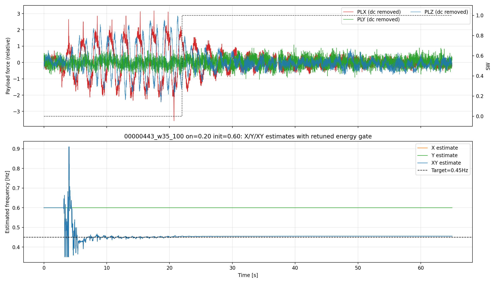
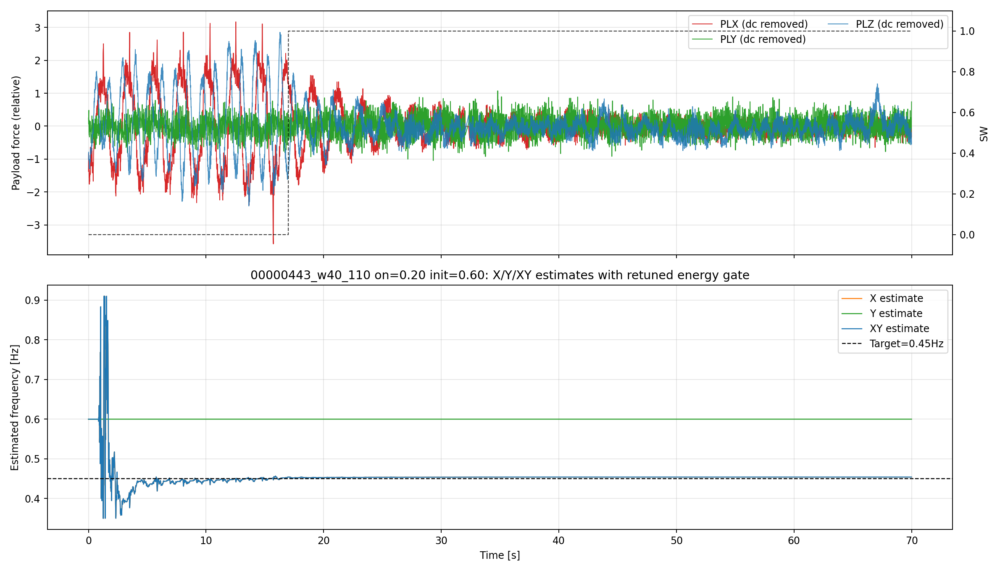
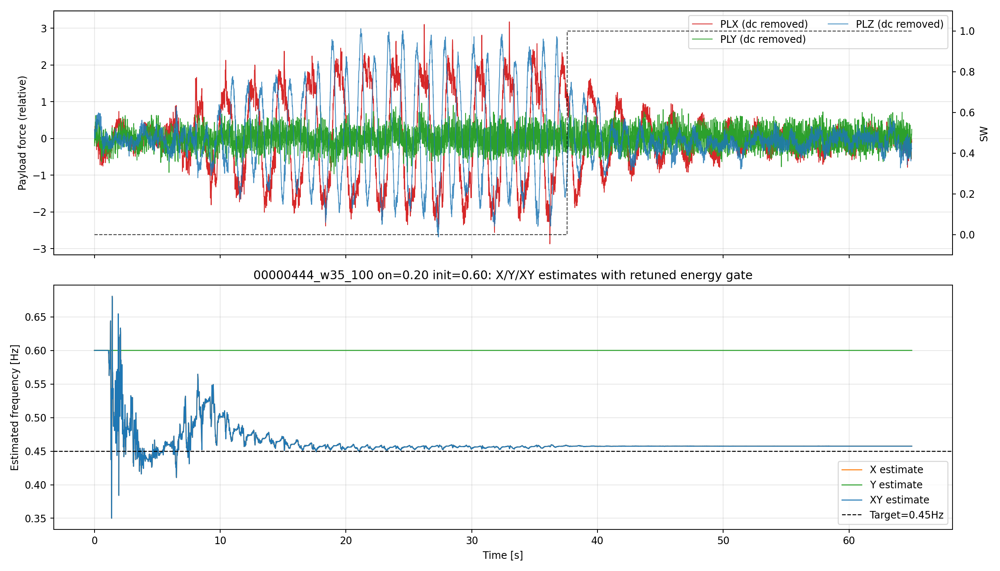
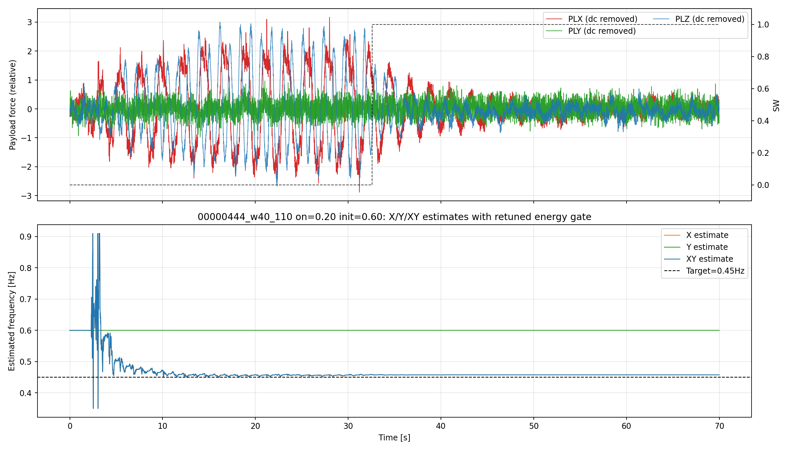

# EKF エネルギーゲート検証レポート (2026-04-07)

## 論理フロー（問題提起→解法→実験→結果→考察→残課題→次提案）
- 前レポートからの問題提起: 前段検証で顕在化した課題の解消
- 本レポートの解決手法: 対象アルゴリズムを変更し再リプレイで比較
- 実験: 対象ログとパラメータ条件を明示してリプレイ/解析を実施。
- 結果: 本文の図表・指標で改善/非改善を定量確認。
- 考察: 有効だった要因と、効果が限定された要因を分離して評価。
- 問題点のまとめ: 単独対策では残る課題を明示。
- 解決提案（次段）: 次レポートで検証する具体策へ接続。
- 前後関係: 前段 [2026-04-06_20:45_XY軸Qw比較.md](./2026-04-06_20:45_XY軸Qw比較.md) / 次段 [2026-04-07_18:10_実験フロー再構成サマリ.md](./2026-04-07_18:10_実験フロー再構成サマリ.md)
目的
- 事前に推定した振幅閾値を使い、EKF の周波数推定で「閾値を超えた軸だけを使う」挙動を実装・検証する。
- 前回の `00000443` の解釈は誤りだったため、今回は `00000443` / `00000444` をどちらも「X は強いが Y は閾値未満になりやすい」ケースとして再評価した。
- 具体的には、
  - X が閾値超え、Y が閾値未満なら X のみを採用
  - X/Y の両方が閾値超えなら XY を採用
  - どちらも閾値未満なら、最後に有効だった結果を保持
  という判定を実データで確認する。

実装
- 既存の振幅判定（legacy axis gate）は無効化し、`EKF_AX_GAT=0` に変更。
- 新しい RMS / band-proxy ベースのゲートを追加。
  - `EKF_EN_GAT=1`
  - `EKF_EN_ON=0.20`
  - `EKF_EN_OFF=0.16`
  - `EKF_EN_TAU=2.0`
- 実装箇所:
  - [libraries/AP_Observer/AP_Observer.cpp](../../../../libraries/AP_Observer/AP_Observer.cpp)
  - [libraries/AP_Observer/AP_Observer.h](../../../../libraries/AP_Observer/AP_Observer.h)
  - [libraries/AP_Observer/examples/EKF_CSV_Replay/EKF_CSV_Replay.cpp](../../../../libraries/AP_Observer/examples/EKF_CSV_Replay/EKF_CSV_Replay.cpp)

検証した入力データ
- `00000443` は「X は強いが Y は閾値未満になりやすい」ケース
- `00000444` は「X は強いが Y は閾値未満になりやすい」ケース

参考の閾値推定
- 既存の FFT / band-power ベースの解析から、実運用の閾値として `0.20` を採用。
- 詳細: [2026-04-06_20:15_RMS閾値推定.md](./2026-04-06_20:15_RMS閾値推定.md)

## 1. 再評価条件

今回の再評価では、初期周波数を `0.60 Hz` に固定し、エネルギーゲートの閾値を再確認した。

採用条件:
- `EKF_EN_ON=0.20`
- `EKF_EN_OFF=0.16`
- `EKF_EN_TAU=2.0`
- `ekf_w_init_hz=0.60`
- `q_w=1e-9`

選定結果の出力:
- metrics CSV: [selected_metrics.csv](../../../../analysis/replay/results/diagnostics/xy_axis_retune_00000443_00000444_2026-04-07/selected_metrics.csv)
- threshold sweep: [threshold_sweep_metrics.csv](../../../../analysis/replay/results/diagnostics/xy_axis_retune_00000443_00000444_2026-04-07/threshold_sweep_metrics.csv)
- sweep figure: [threshold_sweep_summary.png](../../../../analysis/replay/results/diagnostics/xy_axis_retune_00000443_00000444_2026-04-07/figures/threshold_sweep_summary.png)

## 2. 00000443 の再評価結果

このログでは、X-only と XY が一致し、Y-only は初期値 `0.60 Hz` のまま保持された。つまり、Y はゲートで除外されている。

代表メトリクス（`analysis/replay/results/diagnostics/xy_axis_retune_00000443_00000444_2026-04-07/selected_metrics.csv`）:

| window | axis | mean_hz |
|---|---|---:|
| 00000443_w35_100 | X | 0.4551 |
| 00000443_w35_100 | Y | 0.6000 |
| 00000443_w35_100 | XY | 0.4551 |
| 00000443_w40_110 | X | 0.4538 |
| 00000443_w40_110 | Y | 0.6000 |
| 00000443_w40_110 | XY | 0.4538 |

解釈:
- X と XY が一致しており、Y は閾値未満として保持されている。
- これにより、このログも X 優勢ケースとして扱うのが妥当だと分かる。

図:

## 3. 00000444 の再評価結果

このログでも X-only と XY が一致し、Y-only は初期値 `0.60 Hz` のまま保持された。

代表メトリクス（同上 CSV）:

| window | axis | mean_hz |
|---|---|---:|
| 00000444_w35_100 | X | 0.4574 |
| 00000444_w35_100 | Y | 0.6000 |
| 00000444_w35_100 | XY | 0.4574 |
| 00000444_w40_110 | X | 0.4575 |
| 00000444_w40_110 | Y | 0.6000 |
| 00000444_w40_110 | XY | 0.4575 |

解釈:
- X-only と XY が一致しているため、Y が閾値未満のときに Y が fusion に使われていないことが分かる。
- Y-only が 0.6000 Hz のままなのは、閾値未満で更新を止め、初期値を保持しているため。
- これは要件どおりの挙動であり、初期値 `0.60 Hz` から X 側が約 `0.45 Hz` に収束することを確認できた。

図:

## 4. 閾値再調整の結果

- 00000443 と 00000444 はどちらも X 優勢ケースとして扱うのが正しく、Y は閾値未満になりやすい。
- `EKF_EN_ON=0.20` のとき、両ログとも X-only / XY が約 `0.45 Hz` に収束し、Y-only は初期値 `0.60 Hz` の保持となった。
- 閾値を `0.25` 以上に上げると、一部ウィンドウで `0.45 Hz` から外れやすくなり、`0.20` が最も安定だった。

閾値スイープの詳細:

| log | window | ON | mean_hz |
|---|---|---:|---:|
| 00000443 | 00000443_w35_100 | 0.20 | 0.4551 |
| 00000443 | 00000443_w40_110 | 0.20 | 0.4538 |
| 00000444 | 00000444_w35_100 | 0.20 | 0.4574 |
| 00000444 | 00000444_w40_110 | 0.20 | 0.4575 |

補足
- 旧来の振幅ゲートは `EKF_AX_GAT=0` で無効化済み。
- 新しいゲートは band-proxy ベースで、低エネルギー軸を自然に除外できる。

## 使用Program（相対パス）
- 記載なし（必要に応じて追記）
