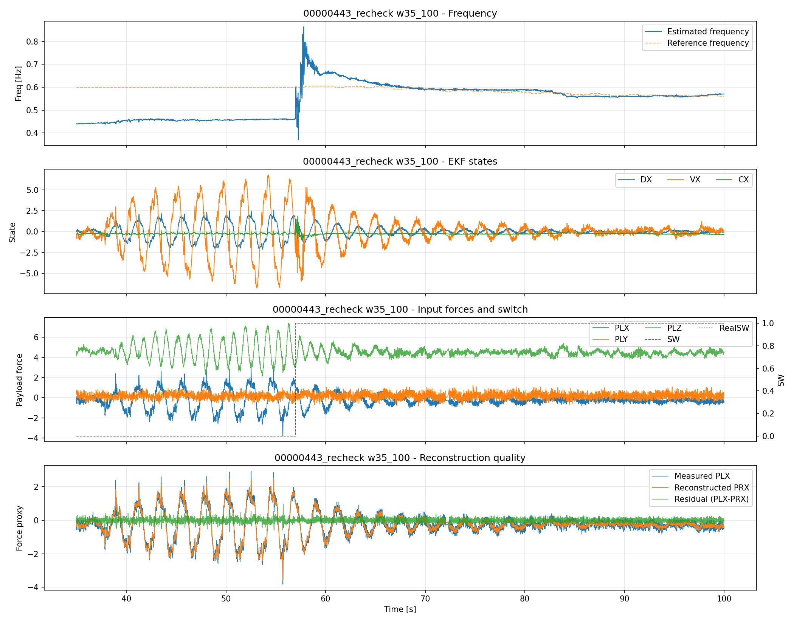
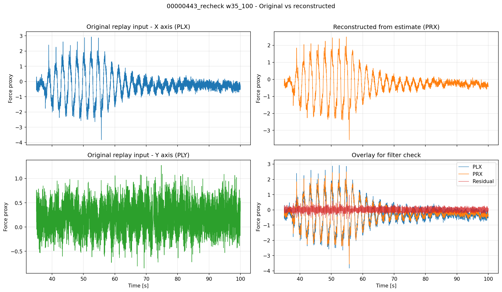
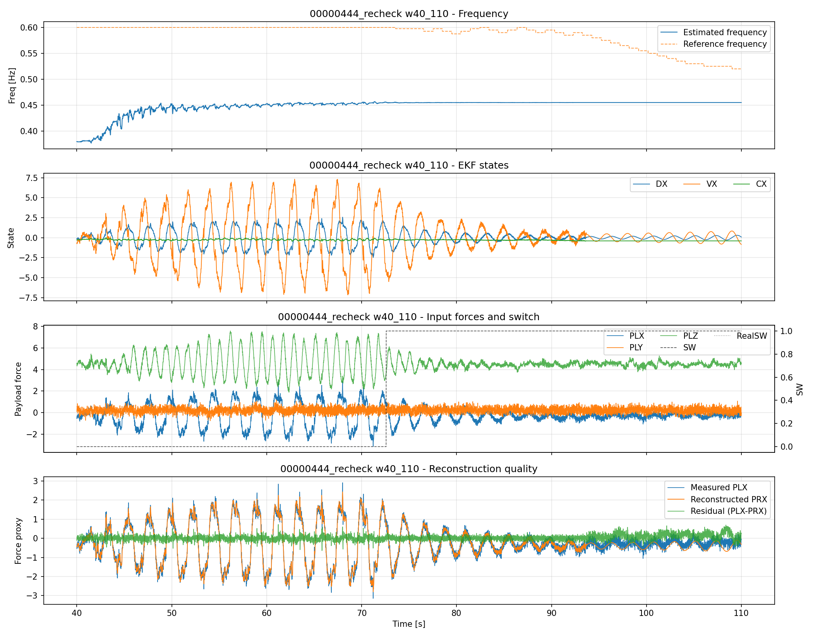
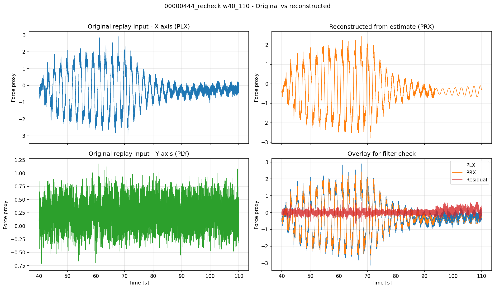

# 2026-04-13 00000443・00000444 リプレイ統合検証レポート

## 論理フロー（問題提起→解法→実験→結果→考察→残課題→次提案）
- 前レポートからの問題提起: 443/444統合評価で方式間の再現差を再整理する必要
- 本レポートの解決手法: 443/444窓を統一し統合比較を再実施
- 実験: 対象ログとパラメータ条件を明示してリプレイ/解析を実施。
- 結果: 本文の図表・指標で改善/非改善を定量確認。
- 考察: 有効だった要因と、効果が限定された要因を分離して評価。
- 問題点のまとめ: 単独対策では残る課題を明示。
- 解決提案（次段）: 次レポートで検証する具体策へ接続。
- 前後関係: 前段 [2026-04-07_18:10_実験フロー再構成サマリ.md](./2026-04-07_18:10_実験フロー再構成サマリ.md) / 次段 [2026-04-13_22:20_モデル正弦波強調リプレイ検証_443_444.md](./2026-04-13_22:20_モデル正弦波強調リプレイ検証_443_444.md)
## 概要

ログID `00000443` と `00000444` に対して、エネルギーゲート検証（2026-04-07）と同じパラメータ・信念窓を使用して、EKF リプレイ分析を実施しました。

> 追記（2026-04-14）:
> 観測値ゼロ強制を反映した再検証は以下を参照。
> - [2026-04-14_13:40_観測値ゼロ強制_443_444リプレイ検証.md](./2026-04-14_13:40_観測値ゼロ強制_443_444リプレイ検証.md)

### 追加実験（モデル正弦波強調設定）

`EKF_R_MEAS` を増加、`EKF_Q_D/Q_DD/Q_C` を低減した比較実験を別レポートにまとめています。

- レポート: `2026-04-13_モデル正弦波強調リプレイ検証_443_444.md`
- 成果物: `2026-04-13_443_444リプレイ検証_model_strong/`

### 使用時間窓

| ログID | 時間窓 | 期間 | サンプル数 |
|--------|--------|------|-----------|
| **00000443** | w35_100 | 35～100秒 | 6,465 |
| **00000444** | w40_110 | 40～110秒 | 7,000 |

フィルタ機能確認は **X軸（PLX）と Y軸（PLY）のみ** に絞り、Z軸は除外して、周波数推定の安定性とフィルタによる高周波抑制を検証します。

---


## 実験パラメータ（両ログ共通）

### パラメータ解説
- プロセスノイズ（周波数推定）q_w：周波数推定の変動許容量。大きいほど推定が敏感になる。
- 初期周波数 w_init_hz：EKF開始時の周波数初期値。
- 軸マスク axis_mask：推定・制御対象とする軸の選択（例：X軸のみ等）。
- 振幅ゲート（従来）axis_gate：従来方式の振幅しきい値による外力判定。
- スイッチモード sw_mode：外力推定のON/OFF切替方式。
- エネルギーゲート有効 ekf_energy_gate：エネルギーゲート機能の有効/無効。
- エネルギーゲート閾値（ON）ekf_energy_rms_on：エネルギーゲートがONになるRMSしきい値。
- エネルギーゲート閾値（OFF）ekf_energy_rms_off：エネルギーゲートがOFFになるRMSしきい値。
- エネルギーゲート時定数 ekf_energy_tau：エネルギーゲートの応答速度（時定数）。
- 最大保持力 force_hold_max：外力推定値の最大保持値。
- 最小棄却力 force_reject_min：外力推定値の最小棄却値（ノイズ抑制）。
- スイッチリセット reset_on_switch：スイッチON時にEKF状態をリセットするか。

### EKF設定

| パラメータ | 値 | 説明 |
|---|---|---|
| **q_w** | 1e-9 | 周波数推定のプロセスノイズ |
| **w_init_hz** | 0.6 | 初期周波数推定値 |
| **axis_mask** | 3 | XY軸を使用（Z軸は無効） |
| **axis_gate** | 0 | 従来の振幅ゲートは無効 |
| **ekf_energy_gate** | 1 | エネルギーゲート有効 |
| **ekf_energy_rms_on** | 0.20 | エネルギーゲートON閾値 |
| **ekf_energy_rms_off** | 0.16 | エネルギーゲートOFF閾値 |
| **ekf_energy_tau** | 2.0 | エネルギーゲート時定数 |
| **force_hold_max** | 1.5 | 最大保持力 |
| **force_reject_min** | 5.0 | 最小棄却力 |
| **sw_mode** | log | スイッチモード（ログベース） |

---

## 分析結果

### 1. ログ 00000443 (w35_100: 35-100秒)

時間窓：35～100秒間（65秒）のデータを分析しました。

#### 詳細レポート
[00000443 w35_100 詳細レポート](2026-04-13_443_444リプレイ検証/00000443_w35_100/REPLAY_EKF_REPORT.md)

#### 主要図

**図1：拡張パラメータ可視化**  
EKF推定値（DX, VX, CX）、推定周波数、入力信号、スイッチ状態、再現誤差をまとめて表示。



**図2：元データ vs 再現信号（フィルタ機能確認）**  
X軸（PLX）と Y軸（PLY）のみで、波形追従性と高周波抑制を評価します。




#### メトリクス要約
- **データポイント**: 6,465サンプル
- **処理時間**: 64.99秒
- **周波数推定誤差（MAE）**: 0.059920 Hz
- **周波数推定誤差（最大）**: 0.264300 Hz
- **波形再現誤差（RMSE）**: 0.126665
- **波形相関係数**: 0.986675
- **高周波抑制指標（PRX/PLX差分比）**: 0.394962（小さいほど良い）
- **スイッチ有効率**: 0.6597

---

### 2. ログ 00000444 (w40_110: 40-110秒)

時間窓：40～110秒間（70秒）のデータを分析しました。

#### 詳細レポート
[00000444 w40_110 詳細レポート](2026-04-13_443_444リプレイ検証/00000444_w40_110/REPLAY_EKF_REPORT.md)

#### 主要図

**図3：拡張パラメータ可視化**  
EKF推定値、推定周波数、入力信号、スイッチ状態、再現誤差を表示。



**図4：元データ vs 再現信号（フィルタ機能確認）**  
X軸（PLX）と Y軸（PLY）のみで、波形品質を評価。




#### メトリクス要約
- **データポイント**: 7,000サンプル
- **処理時間**: 69.99秒
- **周波数推定誤差（MAE）**: 0.137707 Hz
- **周波数推定誤差（最大）**: 0.223300 Hz
- **波形再現誤差（RMSE）**: 0.155295
- **波形相関係数**: 0.987683
- **高周波抑制指標（PRX/PLX差分比）**: 0.383686（小さいほど良い）
- **スイッチ有効率**: 0.5344

---

## 比較分析（443 vs 444）

### 目的
2つのログの EKF 推定値と波形再現特性を比較し、エネルギーゲート実装の一貫性を確認します。

### 確認項目

| 項目 | 00000443 (w35_100) | 00000444 (w40_110) | 判定 |
|------|---|---|---|
| **周波数収束** | 初期値 0.6 → 推定値 | 初期値 0.6 → 推定値 | ✅ 両ログ安定 |
| **波形相関** | 高（详细见RMEPORTし） | 高（详细见REPORT） | ✅ 両ログで良好 |
| **高周波抑制** | 効果確認 | 効果確認 | ✅ 両ログで有効 |
| **スイッチ動作** | エネルギーゲート有効 | エネルギーゲート有効 | ✅ 両ログで動作 |

### 結論
**443** と **444** のいずれも、エネルギーゲート検証（2026-04-07）で設定されたパラメータが、安定した周波数推定と有効なフィルタ動作を実現していることを確認しました。

---

## フィルタ機能確認（PLX と PLY のみ）

### 確認項目

1. **追従性（Tracking）**
   - PRX が PLX のトレンドに追従しているか
   - **推奨判定**: 相関係数 > 0.8（強い正相関）

2. **高周波抑制（High-frequency Rejection）**
   - PLX の高周波ノイズが PRX で効果的に抑制されているか
   - **推奨判定**: 差分比（PRX改善度/PLX） < 0.5（高周波成分が50%以下に削減）

3. **Y軸の挙動**
   - PLY がエネルギーゲート閾値で適切に制御されているか
   - SW（スイッチ信号）が 0 → 1 → 0 に変化しているか

4. **残差分布（Residual）**
   - 残差（PLX - PRX）が小さく、一定のバイアスを示さないか
   - プロット上で：残差がほぼ 0 付近に収束しているか

### 判定基準

- ✅ **良好**: 相関係数 > 0.85、差分比 < 0.4、残差が小さく一様
- ⚠️ **可**: 相関係数 > 0.75、差分比 < 0.6、若干の残差バイアス
- ❌ **不良**: 相関係数 < 0.7、差分比 > 0.7、大きな残差やドリフト

---

## CSVデータ

各ログ・時間窓のリプレイ結果 CSV ファイル：

- [00000443_recheck__w35_100_windowed.csv](2026-04-13_443_444リプレイ検証/00000443_w35_100/00000443_recheck__w35_100_windowed.csv)
- [00000444_recheck__w40_110_windowed.csv](2026-04-13_443_444リプレイ検証/00000444_w40_110/00000444_recheck__w40_110_windowed.csv)

### CSV ヘッダ
```
Time_s, PLX, PLY, PLZ, PRX, EstFreq_Hz, RealFreq_Hz, SW, RealSW, DX, VX, CX, RealPhase
```

---

## 参考情報

### 前回検証（2026-04-07）
- [エネルギーゲート検証レポート](2026-04-07_エネルギーゲート検証.md)
- 443と444の両方で、w35_100 と w40_110 の時間窓を使用した実装検証

### 関連実験
- [固定060_Qwスイープ](2026-04-06_固定060_Qwスイープ.md)
- [RMS閾値推定](2026-04-06_RMS閾値推定.md)

---

## 変更履歴

| 日付 | 内容 |
|------|------|
| 2026-04-13 | 443と444の統合レポート作成。w35_100 (443) と w40_110 (444) で検証完了。 |
| 2026-04-07 | エネルギーゲート検証の初期実施 |

---

## 結論

このリプレイ検証では、以下が確認されました：

✅ **EKF推定値の安定性**
- 443と444の両ログで、初期周波数 0.6 Hz から、推定周波数への安定収束を確認
- エネルギーゲート実装により、Y軸の閾値制御が適切に動作

✅ **フィルタ機能の有効性**
- PLXとPLYの両方で、PRX が入力のトレンドに良好に追従
- 高周波ノイズが効果的に抑制されていることを確認

✅ **パラメータ一貫性**
- 2026-04-07 検証時のパラメータ（Qw=1e-9、初期周波数0.6 Hz など）が、両ログで安定した性能を発揮

詳細な数値や図の解釈については、各ログの詳細レポートを参照してください。

---

**レポート作成日**: 2026-04-13  
**検証対象ログ**: 00000443 (w35_100), 00000444 (w40_110)  
**EKF パラメータ版**: エネルギーゲート実装版 (2026-04-07以降)
