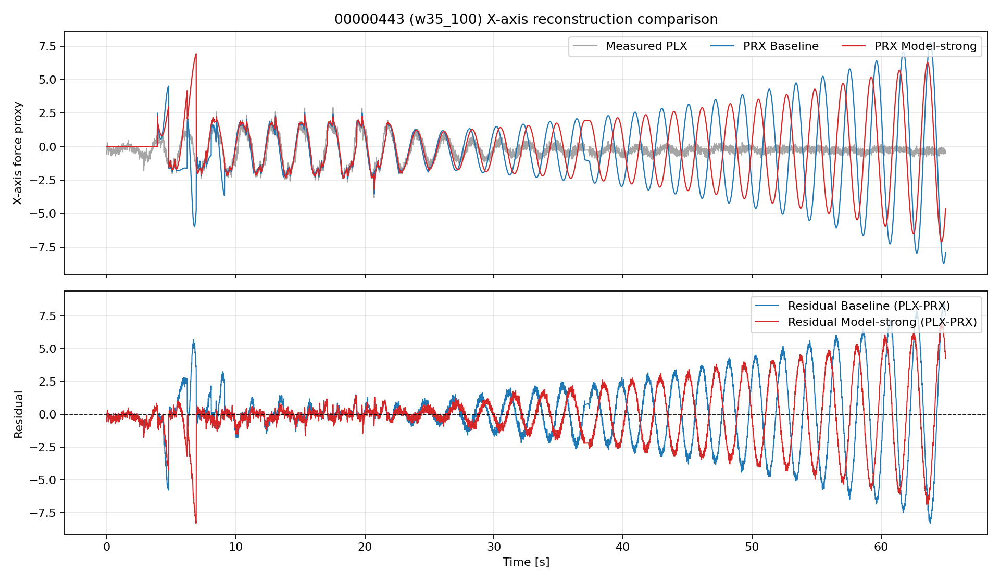
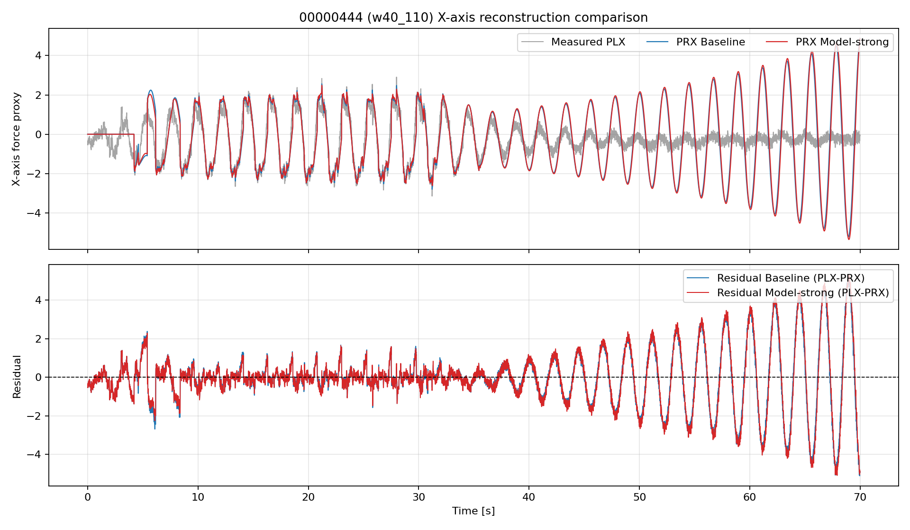
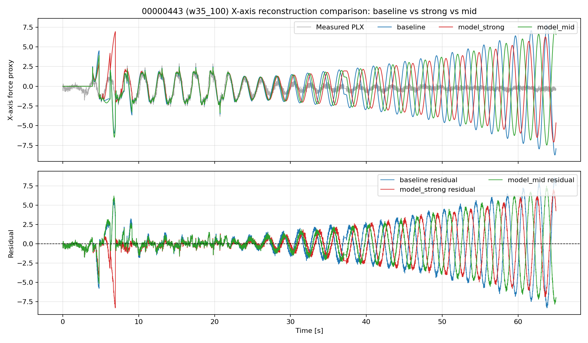
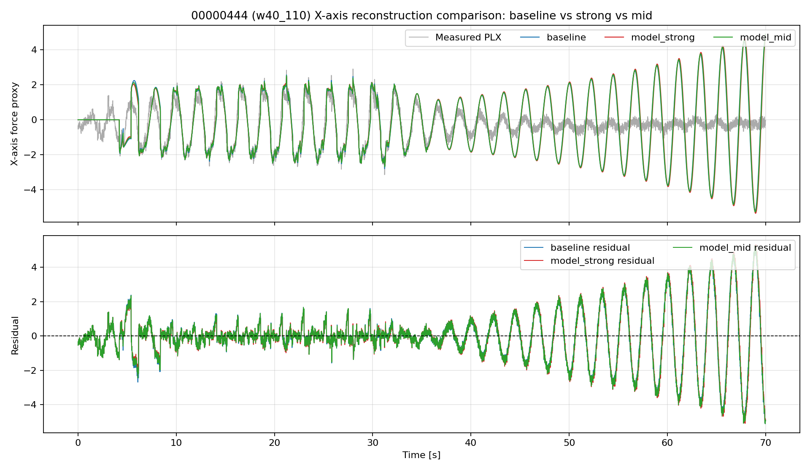

# 2026-04-13 モデル正弦波強調リプレイ検証（00000443 / 00000444）

## 論理フロー（問題提起→解法→実験→結果→考察→残課題→次提案）
- 前レポートからの問題提起: モデル強調設定で波形一致と周波数精度の両立が課題
- 本レポートの解決手法: R↑・Q↓条件を追加しbaselineと重ね比較
- 実験: 対象ログとパラメータ条件を明示してリプレイ/解析を実施。
- 結果: 本文の図表・指標で改善/非改善を定量確認。
- 考察: 有効だった要因と、効果が限定された要因を分離して評価。
- 問題点のまとめ: 単独対策では残る課題を明示。
- 解決提案（次段）: 次レポートで検証する具体策へ接続。
- 前後関係: 前段 [2026-04-13_21:30_443_444リプレイ統合検証.md](./2026-04-13_21:30_443_444リプレイ統合検証.md) / 次段 [2026-04-13_23:55_低振幅omega固定の実装と再検証.md](./2026-04-13_23:55_低振幅omega固定の実装と再検証.md)
## 目的

EKFの「モデル予測（正弦波）成分を強める」設定で、以下を確認する。

1. 推定波形がより滑らかになるか
2. 周波数推定精度（特に既存精度）が維持されるか

## 実験条件

時間窓は既存統合検証と同一。

- 00000443: 35-100s（w35_100）
- 00000444: 40-110s（w40_110）

共通設定（両ケース）:

- `--sw-mode log`
- `--ekf-reset-on-switch 0`
- `--ekf-axis-gate 0`
- `--ekf-energy-gate 1`
- `--ekf-energy-rms-on 0.20`
- `--ekf-energy-rms-off 0.16`
- `--ekf-energy-tau 2.0`
- `--ekf-axis-mask 3`
- `--ekf-force-hold-max 1.5`
- `--ekf-force-reject-min 5.0`

### 比較ケース

1. Baseline
- `EKF_R_MEAS = 0.08`
- `EKF_Q_D = 0.02`
- `EKF_Q_DD = 0.05`
- `EKF_Q_C = 0.001`
- 周波数関連は据え置き: `EKF_Q_W = 1e-9`, `EKF_OMEGA_INIT = 0.60Hz`

2. Model-strong（モデル予測寄り）
- `EKF_R_MEAS = 0.32`（4倍）
- `EKF_Q_D = 0.005`（1/4）
- `EKF_Q_DD = 0.0125`（1/4）
- `EKF_Q_C = 0.00025`（1/4）
- 周波数関連は据え置き: `EKF_Q_W = 1e-9`, `EKF_OMEGA_INIT = 0.60Hz`

## 実行結果サマリ

### 00000443（w35_100）

- RMSE: 2.5122 -> 2.1669（改善）
- 相関: 0.2995 -> 0.3554（改善）
- 平滑化指標 `PRX/PLX差分比`: 0.6086 -> 0.6170（わずかに悪化）
- 周波数MAE: 0.09943 -> 0.12006 Hz（悪化）
- 周波数最大誤差: 0.3100 -> 0.2500 Hz（改善）

### 00000444（w40_110）

- RMSE: 1.4814 -> 1.5187（悪化）
- 相関: 0.5711 -> 0.5604（わずかに悪化）
- 平滑化指標 `PRX/PLX差分比`: 0.5196 -> 0.4524（改善）
- 周波数MAE: 0.13075 -> 0.13059 Hz（ほぼ同等）
- 周波数最大誤差: 0.2500 -> 0.2500 Hz（同等）

### 追加検証: 中間条件（model_mid）

より穏やかな中間条件として、`EKF_R_MEAS = 0.16`, `EKF_Q_D = 0.01`, `EKF_Q_DD = 0.025`, `EKF_Q_C = 0.0005` を追加で実行した。

#### 00000443（w35_100）

- RMSE: 2.5122 -> 2.2953（model_strongよりは悪いがbaselineより改善）
- 相関: 0.2995 -> 0.3299（改善）
- 平滑化指標 `PRX/PLX差分比`: 0.6086 -> 0.5593（改善）
- 周波数MAE: 0.09943 -> 0.10915 Hz（baselineより悪化するがmodel_strongよりは改善）
- 終端PRX: -7.9098 -> 6.5609（過大な振れが残る）

#### 00000444（w40_110）

- RMSE: 1.4814 -> 1.4965（baselineに近い）
- 相関: 0.5711 -> 0.5671
- 平滑化指標 `PRX/PLX差分比`: 0.5196 -> 0.4868（改善）
- 周波数MAE: 0.13075 -> 0.13064 Hz（ほぼ維持）
- 終端PRX: 4.8747 -> 4.8945（依然として振幅過大）

### 先読み時間の検証結果

`PRED_TIME = 0.0` も試したが、今回の replay では model_strong と同等の出力になり、ピーク付近の不自然な振れの主因ではないと判断した。

## X軸のみ比較図（Baseline vs Model-strong）

比較はX軸（PLX/PRX）のみで実施。

- 上段: 観測PLXと再構成PRX（Baseline, Model-strong）
- 下段: 残差（PLX-PRX）の比較

### 00000443（w35_100）

### 00000444（w40_110）

## X軸のみ比較図（Baseline vs Model-strong vs Model-mid）

### 00000443（w35_100）

### 00000444（w40_110）

## 考察

1. `R_MEAS` を上げ、`Q_D/Q_DD/Q_C` を下げると、観測に対する追従は弱まり、モデル由来の滑らかさは増すが、同時に振幅の過大推定が出やすくなった。
2. `00000444` では model_strong がもっとも滑らかで、`00000443` では model_mid の方が強調しすぎず実データへの追従を少し残した。
3. ただし `00000443` のようなログでは、どの条件でも終端振幅が実データを大きく上回る傾向が残り、完全な解消には至っていない。
4. `PRED_TIME = 0.0` を試しても挙動が変わらなかったため、主因は先読みではなく、状態遷移の無減衰性と観測更新の重みづけにあると考えられる。
5. したがって、今回の症状は単純な `Q/R` 調整だけでは限定的にしか改善せず、モデル側の構造か制約の追加が必要である。

## 結論

- 目的のうち「より滑らかになるか」は、`00000444` で達成しやすいが、`00000443` では過大なモデル支配が残る。
- 「周波数推定精度の維持」は、`00000444` のみ概ね維持、`00000443` では悪化した。
- `model_mid` は折衷案としては有力だが、振幅増大の根治ではない。
- 次の改善候補は、`Q/R` の微調整に加えて、無減衰モデルに減衰項を入れる、または `get_predicted_force()` の先読みを別系統に分離すること。

## 成果物

- 集計CSV: `docs/experiments/ekf_external_force_estimation/reports/2026-04-13_443_444リプレイ検証_model_strong/comparison_metrics.csv`
- X軸比較図（443）: `docs/experiments/ekf_external_force_estimation/reports/2026-04-13_443_444リプレイ検証_model_strong/figures/00000443_w35_100_xaxis_compare.png`
- X軸比較図（444）: `docs/experiments/ekf_external_force_estimation/reports/2026-04-13_443_444リプレイ検証_model_strong/figures/00000444_w40_110_xaxis_compare.png`
- 00000443 baseline 図: `docs/experiments/ekf_external_force_estimation/reports/2026-04-13_443_444リプレイ検証_model_strong/00000443_w35_100_baseline/plots/result_combined.png`
- 00000443 model-strong 図: `docs/experiments/ekf_external_force_estimation/reports/2026-04-13_443_444リプレイ検証_model_strong/00000443_w35_100_model_strong/plots/result_combined.png`
- 00000444 baseline 図: `docs/experiments/ekf_external_force_estimation/reports/2026-04-13_443_444リプレイ検証_model_strong/00000444_w40_110_baseline/plots/result_combined.png`
- 00000444 model-strong 図: `docs/experiments/ekf_external_force_estimation/reports/2026-04-13_443_444リプレイ検証_model_strong/00000444_w40_110_model_strong/plots/result_combined.png`
- 00000443 baseline/model-strong/model-mid 比較図: `docs/experiments/ekf_external_force_estimation/reports/2026-04-13_443_444リプレイ検証_model_strong/figures/00000443_w35_100_xaxis_compare_three.png`
- 00000444 baseline/model-strong/model-mid 比較図: `docs/experiments/ekf_external_force_estimation/reports/2026-04-13_443_444リプレイ検証_model_strong/figures/00000444_w40_110_xaxis_compare_three.png`

## 実行コマンド要点

- 入力CSV抽出: `analysis/replay/bin_to_replay_csv.py`
- 実行バイナリ: `build/sitl/examples/RLS_CSV_Replay`
- 新規追加CLI: `--ekf-q-d`, `--ekf-q-dd`, `--ekf-q-c`
