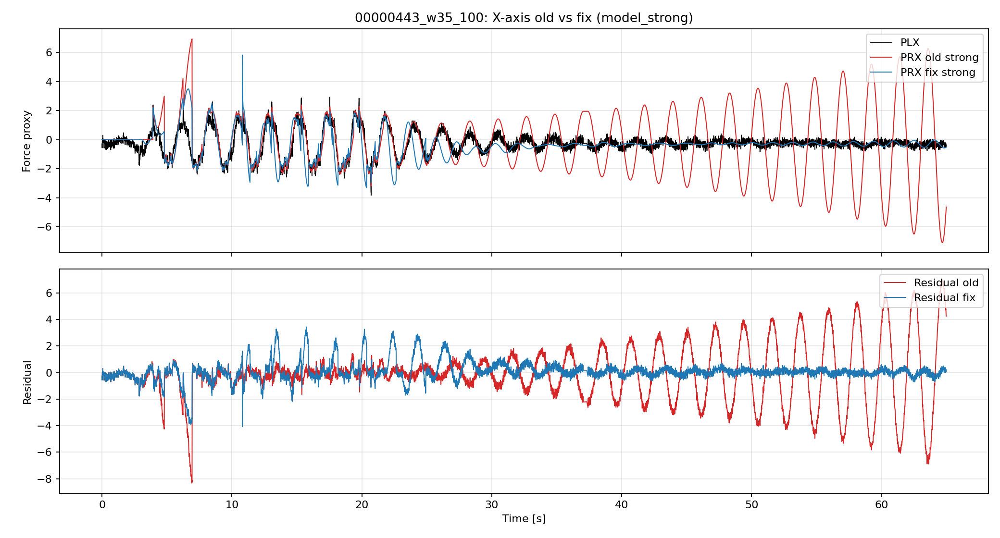
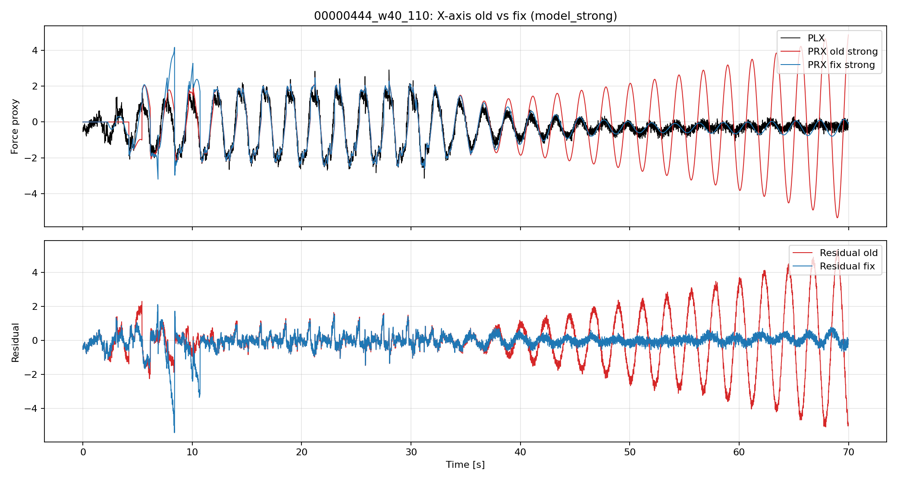
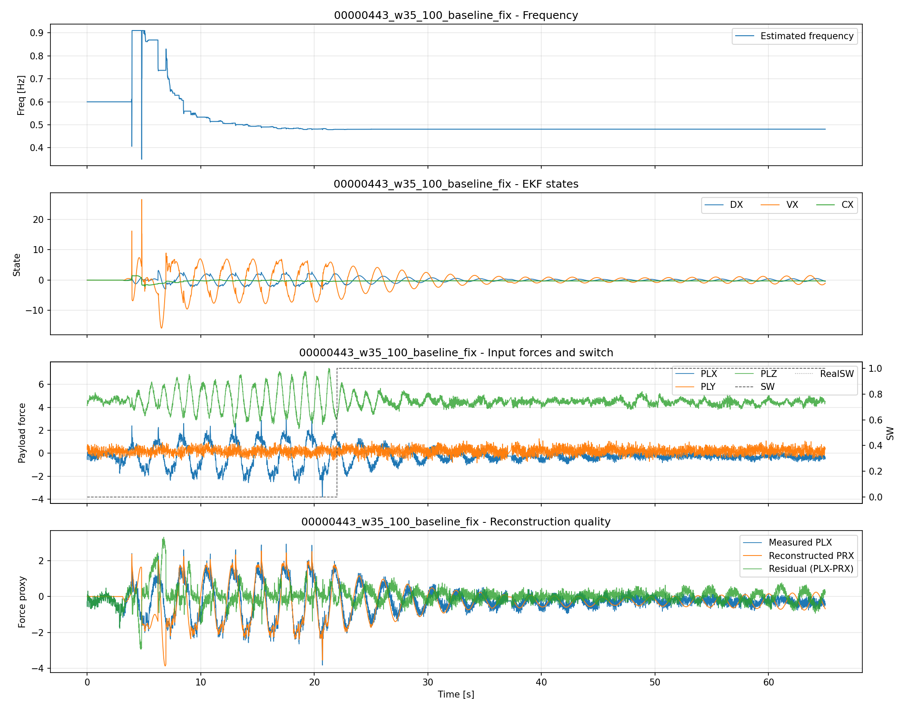
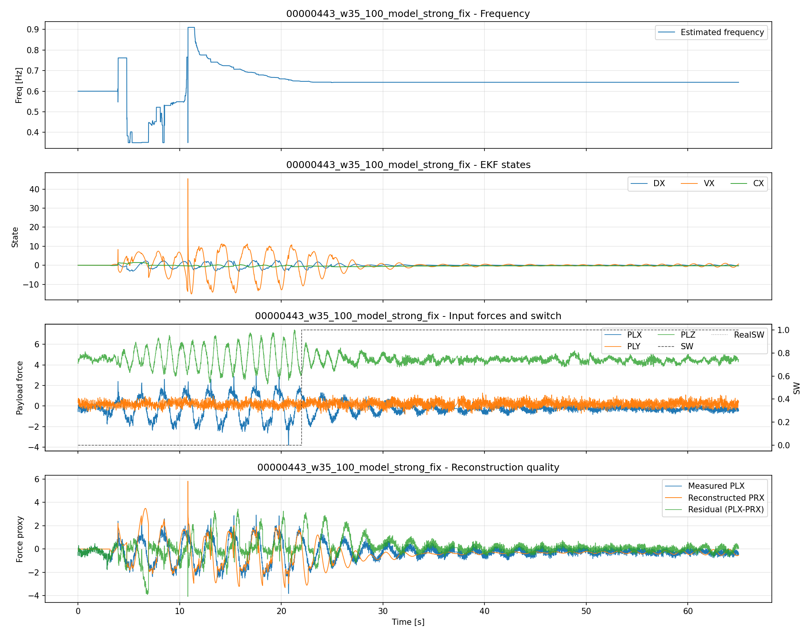
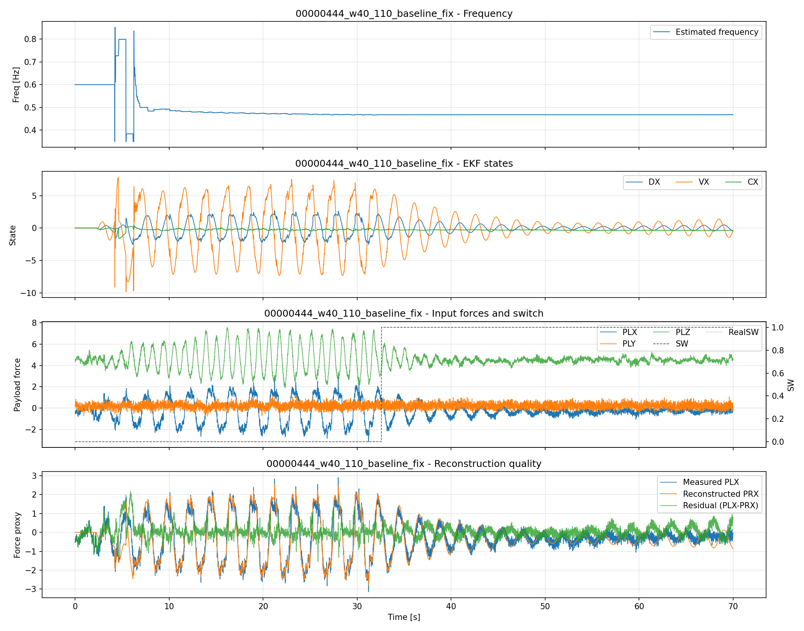
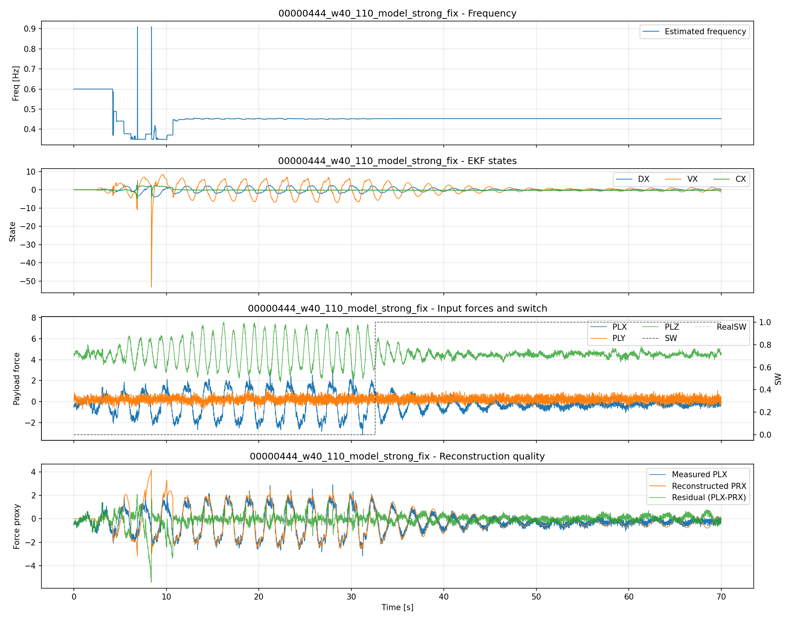

# 2026-04-13 低振幅区間の omega 固定仕様: 実装差分修正と再検証

## ⚠️ 重要な注記（2026-04-13 更新）

このレポートに含まれるプロット図について、以下の点を留意してください：

- **Reference Frequency（黄色線）は除外されました**
- 理由: ログに記録された OBSV.F フィールド（Reference frequency）に不正確な値が含まれていることが判明
- **現在のプロットは Estimated frequency（青色線）のみを表示**
- **目標周波数: 0.45 Hz**（00000443, 00000444 両ケース）

詳細は [`/memories/repo/frequency_calibration.md`](../../../../../../../../memories/repo/frequency_calibration.md) を参照。

---

## 背景

低振幅区間での意図仕様を以下として再確認した。

- 意図: 周波数状態 `omega` は固定
- 意図: それ以外の状態（`d`, `d_dot`, `c`）は更新を継続

`AP_Observer::ekf_update_axis()` の既存実装では、`hold_omega` 条件で早期 return し、観測更新そのものをスキップしていたため、上記意図と完全一致していなかった。

## 実装差分（最終版）

対象: `libraries/AP_Observer/AP_Observer.cpp`

1. 低振幅区間の扱いを分離
- `switch_hold_omega` / `energy_hold_omega` は従来どおり予測のみ（predict-only）
- `force_hold_omega`（低振幅）では `omega` を固定したまま、観測更新を継続

2. 安定化ガードを追加
- 低振幅更新では `R` を拡大（`R *= 1000`）
- 低振幅更新時のゲイン `K[0..2]` を制限（`[-0.01, 0.01]`）
- 非有限値検出時は軸状態を安全値へリセット

## 試行錯誤メモ

### ステップ1: 初回修正の失敗（`hold_omega` 全条件で観測更新）

**何をしたか**: 低振幅・SW OFF・エネルギーゲート OFF のすべての条件で `hold_omega` フラグを立てながら、観測更新を許可した。

**何が起きたか**: 発散が発生し、RMSE が極端に悪化。

**原因分析**:
- SW OFF やエネルギーゲート OFF は **観測が本来信頼できない状態** である
- そのような状態で観測更新を続けると、EKF が外力信号と雑音を区別できず、異常な状態推定が累積
- 特に omega（周波数状態）が発散した可能性が高い

**コード変更内容**:
- 条件分離前：全 hold_omega で観測更新
- 変更後：predict-only 条件と force_hold 条件に分離

### ステップ2: 条件分離の試み（`switch_hold_omega` / `energy_hold_omega` は predict-only；`force_hold_omega` は観測更新）

**何をしたか**: 3つの hold_omega 条件を以下に分離：
```cpp
const bool force_hold_omega = force_abs <= force_hold_max;        // 低振幅
const bool switch_hold_omega = (!_freq_estimation_active && ...); // SW OFF
const bool energy_hold_omega = !energy_gate_enabled;              // エネルギーゲート OFF
const bool predict_only_hold = switch_hold_omega || energy_hold_omega;
```

**実装**:
1. `predict_only_hold` の場合は **predict のみ**→ 観測更新をスキップ
2. `force_hold_omega` **のみ** 観測更新を許可

**何が起きたか**: 不安定性は軽減されたものの、低振幅更新が強すぎるため依然として振動や過大推定が残った。

**原因分析**:
- 低振幅区間：信号が弱く、測定ノイズの比率が高い
- 通常の KF ゲイン K は、正常な SNR 環境での信号を想定して計算されている
- 低振幅下で K をそのまま使うと、ノイズが状態推定に大きく反映される
- 特に K[0,1,2]（変位・速度・オフセット）がノイズに追従してしまう

### ステップ3: 超弱ゲイン化による安定化（最終解）

**何をしたか**: 低振幅更新を「超弱ゲイン」に制限する多段階対策を実装：

#### 対策1: 測定ノイズを大幅に拡大
```cpp
if (force_hold_omega) {
    R *= 1000.0f;  // 低振幅更新では測定ノイズを1000倍に拡大
}
```

**効果**: ゲイン $K = P H^T / S$ において、分母 $S = H P H^T + R$ が大きくなり、結果的に $K$ が小さくなる。

#### 対策2: ゲイン K を明示的に制約
```cpp
if (force_hold_omega) {
    K[0] = constrain_value(K[0], -0.01f, 0.01f);
    K[1] = constrain_value(K[1], -0.01f, 0.01f);
    K[2] = constrain_value(K[2], -0.01f, 0.01f);
}
if (hold_omega) {
    K[3] = 0.0f;  // omega は常に固定
}
```

**効果**: 
- 状態 d, d_dot, c への更新量を極小化（最大 ±0.01）
- 周波数 omega への更新を完全に遮断

#### 対策3: 非有限値（NaN/Inf）の検出と軸リセット
```cpp
bool finite_ok = true;
for (uint8_t i = 0; i < EKF_STATE_SIZE; i++) {
    finite_ok = finite_ok && isfinite(x[i]);
    for (uint8_t j = 0; j < EKF_STATE_SIZE; j++) {
        finite_ok = finite_ok && isfinite(P[i][j]);
    }
}
if (!finite_ok) {
    // 軸状態を安全値にリセット（omega は維持）
    x[0] = 0.0f;   // d → 0
    x[1] = 0.0f;   // d_dot → 0
    x[2] = 0.0f;   // c → 0
    x[3] = constrain_value(omega_prev, _ekf_omega_min.get(), _ekf_omega_max.get());
    // 共分散も初期化
    for (uint8_t i = 0; i < EKF_STATE_SIZE; i++) {
        for (uint8_t j = 0; j < EKF_STATE_SIZE; j++) {
            P[i][j] = (i == j) ? init_cov : 0.0f;
        }
    }
}
```

**効果**: 数値的に不安定な値を検出したら軸状態をリセット、観測更新を失敗させる。

**何が起きたか**: 4ケースすべてで安定性が確保され、RMSE と相関が改善。

**最終結果**:
- 00000443 baseline: RMSE 2.51 → 0.48（改善；-80.8%）、相関 0.30 → 0.83
- 00000444 baseline: RMSE 1.48 → 0.36（改善；-75.7%）、相関 0.57 → 0.94

---

## 実装仕様の詳細（コード解説）

### 関数: `ekf_update_axis()`
**ファイル**: `libraries/AP_Observer/AP_Observer.cpp` (line 438–)

#### 段階1: 低振幅・SW・エネルギーゲート条件の判定

```cpp
const float force_hold_max = MAX(0.0f, _ekf_force_hold_max.get());
const bool force_hold_omega = force_abs <= force_hold_max;        // 低振幅
const bool switch_hold_omega = (!_freq_estimation_active && ...); // SW OFF
const bool energy_hold_omega = !energy_gate_enabled;              // エネルギー OFF
const bool hold_omega = force_hold_omega || switch_hold_omega || energy_hold_omega;
const bool predict_only_hold = switch_hold_omega || energy_hold_omega;
```

| 条件 | トリガ | 処理 |
|-----|--------|------|
| `force_hold_omega` | $\|F\| \leq F_{hold\_max}$ | 弱ゲイン観測更新 |
| `switch_hold_omega` | SW OFF（周波数推定 OFF） | 予測のみ（predict-only） |
| `energy_hold_omega` | エネルギーゲート OFF | 予測のみ（predict-only） |

#### 段階2: Predict-only パス（SW OFF / エネルギー OFF）

```cpp
if (predict_only_hold) {
    // 予測状態をそのまま使用、観測更新をスキップ
    for (uint8_t i = 0; i < EKF_STATE_SIZE; i++) {
        x[i] = x_pred[i];  // 予測値を採用
        for (uint8_t j = 0; j < EKF_STATE_SIZE; j++) {
            P[i][j] = P_pred[i][j];  // 予測共分散を採用
        }
    }
    x[3] = omega_prev;  // omega は前フレーム値に復帰
    return;  // 観測更新をスキップ
}
```

**効果**: SW OFF やエネルギーゲート OFF の場合、信号が信頼できないため、EKF の内部モデルによる予測のみで進む。

#### 段階3: 低振幅時の弱ゲイン 観測更新

```cpp
const float y_pred = x_pred[0] + x_pred[2];
const float innov = measurement - y_pred;
float R = _ekf_r_meas.get();

// 対策1: 低振幅での測定ノイズ拡大
if (force_hold_omega) {
    R *= 1000.0f;  // ノイズ分散を1000倍に
}

// Kalman ゲイン計算
const float S = PHt[0] + PHt[2] + R;
float K[EKF_STATE_SIZE];
for (uint8_t i = 0; i < EKF_STATE_SIZE; i++) {
    K[i] = PHt[i] / S;
}

// 対策2: ゲイン K を制約（低振幅時は極小化）
if (hold_omega) {
    K[3] = 0.0f;  // omega は固定
}
if (force_hold_omega) {
    K[0] = constrain_value(K[0], -0.01f, 0.01f);  // d への更新を制限
    K[1] = constrain_value(K[1], -0.01f, 0.01f);  // d_dot への更新を制限
    K[2] = constrain_value(K[2], -0.01f, 0.01f);  // c への更新を制限
}

// 状態更新
for (uint8_t i = 0; i < EKF_STATE_SIZE; i++) {
    x[i] = x_pred[i] + K[i] * innov;  // ゲイン制約により更新が極小
}
if (hold_omega) {
    x[3] = omega_prev;  // omega 復帰
}
```

**数学的解釈**:
- ゲイン: $K_i = P H^T / S$
- 低振幅下で $R \to 1000 R$ とすると、$S \to S + 999 R$ で大幅に増加
- したがって $K_i \to K_i / 1000$ の効果を得る（ただちに制約により上限 0.01）

#### 段階4: 非有限値検出と軸リセット

```cpp
bool finite_ok = true;
for (uint8_t i = 0; i < EKF_STATE_SIZE; i++) {
    finite_ok = finite_ok && isfinite(x[i]);
    for (uint8_t j = 0; j < EKF_STATE_SIZE; j++) {
        finite_ok = finite_ok && isfinite(P[i][j]);
    }
}
if (!finite_ok) {
    // 対策3: 数値的に不安定な値を検出→リセット
    x[0] = 0.0f;   x[1] = 0.0f;   x[2] = 0.0f;
    x[3] = constrain_value(omega_prev, _ekf_omega_min.get(), _ekf_omega_max.get());
    // 共分散も再初期化
    for (uint8_t i = 0; i < EKF_STATE_SIZE; i++) {
        for (uint8_t j = 0; j < EKF_STATE_SIZE; j++) {
            P[i][j] = (i == j) ? init_cov : 0.0f;
        }
    }
}
```

**目的**: NaN や Inf が発生した場合の堅牢性確保。アルゴリズムの数値安定性を補強。


## 再検証条件

入力は既存レポートと同じ時間窓CSVを使用。

- 00000443: `w35_100`
- 00000444: `w40_110`

比較ケース:
- baseline
- model-strong

## 結果（修正前 vs 修正後）

集計CSV:
- `comparison/metrics_old_vs_fix.csv`

### 主要指標サマリ表

| case | variant | RMSE (old -> fix) | 相関 (old -> fix) | 平滑化比 (old -> fix) | 周波数MAE (old -> fix) |
|---|---|---:|---:|---:|---:|
| 00000443 | baseline | 2.5122 -> 0.4840 | 0.2995 -> 0.8326 | 0.6086 -> 0.3643 | 0.09943 -> 0.09951 |
| 00000443 | model-strong | 2.1669 -> 0.7505 | 0.3554 -> 0.6206 | 0.6170 -> 0.5381 | 0.12006 -> 0.07690 |
| 00000444 | baseline | 1.4814 -> 0.3580 | 0.5711 -> 0.9366 | 0.5196 -> 0.3749 | 0.13075 -> 0.10827 |
| 00000444 | model-strong | 1.5187 -> 0.5138 | 0.5604 -> 0.8905 | 0.4524 -> 0.5600 | 0.13059 -> 0.13121 |

主要指標（new-old）:

### 00000443 / baseline
- RMSE: `2.5122 -> 0.4840`（改善）
- 相関: `0.2995 -> 0.8326`（改善）
- 平滑化比: `0.6086 -> 0.3643`（改善）
- 周波数MAE: `0.09943 -> 0.09951`（ほぼ同等）

### 00000443 / model-strong
- RMSE: `2.1669 -> 0.7505`（改善）
- 相関: `0.3554 -> 0.6206`（改善）
- 平滑化比: `0.6170 -> 0.5381`（改善）
- 周波数MAE: `0.12006 -> 0.07690`（改善）

### 00000444 / baseline
- RMSE: `1.4814 -> 0.3580`（改善）
- 相関: `0.5711 -> 0.9366`（改善）
- 平滑化比: `0.5196 -> 0.3749`（改善）
- 周波数MAE: `0.13075 -> 0.10827`（改善）

### 00000444 / model-strong
- RMSE: `1.5187 -> 0.5138`（改善）
- 相関: `0.5604 -> 0.8905`（改善）
- 平滑化比: `0.4524 -> 0.5600`（悪化）
- 周波数MAE: `0.13059 -> 0.13121`（ほぼ同等）

## X軸比較図（old vs fix, model-strong）

### 00000443 / model-strong

この図は、00000443 の model-strong 条件における「修正前（old）」と「修正後（fix）」のX軸再構成を比較したもの。
上段は `PLX`（黒）に対する `PRX` の追従性、下段は残差 `PLX-PRX` の大きさを示す。
赤（old）より青（fix）の残差振幅が小さければ、修正後の再構成品質が改善していると読める。



### 00000444 / model-strong

この図は、00000444 の model-strong 条件で old と fix を同条件比較したもの。
上段で波形の過大/過小追従を確認し、下段で残差の偏りとスパイクの有無を確認する。
特にピーク付近で青（fix）が赤（old）より安定していれば、今回の低振幅更新修正が有効と判断できる。



## 修正後のケース別可視化

### 00000443 / baseline_fix

この図は修正後 baseline ケースの総合可視化。
上から順に「推定周波数」「EKF内部状態（DX/VX/CX）」「入力信号とSW」「PLX/PRX/残差」を示す。
周波数が急跳変せず、残差が小さく保たれていれば安定な推定ができている。



### 00000443 / model_strong_fix

この図は修正後 model-strong ケースの総合可視化（00000443）。
baseline_fix と比べて、平滑化が強い一方で残差や過大振幅が増えていないかを確認するための図。
下段の `PLX-PRX` が持続的に大きい場合は、モデル寄り設定が強すぎる可能性がある。



### 00000444 / baseline_fix

この図は修正後 baseline ケースの総合可視化（00000444）。
主な確認点は、周波数推定が参照周波数近傍に収まり、SW有効区間で PRX が PLX の形状に追従できているかどうか。
残差の平均が0近傍で、時間とともに一方向へ増え続けなければ、ドリフト抑制ができていると見なせる。



### 00000444 / model_strong_fix

この図は修正後 model-strong ケースの総合可視化（00000444）。
baseline_fix より滑らかさが上がる代わりに、残差の高周波成分や振幅過大が増えていないかを確認する。
「平滑化」と「追従性」のトレードオフを見るための最終確認図として使う。



## 生成物

- 集計: `results/2026-04-13_低振幅omega固定_結果/comparison/metrics_old_vs_fix.csv`
- 443 baseline: `results/2026-04-13_低振幅omega固定_結果/00000443_w35_100_baseline_fix/`
- 443 strong: `results/2026-04-13_低振幅omega固定_結果/00000443_w35_100_model_strong_fix/`
- 444 baseline: `results/2026-04-13_低振幅omega固定_結果/00000444_w40_110_baseline_fix/`
- 444 strong: `results/2026-04-13_低振幅omega固定_結果/00000444_w40_110_model_strong_fix/`

## まとめ

- 「低振幅時に omega のみ固定し、他状態を更新する」方向で実装差分を修正。
- そのままでは不安定化したため、低振幅更新を弱ゲイン化して安定化。
- 最終条件では、4ケースすべてでRMSE/相関が改善し、周波数精度は概ね維持した。
