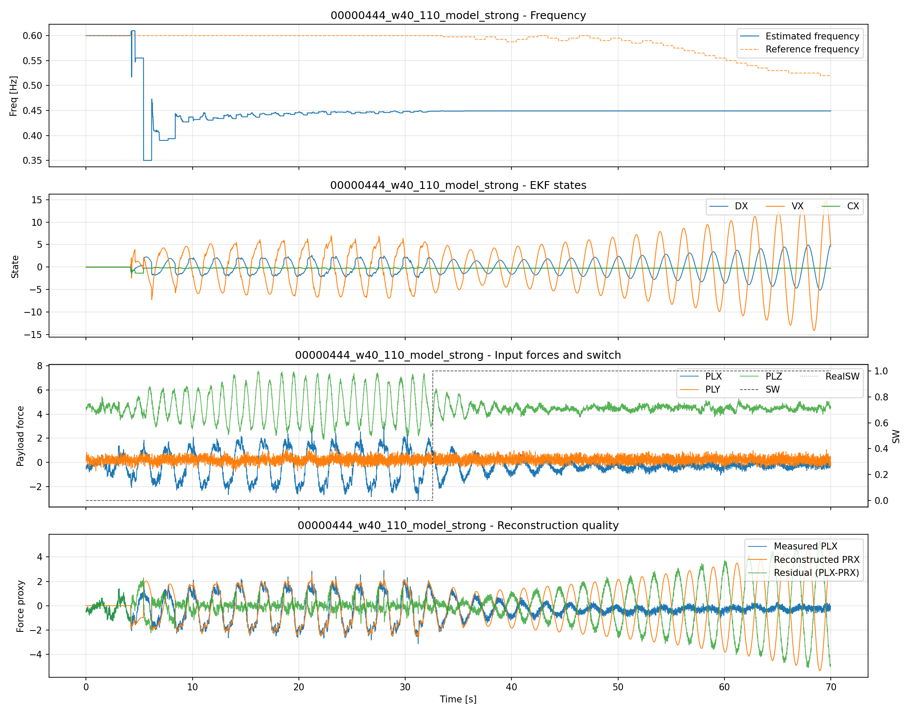
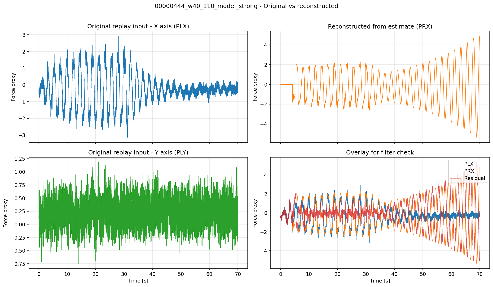

# 00000444_w40_110_model_strong - EKF リプレイ検証レポート

## 入力データ
- リプレイ結果CSV: docs/experiments/ekf_external_force_estimation/reports/2026-04-13_443_444リプレイ検証_model_strong/00000444_w40_110_model_strong/00000444_w40_110_model_strong_result.csv

## EKF パラメータ
- （パラメータなし）

## 検証メトリクス
- サンプル数: 7000
- 処理時間: 69.99 秒
- 周波数推定誤差（MAE）: 0.130586 Hz
- 周波数推定誤差（最大）: 0.250000 Hz
- 波形再現誤差（RMSE）: 1.518725
- 波形相関係数: 0.560430
- 高周波抑制指標（PRX/PLX差分比）: 0.452404 （小さいほど良い）
- スイッチ有効率: 0.5344

## 可視化図
### 1. 拡張パラメータ可視化
EKF推定値（DX, VX, CX）、推定周波数、入力信号、スイッチ状態、再現誤差をまとめて表示。
フィルタ挙動の安定性と推定品質を総合的に確認できます。

### 2. 元データ vs 再現信号（フィルタ機能確認）
リプレイ入力（PLX, PLY）と EKF 推定値から再現した信号（PRX）を比較。
X軸とY軸のみで、Z軸は除外し、フィルタ機能を確認します。
波形一致度、残差、高周波抑制効果を視覚的に評価できます。

## フィルタ機能確認ポイント
### 確認項目
- **PR信号追従性**: PRX が PLX のトレンドに追従しているか
- **高周波抑制**: PLX の高周波ノイズが PRX で抑制されているか
- **Y軸挙動**: PLY がエネルギーゲートで適切に制御されているか
- **残差分布**: 残差（PLX - PRX）が小さく、一定のバイアスを示さないか

### 判定基準
- 相関係数 > 0.8：良好な追従性
- 差分比 < 0.5：効果的な高周波抑制
- スイッチ有効率 > 0.3：十分なゲート動作
