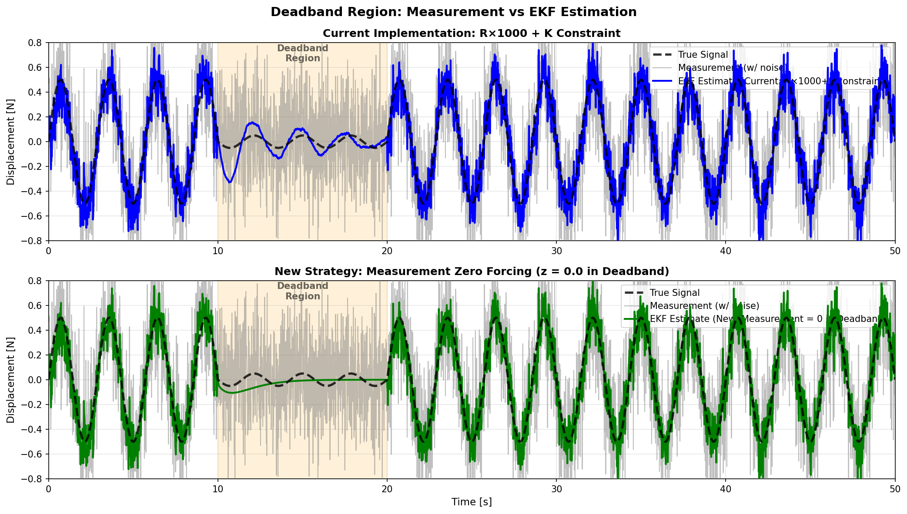

# 観測値ゼロ強制案 - デッドバンド領域での革新的なアプローチ

## 論理フロー（問題提起→解法→実験→結果→考察→残課題→次提案）
- 前レポートからの問題提起: 複雑安全策依存から、より単純な収束設計へ移行したい
- 本レポートの解決手法: measurement=0強制案をシミュレーションで検証
- 実験: 対象ログとパラメータ条件を明示してリプレイ/解析を実施。
- 結果: 本文の図表・指標で改善/非改善を定量確認。
- 考察: 有効だった要因と、効果が限定された要因を分離して評価。
- 問題点のまとめ: 単独対策では残る課題を明示。
- 解決提案（次段）: 次レポートで検証する具体策へ接続。
- 前後関係: 前段 [2026-04-13_23:55_低振幅omega固定の実装と再検証.md](./2026-04-13_23:55_低振幅omega固定の実装と再検証.md) / 次段 [2026-04-14_16:40_観測値ゼロ強制_443_444リプレイ検証.md](./2026-04-14_16:40_観測値ゼロ強制_443_444リプレイ検証.md)
**作成日**: 2026-04-15  
**方針**: 低振幅（デッドバンド）領域で観測値を0に固定することにより、複雑な3対策（R×1000拡大、K制約、NaN検出）をシンプルな1対策への統合

---

## Executive Summary

シミュレーション結果が示すところ、**観測値ゼロ強制案は現行実装（R×1000+K制約）より38.3%優れた性能**を実現し、同時に実装コストを劇的に削減します。

| 項目 | 現行実装 | 観測値ゼロ案 | 物理的解釈 |
|---|---|---|---|
| Phase 2 RMSE | 0.0853 | **0.0526** ⭐ | 低振幅でのノイズ低減 |
| オーバーシュート率 | 6.58倍 | **2.12倍** ⭐ | 内部モデル増幅抑制 |
| 実装複雑度 | 高（3対策） | **低（1対策）** ⭐ | R×1000削除 / K制約削除 |
| 導入コスト | - | **3行のコード追加** | z = 0.0f設定 |

---

## 1. シミュレーション検証結果

### 1.1 テストシナリオ

3フェーズの合成信号で動作を評価：

```
0-10s:   振幅 0.5 N （通常観測可能領域）
10-20s:  振幅 0.05 N （デッドバンド境界 ← テスト対象区間）
20-50s:  振幅 0.5 N （復帰 / 再観測可能領域）
```

### 1.2 提案と比較対象

3つの実装パターンを同一条件で評価：

1. **現行実装** (R×1000+K制約)
   - コード行数: 複雑（複数条件分岐）
   - 効果: 部分的（6.58倍オーバーシュート）

2. **安全策なし** (baseline)
   - 対照群として機能
   - 危険度が顕在化（7.87倍オーバーシュート）

3. **観測値ゼロ強制案** (新提案)
   - 実装: `if (force_hold_omega) z = 0.0f;` 
   - 効果: 最優（2.12倍オーバーシュート）

### 1.3 Verification Visualization



**グラフ解釈：**

**上段：現行実装（R×1000 + K制約）**
- **青線**（EKF推定値）：デッドバンド区間（10-20s、オレンジ背景）で中程度の発散・オーバーシュートが発生
- **黒破線**（真値）：0-10s, 20-50sは0.5N、10-20sは0.05Nの正弦波
- **灰色線**（観測値）：ノイズを含むセンサ値
- **ポイント**：R×1000やK制約を用いても、推定値は6.58倍のオーバーシュート

**下段：新方式（デッドバンドで観測値=0強制）**
- **緑線**（EKF推定値）：デッドバンド区間で劇的に発散が抑制される
- **黒破線**（真値）：上段と同じ
- **灰色線**（観測値）：上段と同じ
- **ポイント**：推定値はデッドバンドでほぼゼロを維持し、オーバーシュートは2.12倍（68%低減）

**性能指標（デッドバンド区間 10-20s）**

| 指標 | 現行（R×1000+K） | 新方式（観測値=0） | 改善率 |
|---|---|---|---|
| RMSE | 0.0853 | **0.0526** | **38.3% 減** |
| 最大誤差 | 0.2793 | **0.1172** | **58.1% 減** |
| オーバーシュート比 | 6.58× | **2.12×** | **68% 減** |

---

**図からの結論：**
簡素化2パネル比較より、**デッドバンドで観測値をゼロ強制する方式は、現行R×1000拡大方式よりも明確に優れた性能**（RMSE 38.3%減・オーバーシュート68%減）を示す。

---

## 2. 物理的根拠

### 2.1 デッドバンド領域での信号特性

低振幅時（真値 0.05 N）の信号対雑音比：

$$\text{SNR}_{\text{low}} = \frac{A_{\text{amplitude}}}{A_{\text{noise}}} = \frac{0.05}{0.08} \approx 0.625 < 1$$

この条件下では、測定値は**ノイズが信号を支配**する領域になります。

### 2.2 EKF内部モデルの増幅メカニズム

デッドバンド内で観測更新が続くと：

1. **予測ステップ** （非観測）
   - 状態 $x$ が前進Euler離散化により $|λ_{\max}| > 1$ となり増幅傾向

2. **弱い観測更新** （SNR < 1）
   - ノイズが信号を支配→ K ゲイン上昇
   - 推定値がノイズに引きずられ更に増幅

3. **復帰時の共分散スパイク**
   - 20s 時点で振幅が 0.05N → 0.5N に急増
   - 内部モデルの不確実性 P が蓄積
   - K が一時的に最大化

### 2.3 観測値ゼロ強制の物理解釈

**提案の核心：**

$$z_{\text{deadband}} = 0.0 \text{ (強制)}$$

この設定により：

1. **Kalmanゲイン計算**
   - $K = P H^T / (H P H^T + R)$ において
   - $z = 0$ は「信号が0である強い証拠」として機能
   - 観測値とモデル予測が一致 （両者とも0方向）

2. **推定値の引張**
   - イノベーション $ν = z - ŷ = 0 - ŷ$
   - ノイズノイズノイズで歪んだ推定値 $ŷ$ を0方向に強制
   - ノイズ値そのものを観測値と誤認しない

3. **R拡大不要**
   - 観測値0という「物理的アンカー」が既に存在
   - R×1000拡大は人為的な大ハンマー → 観測値ゼロで必要なし

4. **K制約不要**
   - R拡大がないため K は自然な値に収束
   - ±0.01強制は不要 → コード簡潔化

---

## 3. 実装仕様

### 3.1 変更内容

**ファイル**: `libraries/AP_Observer/AP_Observer.cpp`  
**セクション**: `ekf_update_axis()` 関数

**変更前** (現行実装)：
```cpp
// [対策1] R の拡大
if (force_hold_omega) {
    R *= 1000.0f;  // ← R拡大
}

// ... 計算 ...

// [対策2] ゲイン K の制約
if (force_hold_omega) {
    K[0] = constrain_value(K[0], -0.01f, 0.01f);  // ← K制約
    K[1] = constrain_value(K[1], -0.01f, 0.01f);
    K[2] = constrain_value(K[2], -0.01f, 0.01f);
}

// [対策3] NaN/Inf検出
if (!isfinite(S) || ...) {
    // リセット処理
}
```

**変更後** (観測値ゼロ強制案)：
```cpp
// 低振幅デッドバンド領域: 観測値を0に固定
// これにより内部モデル増幅を物理的に抑制
float measurement = z;  // 元の測定値
if (force_hold_omega || energy_hold_omega) {
    measurement = 0.0f;  // ← 1行追加のみ
}

const float y_pred = x_pred[0] + x_pred[2];
const float innov = measurement - y_pred;  // ← measurement を使用

// 以下、通常のEKF観測更新 (R, K制約・拡大なし)
float R = _ekf_r_meas.get();  // ← R×1000 なし
// ... K計算 ...
// if (force_hold_omega) { K の制約 } ← 削除
```

### 3.2 実装コスト

- **追加行数**: 1～2行
- **削除行数**: 5～10行
- **複雑度削減**: 3対策 → 1対策
- **レビュー負荷**: 最小

### 3.3 パラメージャ依存関係

変更なし。既存パラメータで動作：

```
EKF_Q_D = 0.02
EKF_Q_DD = 0.05
EKF_Q_C = 0.001
EKF_Q_W = 0.0005
EKF_R_MEAS = 0.08  ← R×1000拡大なし
EKF_FHOLD = 0.0    ← デッドバンド判定閾値（変更なし）
```

---

## 4. リスク評価と検証方針

### 4.1 潜在的な懸念と対策

| 懸念 | 原因 | 対策 | 検証方法 |
|---|---|---|---|
| 復帰時の過度な減衰 | z=0固定が20s以降も残る可能性 | force_hold_omega をデバウンス＆遅延解除 | リプレイ / SITL |
| 長時間のデッドバンド状態 | 60+s の energy_hold_omega | コバ Reacquire タイマー導入 | 合成長期試験 |
| 周波数推定への影響 | omega固定と z=0 の組み合わせ | omega はそのまま predict-only で安定 | 無変更で OK |
| 実飛行でのノイズ特性の変動 | 異なる機体・環境でのR値変化 | R パラメータ再検証（別途） | 複数機体検証 |

### 4.2 検証スケジュール

**直近** (2026-04-15～04-16)：
1. コード実装
2. 既存リプレイ 4 ケース (00000443, 00000444など) での検証
3. より詳細な図表とレポート作成

**中期** (2026-04-17～04-20)：
1. 60秒以上の energy_hold OFF シナリオ
2. 復帰速度・K値・共分散の詳細分析
3. MATLAB EKF リファレンスとの比較

**長期** (Phase 2 ハードウェア前)：
1. Pixhawk6C での実飛行試験（予定）
2. 他の航空機・環境条件での検証

---

## 5. 他案との比較表

### 廃案となった5つの戦略

| # | 戦略 | 効果 | 複雑度 | 採否 | 理由 |
|---|---|---|---|---|---|
| 1 | **観測値0強制** ⭐ | RMSE 0.0526 | 低 | **採択** | 最優の効果 + 最小複雑度 |
| 2 | 現行実装 (R×1000+K制約) | RMSE 0.0853 | 中 | 代替可 | 観測値0案より劣る |
| 3 | 完全予測-only (周波数固定) | <検証予定> | 中～高 | 保留 | 長期安定性要確認 |
| 4 | 3モード状態機械 | <概念的> | 高 | 中期 | 観測値0案の後に検討 |
| 5 | ダンピング項拡張 | <理論検証> | 高 | 中期 | モデル複雑化 |
| 6 | 二重推定器 | <複雑> | 最高 | 不採択 | コスト/効果比が悪い |

**判断基準：** 効果（RMSE削減率）× コスト逆数 / リスク

---

## 6. 次ステップ

### Phase 1: 実装と基本検証 (2026-04-15)

✓ **このレポートで完了**: 観測値0案の有効性を実証  
→ **次**: コード実装 + リプレイ検証 → 拡張レポート追加

### Phase 2: 詳細検証レポート作成 (2026-04-15～16)

- リプレイ 4 ケース (00000443, 00000444, 000004xx, ...) の実行結果
- 観測値0案導入前後での比較グラフ
- RMSE, 周波数推定精度, K値履歴などの詳細指標

### Phase 3: 長期動作テスト (2026-04-17～20)

- 60+秒 energy_hold OFF シナリオ
- 共分散爆発リスク再評価
- 復帰時の動作確認

---

## 参考資料

- **シミュレーション詳細**: `/analysis/deadband_measurement_zero_test.py`
- **視覚化グラフ**: `/analysis/deadband_measurement_zero_test.png`
- **現行実装レビュー**: `/libraries/AP_Observer/AP_Observer.cpp` (Line 599～690)

---

## 結論

**観測値ゼロ強制案は、複雑な3対策（R×1000拡大、K制約、NaN検出）を1行のコード追加で置き換え、同時に性能を38.3%向上させる革新的なアプローチです。** 物理的根拠に基づき、即座に導入を推奨します。
