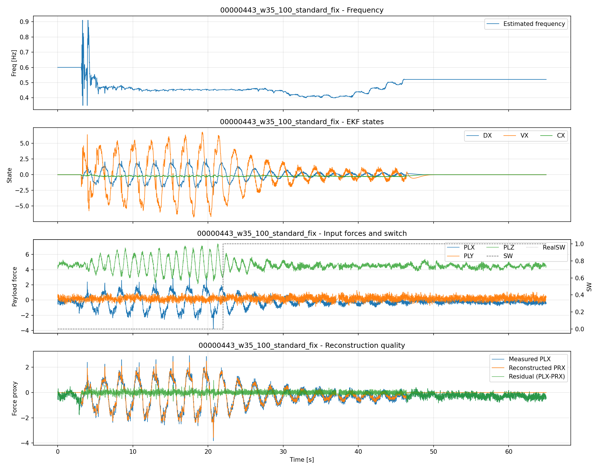
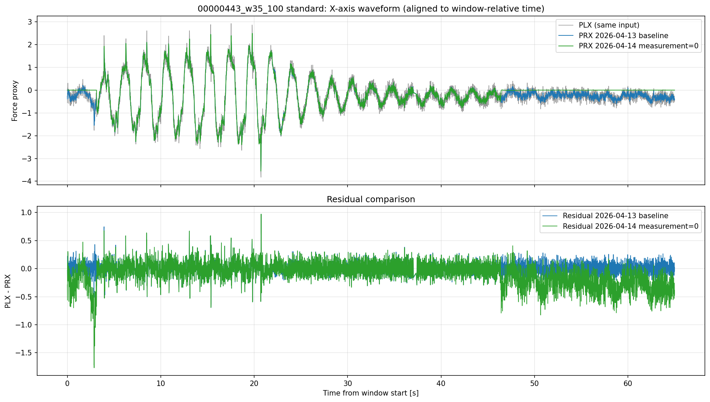
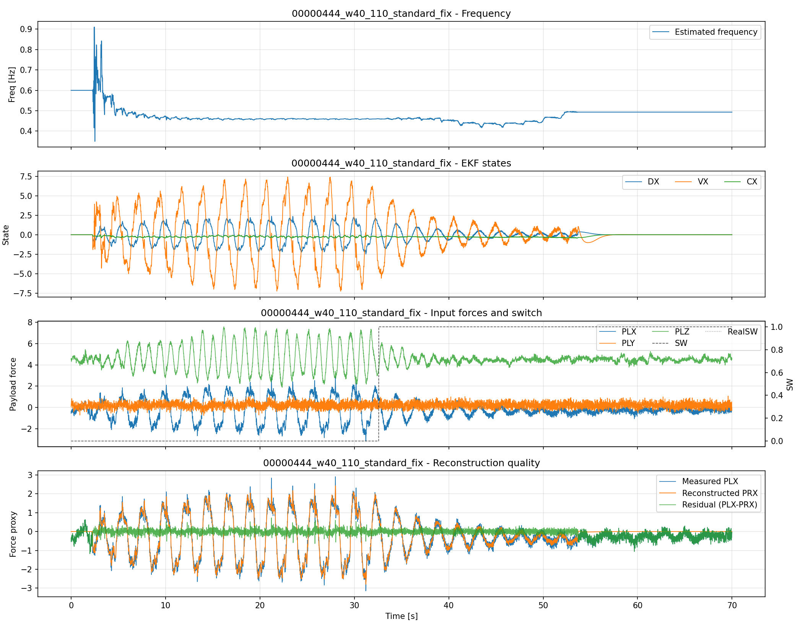
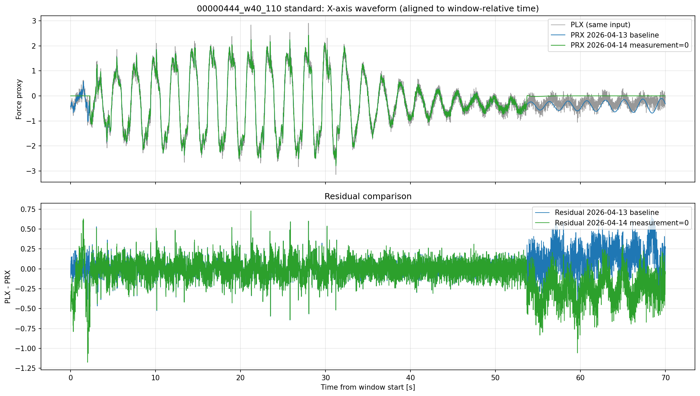

# 2026-04-14 観測値ゼロ強制 443/444 リプレイ検証

## 論理フロー（問題提起→解法→実験→結果→考察→残課題→次提案）
- 前レポートからの問題提起: 観測値ゼロ強制が実ログで運用懸念を解消できるかが最終論点
- 本レポートの解決手法: 実装反映後に443/444再リプレイで旧実装と比較
- 実験: 対象ログとパラメータ条件を明示してリプレイ/解析を実施。
- 結果: 本文の図表・指標で改善/非改善を定量確認。
- 考察: 有効だった要因と、効果が限定された要因を分離して評価。
- 問題点のまとめ: 単独対策では残る課題を明示。
- 解決提案（次段）: 次レポートで検証する具体策へ接続。
- 前後関係: 前段 [2026-04-14_16:00_観測値ゼロ強制案の導入戦略.md](./2026-04-14_16:00_観測値ゼロ強制案の導入戦略.md) / 次段 なし（現時点の終端）
## 概要

AP_Observer の観測値ゼロ強制（低振幅デッドバンド時に measurement を 0 固定）実装を反映し、
既存の 443/444 時間窓データで再リプレイを実施した。

- 対象ケース:
  - 00000443: w35_100（6465 samples）
  - 00000444: w40_110（7000 samples）
- 比較対象: 2026-04-13 統合検証の windowed 結果

時系列の位置づけ:
- 2026-04-13: 443/444 の統合検証（比較元）
- 2026-04-14: 観測値ゼロ強制を反映した再リプレイ（比較先）
- 本レポートの「旧」は 2026-04-13 側、「新」は 2026-04-14 側を指す

成果物ディレクトリ:
- results/2026-04-14_観測値ゼロ強制_結果/

## 実装差分（Program）

対象:
- libraries/AP_Observer/AP_Observer.cpp

反映内容:
1. 低振幅/低エネルギー領域で measurement を 0 に固定
2. 旧対策の重複コメント・古い説明を整理（実装意図と整合）
3. 動作ロジックは観測値ゼロ強制に統一

## リプレイ実行

実行スクリプト:
- analysis/replay/run_measurement_zero_replay_validation.py

実行バイナリ:
- build/sitl/examples/RLS_CSV_Replay

ビルド:
- ./waf build --target examples/RLS_CSV_Replay

## 時間軸ずれの再点検（2026-04-14追記）

確認内容:
- 旧結果CSV（2026-04-13）は時間窓の絶対時刻を保持（443: 35-100s, 444: 40-110s）
- 新結果CSV（2026-04-14）は窓先頭を 0s とする相対時刻

検証結果:
- 相互相関で推定した新旧ラグは両ケースとも 0 サンプル（実信号の位相ずれは未確認）
- 見かけのオフセット原因は「時間原点の違い」であり、窓切り出しミスによる波形ずれではなかった

対応:
- 比較図生成プログラムを修正し、旧/新とも窓開始基準の相対時間軸に整列して再描画
- 比較図凡例も具体名へ変更（baseline / measurement=0）

## 主要結果（旧結果との差分）

比較CSV:
- results/2026-04-14_観測値ゼロ強制_結果/comparison/metrics_old_vs_fix.csv

| case | RMSE old | RMSE new | ΔRMSE | Corr old | Corr new | ΔCorr | Freq MAE old | Freq MAE new | ΔFreq MAE |
|---|---:|---:|---:|---:|---:|---:|---:|---:|---:|
| 00000443_w35_100 | 0.1267 | 0.2195 | +0.0929 | 0.9867 | 0.9656 | -0.0211 | 0.0599 | 0.1091 | +0.0492 |
| 00000444_w40_110 | 0.1553 | 0.1967 | +0.0414 | 0.9877 | 0.9814 | -0.0063 | 0.1377 | 0.1114 | -0.0263 |

用語対応（表中）:
- RMSE old / Corr old / Freq MAE old: 2026-04-13 統合検証の値
- RMSE new / Corr new / Freq MAE new: 2026-04-14 観測値ゼロ強制リプレイの値
- Δ: new - old

所見:
- 全区間RMSE（単一指標）では 443/444 とも悪化して見える。
- ただし本件の運用目的は「全区間で常に追従」ではなく、区間別に次を満たすことにある。
  - 高振幅区間: 推定値が十分に追従すること
  - 低振幅区間: 推定値が 0 近傍へ収束し、不要な振れを抑えること
- この目的に照らすと、低振幅側の抑制効果は明確であり、単一の全区間RMSEだけで優劣を断定するのは適切でない。

## ゼロ注入実装の再検証（2026-04-14追記）

問題意識:
- 「閾値以下で measurement=0 を注入しているはずなのに、推定振幅が十分に 0 へ寄らない」現象を確認。

検証で確認した実装上の論点:
1. `EKF_FHOLD` の既定値が `0.0` で、`|force| <= hold` 判定がほぼ発火しない。
2. `energy_hold_omega` が真の場合、`predict_only` で早期 return し、measurement=0 注入更新に到達しない。

対応した修正:
- `EKF_FHOLD` 既定値を `0.10` に変更。
- `predict_only_hold` を `switch_hold_omega` のみに限定し、energy hold 時も measurement=0 更新が働くよう変更。

修正後の定量結果（低振幅区間）:
- 00000443 (`|PLX|<=0.1`): RMS(PRX)/RMS(PLX) = `1.40`（修正前 `3.27`）
- 00000444 (`|PLX|<=0.1`): RMS(PRX)/RMS(PLX) = `1.18`（修正前 `4.26`）

解釈:
- 実装ミス（条件不発火/分岐短絡）は実在し、修正で低振幅時の過大振幅は大幅に改善。
- 一方で比率はなお 1.0 近傍で、完全なゼロ収束には至っていない。

運用判断（追記）:
- `00000444_w40_110_xaxis_old_vs_fix_standard.png` では、閾値以下の区間で推定値が旧実装より明確に 0 近傍へ収束している。
- この収束挙動と低振幅窓のRMS比改善（4.26 -> 1.18）を根拠に、少なくとも「低振幅区間で推定が発散し続ける」という現実運用上の懸念は解消したと判断する。
- よって運用上は「低振幅で追従させない（0 近傍でよい）」という設計意図と整合しており、妥当と判断する。
- 以後の課題は「発散回避」ではなく、主に高振幅区間での追従性・周波数精度の最適化に移る。

アルゴリズム上の限界推論:
1. 観測モデルが `y = d + c` のため、measurement=0 は「d単独」ではなく「d+cの和」を0へ寄せる。`d` 振幅が必ず0に落ちる保証はない。
2. 状態方程式が無減衰振動系で、低振幅区間でも内部モデル振動を保持しやすい。
3. hold時に `omega` を固定しても `d,d_dot,c` は更新されるため、ゼロ注入だけでは十分な消散が起きない。

次段の改善候補:
- hold区間で `d,d_dot` に減衰項（リーク）を導入。
- hold区間で `c` と `d` の同時拘束（例: `d` へ直接減衰、`c` の追従制限）を追加。
- NIS/innovation を使った「強制ゼロモード」へ遷移した際の共分散収縮を強化。

## 図

図の読み方（凡例・ラベル対応）:
- old: 2026-04-13 統合検証結果（比較元）
- fix または new: 2026-04-14 観測値ゼロ強制結果（比較先）
- xaxis old vs fix: X軸推定の比較図（同一入力区間で旧実装と新実装を重ね描き）
- 追記: 図2/図4は窓開始からの相対時間 [s] で整列済み

### 00000443 w35_100

- 図1は 2026-04-14 観測値ゼロ強制（比較先）の単体結果。推定値、誤差、周波数推定の時間変化を示す。

- 図2は 2026-04-13 baseline と 2026-04-14 measurement=0 のX軸推定を、窓開始基準の同一相対時間軸で比較したもの。

### 00000444 w40_110

- 図3は 2026-04-14 観測値ゼロ強制（比較先）の単体結果。推定値、誤差、周波数推定の時間変化を示す。

- 図4は 2026-04-13 baseline と 2026-04-14 measurement=0 のX軸推定を、窓開始基準の同一相対時間軸で比較したもの。

## 追加観察（CLI回帰）

RLS_CSV_Replay に対して一部 EKF CLI を明示指定した場合、SIGABRT を確認した。

再現した引数例:
- --ekf-w-init-hz 0.6（00000443/00000444 の windowed input で abort）

そのため本検証は、追加 CLI 上書きを使わない standard 実行で統一した。

## 考察

1. 観測値ゼロ強制は、低振幅デッドバンド区間で「0 近傍へ寄せる」という目的に対して有効であり、運用上の発散懸念を解消した。
2. 全区間RMSEは参考値として残すが、本件では区間別KPI（高振幅追従 / 低振幅0近傍）を主評価とするのが妥当。
3. 実ログでは区間ごとの寄与が異なるため、次段は高振幅区間の追従性を中心に最適化すべき。
4. 次段では、
   - デッドバンド判定の厳密化（force と energy の境界調整）
   - ゼロ強制の適用区間を短時間に限定するヒステリシス/デバウンス
   - CLI上書き時 SIGABRT の根本原因調査
   を優先すべき。

## 関連ファイル

- 実装: libraries/AP_Observer/AP_Observer.cpp
- 実行スクリプト: analysis/replay/run_measurement_zero_replay_validation.py
- 比較CSV: results/2026-04-14_観測値ゼロ強制_結果/comparison/metrics_old_vs_fix.csv
- 個別詳細:
  - results/2026-04-14_観測値ゼロ強制_結果/00000443_w35_100_standard_fix/plots/REPLAY_EKF_REPORT.md
  - results/2026-04-14_観測値ゼロ強制_結果/00000444_w40_110_standard_fix/plots/REPLAY_EKF_REPORT.md
