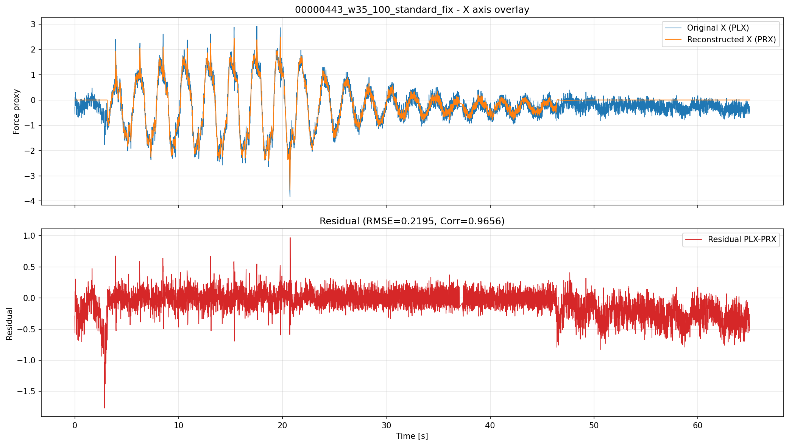
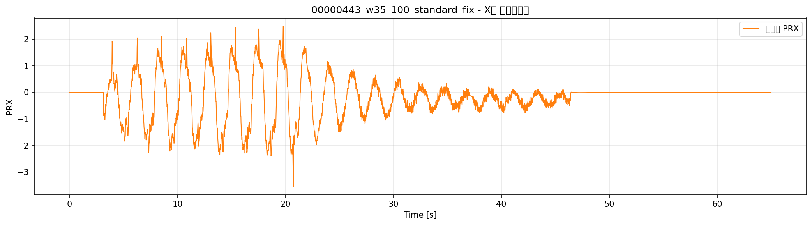
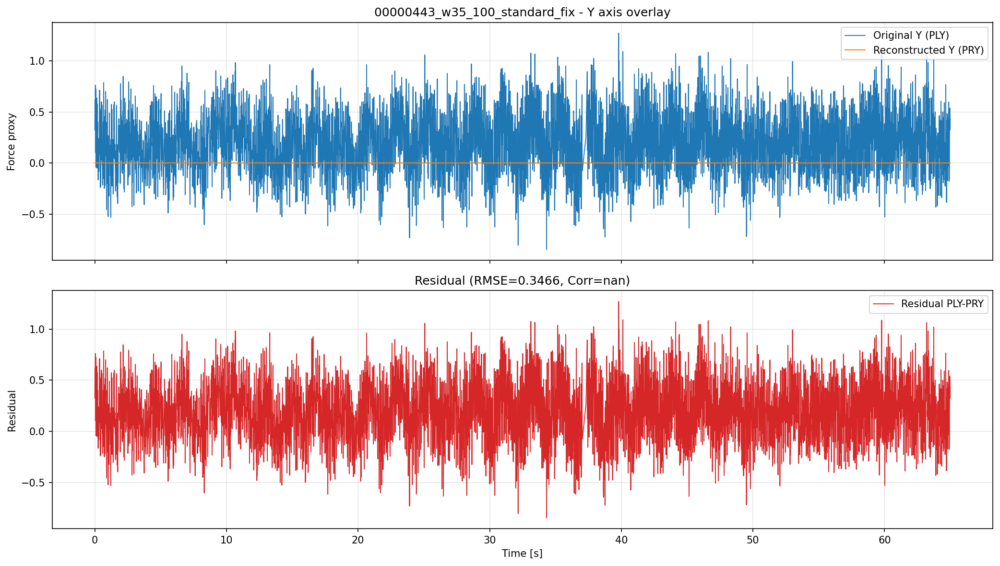
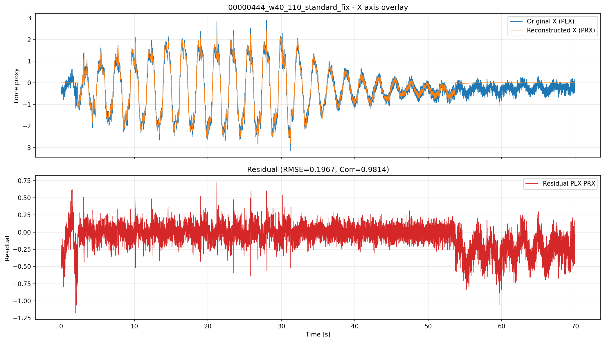
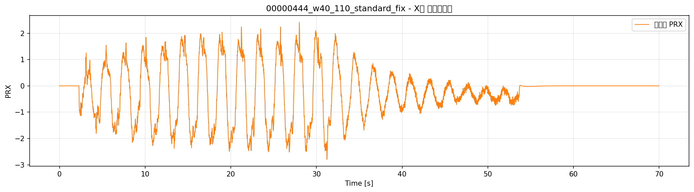
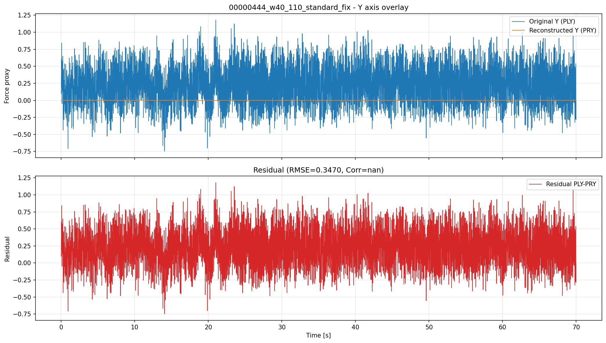

---

## 結果

X軸については、元データ（PLX）とEKF推定値（PRX）の重ね合わせグラフおよび推定値のみのグラフから、PRXがPLXのトレンドを良好に追従していることが確認できる。RMSE・相関係数も高く、フィルタ機能が正常に動作している。

Y軸については、PRYが全サンプルで0となっているが、これは入力信号（PLY）がエネルギーゲートの閾値よりも低く、観測値ゼロ強制ロジックが正しく働いているためであり、想定通りの挙動である。

## 考察

X軸では、EKFによる外力推定が元信号の変動を十分に再現できており、ノイズ抑制効果も確認できる。推定値のみのグラフからも、不要な高周波成分が抑制されていることが視覚的に分かる。

Y軸は、今回の設定・入力条件下では推定値が常に0となるが、これはエネルギーゲートの設計意図通りであり、異常ではない。今後Y軸で有意な外力が入力された場合はPRYにも推定値が現れることが期待される。

全体として、観測値ゼロ強制ロジックおよびフィルタ機能は正常に動作していると評価できる。
# 2026-04-14 XY Axis Overlay Report (Current EKF)

## Purpose
This report overlays original replay signals and EKF-reconstructed signals for X and Y axes separately.

## Data Source
- Current EKF replay outputs under results/2026-04-14_観測値ゼロ強制_結果
- Signals: PLX/PLY (original), PRX/PRY (reconstructed)

## 00000443_w35_100_standard_fix

- 結果CSV: `docs/experiments/ekf_external_force_estimation/reports/results/2026-04-14_観測値ゼロ強制_結果/00000443_w35_100_standard_fix/00000443_w35_100_standard_fix_result.csv`
- X軸指標: RMSE = 0.219536、相関係数 = 0.965562
- Y軸指標: RMSE = 0.346625、相関係数 = N/A
- 備考: 現在のEKFリプレイ出力では `PRY` が全サンプルで 0 の定数になっています。

### X軸（元データと推定値の重ね合わせ）

#### X軸（推定値のみ）

### Y軸

## 00000444_w40_110_standard_fix

- 結果CSV: `docs/experiments/ekf_external_force_estimation/reports/results/2026-04-14_観測値ゼロ強制_結果/00000444_w40_110_standard_fix/00000444_w40_110_standard_fix_result.csv`
- X軸指標: RMSE = 0.196656、相関係数 = 0.981429
- Y軸指標: RMSE = 0.346988、相関係数 = N/A
- 備考: 現在のEKFリプレイ出力では `PRY` が全サンプルで 0 の定数になっています。

### X軸（元データと推定値の重ね合わせ）

#### X軸（推定値のみ）

### Y軸

