# 2026-04-14 X軸推定値 平滑化パラメータ比較（周波数設定固定）

## 方針
- 周波数推定に関わる設定（`OBS_EKF_Q_W`, 初期周波数）は変更しない。
- 平滑化寄与が大きい `Q_D`, `Q_DD`, `Q_C`, `R_MEAS` を段階的に調整する。
- 生データ（PLX）のみの図を追加し、遅れ（ラグ）と合わせて比較する。
- 各設定で X軸推定値（PRX）を可視化し、より強い平滑化プリセットも試行する。

## 調整プリセット

| preset | Q_D | Q_DD | Q_C | R_MEAS |
|---|---:|---:|---:|---:|
| base | 0.020000 | 0.050000 | 0.001000 | 0.080000 |
| smooth_l1 | 0.015000 | 0.035000 | 0.000700 | 0.100000 |
| smooth_l2 | 0.010000 | 0.020000 | 0.000400 | 0.120000 |
| smooth_l3 | 0.007000 | 0.012000 | 0.000250 | 0.150000 |
| smooth_l4 | 0.004000 | 0.008000 | 0.000150 | 0.200000 |
| smooth_l5 | 0.002000 | 0.004000 | 0.000080 | 0.300000 |
| smooth_l6 | 0.001200 | 0.002500 | 0.000050 | 0.450000 |
| smooth_l7 | 0.000800 | 0.001500 | 0.000030 | 0.600000 |

## 00000443_w35_100

### Raw Data Only (PLX)

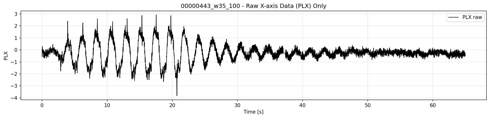

### 指標サマリ

| preset | PRX差分標準偏差（小さいほど滑らか） | 周波数MAE[Hz] | PRX遅れ[ms]（+は遅れ） |
|---|---:|---:|---:|
| base | 0.081663 | 0.109083 | 0.0 |
| smooth_l1 | 0.076096 | 0.109201 | 0.0 |
| smooth_l2 | 0.071801 | 0.109095 | 0.0 |
| smooth_l3 | 0.066852 | 0.109908 | 0.0 |
| smooth_l4 | 0.061030 | 0.110676 | 10.0 |
| smooth_l5 | 0.053785 | 0.112998 | 10.0 |
| smooth_l6 | 0.047604 | 0.114874 | 10.0 |
| smooth_l7 | 0.043842 | 0.116020 | 10.0 |

### PRX Estimate by Preset

#### base

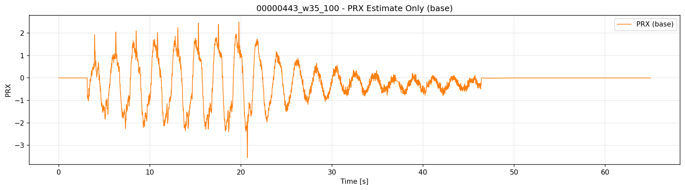

#### smooth_l1

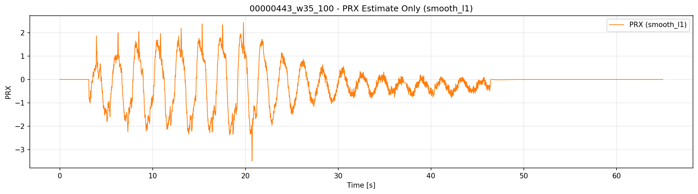

#### smooth_l2

#### smooth_l3

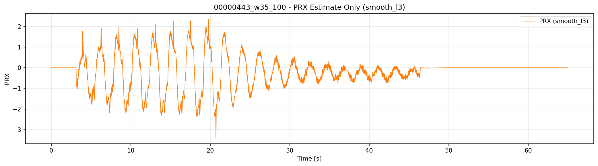

#### smooth_l4

#### smooth_l5

#### smooth_l6

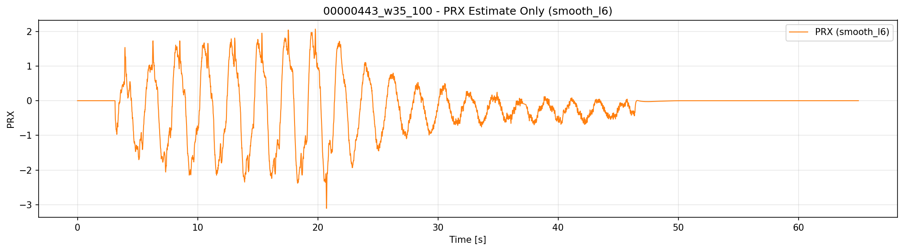

#### smooth_l7

## 00000444_w40_110

### Raw Data Only (PLX)

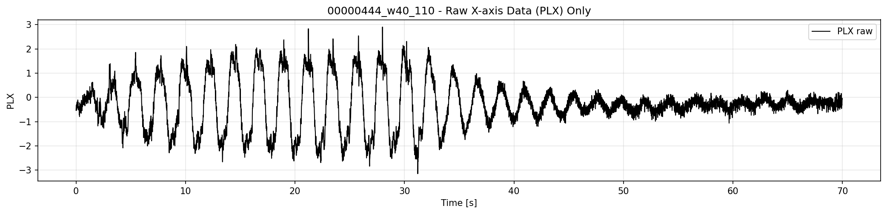

### 指標サマリ

| preset | PRX差分標準偏差（小さいほど滑らか） | 周波数MAE[Hz] | PRX遅れ[ms]（+は遅れ） |
|---|---:|---:|---:|
| base | 0.078375 | 0.111436 | 0.0 |
| smooth_l1 | 0.073430 | 0.111945 | 0.0 |
| smooth_l2 | 0.069645 | 0.112376 | 0.0 |
| smooth_l3 | 0.065330 | 0.112941 | 0.0 |
| smooth_l4 | 0.060281 | 0.113701 | 0.0 |
| smooth_l5 | 0.054116 | 0.114761 | 10.0 |
| smooth_l6 | 0.048984 | 0.115135 | 10.0 |
| smooth_l7 | 0.045889 | 0.115822 | 10.0 |

### PRX Estimate by Preset

#### base

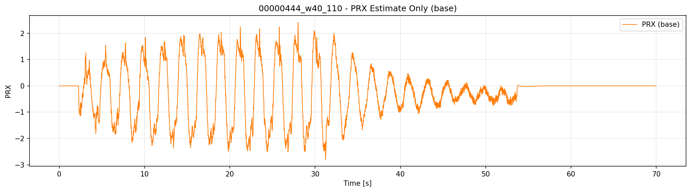

#### smooth_l1

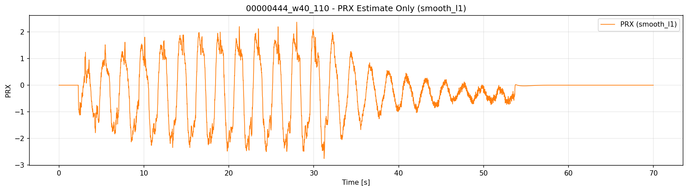

#### smooth_l2

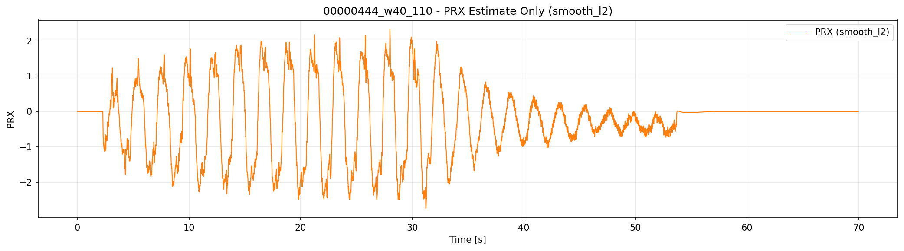

#### smooth_l3

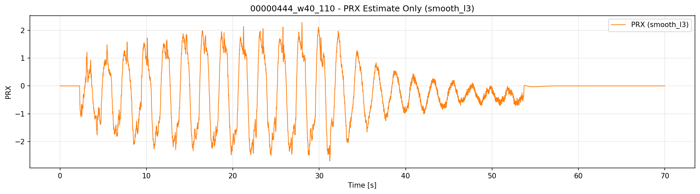

#### smooth_l4

#### smooth_l5

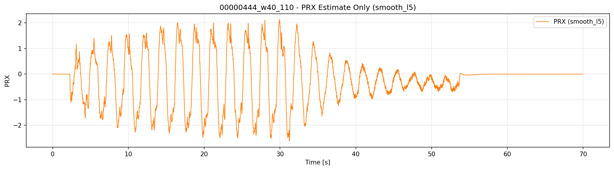

#### smooth_l6

#### smooth_l7

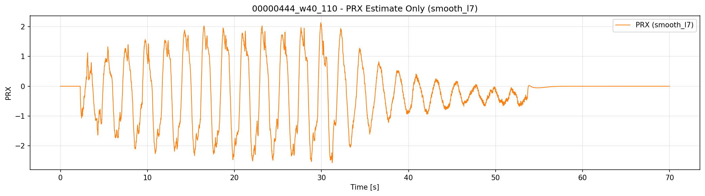

## 結論（暫定）

- `smooth_l1 -> smooth_l2 -> smooth_l3 -> smooth_l4 -> smooth_l5 -> smooth_l6 -> smooth_l7` と進むほど、PRX差分標準偏差は段階的に低下しやすい。
- 周波数推定設定は固定しているため、周波数系のチューニング方針には影響を与えない。
- 一方で平滑化を強めるほど遅れが増える可能性があるため、遅れ指標も同時に確認して採用設定を決める。