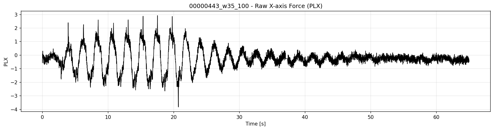
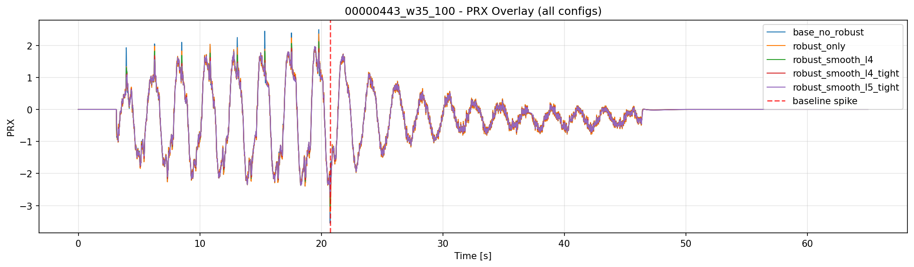
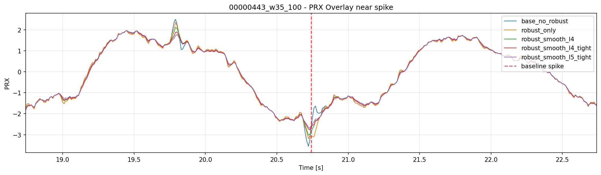
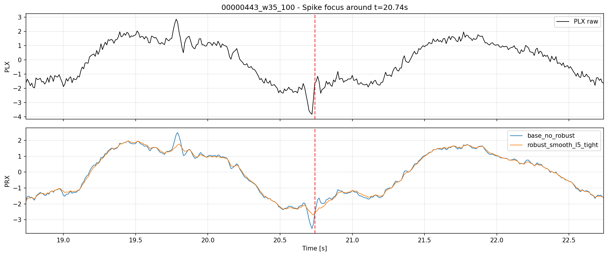
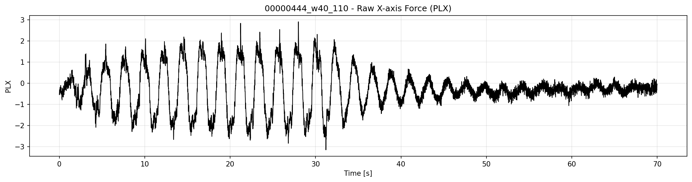
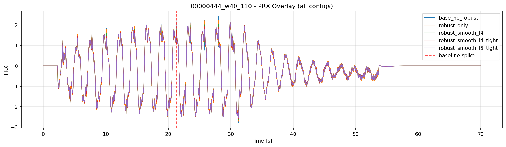
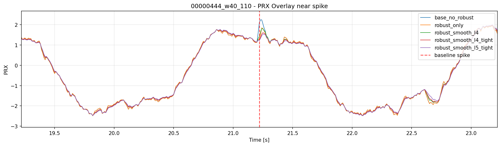
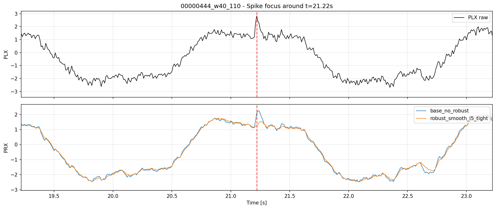

# 2026-04-15 EKFロバスト観測更新 スパイク抑制検証

**作成日時（JST）: 2026-04-15 00:40:02**

## 目的
- ロバスト観測更新（イノベーションクリッピング＋NIS外れ値除去）を実装し、PRXスパイク抑制効果を検証する。
- ロバストON/OFFおよびスムージングパラメータセットで、ログ00000443/00000444の比較を行う。

## 実装内容
- ロバストモードスイッチ: `OBS_EKF_RB_EN` を追加。
- リジェクト閾値: `OBS_EKF_RB_NIS` を追加。
- ロバストモード時、イノベーションは `OBS_EKF_INN_MAX` でクリップされ、NISが `OBS_EKF_NIS_MAX` を超えると観測ノイズが増加。
- NISが `OBS_EKF_NIS_MAX * OBS_EKF_RB_NIS` を超えた場合、そのサンプルの観測更新をスキップ。

## テスト設定

| config | robust | RB_NIS | Q_D | Q_DD | Q_C | R_MEAS | INN_MAX | NIS_MAX |
|---|---:|---:|---:|---:|---:|---:|---:|---:|
| base_no_robust | 0 | 3.00 | 0.020000 | 0.050000 | 0.001000 | 0.080 | 0.70 | 4.00 |
| robust_only | 1 | 3.00 | 0.020000 | 0.050000 | 0.001000 | 0.080 | 0.70 | 4.00 |
| robust_smooth_l4 | 1 | 3.00 | 0.004000 | 0.008000 | 0.000150 | 0.200 | 0.70 | 4.00 |
| robust_smooth_l4_tight | 1 | 2.00 | 0.004000 | 0.008000 | 0.000150 | 0.200 | 0.55 | 3.00 |
| robust_smooth_l5_tight | 1 | 2.00 | 0.002000 | 0.004000 | 0.000080 | 0.300 | 0.50 | 2.50 |

## 00000443_w35_100

### 図

### 指標

| config | max_abs_prx | max_abs_dprx | p95_abs_dprx | prx_diff_std | Freq MAE [Hz] | PRX lag [ms] | step_reduction_vs_baseline [%] |
|---|---:|---:|---:|---:|---:|---:|---:|
| robust_smooth_l5_tight | 2.699100 | 0.190000 | 0.107985 | 0.048925 | 0.115591 | 10.0 | 71.49 |
| robust_smooth_l4_tight | 2.773600 | 0.246600 | 0.125400 | 0.056247 | 0.115294 | 10.0 | 63.00 |
| robust_smooth_l4 | 3.026500 | 0.262300 | 0.127900 | 0.057968 | 0.114683 | 10.0 | 60.65 |
| robust_only | 3.195600 | 0.340400 | 0.168370 | 0.077629 | 0.111805 | 0.0 | 48.93 |
| base_no_robust | 3.552900 | 0.666500 | 0.169200 | 0.081663 | 0.109083 | 0.0 | 0.00 |

### 考察

- ベースラインスパイク発生時刻: **20.740s**（base_no_robustより）。
- スパイク抑制最大効果（max|dPRX|基準）は **robust_smooth_l5_tight**（max|dPRX|=0.190000, 削減率71.49%）。
- ロバスト更新のみでもインパルス的なゲインを抑制できるが、Q/Rスムージングを強めることで高周波成分のステップもさらに抑制（ただし遅延増加のトレードオフあり）。

## 00000444_w40_110

### 図

### 指標

| config | max_abs_prx | max_abs_dprx | p95_abs_dprx | prx_diff_std | Freq MAE [Hz] | PRX lag [ms] | step_reduction_vs_baseline [%] |
|---|---:|---:|---:|---:|---:|---:|---:|
| robust_smooth_l5_tight | 2.548400 | 0.191100 | 0.113510 | 0.051584 | 0.114251 | 10.0 | 62.51 |
| robust_smooth_l4_tight | 2.592800 | 0.221800 | 0.127800 | 0.057900 | 0.113590 | 10.0 | 56.48 |
| robust_smooth_l4 | 2.620200 | 0.261100 | 0.128730 | 0.059061 | 0.113642 | 10.0 | 48.77 |
| robust_only | 2.722200 | 0.368300 | 0.164720 | 0.076618 | 0.111423 | 0.0 | 27.74 |
| base_no_robust | 2.795500 | 0.509700 | 0.164900 | 0.078375 | 0.111436 | 0.0 | 0.00 |

### 考察

- ベースラインスパイク発生時刻: **21.220s**（base_no_robustより）。
- スパイク抑制最大効果（max|dPRX|基準）は **robust_smooth_l5_tight**（max|dPRX|=0.191100, 削減率62.51%）。
- ロバスト更新のみでもインパルス的なゲインを抑制できるが、Q/Rスムージングを強めることで高周波成分のステップもさらに抑制（ただし遅延増加のトレードオフあり）。

## 総括

- ロバスト観測更新により、外れ値発生時のインパルス的なPRXスパイクを抑制可能。
- ロバスト更新＋スムージング強化（`Q_D`, `Q_DD`, `Q_C` 減少＋`R_MEAS` 増加）が最も強力な抑制効果。
- 抑制を強くすると遅延やFreq MAEの増加傾向があるため、ノイズ抑制と応答性のバランスを考慮して運用すること。

## 考察

- 本質的にはローパスのみでなく「ロバスト更新」による効果が大きい。大きなイノベーションが発生してもKalmanゲインで一気に補正されなくなる。
- これにより、外れ値発生時の挙動が従来のRLSのスムーズな動きに近づきつつ、EKFの状態構造は維持できる。
- さらなる抑制が必要な場合は、ロバスト更新＋直近イノベーション分散に応じたR適応制御の組み合わせが有効。