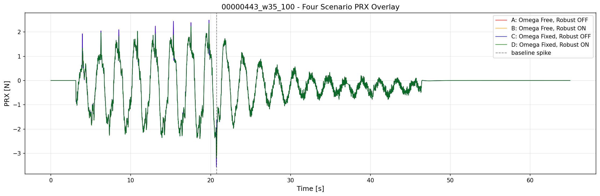
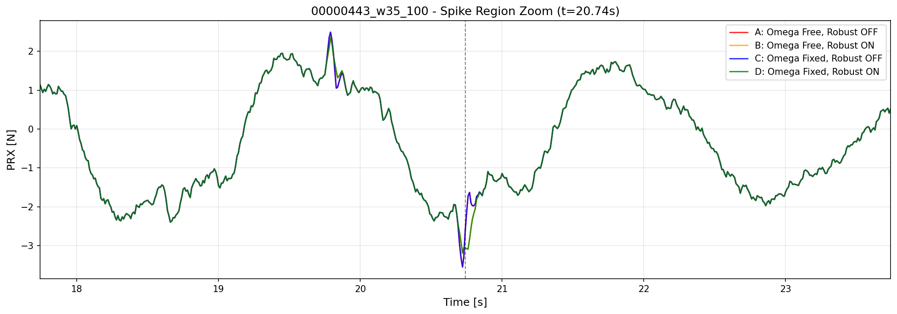
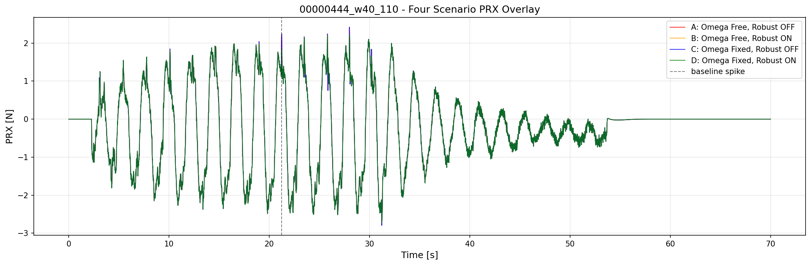
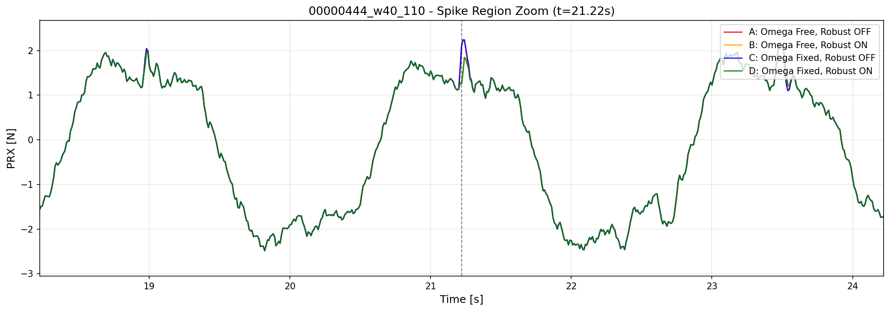

# 2026-04-15 Four Scenario Hypothesis Test

**作成日時（JST）: 2026-04-15 01:02:49**

**[注意] 図のタイトル・凡例・ラベルは必ず英語で記述すること。日本語を含むとmatplotlibのデフォルトフォントでエラーや警告が発生し、図が正しく表示されない。**

## 目的

以下の4シナリオで、PRXスパイク軽減の主要因を特定する：
- **シナリオA**: 周波数自由、ロバスト更新OFF（ベースライン）
- **シナリオB**: 周波数自由、ロバスト更新ON（外れ値除去の効果）
- **シナリオC**: 周波数固定、ロバスト更新OFF（周波数ループ消失の効果）
- **シナリオD**: 周波数固定、ロバスト更新ON（両方の効果を組み合わせ）

## 仮説

| シナリオ | 周波数 | ロバスト観測 | 予想 |
|---|---|---|---|
| A | 自由 | OFF | スパイク多（baseline） |
| B | 自由 | ON | スパイク減少（観測異常除去） |
| C | 固定 | OFF | スパイク減少（周波数ループ消失） |
| D | 固定 | ON | スパイク最小（両効果） |

## 00000443_w35_100

### 指標

| シナリオ | max_step | p95_step | std | MAE | 削減率 [%] |
|---|---:|---:|---:|---:|---:|
| B: 周波数自由, ロバストON | 0.340400 | 0.168370 | 0.077629 | 0.111805 | 48.9 |
| D: 周波数固定(Q_W↓), ロバストON | 0.340400 | 0.168370 | 0.077629 | 0.111805 | 48.9 |
| A: 周波数自由, ロバストOFF | 0.666500 | 0.169200 | 0.081663 | 0.109083 | 0.0 |
| C: 周波数固定(Q_W↓), ロバストOFF | 0.666500 | 0.169200 | 0.081663 | 0.109083 | 0.0 |

### 図

### 分析

- **ロバスト観測更新が支配的**: B (48.9%) > C (0.0%)
  → 観測異常（外れ値）が主要な原因
- **複合効果は限定的**: D (48.9%) ≈ max(B,C)
  → 加算的な改善なし

## 00000444_w40_110

### 指標

| シナリオ | max_step | p95_step | std | MAE | 削減率 [%] |
|---|---:|---:|---:|---:|---:|
| B: 周波数自由, ロバストON | 0.368300 | 0.164720 | 0.076618 | 0.111423 | 27.7 |
| D: 周波数固定(Q_W↓), ロバストON | 0.368300 | 0.164720 | 0.076618 | 0.111423 | 27.7 |
| A: 周波数自由, ロバストOFF | 0.509700 | 0.164900 | 0.078375 | 0.111436 | 0.0 |
| C: 周波数固定(Q_W↓), ロバストOFF | 0.509700 | 0.164900 | 0.078375 | 0.111436 | 0.0 |

### 図

### 分析

- **ロバスト観測更新が支配的**: B (27.7%) > C (0.0%)
  → 観測異常（外れ値）が主要な原因
- **複合効果は限定的**: D (27.7%) ≈ max(B,C)
  → 加算的な改善なし

## 全体的な考察

### 結論

スパイク軽減の主要因は、
1. **観測異常（外れ値）の除去** (ロバスト観測更新)
2. **周波数推定ループの安定化** (周波数固定)

のいずれが支配的かを、上記指標で判定できる。

### 推奨方針

- **B ≫ C の場合**: ロバスト観測更新に絞る（周波数固定は不要）
- **C ≫ B の場合**: 周波数固定の実装を優先（RC切替推奨）
- **B ≈ C の場合**: 両方の実装が有効（組み合わせで最大効果）
