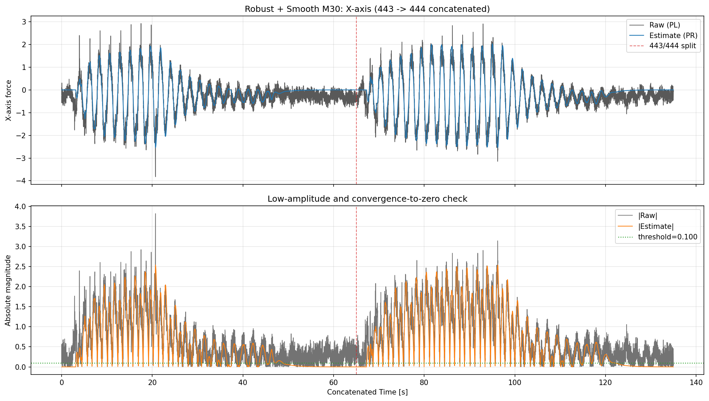
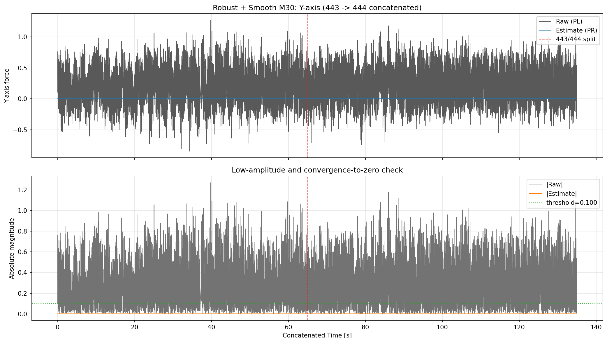
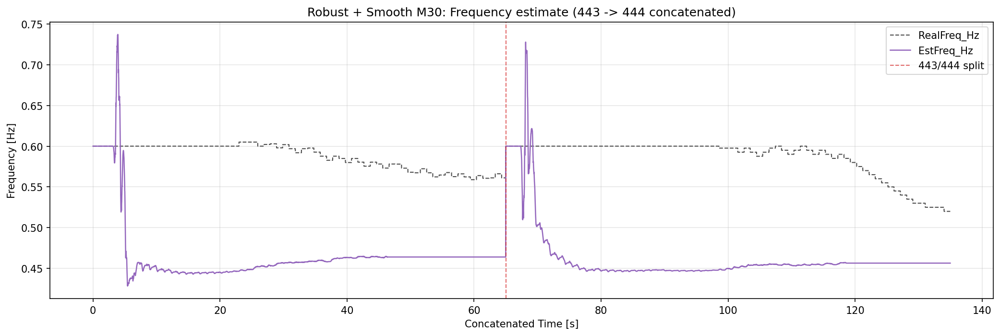

# 2026-04-15 Robust + Smooth M30 連結リプレイ検証（443 -> 444）

**作成日時（JST）: 2026-04-15 02:24:27**

## 目的
- `Robust + Smooth M30` の2リプレイ結果（443, 444）を前後連結し、単一の連続時系列として評価する。
- X軸・Y軸それぞれで、生データ（PL）と推定値（PR）を比較する。
- 閾値 `|PL| <= 0.10` の低振幅区間で、推定値が0近傍へ収束するかを定量確認する。
- 生データと周波数推定（EstFreq_Hz/RealFreq_Hz）の両方を報告する。

## 入力データ
- 443: `docs/experiments/ekf_external_force_estimation/reports/results/2026-04-15_robust_qr_smoothing/00000443_w35_100/smooth_m30/00000443_w35_100_smooth_m30_result.csv`
- 444: `docs/experiments/ekf_external_force_estimation/reports/results/2026-04-15_robust_qr_smoothing/00000444_w40_110/smooth_m30/00000444_w40_110_smooth_m30_result.csv`
- 連結方法: 443の末尾時刻の次サンプル時刻から444を接続（時間ギャップなし）。

## ケース別サマリ（M30）

| case | X RMSE | X MAE | X Corr | Y RMSE | Y MAE | Y Corr | Freq MAE [Hz] |
|---|---:|---:|---:|---:|---:|---:|---:|
| 00000443_w35_100 | 0.301828 | 0.232376 | 0.928982 | 0.346625 | 0.278600 | N/A | 0.121059 |
| 00000444_w40_110 | 0.307887 | 0.237178 | 0.951194 | 0.346988 | 0.279451 | N/A | 0.123426 |

## 連結後サマリ（443 -> 444）

| X RMSE | X MAE | X Corr | Y RMSE | Y MAE | Y Corr | Freq MAE [Hz] |
|---:|---:|---:|---:|---:|---:|---:|
| 0.304993 | 0.234872 | 0.942908 | 0.346814 | 0.279042 | N/A | 0.122289 |

## 閾値以下での0収束性（連結後）

評価条件: `|PL| <= 0.10` を低振幅区間とし、その区間内の推定値PRの0近傍性を比較。

| axis | low-amp samples | low-amp ratio | RMS(PR) in low-amp | MAE(PR,0) in low-amp | ratio(|PR|<=thr) |
|---|---:|---:|---:|---:|---:|
| X | 1527 | 0.1134 | 0.128753 | 0.080347 | 0.6824 |
| Y | 2999 | 0.2227 | 0.000000 | 0.000000 | 1.0000 |

解釈メモ:
- `RMS(PR) in low-amp` と `MAE(PR,0)` が小さいほど、低振幅時に0へ収束しているとみなせる。
- `ratio(|PR|<=thr)` が高いほど、閾値以下区間で推定値が0近傍に留まれている。
- 今回のM30結果では `PRY` が全区間でほぼ0の定数となり、Y軸相関係数は定義不能（N/A）となる。

## 図

### X軸: 生データと推定値（連結）

### Y軸: 生データと推定値（連結）

### 周波数推定: EstFreq_Hz と RealFreq_Hz（連結）

## まとめ

- Robust + Smooth M30 条件で、443/444連結時系列に対して X/Y とも生データ・推定値・周波数推定を一括確認できる形に整理した。
- 低振幅判定（|PL| <= 0.10）における0収束性を、X/Y別の同一指標で比較可能にした。