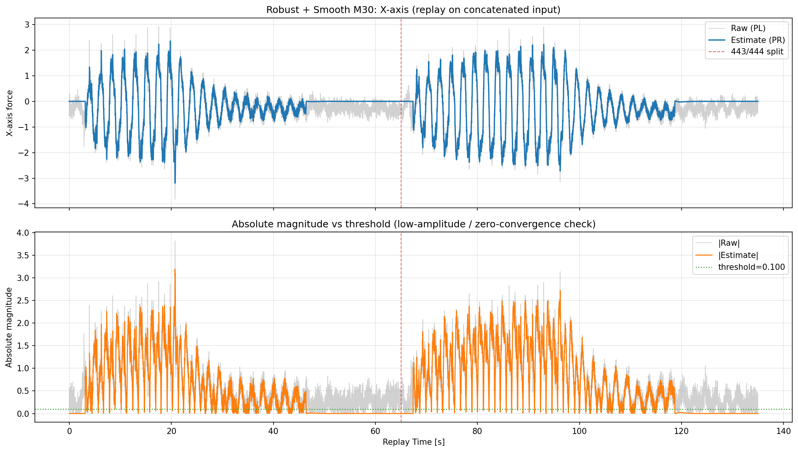
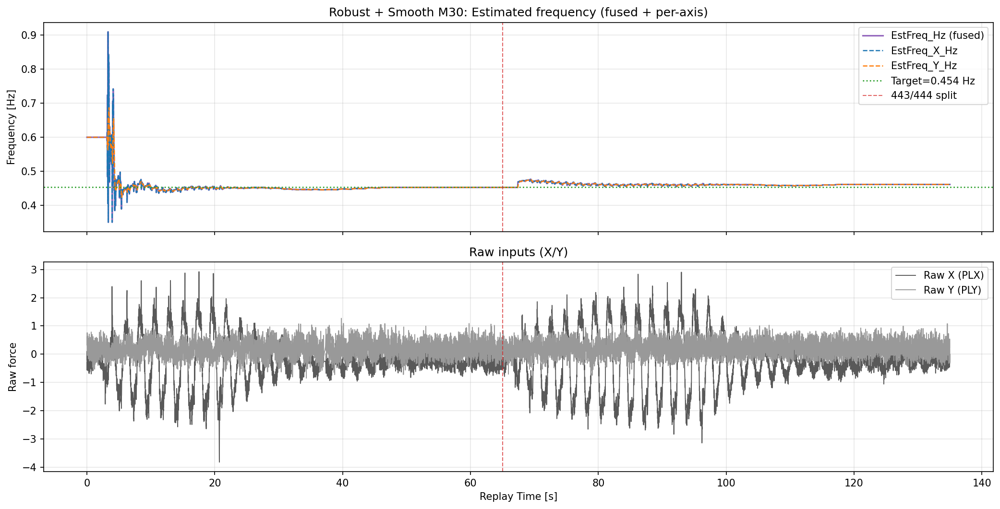

# 2026-04-16 Robust + Smooth M30 連結ログ直接リプレイ検証（443 -> 444）

**作成日時（JST）: 2026-04-16 12:07:07**

## 目的

- 2ログを後処理で連結するのではなく、入力ログを先に連結した上で1回のリプレイを実施する。

- `Robust + Smooth M30` 条件で、X/Yの推定と低振幅時の0収束、および推定周波数の挙動を検証する。

## 入力ログ連結

- 入力A: `docs/experiments/ekf_external_force_estimation/reports/2026-04-13_443_444リプレイ検証_model_strong/00000443_w35_100_input.csv`

- 入力B: `docs/experiments/ekf_external_force_estimation/reports/2026-04-13_443_444リプレイ検証_model_strong/00000444_w40_110_input.csv`

- 連結入力CSV: `docs/experiments/ekf_external_force_estimation/reports/results/2026-04-16_robust_smooth_m30_concat_direct_replay/concat_input/00000443_00000444_concat_input.csv`

- サンプル数: A=6465, B=7000, Total=13465

- 境界時刻: t=65.000312s （この時刻で443区間と444区間が切り替わる）

## リプレイ設定（Robust + Smooth M30）

- SW mode: always-on（リプレイ全区間で周波数推定SWをON）

- robust update: ON (`--ekf-robust-update 1`) / NIS reject: 3.0

- Q_D=0.02, Q_DD=0.05, Q_C=0.001, R_MEAS=0.080

- EKF_Q_W=1e-05 (frequency-estimation gain / process noise)

- EKF_SH_BETA=0.100 (shared omega blend)

- 結果CSV: `docs/experiments/ekf_external_force_estimation/reports/results/2026-04-16_robust_smooth_m30_concat_direct_replay/replay/00000443_00000444_concat_robust_smooth_m30_result.csv`

## 指標サマリ

| segment | X RMSE | X MAE | X Corr | Y RMSE | Y MAE | Y Corr | EstFreq mean [Hz] | EstFreq std [Hz] | EstFreq p95 step [Hz] | EstFreq max step [Hz] |

|---|---:|---:|---:|---:|---:|---:|---:|---:|---:|---:|

| all | 0.215499 | 0.152260 | 0.973355 | 0.346814 | 0.279042 | N/A | 0.460615 | 0.027916 | 0.001200 | 0.273400 |

| first (443) | 0.227316 | 0.161298 | 0.962353 | 0.346601 | 0.278573 | N/A | 0.460225 | 0.040100 | 0.002400 | 0.273400 |

| second (444) | 0.203975 | 0.143911 | 0.979935 | 0.347011 | 0.279477 | N/A | 0.460976 | 0.003671 | 0.000700 | 0.014700 |

## 閾値以下での0収束性（全区間）

評価条件: `|PL| <= 0.10`

| axis | low-amp samples | low-amp ratio | RMS(PR) in low-amp | MAE(PR,0) in low-amp | ratio(|PR|<=thr) |

|---|---:|---:|---:|---:|---:|

| X | 1527 | 0.1134 | 0.075486 | 0.041649 | 0.8369 |

| Y | 2999 | 0.2227 | 0.000000 | 0.000000 | 1.0000 |

注記:

- `RMS(PR) in low-amp` と `MAE(PR,0)` が小さいほど0収束性が高い。

- `ratio(|PR|<=thr)` が高いほど、低振幅区間で推定が閾値内に留まる。

- 下段グラフ（Absolute magnitude vs threshold）は、`|Raw|` と `|Estimate|` を閾値線と比較し、低振幅区間で推定が0近傍へ収束しているかを確認するための図。

## 比較結果

- 直前の同系列レポート（`EKF_Q_W=5e-4` 相当）では、`EstFreq std=0.040593 Hz`、`p95 step=0.004500 Hz` だった。
- 今回は `EKF_Q_W=1e-5` に下げた結果、`EstFreq std=0.027916 Hz`、`p95 step=0.001200 Hz` まで低下した。
- したがって、周波数推定のゲインを下げると振動はかなり抑えられる。
- ただし 443 区間の切替近傍では最大ステップ `0.273400 Hz` が残るため、完全に振動ゼロにはなっていない。

## 統合サマリ（旧レポート3本を統合）

以下の旧レポート内容を本レポートに集約した。

- `2026-04-15_03-26-45_...md`（旧M30初期条件）
- `2026-04-16_11:54:27_...md`（SW always-on + `EKF_SH_BETA=0.300`）
- `2026-04-16_12:02:28_...md`（SW always-on + `EKF_SH_BETA=0.100`）

| run | 主要設定差分 | X RMSE(all) | EstFreq std(all) [Hz] | EstFreq p95 step(all) [Hz] | 備考 |
|---|---|---:|---:|---:|---|
| 2026-04-15_03-26-45 | SW: log追従相当, `Q_D/Q_DD/Q_C` 極小, `R_MEAS=46.0` | 0.305962 | 0.030995 | N/A | 旧基準。推定は滑らかだがX追従性が低い。 |
| 2026-04-16_11:54:27 | SW: always-on, `EKF_SH_BETA=0.300`, `EKF_Q_W=5e-4` 相当 | 0.215424 | 0.040593 | 0.004500 | X追従は改善したが周波数振動が増加。 |
| 2026-04-16_12:02:28 | SW: always-on, `EKF_SH_BETA=0.100`, `EKF_Q_W=5e-4` 相当 | 0.215424 | 0.040593 | 0.004500 | βのみ低減しても主要指標は実質同等。 |
| 2026-04-16_12:07:07 (本報告) | SW: always-on, `EKF_SH_BETA=0.100`, `EKF_Q_W=1e-5` | 0.215499 | 0.027916 | 0.001200 | 振動量を大幅低減。境界近傍の最大ステップは残る。 |

結論:

- この系列では `EKF_SH_BETA` より `EKF_Q_W` の方が周波数振動抑制に効く。
- 運用上の推奨は `SW always-on` を維持しつつ、`EKF_Q_W` を小さめに設定して振動を抑える方針。

## 図

### X軸: 生データと推定値（連結ログを直接リプレイ）

### Y軸: 生データと推定値（連結ログを直接リプレイ）

### 周波数推定: 統合値+各軸推定（下段: X/Y生データ）

