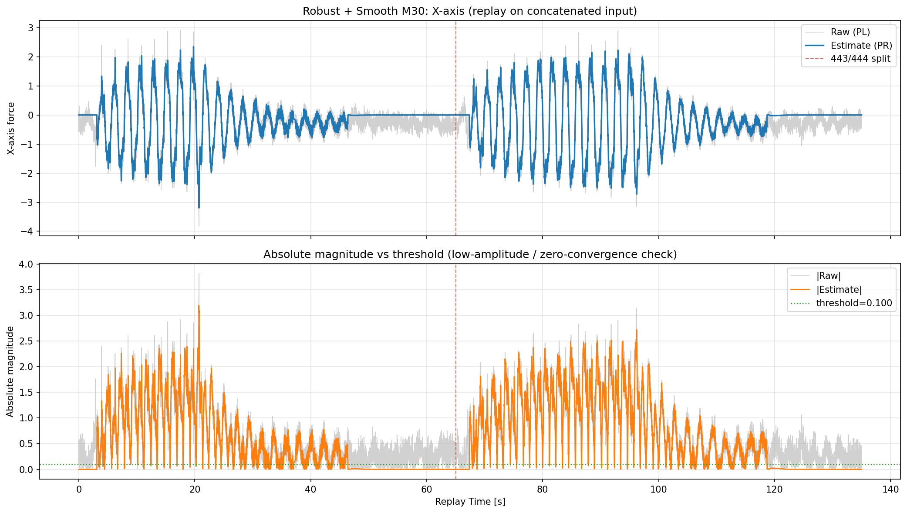
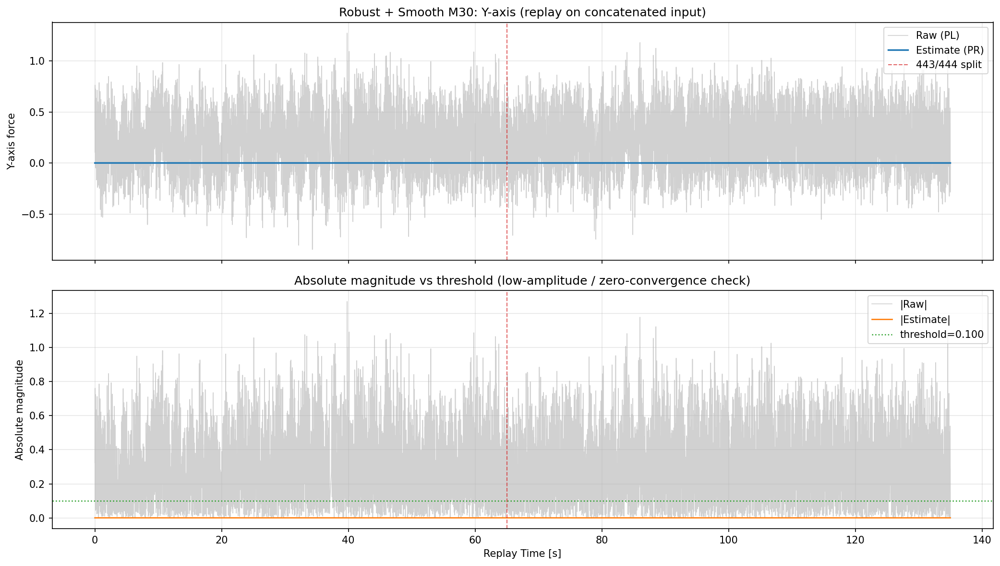
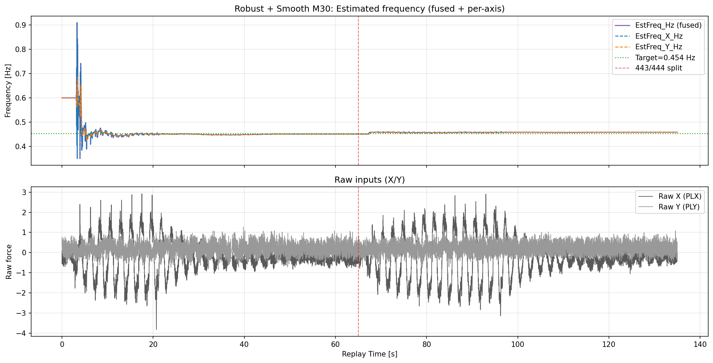

# 2026-04-16 Robust + Smooth M30 連結ログ直接リプレイ検証（443 -> 444）

**作成日時（JST）: 2026-04-16 13:20:16**

## 目的

- 2ログを後処理で連結するのではなく、入力ログを先に連結した上で1回のリプレイを実施する。

- `Robust + Smooth M30` 条件で、X/Yの推定と低振幅時の0収束、および推定周波数の挙動を検証する。

## 入力ログ連結

- 入力A: `docs/experiments/ekf_external_force_estimation/reports/2026-04-13_443_444リプレイ検証_model_strong/00000443_w35_100_input.csv`

- 入力B: `docs/experiments/ekf_external_force_estimation/reports/2026-04-13_443_444リプレイ検証_model_strong/00000444_w40_110_input.csv`

- 連結入力CSV: `docs/experiments/ekf_external_force_estimation/reports/results/2026-04-16_robust_smooth_m30_concat_direct_replay/concat_input/00000443_00000444_concat_input.csv`

- サンプル数: A=6465, B=7000, Total=13465

- 境界時刻: t=65.000312s （この時刻で443区間と444区間が切り替わる）

## リプレイ設定（Robust + Smooth M30）

- SW mode: always-on（リプレイ全区間で周波数推定SWをON）

- robust update: ON (`--ekf-robust-update 1`) / NIS reject: 3.0

- Q_D=0.02, Q_DD=0.05, Q_C=0.001, R_MEAS=0.08

- EKF_Q_W=1e-06 (frequency-estimation gain / process noise)

- Frequency R/Q ratio (R_MEAS / EKF_Q_W)=80000

- EKF_SH_BETA=0.100 (shared omega blend)

- 結果CSV: `docs/experiments/ekf_external_force_estimation/reports/results/2026-04-16_robust_smooth_m30_concat_direct_replay/replay/00000443_00000444_concat_robust_smooth_m30_result.csv`

## 指標サマリ

| segment | X RMSE | X MAE | X Corr | Y RMSE | Y MAE | Y Corr | EstFreq mean [Hz] | EstFreq std [Hz] | EstFreq p95 step [Hz] | EstFreq max step [Hz] |

|---|---:|---:|---:|---:|---:|---:|---:|---:|---:|---:|

| all | 0.215464 | 0.152220 | 0.973372 | 0.346814 | 0.279042 | N/A | 0.458926 | 0.027857 | 0.000900 | 0.273400 |

| first (443) | 0.227315 | 0.161298 | 0.962353 | 0.346601 | 0.278573 | N/A | 0.459887 | 0.040144 | 0.002400 | 0.273400 |

| second (444) | 0.203905 | 0.143834 | 0.979958 | 0.347011 | 0.279477 | N/A | 0.458039 | 0.001586 | 0.000300 | 0.006400 |

## 閾値以下での0収束性（全区間）

評価条件: `|PL| <= 0.10`

| axis | low-amp samples | low-amp ratio | RMS(PR) in low-amp | MAE(PR,0) in low-amp | ratio(|PR|<=thr) |

|---|---:|---:|---:|---:|---:|

| X | 1527 | 0.1134 | 0.075494 | 0.041654 | 0.8369 |

| Y | 2999 | 0.2227 | 0.000000 | 0.000000 | 1.0000 |

注記:

- `RMS(PR) in low-amp` と `MAE(PR,0)` が小さいほど0収束性が高い。

- `ratio(|PR|<=thr)` が高いほど、低振幅区間で推定が閾値内に留まる。

- 下段グラフ（Absolute magnitude vs threshold）は、`|Raw|` と `|Estimate|` を閾値線と比較し、低振幅区間で推定が0近傍へ収束しているかを確認するための図。

## R/Q比 10/20/30倍 の比較結果

- 比較基準: 直前の実運用条件（`EKF_Q_W=1e-5`, `R_MEAS=0.08`, `R/Q=8000`）。
- 比較条件:
	- 10倍: `EKF_Q_W=1e-6`, `R_MEAS=0.08`, `R/Q=80000`
	- 20倍: `EKF_Q_W=5e-7`, `R_MEAS=0.08`, `R/Q=160000`
	- 30倍: `EKF_Q_W=3.333333333e-7`, `R_MEAS=0.08`, `R/Q=240000`

| case | EKF_Q_W | R_MEAS | R/Q | EstFreq mean [Hz] | EstFreq std [Hz] | EstFreq p95 step [Hz] | EstFreq max step [Hz] |
|---|---:|---:|---:|---:|---:|---:|---:|
| baseline (前回) | 1e-5 | 0.08 | 8000 | 0.459055 | 0.027916 | 0.001200 | 0.273400 |
| R/Q x10 | 1e-6 | 0.08 | 80000 | 0.458926 | 0.027859 | 0.000900 | 0.273400 |
| R/Q x20 | 5e-7 | 0.08 | 160000 | 0.458772 | 0.027864 | 0.000900 | 0.273400 |
| R/Q x30 | 3.333333333e-7 | 0.08 | 240000 | 0.458724 | 0.027865 | 0.000900 | 0.273400 |

結論:

- `p95 step` は baseline の `0.001200` から、10倍以上で `0.000900` へ改善し、細かな振動は抑制された。
- `std` は 10倍で最小（`0.027857`）となり、20倍・30倍はほぼ同等で追加改善は限定的だった。
- 境界近傍の最大ステップは全条件で同等（`0.273400`）で、切替起因ピークには別対策が必要。

運用判断:

- 周波数推定（`EKF_Q_W` 系）は **R/Q x10（`EKF_Q_W=1e-6`, `R_MEAS=0.08`）を採用** する。

## X軸平滑化の追加検証（非周波数EKF比）

方針:

- 周波数推定パラメータ（`EKF_Q_W`, `EKF_SH_BETA`）は固定。
- それ以外の状態推定パラメータ（`Q_D/Q_DD/Q_C/R_MEAS`）だけを比率変更して、X軸推定ノイズを比較。
- 詳細レポート: `docs/experiments/ekf_external_force_estimation/reports/2026-04-16_16-44-50_X軸平滑化_非周波数EKF比スイープ_連結リプレイ検証.md`

固定（周波数推定系）:

- `EKF_Q_W=1e-6`（周波数側はx10採用値）
- `EKF_SH_BETA=0.10`
- `SW mode=always-on`, `robust update=ON`

追加スイープ結果（要点）:

| case | 設定意図 | X RMSE | std(diff(PRX)) | p95(|diff(PRX)|) | max(|diff(PRX)|) | EstFreq std [Hz] | 備考 |
|---|---|---:|---:|---:|---:|---:|---|
| stateqr_x1 | 現行基準 | 0.215464 | 0.076882 | 0.166100 | 0.366700 | 0.027857 | 基準 |
| stateqr_x2 | より平滑化 | 0.233641 | 0.050734 | 0.112585 | 0.264900 | 0.028270 | ノイズ低減（追従はやや低下） |
| stateqr_x4 | 強平滑化 | 26385.621638 | 1056.235374 | 2569.338615 | 6774.962400 | 0.023350 | 発散 |
| stateqr_x8 | 過大平滑化 | 337275401.300371 | 17019715.548751 | 35305147.200000 | 137656426.000000 | 0.052065 | 発散 |

判定:

- X軸ノイズ低減だけを見ると `stateqr_x2` が有効。
- `stateqr_x4` 以上は明確に不安定化（発散）するため不採用。

最終決定:

- 非周波数EKF比は **`stateqr_x2` を採用**。
- 周波数推定系は本報告の方針通り **`EKF_Q_W=1e-6`, `EKF_SH_BETA=0.10` を維持**。

採用後の実運用パラメータ（replay検証ベース）:

1. 周波数推定系（固定）
	- `EKF_Q_W=1e-6`
	- `EKF_SH_BETA=0.10`
2. 非周波数EKF系（x2採用）
	- `Q_D=0.01`
	- `Q_DD=0.025`
	- `Q_C=0.0005`
	- `R_MEAS=0.16`
3. 共通
	- `SW mode=always-on`
	- `robust update=ON`
	- `NIS reject=3.0`

補足（軸間で同じ値を使っているか）:

- `Q_D/Q_DD/Q_C/Q_W/R_MEAS` は軸ごとの別値ではなく、共通のAPパラメータとして全軸に適用される。
- 軸間差は、入力信号差・軸ゲート・信頼度判定・shared omega融合重みで生じる。

詳細:

- 非周波数EKF比スイープ決定版: `docs/experiments/ekf_external_force_estimation/reports/2026-04-16_16-44-50_X軸平滑化_非周波数EKF比スイープ_連結リプレイ検証.md`
- アルゴリズム詳細（分岐条件・軸間干渉）: `libraries/AP_Observer/README.md`

## 原因切り分け検証（旧 smooth_m30 図との差分）

検証目的:

- `2026-04-15_robust_qr_smoothing` の `smooth_m30` 図と、最新レポートの X 軸推定で見える細かな振動差が、
	- 設定パラメータ差によるものか
	- 周波数推定アルゴリズム（実装世代）差によるものか
	を切り分ける。

比較対象（すべて `00000443_w35_100_input.csv` で評価）:

| label | 入力 | SW mode | Q_D | Q_DD | Q_C | R_MEAS | Q_W | SH_BETA | CSV |
|---|---|---|---:|---:|---:|---:|---:|---:|---|
| A old_ref_smooth_m30 | 旧結果アーカイブ | log相当 | 9.5367432e-12 | 2.3841858e-11 | 4.7683716e-13 | 46.0 | (旧実験時既定) | 0.0相当 | `results/2026-04-15_robust_qr_smoothing/00000443_w35_100/smooth_m30/00000443_w35_100_smooth_m30_result.csv` |
| B cur_old_m30 | 現行バイナリ再実行 | log | 9.5367432e-12 | 2.3841858e-11 | 4.7683716e-13 | 46.0 | 0.0005 (既定) | 0.0 (既定) | `results/2026-04-16_param_cause_check/replay/cur_old_m30_result.csv` |
| C cur_latest_x10_single | 現行バイナリ再実行 | always-on | 0.02 | 0.05 | 0.001 | 0.08 | 1e-6 | 0.10 | `results/2026-04-16_param_cause_check/replay/cur_latest_x10_single_result.csv` |
| D cur_old_m30_always_on | 現行バイナリ再実行 | always-on | 9.5367432e-12 | 2.3841858e-11 | 4.7683716e-13 | 46.0 | 0.0005 (既定) | 0.0 (既定) | `results/2026-04-16_param_cause_check/replay/cur_old_m30_always_on_result.csv` |

評価指標（X軸推定 PRX の細かな振動）:

- `std(diff(PRX))`
- `p95(|diff(PRX)|)`
- `max(|diff(PRX)|)`

| label | rows | SW mean | PRX std | std(diff(PRX)) | p95(|diff(PRX)|) | max(|diff(PRX)|) |
|---|---:|---:|---:|---:|---:|---:|
| A old_ref_smooth_m30 | 6465 | 0.6597 | 0.760156 | 0.022445 | 0.050485 | 0.075300 |
| B cur_old_m30 (log) | 6465 | 0.6597 | 1.341808 | 0.064324 | 0.084685 | 3.624400 |
| C cur_latest_x10_single | 6465 | 1.0000 | 0.764066 | 0.077613 | 0.168200 | 0.340400 |
| D cur_old_m30_always_on | 6465 | 1.0000 | 153.706300 | 6.158024 | 11.373845 | 321.231800 |

追加比較（アルゴリズム世代差の目安）:

- A vs B（同じ smooth_m30 パラメータ相当、同入力）
	- `RMSE(PRX) = 1.099367`
	- `RMSE(EstFreq_Hz) = 0.037581`

判定:

- **結論は「両方の要因がある」**。
- A と B が同一入力・同等パラメータで一致しないため、旧図作成時点から現行までに**アルゴリズム/実装挙動の差**が存在する。
- さらに B（old_m30/log）と C（latest_x10_single）比較で `std(diff(PRX))` と `p95(|diff(PRX)|)` が増えており、**最新条件（Q/R・Q_W・always-on）の設定差**で細かな振動が増える。
- D が示す通り、old_m30 極端平滑パラメータをそのまま always-on にすると不安定化が強いため、現在の運用では `Q_D/Q_DD/Q_C/R_MEAS` と `Q_W` を再バランスした条件が必要。

## 図（倍率ごとの個別表示）

固定設定（全ケース共通）:

- `EKF_SH_BETA=0.10`
- `R_MEAS=0.08`
- `Q_D=0.02`, `Q_DD=0.05`, `Q_C=0.001`
- `SW mode=always-on`, `robust update=ON`, `NIS reject=3.0`

### R/Q x10（`EKF_Q_W=1e-6`, `R/Q=80000`）

- 結果CSV: `results/2026-04-16_robust_smooth_m30_concat_direct_replay/replay/rq_x10_result.csv`

### R/Q x20（`EKF_Q_W=5e-7`, `R/Q=160000`）

- 結果CSV: `results/2026-04-16_robust_smooth_m30_concat_direct_replay/replay/rq_x20_result.csv`

### R/Q x30（`EKF_Q_W=3.333333333e-7`, `R/Q=240000`）

- 結果CSV: `results/2026-04-16_robust_smooth_m30_concat_direct_replay/replay/rq_x30_result.csv`

