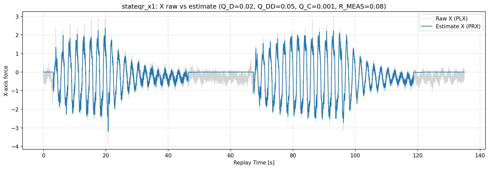
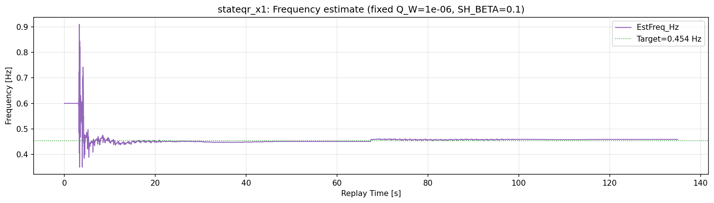
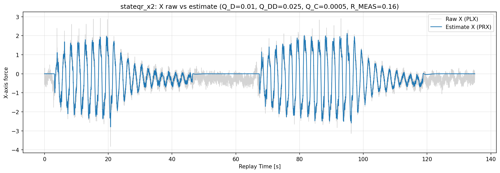
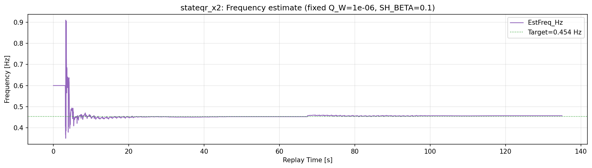
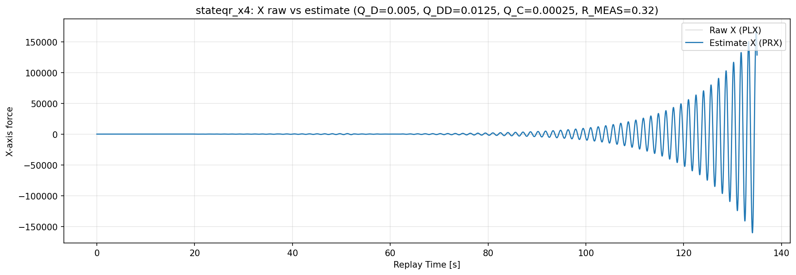
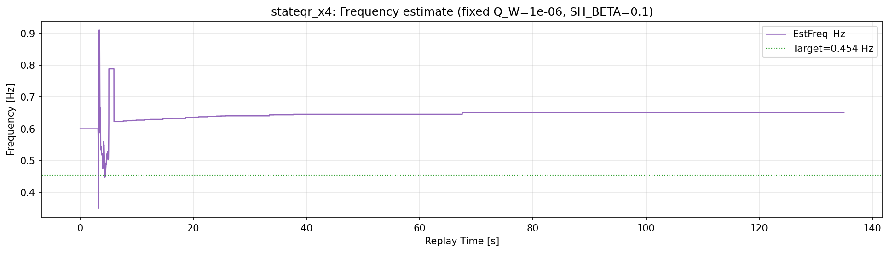
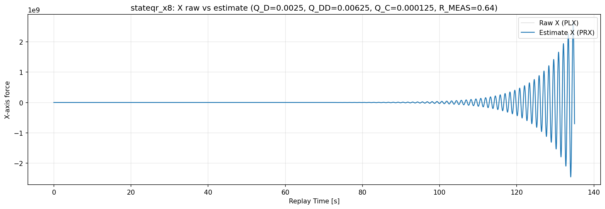
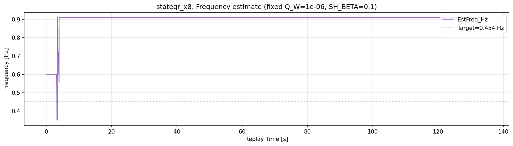

# 2026-04-16 X軸平滑化: 非周波数EKF比スイープ（連結リプレイ）

**作成日時（JST）: 2026-04-16 16:44:50**

## 決定事項

- 周波数推定パラメータは **R/Q x10 相当**を維持する。
- X軸平滑化のための非周波数EKF比は **stateqr_x2** を採用する。
- `stateqr_x4` 以上は発散するため不採用とする。

## 目的

- 周波数推定系と、それ以外の状態推定系を分離して最適化する。
- 周波数推定を固定した状態で、X軸推定 `PRX` のノイズを減らす。

## 実験条件

### 共通入力

- 連結入力CSV:
  `docs/experiments/ekf_external_force_estimation/reports/results/2026-04-16_robust_smooth_m30_concat_direct_replay/concat_input/00000443_00000444_concat_input.csv`

### 固定設定（周波数推定系）

- `EKF_Q_W=1e-6`（周波数側 R/Q x10 採用値）
- `EKF_SH_BETA=0.10`
- `SW mode=always-on`
- `robust update=ON`, `NIS reject=3.0`

### スイープ設定（非周波数EKF系）

- 基準: `Q_D=0.02`, `Q_DD=0.05`, `Q_C=0.001`, `R_MEAS=0.08`
- 係数 `k` に対し、`Q_D/Q_DD/Q_C` を `1/k`、`R_MEAS` を `k` 倍。

| case | k | Q_D | Q_DD | Q_C | R_MEAS |
|---|---:|---:|---:|---:|---:|
| stateqr_x1 | 1.0 | 0.02 | 0.05 | 0.001 | 0.08 |
| stateqr_x2 | 2.0 | 0.01 | 0.025 | 0.0005 | 0.16 |
| stateqr_x4 | 4.0 | 0.005 | 0.0125 | 0.00025 | 0.32 |
| stateqr_x8 | 8.0 | 0.0025 | 0.00625 | 0.000125 | 0.64 |

## 結果サマリ（比較表）

| case | X RMSE | X MAE | PRX std | std(diff(PRX)) | p95(|diff(PRX)|) | max(|diff(PRX)|) | EstFreq std [Hz] | EstFreq p95 step [Hz] |
|---|---:|---:|---:|---:|---:|---:|---:|---:|
| stateqr_x1 | 0.215464 | 0.152220 | 0.871771 | 0.076882 | 0.166100 | 0.366700 | 0.027857 | 0.000900 |
| stateqr_x2 | 0.233641 | 0.172753 | 0.866620 | 0.050734 | 0.112585 | 0.264900 | 0.028270 | 0.000600 |
| stateqr_x4 | 26385.621638 | 10109.001191 | 26384.600195 | 1056.235374 | 2569.338615 | 6774.962400 | 0.023350 | 0.000000 |
| stateqr_x8 | 337275401.300371 | 105128331.347307 | 337252298.396605 | 17019715.548751 | 35305147.200000 | 137656426.000000 | 0.052065 | 0.000000 |

## 採用判定

- `stateqr_x2` は `stateqr_x1` 比で `std(diff(PRX))` と `p95(|diff(PRX)|)` を低減し、平滑化効果がある。
- `stateqr_x4`, `stateqr_x8` は PRX が急拡大し、発散しているため不採用。
- よって、今後の暫定採用は以下。

### 採用設定（決定版）

1. 周波数推定系（固定）
	- `EKF_Q_W=1e-6`
	- `EKF_SH_BETA=0.10`

2. 非周波数EKF系（X軸平滑化採用）
	- `Q_D=0.01`
	- `Q_DD=0.025`
	- `Q_C=0.0005`
	- `R_MEAS=0.16`

3. 共通
	- `SW mode=always-on`
	- `EKF robust update=ON`
	- `EKF robust NIS reject=3.0`

## アルゴリズム整理（周波数推定とその他EKFの分離）

- 状態EKFは各軸で `d, d_dot, c, omega` を持つ。
- 本検証では、
  - `omega` 関連（`Q_W`, `SH_BETA`）を周波数推定系として固定
  - `d, d_dot, c` と観測雑音 `R_MEAS` を非周波数系としてスイープ
  し、寄与を分離した。

## 軸間で同じ値を使っているか？

結論:

- **使っている（同じ値）**。

理由:

1. `Q_D/Q_DD/Q_C/Q_W/R_MEAS` は `AP_Observer` の単一パラメータとして定義され、軸ごとに別パラメータを持っていない。
2. `ekf_update_axis(axis, ...)` は各軸ループで同一パラメータ値を参照して更新する構造。
3. 軸間差が出るのは主に入力信号、軸ゲート、融合重み、信頼度判定の差による。

補足:

- 周波数融合は XY を主対象としており、Z は融合対象外。

## ケース別の出力

### stateqr_x1

- 結果CSV: `docs/experiments/ekf_external_force_estimation/reports/results/2026-04-16_state_qr_sweep_concat/replay/00000443_00000444_concat_stateqr_x1_result.csv`
- X図: 
- 周波数図: 

### stateqr_x2（採用）

- 結果CSV: `docs/experiments/ekf_external_force_estimation/reports/results/2026-04-16_state_qr_sweep_concat/replay/00000443_00000444_concat_stateqr_x2_result.csv`
- X図: 
- 周波数図: 

### stateqr_x4（不採用: 発散）

- 結果CSV: `docs/experiments/ekf_external_force_estimation/reports/results/2026-04-16_state_qr_sweep_concat/replay/00000443_00000444_concat_stateqr_x4_result.csv`
- X図: 
- 周波数図: 

### stateqr_x8（不採用: 発散）

- 結果CSV: `docs/experiments/ekf_external_force_estimation/reports/results/2026-04-16_state_qr_sweep_concat/replay/00000443_00000444_concat_stateqr_x8_result.csv`
- X図: 
- 周波数図: 
