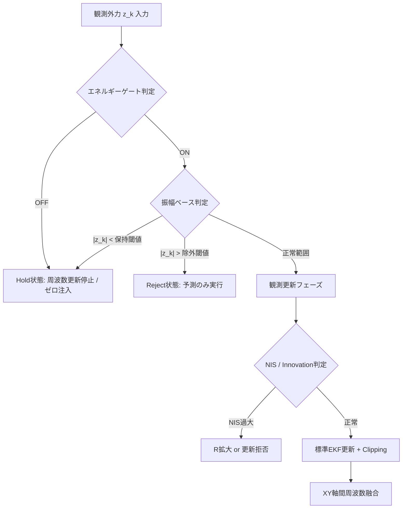
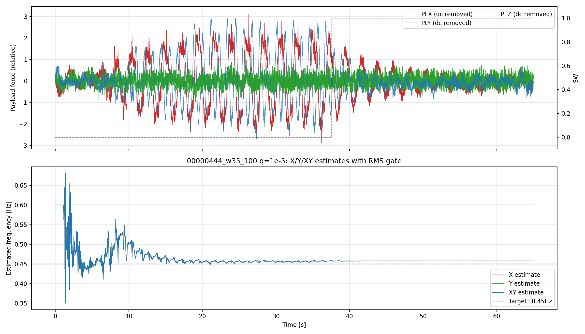

# AP_Observer: 外力推定から補正角生成までの数理アルゴリズム

最終更新: 2026-04

## 1. 目的

本書は、AP_Observer の処理をプログラム実行順に従って、数式中心で記述する。
対象は「外乱力の観測量生成」から「EKFによる状態推定」「予測外力算出」「補正角・補正クォータニオン生成」までである。
実機運用における数値発散防止（シンプレクティック積分、NaNリセット）や、特定軸の計算省略など、実装上の分岐条件・安全化処理も推定器の一部として明示する。

## 2. 記号定義

- サンプリング時刻: $k$
- サンプリング間隔: $\Delta t_k$
- 予測ホライズン: $\Delta p$
- 機体質量: $m$
- 重力加速度: $g$
- 正規化スロットル指令: $u_k$
- 推力モデル係数: $\alpha_T = 6.3157, \beta_T = -0.9995$
- 機体座標系加速度: $\mathbf{a}_k=[a_{x,k},a_{y,k},a_{z,k}]^\top$
- 観測外力: $\mathbf{z}_k=[z_{x,k},z_{y,k},z_{z,k}]^\top$
- 軸インデックス: $i\in\{x,y,z\}$

各軸EKF状態は

$$
\mathbf{x}_{i,k} =
\begin{bmatrix}
d_{i,k} \\
\dot d_{i,k} \\
c_{i,k} \\
\omega_{i,k}
\end{bmatrix},
\qquad
\mathbf{P}_{i,k}\in\mathbb{R}^{4\times 4}
$$

### 2.1 状態量の選定理由

本推定器では、ペイロードの振動外乱を「振幅変調された正弦波（周波数ω）＋低周波バイアス成分」とモデル化する。
正弦波成分は２次の調和振動子（位置d、速度d_dot）で表現し、周波数ωを別状態とすることで時変周波数への適応を可能とする。
バイアス成分cはDCオフセットやゆっくり変動する外乱を吸収するための状態である。
各軸独立にこのモデルを適用し、Z軸を実装上都合の良い理由で除外している。

この状態表現の利点は以下の通り：
- 調和振動子の線形性を活かし、シンプレクティック積分によるエネルギー保存が容易。
- ωを状態とすることで、未知かつ変動する周波数に対して追従可能。
- バイアス項cにより、外界の定常的力やセンサバイアスを自動的に補償。
- d, d_dotの二次元により振幅と位相を表現し、観測モデルがd+cと線形になる。

とする。

- $d$: 調和外乱成分
- $\dot d$: その時間微分
- $c$: 低周波/バイアス成分
- $\omega$: 角周波数

## 3. 観測外力の生成 (処理の先頭)

### 3.1 推力補償

推力はスロットル指令に対する線形近似で

$$
T_k = -\left(\alpha_T u_k + \beta_T\right)g
$$

とし、機体加速度から外力観測量を

$$
z_{x,k}=m a_{x,k},\quad
z_{y,k}=m a_{y,k},\quad
z_{z,k}=m a_{z,k}-T_k
$$

として構成する。ここで $\mathbf{z}_k$ は「推定すべき外乱力」の観測値である。なお、本実装ではフィルタ処理をバイパスし、生のペイロード力を入力として用いる。

### 3.2 Z軸の計算除外

実装上、Z軸（$i=z$）については推力変動との分離困難性および計算負荷低減（発散防止）の観点から、**EKFの更新処理を完全にスキップ**する。したがって、以降のEKF状態更新はX軸およびY軸のみに適用される。

## 4. 軸別EKFの状態方程式と観測方程式

### 4.1 非線形離散時間モデル（シンプレクティック・オイラー法）

単純な前進オイラー法では振動系において数値発散（エネルギー増大）を招くため、時間更新にはシンプレクティック・オイラー法を採用する。速度（$\dot d$）を先に更新し、その値を用いて位置（$d$）を更新する。

$$
\dot d_{k+1}=\dot d_k-\Delta t_k\omega_k^2 d_k
$$
$$
d_{k+1}=d_k+\Delta t_k\dot d_{k+1}
$$
$$
c_{k+1}=c_k,\qquad \omega_{k+1}=\omega_k
$$

観測モデルは

$$
z_k = d_k + c_k + v_k
$$

であり、観測行列は

$$
\mathbf{H}=\begin{bmatrix}1&0&1&0\end{bmatrix}
$$

となる。

### 4.2 ヤコビアン

予測点 $(d_k,\dot d_k,c_k,\omega_k)$ 周りの状態ヤコビアンは以下の通り定義する。

$$
\mathbf{F}_k=
\begin{bmatrix}
1 & \Delta t_k & 0 & 0 \\
-\Delta t_k\omega_k^2 & 1 & 0 & -2\Delta t_k\omega_k d_k \\
0 & 0 & 1 & 0 \\
0 & 0 & 0 & 1
\end{bmatrix}
$$

### 4.3 標準EKF更新とNaN防御

事前状態予測 $\mathbf{x}_{k|k-1}$ と共分散予測 $\mathbf{P}_{k|k-1}$ は標準EKF式に従う。これにプロセスノイズ $\mathbf{Q}_k$ を加算する。

$$
r_k=z_k-h(\mathbf{x}_{k|k-1}),\quad
S_k=\mathbf{H}\mathbf{P}_{k|k-1}\mathbf{H}^\top+R_k
$$

$$
\mathbf{K}_k=\mathbf{P}_{k|k-1}\mathbf{H}^\top S_k^{-1}
$$

$$
\mathbf{x}_{k|k}=\mathbf{x}_{k|k-1}+\mathbf{K}_k r_k,
\quad
\mathbf{P}_{k|k}=(\mathbf{I}-\mathbf{K}_k\mathbf{H})\mathbf{P}_{k|k-1}
$$

実装では数値安定化のため共分散対称化を行う。さらに、演算過程で非有限値（NaN/Inf）が発生した場合、**周波数 $\omega$ は直前の値を維持しつつ、他の状態 $(d, \dot d, c)$ を $0$ にリセットし、共分散行列 $\mathbf{P}$ を初期化する**堅牢性対策が組み込まれている。

## 5. ロバスト化分岐 (実装の本質)

本推定器は標準EKFをそのまま適用せず、外乱振幅・エネルギー・異常値に応じた条件分岐を直列に適用する。全体のロジックフローを以下に示す。

### 5.1 エネルギー信頼度ゲート (Energy Reliability Gate)

低SNR環境での周波数推定の「迷走」を防ぐため、特定帯域のエネルギー量に基づいたヒステリシスゲートを設けている。

- **仕組み**:
  1. 高速帯域（0.8Hz）と低速帯域（0.25Hz）の差分 $\Delta z$ の二乗和を指数移動平均（EMA）で平滑化し、推定エネルギー $P_k$ とする。
  2. ヒステリシス閾値 $(\rho_{on},\rho_{off})$ により信頼フラグを更新。
  3. ゲートが **OFF** の間は、その軸の周波数 $\omega$ の状態更新を完全に凍結する。

*図：エネルギーゲートによる信頼度判定と周波数推定の安定化。低エネルギー区間（灰色）では周波数がホールドされている。*

### 5.2 振幅ベース保持・除外・ゼロ注入 (Amplitude Gating)

観測振幅 $|z_k|$ に直接基づいた強靭化処理を行う。

1. **保持（Hold）とゼロ注入（Zero Injection）**:
   - 条件: $|z_k|\le \zeta_h$ （`EKF_FHOLD`） またはエネルギーゲートOFF時。
   - 目的: 静止状態や極低振幅時の「ノイズへの過剰反応」を抑制する。
   - 処理: 周波数更新を停止し、さらに**観測値にゼロを注入 ($z_k \leftarrow 0$)** してカルマンフィルタを更新する。これにより、外乱成分（$d, \dot d$）を速やかに $0$ へ収束させる。
2. **除外（Reject）**:
   - 条件: $|z_k|\ge \zeta_r$ （`EKF_FREJ`）。
   - 目的: センサ飽和や衝突等の異常値による推定破綻を防止する。
   - 処理: 観測更新を完全に拒否（Predict-only）。状態 $\omega$ は直前の値を維持する。

*図：各軸の振幅に応じた周波数推定のON/OFF（SW）の切り替わり。*

### 5.3 Innovation clipping と NIS判定

観測更新フェーズでは、残差（Innovation）の妥当性を評価する。

- **Innovation Clipping**: $r_k$ を最大値 $r_{max}$ で制限する。急激な外力変化に対しても状態変化を緩やかにし、オーバーシュートを抑制する。
- **NIS（Normalized Innovation Squared）に基づく適応的 $R$ 制御**:
  $$
  \nu_k = \frac{r_k^2}{S_k}
  $$
  $\nu_k$ が閾値 $\nu_{max}$ を超えた場合、観測ノイズ共分散 $R_k$ を $\nu_k/\nu_{max}$ 比率で拡大する。これにより「自信のない観測値」の反映度を自動的に下げ、推定の連続性を保つ。
- **強硬拒否**: $\nu_k$ がさらに過大な倍率（`EKF_RB_NIS`）を超えた場合は、Robust Update機能により更新自体をスキップする。

## 6. XY軸の共有周波数融合 (Shared Frequency Fusion)

各軸（X, Y）は個別にEKFを持つが、物理的に同一のペイロードから生じる振動であるため、軸間で推定周波数を共有・ブレンドすることで精度とロバスト性を高める。

### 6.1 融合重みの算出

各軸の周波数情報の「確からしさ」を以下の4要素の積で算出する：
$$
w_i = w_i^{\mathrm{nis}} \cdot w_i^{\mathrm{eng}} \cdot w_i^{\mathrm{amp}} \cdot w_i^{\mathrm{hold}}
$$
- $w^{\mathrm{nis}}$: NISが小さいほど高重み。
- $w^{\mathrm{eng}}$: エネルギーゲートONで $1.0$、OFFで極小値（`EKF_HOLD_W`）。
- $w^{\mathrm{amp}}$: 振幅が `EKF_FHOLD` を超えるまで滑らかに増加。
- $w^{\mathrm{hold}}$: 周波数更新が許可されている場合に $1.0$。

### 6.2 共有周波数の還元（Betaブレンドとハードモード）

算出された共有周波数 $\bar\omega$ は、以下のロジックで各軸にフィードバック（注入）される。

1. **通常ブレンド（Soft Blend）**:
   パラメータ $\beta$ (`EKF_SH_BETA`) を用い、低信頼な軸に対してのみ $\omega_i \leftarrow (1-\beta)\omega_i + \beta\bar\omega$ を適用する。
2. **ハードモード（Hard Mode）**:
   両軸の信頼性が非常に高く（$w_x+w_y \ge 1.8$）、かつNISが安定している場合、低信頼軸の周波数を $\bar\omega$ で直接置換する。

*図：X軸単体、Y軸単体、および共有融合後の周波数推定。融合によりノイズが低減され、安定した 0.45Hz 付近の推定が実現されている。*

## 7. 予測外力の生成

補正に使用する外力は現在値ではなく、予測ホライズン $\Delta p$ 先で評価する。Z軸に対する計算も予測式のみ適用する。

$$
d_{i, k+\Delta p} = d_{i, k} + \Delta p\,\dot d_{i, k}
$$
$$
\hat f_{i,k+\Delta p} = d_{i,k+\Delta p} + c_{i,k}
$$

したがって予測外力ベクトルは

$$
\hat{\mathbf{f}}_{k+\Delta p}=
\begin{bmatrix}
\hat f_{x,k+\Delta p}\\
\hat f_{y,k+\Delta p}\\
\hat f_{z,k+\Delta p}
\end{bmatrix}
$$

となる。

## 8. 補正角と補正クォータニオン

### 8.1 補正角の算出

予測外力ノルム $\|\hat{\mathbf{f}}\|$ が閾値 $f_{min}$ 未満なら補正はゼロとする。
それ以外では、補正ゲイン $k_c$ と機体質量 $m$ を用いてオイラー角を算出する（ヨー角は常にゼロ）。

$$
\phi = \mathrm{sat}\!\left(\frac{k_c}{m}\hat f_y,\,\phi_{max}\right),
\qquad
\theta = \mathrm{sat}\!\left(-\frac{k_c}{m}\hat f_x,\,\theta_{max}\right),
\qquad
\psi=0
$$

ここで $\mathrm{sat}(\cdot)$ は角度上限（`_max_correction_angle`）での飽和関数である。

### 8.2 クォータニオン化

得られたオイラー角 $(\phi,\theta,\psi)$ から補正クォータニオン $\mathbf{q}_c$ を生成し、正規化してフライトコントローラの姿勢制御ループへ出力する。

## 9. プログラム順アルゴリズム (要約)

1. モータースロットルと加速度センサから外力 $\mathbf{z}_k$ を構成（フィルタバイパス）。
2. 離陸判定と $\Delta t_k$ の計算。
3. Z軸をスキップし、X・Y軸に対してシンプレクティック・オイラー法でEKF予測。
4. 保持（Hold）・除外（Reject）・ゼロ注入条件を評価。
5. 許可された場合のみEKF観測更新（NaN防御機構付き）。
6. X・Y軸間で周波数融合および共有注入（Betaブレンド）。
7. $\Delta p$ 先の予測外力 $\hat{\mathbf{f}}_{k+\Delta p}$ を算出（Z軸も含む）。
8. 予測外力から補正オイラー角 $(\phi,\theta,\psi)$ と補正クォータニオン $\mathbf{q}_c$ を生成。
9. ログ出力（カスタムフォーマット `OBSV`）。

## 10. 実務上の解釈

- 本推定器は、単純な「EKF一発更新」ではなく、運用上の異常値・低励振を含む条件分岐付き非線形推定器である。
- 特に前進オイラー法による数値発散を**シンプレクティック積分**で防ぎ、Z軸計算を破棄することでリソースと安定性を確保している。
- 低SNR領域での**ゼロ注入**、NaN時の**安全リセット**など、フェールセーフを中心とした安定化機構が設計の根幹をなしている。

## 11. 参考文献 (記法と構成の基準)

1. R. E. Kalman, "A New Approach to Linear Filtering and Prediction Problems," 1960.
2. EKF標準形式に基づく記述。
3. シンプレクティック幾何学と数値積分法の応用（調和振動子のエネルギー保存）。
