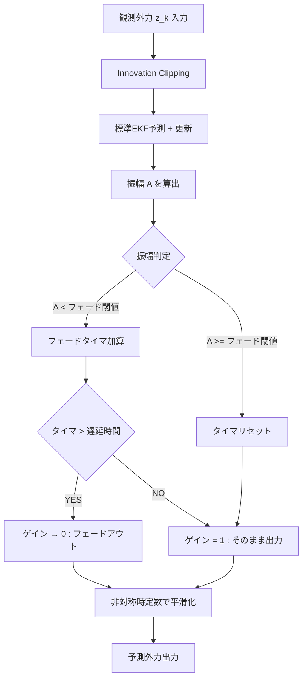

# AP_Observer: 外力推定から補正角生成までの数理アルゴリズム

最終更新: 2026-04

## 1. はじめに
本ドキュメントは、AP_Observer における「外乱力の推定」から「姿勢補正角の生成」までの数理アルゴリズムをまとめたものである。
ドローン（UAV）が荷物を吊り下げて飛行する際、荷物の揺れは機体に対して複雑な周期外乱を与える。本システムでは、この外乱を精度良く推定し、機体の傾きで補償するために**拡張カルマンフィルタ（EKF）**を採用している。

本稿では、まずカルマンフィルタの基本的な考え方を解説し、それを非線形システムへ拡張するロジック（EKF）を整理する。その上で、`AP_Observer` の実装がどのような数理的背景に基づいているかを解説する。

---

## 2. カルマンフィルタ（KF）の基礎理論

カルマンフィルタは、ノイズを含む観測データから、システムの内部状態を最適に推定するアルゴリズムである。

### 2.1 予測と更新のロジック
カルマンフィルタの核心は、**「予測（Predict）」**と**「更新（Update）」**の繰り返しにある。

1.  **予測ステップ**: 「現在の状態」と「物理法則」を用いて、次の瞬間の状態を予測する。このとき、時間の経過とともに予測の**不確かさ（誤差共分散 $P$）**は増大する。
2.  **更新ステップ**: 実際のセンサデータ（観測値 $z$）が得られたら、予測値との差（イノベーション）を計算する。**「予測の自信」と「センサの自信」を天秤にかけ（カルマンゲイン $K$）**、状態を修正する。これにより、不確かさは減少する。

### 2.2 線形カルマンフィルタの数式
システムが線形（行列の足し算・掛け算のみ）で記述できる場合、以下の式で表される。

#### ① 状態空間モデル
* **状態方程式**: $\mathbf{x}_{k} = \mathbf{F}_{k} \mathbf{x}_{k-1} + \mathbf{w}_{k-1}$
* **観測方程式**: $\mathbf{z}_{k} = \mathbf{H}_{k} \mathbf{x}_{k} + \mathbf{v}_{k}$
    * $\mathbf{F}$: 状態遷移行列、$\mathbf{H}$: 観測行列
    * $\mathbf{w} \sim \mathcal{N}(0, \mathbf{Q})$: プロセスノイズ（モデルの不確かさ）
    * $\mathbf{v} \sim \mathcal{N}(0, \mathbf{R})$: 観測ノイズ（センサの不確かさ）

#### ② 予測（Predict）
$$\hat{\mathbf{x}}_{k|k-1} = \mathbf{F}_k \hat{\mathbf{x}}_{k-1|k-1}$$
$$\mathbf{P}_{k|k-1} = \mathbf{F}_k \mathbf{P}_{k-1|k-1} \mathbf{F}_k^\top + \mathbf{Q}_k$$

#### ③ 更新（Update）
カルマンゲイン $K$ は、誤差共分散 $P$ と観測ノイズ $R$ の比率で決まる。
$$\mathbf{K}_k = \mathbf{P}_{k|k-1} \mathbf{H}_k^\top (\mathbf{H}_k \mathbf{P}_{k|k-1} \mathbf{H}_k^\top + \mathbf{R}_k)^{-1}$$
$$\hat{\mathbf{x}}_{k|k} = \hat{\mathbf{x}}_{k|k-1} + \mathbf{K}_k (\mathbf{z}_k - \mathbf{H}_k \hat{\mathbf{x}}_{k|k-1})$$
$$\mathbf{P}_{k|k} = (\mathbf{I} - \mathbf{K}_k \mathbf{H}_k) \mathbf{P}_{k|k-1}$$

---

## 3. 拡張カルマンフィルタ（EKF）への拡張

現実の物理現象は非線形であることが多い。状態方程式が $\mathbf{x}_{k+1} = f(\mathbf{x}_k)$ という非線形関数の場合、そのままでは行列演算（$\mathbf{F} \mathbf{P} \mathbf{F}^\top$）ができない。

### 3.1 局所線形化とヤコビアン
EKFでは、現在の推定値 $\hat{\mathbf{x}}$ の周りで関数を微分（1次テイラー展開）し、その瞬間の「傾き」で直線を引くことで近似する。
$$f(\mathbf{x}) \approx f(\hat{\mathbf{x}}) + \underbrace{\frac{\partial f}{\partial \mathbf{x}}\bigg|_{\hat{\mathbf{x}}}}_{\mathbf{F}_k} (\mathbf{x} - \hat{\mathbf{x}})$$
この偏微分行列 $\mathbf{F}_k$ を**ヤコビアン（ヤコビ行列）**と呼ぶ。

### 3.2 EKFの計算分担
* **状態の予測**: 正確さを期すため、**非線形な式 $f$ をそのまま計算**する。
* **誤差の伝播（$P$ の更新）**: 行列計算が必要なため、**ヤコビアン $\mathbf{F}_k$ を使って計算**する。

---

## 4. AP_Observer の状態モデル定義

### 4.1 状態ベクトル $\mathbf{x}$
外乱を「周期的な振動」＋「ゆっくり変わるオフセット」と捉え、以下の4状態を定義する。
$$\mathbf{x}_{k} = [d_k, \dot{d}_k, c_k, \omega_k]^\top$$

1.  **$d$ (振動位置)**: 外力の振動成分。仮想的なバネマス系の変位。
2.  **$\dot{d}$ (振動速度)**: $d$ の時間微分。
3.  **$c$ (DCバイアス)**: 重心ズレや定常風による一定方向の外力。
4.  **$\omega$ (角周波数)**: 振り子振動の速さ。時変パラメータとして推定する。

### 4.2 物理的イメージ
外力 $z$ は、振動成分 $d$ とバイアス $c$ の足し算として観測される。
$$z_k = d_k + c_k + \text{noise}$$
これに基づき、観測行列は $\mathbf{H} = [1, 0, 1, 0]$ となる。

---

## 5. 予測ステップ（実装詳細）

### 5.1 調和振動子モデルの導出

状態 $d_k$ は外力の振動成分を表し、その波形は正弦波 $d(t) = A\sin(\omega t + \phi)$ で近似できる。このとき、

$$
\dot d(t) = A\omega\cos(\omega t + \phi), \quad
\ddot d(t) = -A\omega^2\sin(\omega t + \phi) = -\omega^2 d(t)
$$

より、以下の2階線形微分方程式が得られる。

$$
\ddot d = -\omega^2 d
$$

すなわち、外力の振動成分は角周波数 $\omega$ の単振動としてモデル化される。

### 5.2 シンプレクティック・オイラー法の採用

上記の単振動 $\ddot{d} = -\omega^2 d$ を単純な離散化（前進オイラー法）で解くと、数値的にエネルギーが増大し発散する。本実装ではエネルギー保存特性に優れた**シンプレクティック・オイラー法**を採用している。
$$\dot d_{k+1} = \dot d_k - \Delta t_k \omega_k^2 d_k$$
$$d_{k+1} = d_k + \Delta t_k \dot d_{k+1}$$

### 5.3 状態遷移関数 $f(\mathbf{x}_k)$
速度更新を位置更新に代入して整理すると、以下の非線形状態遷移関数が得られる。
$$\mathbf{x}_{k+1} = f(\mathbf{x}_k) = \begin{bmatrix}
d_k + \Delta t_k(\dot d_k - \Delta t_k \omega_k^2 d_k) \\
\dot d_k - \Delta t_k \omega_k^2 d_k \\
c_k \\
\omega_k
\end{bmatrix}$$

### 5.4 ヤコビアン $\mathbf{F}_k$ の導出
上記 $f$ を各状態で偏微分すると、ヤコビアンは以下となる。
$$\mathbf{F}_k^{\text{exact}} = \begin{bmatrix}
1 - \Delta t_k^2\omega_k^2 & \Delta t_k & 0 & -2\Delta t_k^2\omega_k d_k \\
-\Delta t_k\omega_k^2 & 1 & 0 & -2\Delta t_k\omega_k d_k \\
0 & 0 & 1 & 0 \\
0 & 0 & 0 & 1
\end{bmatrix}$$
実装では $\Delta t_k$ が十分に小さいことから、2次項を無視した簡略化ヤコビアンを採用し、計算負荷を抑制している。

---

## 5. ロバスト化機構 (実装の本質)

本推定器は標準EKFをそのまま適用せず、予測値との乖離（Innovation）のクリッピングと、推定振幅に基づく出力フェード処理によって堅牢性を確保している。全体のロジックフローを以下に示す。

本機構は以下の2つの要素からなる。

1. **Innovation Clipping**: 観測残差 $r_k$ をパラメータ `EKF_INN_MAX` で制限し、急峻な外乱に対する過剰反応を抑制する。
2. **出力フェード**: 推定振幅 $A = \sqrt{d^2 + (\dot d/\omega)^2}$ を監視し、振幅が閾値 `FADE_TH` を下回る状態が遅延時間 `FADE_DLY` を超えて継続した場合、出力ゲインを 0 へ漸近させる。ゲインは非対称の時定数（フェードイン: `FADE_IN_T`, フェードアウト: `FADE_OUT_T`）で指数平滑されるため、外乱復帰時は速やかに、消失時は緩やかに出力が変動する。

この2段構成により、スパイクノイズと低SNR環境の両方に対する安定性を簡潔な構造で実現している。

### 5.1 Innovation Clipping

観測更新時に計算されるイノベーション $r_k = z_k - \hat z_k$ に対し、設定値 `EKF_INN_MAX` ($r_{max}$) による飽和処理を施す。

$$
r_k^{\text{used}} = \mathrm{clamp}(r_k,\; -r_{max},\; r_{max})
$$

クリッピングされたイノベーションがカルマンゲイン $K$ を通じて状態修正量 $\Delta x = K \cdot r_k^{\text{used}}$ に変換されるため、単発的な外れ値による状態の跳躍を防ぐ。

### 5.2 出力フェード機構

推定された状態から振幅 $A$ を算出し、この振幅に基づいて出力ゲイン $\gamma \in [0, 1]$ を制御する。

#### 振幅の算出

状態 $d$（振動位置）と $\dot d$（振動速度）から、調和振動子の振幅を以下の式で求める。

$$
A = \sqrt{d^2 + \left(\frac{\dot d}{\omega}\right)^2}
$$

これは正弦波 $d(t) = A\sin(\omega t + \phi)$ とその微分 $\dot d(t) = A\omega\cos(\omega t + \phi)$ から導かれる関係 $A^2 = d^2 + (\dot d/\omega)^2$ に基づく。

#### フェード判定とゲイン制御

1. **振幅監視とタイマ**: $A <$ `FADE_TH` の間、フェードタイマ $T_f$ が加算される。$A \ge$ `FADE_TH` でタイマはリセット。
2. **目標ゲイン**: $T_f >$ `FADE_DLY` で目標ゲイン $g_t = 0$（フェードアウト）、それ以外は $g_t = 1$（通常出力）。
3. **非対称平滑化**: 実ゲイン $\gamma$ は目標ゲイン $g_t$ に向けて一次遅れで追従する。

$$
\gamma \leftarrow \gamma + \alpha \cdot (g_t - \gamma), \quad \alpha = \frac{\Delta t}{\Delta t + \tau}
$$

時定数 $\tau$ は方向によって異なる値を用いる。
- **フェードイン** ($g_t > \gamma$): $\tau =$ `FADE_IN_T`（通常 0.1 s、高速復帰）
- **フェードアウト** ($g_t < \gamma$): $\tau =$ `FADE_OUT_T`（通常 1.0 s、緩慢減衰）

この非対称設計により、外乱の再出現には即応しつつ、一時的な振幅低下によるチャタリングを防止する。

## 6. 予測外力の生成

補正に使用する外力は現在値ではなく、予測ホライズン $\Delta p$ 先で評価する。Z軸に対する計算も予測式のみ適用する。

$$
d_{i, k+\Delta p} = d_{i, k} + \Delta p\,\dot d_{i, k}
$$
$$
\hat f_{i,k+\Delta p} = d_{i,k+\Delta p} + c_{i,k}
$$

したがって予測外力ベクトルは

$$
\hat{\mathbf{f}}_{k+\Delta p}=
\begin{bmatrix}
\hat f_{x,k+\Delta p}\\
\hat f_{y,k+\Delta p}\\
\hat f_{z,k+\Delta p}
\end{bmatrix}
$$

となる。

## 7. 補正角と補正クォータニオン

### 7.1 補正角の算出

予測外力ノルム $\|\hat{\mathbf{f}}\|$ が閾値 $f_{min}$ 未満なら補正はゼロとする。
それ以外では、補正ゲイン $k_c$ と機体質量 $m$ を用いてオイラー角を算出する（ヨー角は常にゼロ）。

$$
\phi = \mathrm{sat}\!\left(\frac{k_c}{m}\hat f_y,\,\phi_{max}\right),
\qquad
\theta = \mathrm{sat}\!\left(-\frac{k_c}{m}\hat f_x,\,\theta_{max}\right),
\qquad
\psi=0
$$

ここで $\mathrm{sat}(\cdot)$ は角度上限（`_max_correction_angle`）での飽和関数である。

### 7.2 クォータニオン化

得られたオイラー角 $(\phi,\theta,\psi)$ から補正クォータニオン $\mathbf{q}_c$ を生成し、正規化してフライトコントローラの姿勢制御ループへ出力する。

## 8. プログラム順アルゴリズム (要約)

1. モータースロットルと加速度センサから外力 $\mathbf{z}_k$ を構成（フィルタバイパス）。
2. 離陸判定と $\Delta t_k$ の計算。
3. Z軸をスキップし、X・Y軸に対してシンプレクティック・オイラー法でEKF予測。
4. イノベーションクリッピング後、EKF観測更新を実行（NaN防御機構付き）。
5. 推定振幅 $A$ を算出し、出力フェード機構でゲイン $\gamma$ を制御。
6. $\gamma$ を乗じた状態から $\Delta p$ 先の予測外力 $\hat{\mathbf{f}}_{k+\Delta p}$ を算出（Z軸も含む）。
7. 予測外力から補正オイラー角 $(\phi,\theta,\psi)$ と補正クォータニオン $\mathbf{q}_c$ を生成。
8. ログ出力（カスタムフォーマット `OBSV`）。

## 9. 実務上の解釈

- 本推定器は、単純な「EKF一発更新」ではなく、運用上の異常値・低励振を含む条件分岐付き非線形推定器である。
- 特に前進オイラー法による数値発散を**シンプレクティック積分**で防ぎ、Z軸計算を破棄することでリソースと安定性を確保している。
- 低SNR領域での**出力フェード**、NaN時の**安全リセット**など、フェールセーフを中心とした安定化機構が設計の根幹をなしている。

## 10. 参考文献 (記法と構成の基準)

1. R. E. Kalman, "A New Approach to Linear Filtering and Prediction Problems," 1960.
2. EKF標準形式に基づく記述。
3. シンプレクティック幾何学と数値積分法の応用（調和振動子のエネルギー保存）。
