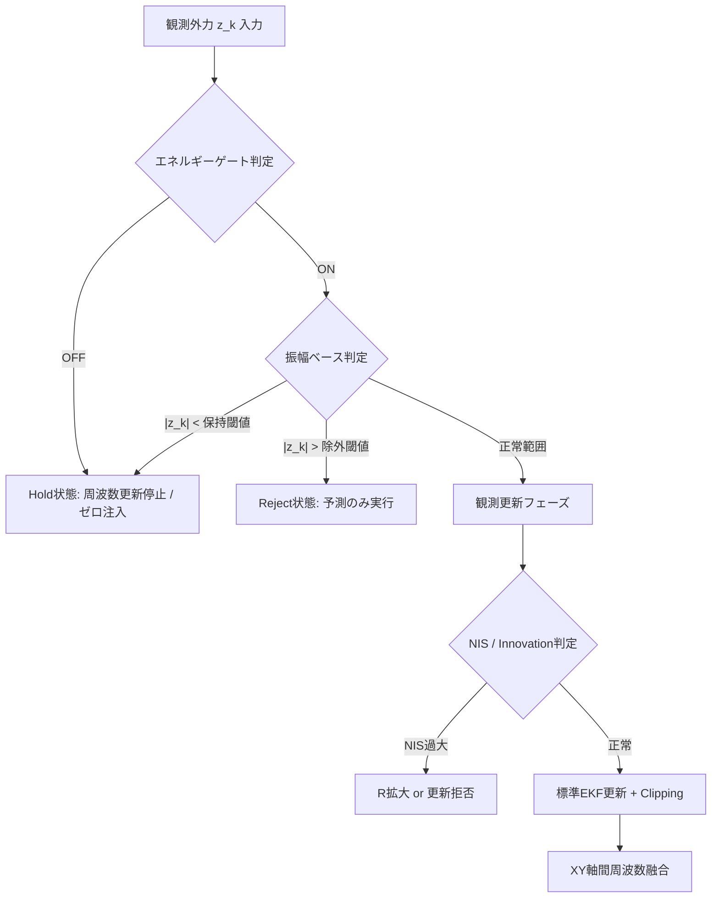
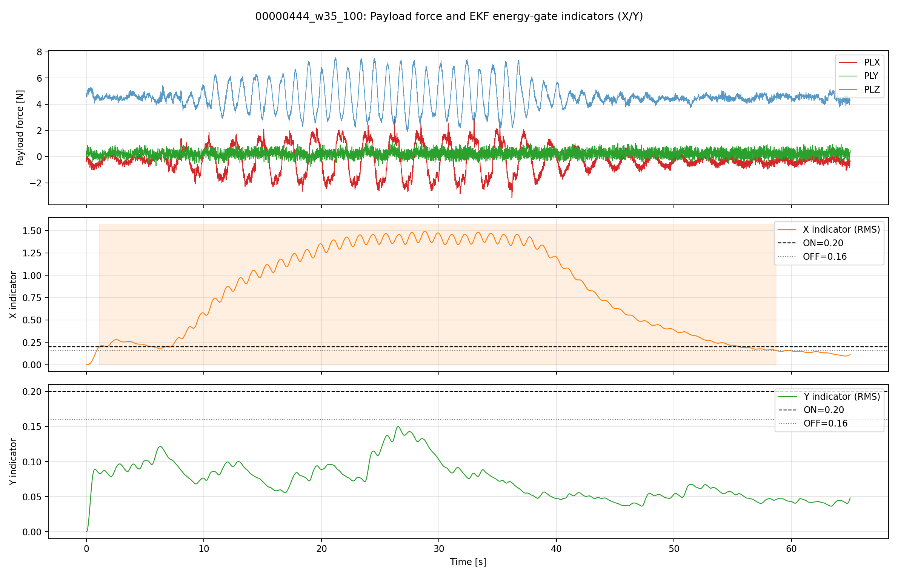

# AP_Observer: 外力推定から補正角生成までの数理アルゴリズム

最終更新: 2026-04

## 0. カルマンフィルタ（KF）の概要

本ドキュメントで用いる拡張カルマンフィルタ（EKF）を理解するために、まず線形カルマンフィルタの基本を説明する。  
カルマンフィルタは、**予測モデル**と**観測**を逐次的に組み合わせて、ノイズの影響を抑えながらシステムの内部状態を推定する手法である。

### 0.1 状態空間モデル

システムは以下の２式で記述される。

**状態方程式**（システムの時間発展を表す）：

$$
\mathbf{x}_k = \mathbf{F}_k \mathbf{x}_{k-1} + \mathbf{B}_k \mathbf{u}_k + \mathbf{w}_k, \quad \mathbf{w}_k \sim \mathcal{N}(\mathbf{0}, \mathbf{Q}_k)
$$

**観測方程式**（状態から観測値への写像）：

$$
\mathbf{z}_k = \mathbf{H}_k \mathbf{x}_k + \mathbf{v}_k, \quad \mathbf{v}_k \sim \mathcal{N}(\mathbf{0}, \mathbf{R}_k)
$$

各記号の意味：

- $\mathbf{x}_k$ : 時刻 $k$ における**状態ベクトル**（例：位置・速度・バイアスなど）
- $\mathbf{F}_k$ : **状態遷移行列**（前時刻の状態から現在の状態を予測する線形写像）
- $\mathbf{B}_k$ : **制御入力行列**（制御入力 $\mathbf{u}_k$ の状態への影響を表す）
- $\mathbf{u}_k$ : **制御入力**（既知の操作量）
- $\mathbf{w}_k$ : **プロセスノイズ**（モデル化誤差や外乱、平均ゼロ・共分散 $\mathbf{Q}_k$ のガウス分布に従うと仮定）
- $\mathbf{z}_k$ : **観測値ベクトル**（センサなどで得られる測定値）
- $\mathbf{H}_k$ : **観測行列**（状態から観測空間への線形写像）
- $\mathbf{v}_k$ : **観測ノイズ**（センサノイズ、平均ゼロ・共分散 $\mathbf{R}_k$ のガウス分布）

ここで「$ \sim \mathcal{N}(\mathbf{0}, \mathbf{Q}_k)$」は「平均がゼロベクトル、共分散行列が $\mathbf{Q}_k$ の多変量正規分布に従う」ことを意味する。

### 0.2 予測ステップ（Time Update）

**Predict（予測）**：前の時刻の推定値を使って、現在の状態を「とりあえず」予測する。

$$
\hat{\mathbf{x}}_{k|k-1} = \mathbf{F}_k \hat{\mathbf{x}}_{k-1|k-1} + \mathbf{B}_k \mathbf{u}_k
$$
$$
\mathbf{P}_{k|k-1} = \mathbf{F}_k \mathbf{P}_{k-1|k-1} \mathbf{F}_k^\top + \mathbf{Q}_k
$$

記号の意味：

- $\hat{\mathbf{x}}_{k|k-1}$ : 時刻 $k$ における**事前状態推定値**（まだ観測を使っていない）
- $\mathbf{P}_{k|k-1}$ : **事前共分散行列**（推定の不確かさを表す）
- $\mathbf{Q}_k$ : **プロセスノイズ共分散行列**（予測モデルの不確かさ）

### 0.3 観測更新ステップ（Measurement Update）

**Update（更新）**：実際の観測値を使って予測を修正する。

まず、**カルマンゲイン** $\mathbf{K}_k$ を計算する。これは「予測と観測のどちらをどれだけ信頼するか」の重みを表す。

$$
\mathbf{K}_k = \mathbf{P}_{k|k-1} \mathbf{H}_k^\top (\mathbf{H}_k \mathbf{P}_{k|k-1} \mathbf{H}_k^\top + \mathbf{R}_k)^{-1}
$$

次に、観測値 $\mathbf{z}_k$ を使って状態を補正する。

$$
\hat{\mathbf{x}}_{k|k} = \hat{\mathbf{x}}_{k|k-1} + \mathbf{K}_k (\mathbf{z}_k - \mathbf{H}_k \hat{\mathbf{x}}_{k|k-1})
$$

最後に、共分散も更新する。

$$
\mathbf{P}_{k|k} = (\mathbf{I} - \mathbf{K}_k \mathbf{H}_k) \mathbf{P}_{k|k-1}
$$

記号の意味：

- $\mathbf{K}_k$ : **カルマンゲイン行列**（予測と観測の混合比率）
- $(\mathbf{z}_k - \mathbf{H}_k \hat{\mathbf{x}}_{k|k-1})$ : **イノベーション**（「予測と実際の差」＝新しい情報）
- $\hat{\mathbf{x}}_{k|k}$ : **事後状態推定値**（観測で修正後の状態）
- $\mathbf{P}_{k|k}$ : **事後共分散行列**（更新後の不確かさ）

### 0.4 拡張カルマンフィルタ（EKF）

現実のシステムは多くの場合、**非線形**である。非線形システム $f(\cdot)$ および $h(\cdot)$ に対しては、**ヤコビアン**（偏微分行列）を使って線形近似を行う。

$$
\mathbf{F}_k = \frac{\partial f}{\partial \mathbf{x}}\bigg|_{\hat{\mathbf{x}}_{k-1|k-1}}, \quad
\mathbf{H}_k = \frac{\partial h}{\partial \mathbf{x}}\bigg|_{\hat{\mathbf{x}}_{k|k-1}}
$$

これらを上記の線形カルマンフィルタの式にそのまま代入することで、非線形状態推定を実現する。本推定器ではシンプレクティック積分を用いた非線形状態方程式と線形観測モデルを持つEKFを実装している。

## 1. 目的

本書は、AP_Observer の処理をプログラム実行順に従って、数式中心で記述する。
対象は「外乱力の観測量生成」から「EKFによる状態推定」「予測外力算出」「補正角・補正クォータニオン生成」までである。
実機運用における数値発散防止（シンプレクティック積分、NaNリセット）や、特定軸の計算省略など、実装上の分岐条件・安全化処理も推定器の一部として明示する。

## 2. 記号定義

- サンプリング時刻: $k$
- サンプリング間隔: $\Delta t_k$
- 予測ホライズン: $\Delta p$
- 機体質量: $m$
- 重力加速度: $g$
- 正規化スロットル指令: $u_k$
- 推力モデル係数: $\alpha_T = 6.3157, \beta_T = -0.9995$
- 機体座標系加速度: $\mathbf{a}_k=[a_{x,k},a_{y,k},a_{z,k}]^\top$
- 観測外力: $\mathbf{z}_k=[z_{x,k},z_{y,k},z_{z,k}]^\top$
- 軸インデックス: $i\in\{x,y,z\}$

各軸EKF状態は

$$
\mathbf{x}_{i,k} =
\begin{bmatrix}
d_{i,k} \\
\dot d_{i,k} \\
c_{i,k} \\
\omega_{i,k}
\end{bmatrix},
\qquad
\mathbf{P}_{i,k}\in\mathbb{R}^{4\times 4}
$$

### 2.1 状態量の選定理由

本推定器では、ペイロードの振動外乱を「振幅変調された正弦波（周波数ω）＋低周波バイアス成分」とモデル化する。
正弦波成分は２次の調和振動子（位置d、速度d_dot）で表現し、周波数ωを別状態とすることで時変周波数への適応を可能とする。
バイアス成分cはDCオフセットやゆっくり変動する外乱を吸収するための状態である。
各軸独立にこのモデルを適用し、Z軸を実装上都合の良い理由で除外している。

この状態表現の利点は以下の通り：
- 調和振動子の線形性を活かし、シンプレクティック積分によるエネルギー保存が容易。
- ωを状態とすることで、未知かつ変動する周波数に対して追従可能。
- バイアス項cにより、外界の定常的力やセンサバイアスを自動的に補償。
- d, d_dotの二次元により振幅と位相を表現し、観測モデルがd+cと線形になる。

### 2.2 なぜこの形になるのか？（初学者向け直感）

本節では、上記の状態モデルが「なぜそうなるのか」を直感的に説明する。

#### 2.2.1 「外力 = 正弦波 + DCバイアス」とモデル化する理由

本実装の AP_Observer が対象とするのは、**ドローンがワイヤーで吊り下げた荷物の振り子運動**に起因する周期外乱である。
吊り下げ荷物が振り子のように振動すると、その張力変動が機体に周期的な外力として現れるため、その波形は近似的に**正弦波**で表現できる。

- 正弦波の周波数 ω は振り子の固有角周波数 $\sqrt{g/L}$ 付近の値となる（L：ワイヤー長）。
- 正弦波の振幅 A は荷物の振れ幅に相当する。
- DCバイアス c は、機体の重心ずれ・トリム誤差・定常風などによる**時間的にゆっくり変化する力**を吸収するための状態である。

したがって、各軸の外力は以下の形で近似できる：

$$
\text{外力}(t) \approx \underbrace{A \sin(\omega t + \phi)}_{\text{振動成分}} + \underbrace{c}_{\text{DCバイアス}}
$$

#### 2.2.2 「なぜ d（位置）と d_dot（速度）で外力を表すのか？」

正弦波 $A\sin(\omega t + \phi)$ は、以下の**2階線形微分方程式**を満たす：

$$
\frac{d^2}{dt^2}\big(A\sin(\omega t + \phi)\big) = -\omega^2 \cdot A\sin(\omega t + \phi)
$$

つまり「2回微分すると元の関数に $-\omega^2$ がかかる」という性質を持つ。
この2階微分方程式をEKFで扱うには、**2つの状態変数**が必要になる：

- $d$（位置に相当）：正弦波の現在値 $A\sin(\omega t + \phi)$ を表す
- $\dot d$（速度に相当）：正弦波の時間微分 $A\omega\cos(\omega t + \phi)$ を表す

**重要な発想の転換**：ここで $d$ は「実際の物理的な位置」ではなく、
**「外力の振動成分を、あたかもバネにつながった質量の位置であるかのようにモデル化したもの」** である。
つまり、外力の振動を「仮想的なバネマス系の運動」に置き換えて推定している。

$$
\text{外力の振動成分 } d(t) \quad\longleftrightarrow\quad \text{バネマス系の位置}
$$

このように考えると、状態方程式が単振動の形になる理由が理解できる：

$$
\ddot d = -\omega^2 d
$$

これは「外力の振動成分は、角周波数 ω の単振動をする」というモデルである。

#### 2.2.3 「なぜ観測が d + c なのか？」

観測される外力 $\mathbf{z}$ は、加速度センサと推力モデルから計算される「今この瞬間の外力」である。
これはモデル上、

$$
\mathbf{z} = \underbrace{d}_{\text{振動成分}} + \underbrace{c}_{\text{DCバイアス}} + \underbrace{v}_{\text{センサノイズ}}
$$

と書ける。振動成分とDCバイアスは**足し算で重なる**ため、観測モデルは線形になる。
したがって観測行列は

$$
\mathbf{H} = \begin{bmatrix}1 & 0 & 1 & 0\end{bmatrix}
$$

となり、「状態 $d$ と状態 $c$ を取り出して足す」という単純な操作になる。
これが「線形っぽい式」の正体である。

#### 2.2.4 状態量の役割まとめ

| 状態 | 記号 | 物理的イメージ | 役割 |
|------|------|----------------|------|
| 振動位置 | $d$ | 正弦波の現在値 | 外力の振動成分の瞬時値 |
| 振動速度 | $\dot d$ | 正弦波の時間微分 | 次の瞬間の $d$ を決める |
| DCバイアス | $c$ | ゆっくり変わるオフセット | 定常外力・センサバイアス |
| 角周波数 | $\omega$ | 振動の速さ | 振動数の変動に追従 |

この4状態により、「振幅・位相・周波数・DCオフセットがすべて未知の正弦波状外力」を逐次推定できる。

## 3. 観測外力の生成 (処理の先頭)

### 3.1 推力補償

推力はスロットル指令に対する線形近似で

$$
T_k = -\left(\alpha_T u_k + \beta_T\right)g
$$

とし、機体加速度から外力観測量を

$$
z_{x,k}=m a_{x,k},\quad
z_{y,k}=m a_{y,k},\quad
z_{z,k}=m a_{z,k}-T_k
$$

として構成する。ここで $\mathbf{z}_k$ は「推定すべき外乱力」の観測値である。なお、本実装ではフィルタ処理をバイパスし、生のペイロード力を入力として用いる。

### 3.2 Z軸の計算除外

実装上、Z軸（$i=z$）については推力変動との分離困難性および計算負荷低減（発散防止）の観点から、**EKFの更新処理を完全にスキップ**する。したがって、以降のEKF状態更新はX軸およびY軸のみに適用される。

## 4. 軸別EKFの状態方程式と観測方程式

### 4.1 非線形離散時間モデル（シンプレクティック・オイラー法）

単純な前進オイラー法では振動系において数値発散（エネルギー増大）を招くため、時間更新にはシンプレクティック・オイラー法を採用する。速度（$\dot d$）を先に更新し、その値を用いて位置（$d$）を更新する。

#### 4.1.1 この式はどこから来るのか？（初学者向け導出）

**Step 1: 連続時間の微分方程式**

2.2.2節で説明した通り、外力の振動成分 $d(t)$ は調和振動子の方程式に従う：

$$
\ddot d(t) = -\omega^2 d(t)
$$

これは「$d(t)$ を2回微分すると、元の関数に $-\omega^2$ がかかったものになる」という意味で、正弦波 $A\sin(\omega t + \phi)$ が満たす性質そのものである。

**Step 2: 1階連立微分方程式に分解**

2階微分方程式を、2つの1階微分方程式に分解する：

$$
\begin{cases}
\displaystyle \frac{d}{dt}\dot d(t) = -\omega^2 d(t) \quad\cdots\text{「速度の変化率 = $-\omega^2 \times$ 現在位置」}\\[8pt]
\displaystyle \frac{d}{dt}d(t) = \dot d(t) \qquad\;\;\,\cdots\text{「位置の変化率 = 現在速度」}
\end{cases}
$$

**Step 3: 前進オイラー法で離散化**

微分を「差分」で近似する（$\frac{df}{dt} \approx \frac{f_{k+1} - f_k}{\Delta t_k}$）：

$$
\begin{cases}
\displaystyle \frac{\dot d_{k+1} - \dot d_k}{\Delta t_k} = -\omega_k^2 d_k \\[10pt]
\displaystyle \frac{d_{k+1} - d_k}{\Delta t_k} = \dot d_k
\end{cases}
$$

両辺に $\Delta t_k$ をかけて整理すると：

$$
\begin{cases}
\dot d_{k+1} = \dot d_k - \Delta t_k \cdot \omega_k^2 d_k \\[3pt]
d_{k+1} = d_k + \Delta t_k \cdot \dot d_k
\end{cases}
$$

これが「素朴な前進オイラー法」による離散化である。

**Step 4: シンプレクティック・オイラー法への修正**

上の素朴な前進オイラー法には、**時間が経つごとに系の全エネルギー $\frac{1}{2}\dot d^2 + \frac{1}{2}\omega^2 d^2$ が増大し、数値的に発散する**という問題がある。

そこで、速度 $\dot d$ を先に更新し、**更新後の速度を使って位置 $d$ を更新する** シンプレクティック・オイラー法を用いる：

$$
\boxed{\dot d_{k+1} = \dot d_k - \Delta t_k \, \omega_k^2 d_k}
$$

$$
\boxed{d_{k+1} = d_k + \Delta t_k \, \dot d_{k+1}} \quad (\leftarrow \text{新しい速度を使う！})
$$

これによりエネルギーが保存され、長期間のシミュレーションでも発散を防げる。これがシンプレクティック積分の利点である。

DCバイアス $c$ と角周波数 $\omega$ は「時間変化しない」と仮定するため、その更新は単に：

$$
c_{k+1} = c_k, \qquad \omega_{k+1} = \omega_k
$$

となる。

観測モデルは

$$
z_k = d_k + c_k + v_k
$$

であり、観測行列は

$$
\mathbf{H}=\begin{bmatrix}1&0&1&0\end{bmatrix}
$$

となる。

### 4.2 ヤコビアン

予測点 $(d_k,\dot d_k,c_k,\omega_k)$ 周りの状態ヤコビアンは以下の通り定義する。

$$
\mathbf{F}_k=
\begin{bmatrix}
1 & \Delta t_k & 0 & 0 \\
-\Delta t_k\omega_k^2 & 1 & 0 & -2\Delta t_k\omega_k d_k \\
0 & 0 & 1 & 0 \\
0 & 0 & 0 & 1
\end{bmatrix}
$$

### 4.3 標準EKF更新とNaN防御

事前状態予測 $\mathbf{x}_{k|k-1}$ と共分散予測 $\mathbf{P}_{k|k-1}$ は標準EKF式に従う。これにプロセスノイズ $\mathbf{Q}_k$ を加算する。

$$
r_k=z_k-h(\mathbf{x}_{k|k-1}),\quad
S_k=\mathbf{H}\mathbf{P}_{k|k-1}\mathbf{H}^\top+R_k
$$

$$
\mathbf{K}_k=\mathbf{P}_{k|k-1}\mathbf{H}^\top S_k^{-1}
$$

$$
\mathbf{x}_{k|k}=\mathbf{x}_{k|k-1}+\mathbf{K}_k r_k,
\quad
\mathbf{P}_{k|k}=(\mathbf{I}-\mathbf{K}_k\mathbf{H})\mathbf{P}_{k|k-1}
$$

実装では数値安定化のため共分散対称化を行う。さらに、演算過程で非有限値（NaN/Inf）が発生した場合、**周波数 $\omega$ は直前の値を維持しつつ、他の状態 $(d, \dot d, c)$ を $0$ にリセットし、共分散行列 $\mathbf{P}$ を初期化する**堅牢性対策が組み込まれている。

## 5. ロバスト化分岐 (実装の本質)

本推定器は標準EKFをそのまま適用せず、外乱振幅・エネルギー・異常値に応じた条件分岐を直列に適用する。全体のロジックフローを以下に示す。

これらの3つのゲートは、評価するドメイン（時間スケール・物理量・統計）と条件不成立時の挙動が異なる。
- **エネルギーゲート**：長期的な信号パワーを評価し、サイン波のゼロクロス時のチャタリングを防止する。ゲートOFF時は ω 更新を停止し、観測をゼロ注入する。
- **振幅ベースゲート**：瞬間の物理量の絶対値を閾値判定する。低振幅時は ω 更新停止＋ゼロ注入、高振幅（飽和・衝突）時は観測更新を完全拒否（Predict-only）する。
- **NIS判定**：統計的な予測との乖離（マハラノビス距離）を評価する。中程度の乖離では観測ノイズ R を適応的に拡大し、過大な乖離では観測更新を完全拒否する。

このように、時間的・物理的・統計的の3つの異なるフィルターを直列に施すことで、実機の過酷な環境下でも推定器の堅牢性を確保している。

### 5.1 エネルギー信頼度ゲート (Energy Reliability Gate)

低SNR環境での周波数推定の「迷走」を防ぐため、特定帯域のエネルギー量に基づいたヒステリシスゲートを設けている。

- **仕組み**:
  1. 高速帯域（0.8Hz）と低速帯域（0.25Hz）の差分 $\Delta z$ の二乗和を指数移動平均（EMA）で平滑化し、推定エネルギー $P_k$ とする。
  2. ヒステリシス閾値 $(\rho_{on},\rho_{off})$ により信頼フラグを更新。
  3. ゲートが **OFF** の間は、その軸の周波数 $\omega$ の状態更新を完全に凍結する。

*図：エネルギーゲートによる信頼度判定と周波数推定の安定化。低エネルギー区間（灰色）では周波数がホールドされている。*

**役割**: エネルギーゲートは、外乱が正弦波的な振動である場合に必ず現れる「ゼロクロス（振幅が瞬間的に0になる）」のタイミングでEKFがチャタリングするのを防ぐ。短時間の電力変動に惑わされず、数秒間の包絡線（指数的移動平均）を用いて「本当に振動が収まったか」を判断する。ゲートOFF時にはωの更新を凍結し、観測値を0に強制することで、ホワイトノイズに状態が引きずられるのを防ぐ。

### 5.2 振幅ベース保持・除外・ゼロ注入 (Amplitude Gating)

観測振幅 $|z_k|$ に直接基づいた強靭化処理を行う。

1. **保持（Hold）とゼロ注入（Zero Injection）**:
   - 条件: $|z_k|\le \zeta_h$ （`EKF_FHOLD`） またはエネルギーゲートOFF時。
   - 目的: 静止状態や極低振幅時の「ノイズへの過剰反応」を抑制する。
   - 処理: 周波数更新を停止し、さらに**観測値にゼロを注入 ($z_k \leftarrow 0$)** してカルマンフィルタを更新する。これにより、外乱成分（$d, \dot d$）を速やかに $0$ へ収束させる。
2. **除外（Reject）**:
   - 条件: $|z_k|\ge \zeta_r$ （`EKF_FREJ`）。
   - 目的: センサ飽和や衝突等の異常値による推定破綻を防止する。
   - 処理: 観測更新を完全に拒否（Predict-only）。状態 $\omega$ は直前の値を維持する。

*図：各軸の振幅に応じた周波数推定のON/OFF（SW）の切り替わり。*

**役割**: 振幅ベースゲートは、瞬間的な物理量の絶対値に基づく閾値判定である。
- **下限 (`force_hold_max`)**: 機体の微振動（モーター振動など）をノイズフロアとして除外し、誤推定を防止する。この領域では観測にゼロを注入し、状態を速やかに0へ収束させる。
- **上限 (`force_reject_min`)**: 衝突・突風など線形モデルが全く通用しない過大入力を物理量ベースで即座に遮断する。該当サンプルでは観測更新を完全に拒否し、状態方程式による予測のみを進める。

### 5.3 Innovation clipping と NIS判定

観測更新フェーズでは、残差（Innovation）の妥当性を評価する。

- **Innovation Clipping**: $r_k$ を最大値 $r_{max}$ で制限する。急激な外力変化に対しても状態変化を緩やかにし、オーバーシュートを抑制する。
- **NIS（Normalized Innovation Squared）に基づく適応的 $R$ 制御**:
  $$
  \nu_k = \frac{r_k^2}{S_k}
  $$
  $\nu_k$ が閾値 $\nu_{max}$ を超えた場合、観測ノイズ共分散 $R_k$ を $\nu_k/\nu_{max}$ 比率で拡大する。これにより「自信のない観測値」の反映度を自動的に下げ、推定の連続性を保つ。
- **強硬拒否**: $\nu_k$ がさらに過大な倍率（`EKF_RB_NIS`）を超えた場合は、Robust Update機能により更新自体をスキップする。

**役割**: NIS（正規化イノベーション二乗）判定は、物理的な絶対量ではなく「予測と実測のずれ (r_k) を、現在の推定不確かさ (S_k) で正規化した値（マハラノビス距離）」を評価する。これにより、振幅は正常範囲内でも、モデルが想定していない急峻なスパイクノイズや突発的な変化を統計的に検出する。中程度の外れ値に対しては観測ノイズ R を拡大して影響を抑制し、深刻な外れ値に対しては観測更新自体を拒否することで、推定の連続性を保つ。

## 6. 予測外力の生成

補正に使用する外力は現在値ではなく、予測ホライズン $\Delta p$ 先で評価する。Z軸に対する計算も予測式のみ適用する。

$$
d_{i, k+\Delta p} = d_{i, k} + \Delta p\,\dot d_{i, k}
$$
$$
\hat f_{i,k+\Delta p} = d_{i,k+\Delta p} + c_{i,k}
$$

したがって予測外力ベクトルは

$$
\hat{\mathbf{f}}_{k+\Delta p}=
\begin{bmatrix}
\hat f_{x,k+\Delta p}\\
\hat f_{y,k+\Delta p}\\
\hat f_{z,k+\Delta p}
\end{bmatrix}
$$

となる。

## 7. 補正角と補正クォータニオン

### 8.1 補正角の算出

予測外力ノルム $\|\hat{\mathbf{f}}\|$ が閾値 $f_{min}$ 未満なら補正はゼロとする。
それ以外では、補正ゲイン $k_c$ と機体質量 $m$ を用いてオイラー角を算出する（ヨー角は常にゼロ）。

$$
\phi = \mathrm{sat}\!\left(\frac{k_c}{m}\hat f_y,\,\phi_{max}\right),
\qquad
\theta = \mathrm{sat}\!\left(-\frac{k_c}{m}\hat f_x,\,\theta_{max}\right),
\qquad
\psi=0
$$

ここで $\mathrm{sat}(\cdot)$ は角度上限（`_max_correction_angle`）での飽和関数である。

### 8.2 クォータニオン化

得られたオイラー角 $(\phi,\theta,\psi)$ から補正クォータニオン $\mathbf{q}_c$ を生成し、正規化してフライトコントローラの姿勢制御ループへ出力する。

## 8. プログラム順アルゴリズム (要約)

1. モータースロットルと加速度センサから外力 $\mathbf{z}_k$ を構成（フィルタバイパス）。
2. 離陸判定と $\Delta t_k$ の計算。
3. Z軸をスキップし、X・Y軸に対してシンプレクティック・オイラー法でEKF予測。
4. 保持（Hold）・除外（Reject）・ゼロ注入条件を評価。
5. 許可された場合のみEKF観測更新（NaN防御機構付き）。
6. $\Delta p$ 先の予測外力 $\hat{\mathbf{f}}_{k+\Delta p}$ を算出（Z軸も含む）。
7. 予測外力から補正オイラー角 $(\phi,\theta,\psi)$ と補正クォータニオン $\mathbf{q}_c$ を生成。
8. ログ出力（カスタムフォーマット `OBSV`）。

## 9. 実務上の解釈

- 本推定器は、単純な「EKF一発更新」ではなく、運用上の異常値・低励振を含む条件分岐付き非線形推定器である。
- 特に前進オイラー法による数値発散を**シンプレクティック積分**で防ぎ、Z軸計算を破棄することでリソースと安定性を確保している。
- 低SNR領域での**ゼロ注入**、NaN時の**安全リセット**など、フェールセーフを中心とした安定化機構が設計の根幹をなしている。

## 10. 参考文献 (記法と構成の基準)

1. R. E. Kalman, "A New Approach to Linear Filtering and Prediction Problems," 1960.
2. EKF標準形式に基づく記述。
3. シンプレクティック幾何学と数値積分法の応用（調和振動子のエネルギー保存）。
