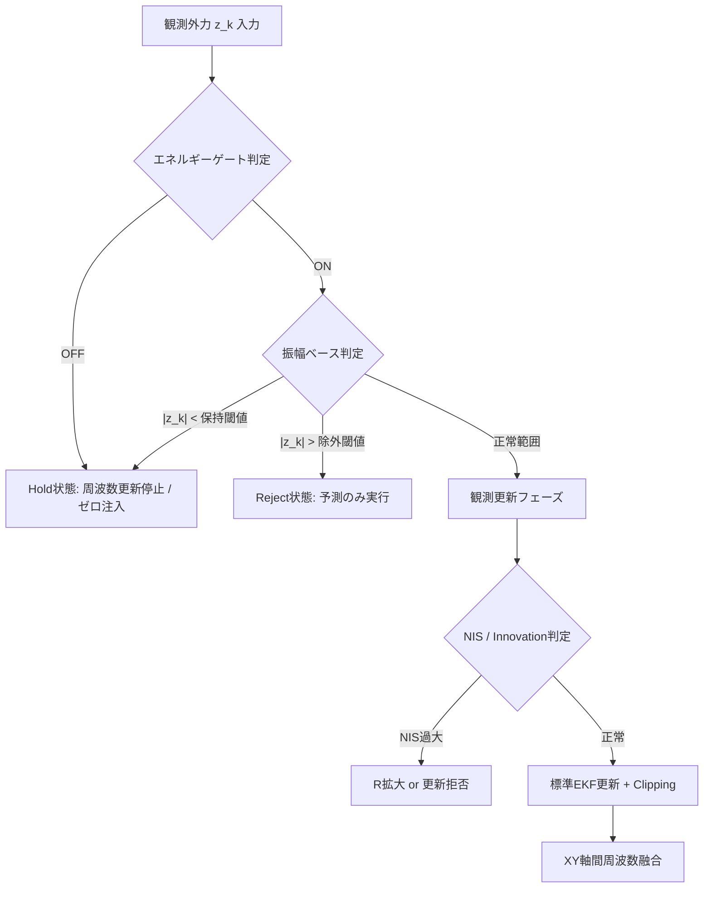

# AP_Observer: 外力推定から補正角生成までの数理アルゴリズム

最終更新: 2026-04

## 1. はじめに
本ドキュメントは、AP_Observer における「外乱力の推定」から「姿勢補正角の生成」までの数理アルゴリズムをまとめたものである。
ドローン（UAV）が荷物を吊り下げて飛行する際、荷物の揺れは機体に対して複雑な周期外乱を与える。本システムでは、この外乱を精度良く推定し、機体の傾きで補償するために**拡張カルマンフィルタ（EKF）**を採用している。

本稿では、まずカルマンフィルタの基本的な考え方を解説し、それを非線形システムへ拡張するロジック（EKF）を整理する。その上で、`AP_Observer` の実装がどのような数理的背景に基づいているかを解説する。

---

## 2. カルマンフィルタ（KF）の基礎理論

カルマンフィルタは、ノイズを含む観測データから、システムの内部状態を最適に推定するアルゴリズムである。

### 2.1 予測と更新のロジック
カルマンフィルタの核心は、**「予測（Predict）」**と**「更新（Update）」**の繰り返しにある。

1.  **予測ステップ**: 「現在の状態」と「物理法則」を用いて、次の瞬間の状態を予測する。このとき、時間の経過とともに予測の**不確かさ（誤差共分散 $P$）**は増大する。
2.  **更新ステップ**: 実際のセンサデータ（観測値 $z$）が得られたら、予測値との差（イノベーション）を計算する。**「予測の自信」と「センサの自信」を天秤にかけ（カルマンゲイン $K$）**、状態を修正する。これにより、不確かさは減少する。

### 2.2 線形カルマンフィルタの数式
システムが線形（行列の足し算・掛け算のみ）で記述できる場合、以下の式で表される。

#### ① 状態空間モデル
* **状態方程式**: $\mathbf{x}_{k} = \mathbf{F}_{k} \mathbf{x}_{k-1} + \mathbf{w}_{k-1}$
* **観測方程式**: $\mathbf{z}_{k} = \mathbf{H}_{k} \mathbf{x}_{k} + \mathbf{v}_{k}$
    * $\mathbf{F}$: 状態遷移行列、$\mathbf{H}$: 観測行列
    * $\mathbf{w} \sim \mathcal{N}(0, \mathbf{Q})$: プロセスノイズ（モデルの不確かさ）
    * $\mathbf{v} \sim \mathcal{N}(0, \mathbf{R})$: 観測ノイズ（センサの不確かさ）

#### ② 予測（Predict）
$$\hat{\mathbf{x}}_{k|k-1} = \mathbf{F}_k \hat{\mathbf{x}}_{k-1|k-1}$$
$$\mathbf{P}_{k|k-1} = \mathbf{F}_k \mathbf{P}_{k-1|k-1} \mathbf{F}_k^\top + \mathbf{Q}_k$$

#### ③ 更新（Update）
カルマンゲイン $K$ は、誤差共分散 $P$ と観測ノイズ $R$ の比率で決まる。
$$\mathbf{K}_k = \mathbf{P}_{k|k-1} \mathbf{H}_k^\top (\mathbf{H}_k \mathbf{P}_{k|k-1} \mathbf{H}_k^\top + \mathbf{R}_k)^{-1}$$
$$\hat{\mathbf{x}}_{k|k} = \hat{\mathbf{x}}_{k|k-1} + \mathbf{K}_k (\mathbf{z}_k - \mathbf{H}_k \hat{\mathbf{x}}_{k|k-1})$$
$$\mathbf{P}_{k|k} = (\mathbf{I} - \mathbf{K}_k \mathbf{H}_k) \mathbf{P}_{k|k-1}$$

---

## 3. 拡張カルマンフィルタ（EKF）への拡張

現実の物理現象は非線形であることが多い。状態方程式が $\mathbf{x}_{k+1} = f(\mathbf{x}_k)$ という非線形関数の場合、そのままでは行列演算（$\mathbf{F} \mathbf{P} \mathbf{F}^\top$）ができない。

### 3.1 局所線形化とヤコビアン
EKFでは、現在の推定値 $\hat{\mathbf{x}}$ の周りで関数を微分（1次テイラー展開）し、その瞬間の「傾き」で直線を引くことで近似する。
$$f(\mathbf{x}) \approx f(\hat{\mathbf{x}}) + \underbrace{\frac{\partial f}{\partial \mathbf{x}}\bigg|_{\hat{\mathbf{x}}}}_{\mathbf{F}_k} (\mathbf{x} - \hat{\mathbf{x}})$$
この偏微分行列 $\mathbf{F}_k$ を**ヤコビアン（ヤコビ行列）**と呼ぶ。

### 3.2 EKFの計算分担
* **状態の予測**: 正確さを期すため、**非線形な式 $f$ をそのまま計算**する。
* **誤差の伝播（$P$ の更新）**: 行列計算が必要なため、**ヤコビアン $\mathbf{F}_k$ を使って計算**する。

---

## 4. AP_Observer の状態モデル定義

### 4.1 状態ベクトル $\mathbf{x}$
外乱を「周期的な振動」＋「ゆっくり変わるオフセット」と捉え、以下の4状態を定義する。
$$\mathbf{x}_{k} = [d_k, \dot{d}_k, c_k, \omega_k]^\top$$

1.  **$d$ (振動位置)**: 外力の振動成分。仮想的なバネマス系の変位。
2.  **$\dot{d}$ (振動速度)**: $d$ の時間微分。
3.  **$c$ (DCバイアス)**: 重心ズレや定常風による一定方向の外力。
4.  **$\omega$ (角周波数)**: 振り子振動の速さ。時変パラメータとして推定する。

### 4.2 物理的イメージ
外力 $z$ は、振動成分 $d$ とバイアス $c$ の足し算として観測される。
$$z_k = d_k + c_k + \text{noise}$$
これに基づき、観測行列は $\mathbf{H} = [1, 0, 1, 0]$ となる。

---

## 5. 予測ステップ（実装詳細）

### 5.1 調和振動子モデルの導出

状態 $d_k$ は外力の振動成分を表し、その波形は正弦波 $d(t) = A\sin(\omega t + \phi)$ で近似できる。このとき、

$$
\dot d(t) = A\omega\cos(\omega t + \phi), \quad
\ddot d(t) = -A\omega^2\sin(\omega t + \phi) = -\omega^2 d(t)
$$

より、以下の2階線形微分方程式が得られる。

$$
\ddot d = -\omega^2 d
$$

すなわち、外力の振動成分は角周波数 $\omega$ の単振動としてモデル化される。

### 5.2 シンプレクティック・オイラー法の採用

上記の単振動 $\ddot{d} = -\omega^2 d$ を単純な離散化（前進オイラー法）で解くと、数値的にエネルギーが増大し発散する。本実装ではエネルギー保存特性に優れた**シンプレクティック・オイラー法**を採用している。
$$\dot d_{k+1} = \dot d_k - \Delta t_k \omega_k^2 d_k$$
$$d_{k+1} = d_k + \Delta t_k \dot d_{k+1}$$

### 5.3 状態遷移関数 $f(\mathbf{x}_k)$
速度更新を位置更新に代入して整理すると、以下の非線形状態遷移関数が得られる。
$$\mathbf{x}_{k+1} = f(\mathbf{x}_k) = \begin{bmatrix}
d_k + \Delta t_k(\dot d_k - \Delta t_k \omega_k^2 d_k) \\
\dot d_k - \Delta t_k \omega_k^2 d_k \\
c_k \\
\omega_k
\end{bmatrix}$$

### 5.4 ヤコビアン $\mathbf{F}_k$ の導出
上記 $f$ を各状態で偏微分すると、ヤコビアンは以下となる。
$$\mathbf{F}_k^{\text{exact}} = \begin{bmatrix}
1 - \Delta t_k^2\omega_k^2 & \Delta t_k & 0 & -2\Delta t_k^2\omega_k d_k \\
-\Delta t_k\omega_k^2 & 1 & 0 & -2\Delta t_k\omega_k d_k \\
0 & 0 & 1 & 0 \\
0 & 0 & 0 & 1
\end{bmatrix}$$
実装では $\Delta t_k$ が十分に小さいことから、2次項を無視した簡略化ヤコビアンを採用し、計算負荷を抑制している。

---

## 5. ロバスト化分岐 (実装の本質)

本推定器は標準EKFをそのまま適用せず、外乱振幅・エネルギー・異常値に応じた条件分岐を直列に適用する。全体のロジックフローを以下に示す。

これらの3つのゲートは、評価するドメイン（時間スケール・物理量・統計）と条件不成立時の挙動が異なる。
- **エネルギーゲート**：長期的な信号パワーを評価し、サイン波のゼロクロス時のチャタリングを防止する。ゲートOFF時は ω 更新を停止し、観測をゼロ注入する。
- **振幅ベースゲート**：瞬間の物理量の絶対値を閾値判定する。低振幅時は ω 更新停止＋ゼロ注入、高振幅（飽和・衝突）時は観測更新を完全拒否（Predict-only）する。
- **NIS判定**：統計的な予測との乖離（マハラノビス距離）を評価する。中程度の乖離では観測ノイズ R を適応的に拡大し、過大な乖離では観測更新を完全拒否する。

このように、時間的・物理的・統計的の3つの異なるフィルターを直列に施すことで、実機の過酷な環境下でも推定器の堅牢性を確保している。

### 5.1 エネルギー信頼度ゲート (Energy Reliability Gate)

低SNR環境での周波数推定の「迷走」を防ぐため、特定帯域のエネルギー量に基づいたヒステリシスゲートを設けている。

- **仕組み**:
  1. 高速帯域（0.8Hz）と低速帯域（0.25Hz）の差分 $\Delta z$ の二乗和を指数移動平均（EMA）で平滑化し、推定エネルギー $P_k$ とする。
  2. ヒステリシス閾値 $(\rho_{on},\rho_{off})$ により信頼フラグを更新。
  3. ゲートが **OFF** の間は、その軸の周波数 $\omega$ の状態更新を完全に凍結する。

*図：エネルギーゲートによる信頼度判定と周波数推定の安定化。低エネルギー区間（灰色）では周波数がホールドされている。*

**役割**: エネルギーゲートは、外乱が正弦波的な振動である場合に必ず現れる「ゼロクロス（振幅が瞬間的に0になる）」のタイミングでEKFがチャタリングするのを防ぐ。短時間の電力変動に惑わされず、数秒間の包絡線（指数的移動平均）を用いて「本当に振動が収まったか」を判断する。ゲートOFF時にはωの更新を凍結し、観測値を0に強制することで、ホワイトノイズに状態が引きずられるのを防ぐ。

### 5.2 振幅ベース保持・除外・ゼロ注入 (Amplitude Gating)

観測振幅 $|z_k|$ に直接基づいた強靭化処理を行う。

1. **保持（Hold）とゼロ注入（Zero Injection）**:
   - 条件: $|z_k|\le \zeta_h$ （`EKF_FHOLD`） またはエネルギーゲートOFF時。
   - 目的: 静止状態や極低振幅時の「ノイズへの過剰反応」を抑制する。
   - 処理: 周波数更新を停止し、さらに**観測値にゼロを注入 ($z_k \leftarrow 0$)** してカルマンフィルタを更新する。これにより、外乱成分（$d, \dot d$）を速やかに $0$ へ収束させる。
2. **除外（Reject）**:
   - 条件: $|z_k|\ge \zeta_r$ （`EKF_FREJ`）。
   - 目的: センサ飽和や衝突等の異常値による推定破綻を防止する。
   - 処理: 観測更新を完全に拒否（Predict-only）。状態 $\omega$ は直前の値を維持する。

*図：各軸の振幅に応じた周波数推定のON/OFF（SW）の切り替わり。*

**役割**: 振幅ベースゲートは、瞬間的な物理量の絶対値に基づく閾値判定である。
- **下限 (`force_hold_max`)**: 機体の微振動（モーター振動など）をノイズフロアとして除外し、誤推定を防止する。この領域では観測にゼロを注入し、状態を速やかに0へ収束させる。
- **上限 (`force_reject_min`)**: 衝突・突風など線形モデルが全く通用しない過大入力を物理量ベースで即座に遮断する。該当サンプルでは観測更新を完全に拒否し、状態方程式による予測のみを進める。

### 5.3 Innovation clipping と NIS判定

観測更新フェーズでは、残差（Innovation）の妥当性を評価する。

- **Innovation Clipping**: $r_k$ を最大値 $r_{max}$ で制限する。急激な外力変化に対しても状態変化を緩やかにし、オーバーシュートを抑制する。
- **NIS（Normalized Innovation Squared）に基づく適応的 $R$ 制御**:
  $$
  \nu_k = \frac{r_k^2}{S_k}
  $$
  $\nu_k$ が閾値 $\nu_{max}$ を超えた場合、観測ノイズ共分散 $R_k$ を $\nu_k/\nu_{max}$ 比率で拡大する。これにより「自信のない観測値」の反映度を自動的に下げ、推定の連続性を保つ。
- **強硬拒否**: $\nu_k$ がさらに過大な倍率（`EKF_RB_NIS`）を超えた場合は、Robust Update機能により更新自体をスキップする。

**役割**: NIS（正規化イノベーション二乗）判定は、物理的な絶対量ではなく「予測と実測のずれ (r_k) を、現在の推定不確かさ (S_k) で正規化した値（マハラノビス距離）」を評価する。これにより、振幅は正常範囲内でも、モデルが想定していない急峻なスパイクノイズや突発的な変化を統計的に検出する。中程度の外れ値に対しては観測ノイズ R を拡大して影響を抑制し、深刻な外れ値に対しては観測更新自体を拒否することで、推定の連続性を保つ。

## 6. 予測外力の生成

補正に使用する外力は現在値ではなく、予測ホライズン $\Delta p$ 先で評価する。Z軸に対する計算も予測式のみ適用する。

$$
d_{i, k+\Delta p} = d_{i, k} + \Delta p\,\dot d_{i, k}
$$
$$
\hat f_{i,k+\Delta p} = d_{i,k+\Delta p} + c_{i,k}
$$

したがって予測外力ベクトルは

$$
\hat{\mathbf{f}}_{k+\Delta p}=
\begin{bmatrix}
\hat f_{x,k+\Delta p}\\
\hat f_{y,k+\Delta p}\\
\hat f_{z,k+\Delta p}
\end{bmatrix}
$$

となる。

## 7. 補正角と補正クォータニオン

### 7.1 補正角の算出

予測外力ノルム $\|\hat{\mathbf{f}}\|$ が閾値 $f_{min}$ 未満なら補正はゼロとする。
それ以外では、補正ゲイン $k_c$ と機体質量 $m$ を用いてオイラー角を算出する（ヨー角は常にゼロ）。

$$
\phi = \mathrm{sat}\!\left(\frac{k_c}{m}\hat f_y,\,\phi_{max}\right),
\qquad
\theta = \mathrm{sat}\!\left(-\frac{k_c}{m}\hat f_x,\,\theta_{max}\right),
\qquad
\psi=0
$$

ここで $\mathrm{sat}(\cdot)$ は角度上限（`_max_correction_angle`）での飽和関数である。

### 7.2 クォータニオン化

得られたオイラー角 $(\phi,\theta,\psi)$ から補正クォータニオン $\mathbf{q}_c$ を生成し、正規化してフライトコントローラの姿勢制御ループへ出力する。

## 8. プログラム順アルゴリズム (要約)

1. モータースロットルと加速度センサから外力 $\mathbf{z}_k$ を構成（フィルタバイパス）。
2. 離陸判定と $\Delta t_k$ の計算。
3. Z軸をスキップし、X・Y軸に対してシンプレクティック・オイラー法でEKF予測。
4. 保持（Hold）・除外（Reject）・ゼロ注入条件を評価。
5. 許可された場合のみEKF観測更新（NaN防御機構付き）。
6. $\Delta p$ 先の予測外力 $\hat{\mathbf{f}}_{k+\Delta p}$ を算出（Z軸も含む）。
7. 予測外力から補正オイラー角 $(\phi,\theta,\psi)$ と補正クォータニオン $\mathbf{q}_c$ を生成。
8. ログ出力（カスタムフォーマット `OBSV`）。

## 9. 実務上の解釈

- 本推定器は、単純な「EKF一発更新」ではなく、運用上の異常値・低励振を含む条件分岐付き非線形推定器である。
- 特に前進オイラー法による数値発散を**シンプレクティック積分**で防ぎ、Z軸計算を破棄することでリソースと安定性を確保している。
- 低SNR領域での**ゼロ注入**、NaN時の**安全リセット**など、フェールセーフを中心とした安定化機構が設計の根幹をなしている。

## 10. 参考文献 (記法と構成の基準)

1. R. E. Kalman, "A New Approach to Linear Filtering and Prediction Problems," 1960.
2. EKF標準形式に基づく記述。
3. シンプレクティック幾何学と数値積分法の応用（調和振動子のエネルギー保存）。
