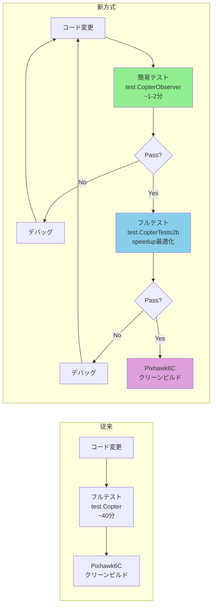

# オートテストワークフロー高速化計画

## 現状分析

### アーキテクチャ
```mermaid
flowchart TD
    A[autotest.py] --> B[tester_class_map]
    B --> C[test.Copter: AutoTestCopter->tests()]
    B --> D[test.CopterTests2b: AutoTestCopterTests2b->tests2b()]
    D --> E[TestObserverParameters]
    D --> F[TestObserverLogging]
    D --> G[TestObserverEKFOperation]
    D --> H[MotorVibration]
    D --> I[DynamicNotches]
    D --> J[...他19テスト]
```

### 発見事項

1. **`.clinerules` に簡易テストの記述あり**（73-83行）:
   ```bash
   # 簡易テスト（デフォルト）
   ./Tools/autotest/autotest.py --no-clean --skip-extra-hardware build.ArduCopter
   ```
   → `--skip-extra-hardware` は現在のautotest.pyに存在しない無効オプション

2. **`autotest.py` はロックファイル使用**（`buildlogs/autotest.lck`）:
   - 同時に1つのautotest.pyプロセスしか実行不可
   - 既存のテストグループ（test.CopterTests1a〜2b）は**逐次実行**
   - 各グループは独立したSITLインスタンスを起動

3. **個別サブテスト実行可能**:
   ```bash
   # test.Copter.TestObserverParameters のような記法で個別テスト実行可
   ```
   - `split_specific_test_step()` で解析
   - `run_specific_test()` でディスパッチ

4. **`--speedup=N` オプション**:
   - シミュレーション速度をN倍に設定
   - 既存の `tasks.json` では `--speedup=300` を使用

5. **既存の `tasks.json`**:
   - "Build & Test Mandatory SITL": `--speedup=300` で簡易テスト実行

6. **CPU: Ryzen 9950X (16C/32T), RAM: 128GB** → 高い並列性と速度upが可能

## 変更計画

### Step 1: 簡易テスト用クラス `AutoTestCopterTestsObserver` を作成

**ファイル**: [`Tools/autotest/arducopter.py`](Tools/autotest/arducopter.py)（末尾、既存サブクラス群の後）

```python
class AutoTestCopterTestsObserver(AutoTestCopter):
    def tests(self):
        return [
            self.TestObserverParameters,
            self.TestObserverLogging,
            self.TestObserverEKFOperation,
        ]
```

**ねらい**: Observer関連3テストのみを実行する軽量テストグループ。SITL起動〜テスト完了まで約1-2分。

### Step 2: `autotest.py` に新ステップを登録

**ファイル**: [`Tools/autotest/autotest.py`](Tools/autotest/autotest.py)

- [`tester_class_map`](Tools/autotest/autotest.py:345) に追加:
  ```python
  "test.CopterObserver": arducopter.AutoTestCopterTestsObserver,
  ```
- [`moresteps`](Tools/autotest/autotest.py:1101) に追加:
  ```python
  'test.CopterObserver',
  ```
- [`step_mapping`](Tools/autotest/autotest.py:1121) に追加（旧名との互換性）:
  ```python
  "fly.ArduCopterObserver": "test.CopterObserver",
  ```

### Step 3: 簡易テスト実行用スクリプト作成

**新規ファイル**: [`run_autotest_lite.sh`](run_autotest_lite.sh)

```bash
#!/bin/bash
# AP_Observer 簡易テスト - コード変更後のクイックチェック用
set -e
cd "$(dirname "$0")"
source venv/bin/activate

# SITLビルド（差分ビルド可）
./waf configure --board sitl
./waf build --target bin/arducopter

# Observerテストのみ実行
python3 ./Tools/autotest/autotest.py --no-clean --speedup=300 test.CopterObserver
```

### Step 4: フルオートテスト実行用スクリプト作成

**新規ファイル**: [`run_autotest_full.sh`](run_autotest_full.sh)

```bash
#!/bin/bash
# フルオートテスト - 本番反映前の最終確認用
set -e
cd "$(dirname "$0")"
source venv/bin/activate

# フルテスト実行
python3 ./Tools/autotest/autotest.py --no-clean --speedup=300 test.CopterTests2b
```

### Step 5: CI統合スクリプト作成

**新規ファイル**: [`run_ci_pipeline.sh`](run_ci_pipeline.sh)

```bash
#!/bin/bash
# CIパイプライン: 簡易テスト → フルテスト → Pixhawk6Cビルド
set -e
cd "$(dirname "$0")"

echo "=========================================="
echo "Step 1/3: SITL Build"
echo "=========================================="
source venv/bin/activate
./waf configure --board sitl
./waf build --target bin/arducopter

echo "=========================================="
echo "Step 2/3: Lite Autotest (Observer only)"
echo "=========================================="
./Tools/autotest/autotest.py --no-clean --speedup=300 test.CopterObserver

echo "=========================================="
echo "Step 3/3: Pixhawk6C Clean Build"
echo "=========================================="
./build_pixhawk6c.sh

echo "✅ CI Pipeline completed successfully!"
```

### Step 6: 高速化実験計画

Ryzen 9950X（16C/32T）+ 128GB RAMを活かすため、以下を実験:

#### 6a. `--speedup` 値の最適化実験

```bash
# speedup値を変えて各テストグループが安定動作する閾値を発見
for speed in 100 200 300 400 500 600 800 1000; do
    echo "Testing speedup=$speed"
    timeout 600 ./Tools/autotest/autotest.py --no-clean --speedup=$speed test.CopterObserver
done
```

**期待値**: 
- 低速テスト（GPS待ち等）は高speedupでタイムアウトする可能性
- Observerテストは高speedupでも安定する見込み（飛行シミュレーション軽め）

#### 6b. 並列実行実験

`autotest.py` のロック機構を回避して並列実行:

```bash
# 並列実行実験（ロックファイルをバイパス）
for group in test.CopterTests1a test.CopterTests1b test.CopterTests1c; do
    python3 ./Tools/autotest/autotest.py --no-clean --speedup=300 $group &
done
wait
```

**注意点**:
- 各グループは独立したSITLインスタンスを起動
- ポート衝突を避けるため自動インクリメントされる想定
- 16C/32T + 128GBなら4-6並列が現実的

### Step 7: `.vscode/tasks.json` 更新

```json
{
    "label": "Build & Test Lite (Observer)",
    "command": "bash run_autotest_lite.sh",
    "group": "test"
},
{
    "label": "Build & Test Full (tests2b)",
    "command": "bash run_autotest_full.sh",
    "group": "test"
},
{
    "label": "CI Pipeline (Lite → Full → Pixhawk6C)",
    "command": "bash run_ci_pipeline.sh",
    "group": "test"
}
```

### Step 8: `.clinerules` 更新

`autotest` セクションを以下のように書き換え:

```markdown
### オートテスト

#### 簡易テスト（AP_Observer変更時のクイックチェック）
```bash
source venv/bin/activate
./Tools/autotest/autotest.py --no-clean --speedup=300 test.CopterObserver
```

#### フルテスト（tests2bグループ: Observer + モーター/FFT/GPS等）
```bash
source venv/bin/activate
./Tools/autotest/autotest.py --no-clean --speedup=300 test.CopterTests2b
```

#### CIパイプライン（簡易テスト → フルテスト → Pixhawk6Cビルド）
```bash
./run_ci_pipeline.sh
```

**重要**: 
1. コード変更後はまず簡易テストで確認
2. 簡易テスト通過後にフルテストを実行
3. フルテスト通過後にPixhawk6Cクリーンビルド
4. `--speedup` 値は実験結果に基づき調整（デフォルト300）
```

## 実装手順まとめ

| # | ファイル | 変更内容 |
|---|---------|---------|
| 1 | [`arducopter.py`](Tools/autotest/arducopter.py) | `AutoTestCopterTestsObserver` クラス追加（3テストのみ） |
| 2 | [`autotest.py`](Tools/autotest/autotest.py) | `tester_class_map`, `moresteps`, `step_mapping` に新ステップ追加 |
| 3 | [`run_autotest_lite.sh`](run_autotest_lite.sh) | 新規作成 - 簡易テスト用スクリプト |
| 4 | [`run_autotest_full.sh`](run_autotest_full.sh) | 新規作成 - フルテスト用スクリプト |
| 5 | [`run_ci_pipeline.sh`](run_ci_pipeline.sh) | 新規作成 - CI統合スクリプト |
| 6 | [`tasks.json`](.vscode/tasks.json) | 3つのタスク追加 |
| 7 | [`.clinerules`](.clinerules) | オートテストセクションを最新化 |
| 8 | 実験 | speedup値の最適化 + 並列実行の可能性検証 |

## 高速化戦略まとめ



## 今後の実験項目

1. `--speedup` の最大安定値の特定（現在1000想定だが、テストごとに異なる可能性）
2. 並列実行時のポート競合の確認
3. メモリ使用量の監視（128GBあれば16並列も可能だが、SITL×4で実用的）
