# 共有周波数融合 (Shared Frequency Fusion) 廃止計画

## 概要

現在の AP_Observer では、X軸・Y軸それぞれの EKF で推定した周波数 (ω) を、重み付き平均・donor 平均・ハードモード/ソフトモード で融合・相互注入している。
この設計を廃止し、**各軸完全独立推定** に変更する。

## 削除対象の全体像

```mermaid
graph TD
    subgraph "削除する機能"
        A[compute_axis_fusion_weight]
        B[is_axis_enabled_in_fusion]
        C[ekf_shared_omega_rad]
        D[ekf_shared_weight_sum]
        E[ekf_shared_hard_mode]
        F[ekf_axis_weight]
        G[ekf_axis_trusted]
        H["パラメータ: EKF_AX_MASK"]
        I["パラメータ: EKF_HOLD_W"]
        J["パラメータ: EKF_SH_BETA"]
        K["パラメータ: EKF_SH_HWM"]
        L["パラメータ: EKF_SH_NIS"]
        M["estimated_frequency メンバ変数"]
        N["ログ Fフィールド (融合周波数)"]
    end

    subgraph "維持する機能"
        O["ekf_update_axis (各軸EKF)"]
        P["is_axis_frequency_trusted (軸品質)"]
        Q["エネルギーゲート (軸単位)"]
        R["振幅ベースゲート (軸単位)"]
        S["NIS判定 (軸単位)"]
    end

    A --> |削除| X[簡略化された ekf_update]
    B --> |削除| X
    C --> |削除| X
    D --> |削除| X
    E --> |削除| X
    F --> |削除| X
    G --> |削除| X
    H --> |削除| X
    I --> |削除| X
    J --> |削除| X
    K --> |削除| X
    L --> |削除| X
    M --> |削除| X
    N --> |削除| X[OBSVログからF削除、FX/FYのみ]

    O --> |維持| Y[各軸独立推定]
    P --> |維持| Y
    Q --> |維持| Y
    R --> |維持| Y
    S --> |維持| Y
```



## 変更内容 詳細

### 1. AP_Observer.h — 融合関連の宣言・変数・パラメータを削除

#### 削除する public メンバ

| メンバ | 行 | 理由 |
|-------|----|------|
| `float get_estimated_frequency() const` (実装のみ。宣言は72行目) | `.h:72` | 融合周波数ゲッター。削除し、各軸の周波数は `get_axis_estimated_frequency(axis)` で取得 |
| `set_ekf_axis_mask_for_replay(uint8_t)` | `.h:68` | 融合用リプレイセッター |
| `set_ekf_shared_blend_beta_for_replay(float)` | `.h:69` | 融合用リプレイセッター |

#### 削除する private メンバ変数

| 変数 | 型 | 行 | 備考 |
|------|----|----|------|
| `ekf_axis_weight[OBS_NUM_AXES]` | `float[]` | 130 | 融合重み |
| `ekf_axis_trusted[OBS_NUM_AXES]` | `uint8_t[]` | 131 | 融合信頼フラグ |
| `ekf_shared_omega_rad` | `float` | 137 | 共有周波数 [rad/s] |
| `ekf_shared_weight_sum` | `float` | 138 | 共有重み合計 |
| `ekf_shared_hard_mode` | `uint8_t` | 139 | ハードモードフラグ |
| `estimated_frequency` | `float` | 172 | 融合周波数。各軸独立のため不要に |

#### 削除する private パラメータ

| パラメータ | AP名 | インデックス | 行 | デフォルト値 |
|-----------|------|-------------|----|------------|
| `_ekf_axis_mask` | `EKF_AX_MASK` | 33 | 158 | 3 |
| `_ekf_hold_weight` | `EKF_HOLD_W` | 37 | 161 | 0.05f |
| `_ekf_shared_blend_beta` | `EKF_SH_BETA` | 38 | 162 | 0.5f |
| `_ekf_shared_hard_weight_min` | `EKF_SH_HWM` | 39 | 163 | 1.8f |
| `_ekf_shared_hard_nis_max` | `EKF_SH_NIS` | 40 | 164 | 1.0f |

※ パラメータインデックスは再利用せず、未使用のままにする（既存パラメータストレージ保全のため）

#### 削除する private 関数宣言

| 関数 | 行 | 理由 |
|------|----|------|
| `is_axis_enabled_in_fusion(uint8_t) const` | 179 | 融合専用 |
| `compute_axis_fusion_weight(uint8_t) const` | 180 | 融合専用 |

#### 維持する private 関数宣言

| 関数 | 行 | 理由 |
|------|----|------|
| `is_axis_frequency_trusted(uint8_t) const` | 178 | 純粋に軸単位の品質判定。独立した有用性を持つ |
| `ekf_update_axis(uint8_t, float, float)` | 177 | 各軸EKFのコア更新処理。変更なし |

### 2. AP_Observer.cpp — 融合関連の実装を削除し、各軸独立推定に変更

#### 2.1 パラメータテーブル (`var_info[]`)

以下の5エントリを削除：
- `AP_GROUPINFO("EKF_AX_MASK", 33, ...)` (行146-151)
- `AP_GROUPINFO("EKF_HOLD_W", 37, ...)` (行167-172)
- `AP_GROUPINFO("EKF_SH_BETA", 38, ...)` (行174-179)
- `AP_GROUPINFO("EKF_SH_HWM", 39, ...)` (行181-186)
- `AP_GROUPINFO("EKF_SH_NIS", 40, ...)` (行188-193)

#### 2.2 `ekf_init()` (行231-265)

削除する行：
```cpp
ekf_axis_weight[axis] = 0.0f;            // 行245
ekf_axis_trusted[axis] = 1U;             // 行246
estimated_frequency = init_omega / (2.0f * M_PI); // 行260
ekf_shared_omega_rad = init_omega;        // 行261
ekf_shared_weight_sum = 0.0f;            // 行262
ekf_shared_hard_mode = 0U;               // 行263
```

#### 2.3 `ekf_update()` (行349-506) — 最大の変更ポイント

現在の構造：
1. エネルギー帯域フィルタの適用 (行359-361)
2. 各軸 EKF 更新ループ (行363-374)
3. **共有周波数融合ブロック (行376-505)** ← **これ全体を削除**

新しい構造：
1. エネルギー帯域フィルタの適用（維持）
2. 各軸 EKF 更新ループ（維持：X・Y軸のみ）
3. `ekf_sample_count++`（維持）

**削除されるコードブロック（約130行）**：
- 行376-428: 重み計算・trustedカウント・donor集計ループ
- 行430-499: 共有注入条件分岐（beta/hard_mode判定、注入処理）
- 行501-504: 共有状態更新

#### 2.4 `compute_axis_fusion_weight()` (行307-347) — 関数ごと削除

#### 2.5 `is_axis_enabled_in_fusion()` (行1105-1117) — 関数ごと削除

#### 2.6 リプレイテスト関数の削除 (行1094-1096)

```cpp
void AP_Observer::set_ekf_shared_blend_beta_for_replay(float beta) { ... }
```
および対応するヘッダ宣言 (`.h:69`)。

※ `set_ekf_axis_mask_for_replay()` はヘッダでの宣言のみ削除。実装は cpp 内にあるか？→ 確認：`.h:68` で宣言、実装は cpp 行1090-1092。削除する。

#### 2.7 `update_prediction_cache()` (行836-839)

`estimated_frequency` 削除に伴い、X軸のω（`ekf_state[0][3]`）を使用するよう変更。

#### 2.8 `reset_frequency_estimation()` (行267-280)

`estimated_frequency` 削除に伴い、GCSメッセージ内の周波数表示を `_ekf_omega_init` からの計算値に変更。

#### 2.9 `Write_Observer_Log()` (行986-1012)

**OBSVフォーマット変更**：
```
変更前: "TimeUS,PLX,PLY,PLZ,PFX,PFY,PFZ,F,FX,FY,SW"
変更後: "TimeUS,PLX,PLY,PLZ,PFX,PFY,PFZ,FX,FY,SW"
                                           ^^^ 削除
```
- `F`（融合周波数）フィールドを削除
- `FX`（X軸周波数）, `FY`（Y軸周波数）は維持
- ログフォーマット文字列と `Write()` 呼び出しの引数から `estimated_frequency` を削除
- ラベルの `s` と単位の `F` を1文字ずつ削減

#### 2.10 `get_estimated_frequency()` (`.h:72`) — 削除

public ゲッター。各軸周波数は `get_axis_estimated_frequency(axis)` で取得可能なため不要。

#### 2.11 `is_axis_frequency_trusted()` (行282-305) — 維持

軸単位の品質判定関数。融合とは独立して有用。
ただし `ekf_axis_trusted[axis]` 配列は削除するため、この関数内の判定結果の格納先がなくなる。
→ この関数は純粋に `return` 文で真偽値を返すだけなので問題なし。呼び出し元が結果を使うだけ。

### 3. README.md — Section 6 (共有周波数融合) を削除

#### Section 6「XY軸の共有周波数融合」全文削除（行307-382）

現在の構成：
- 6. 共有周波数融合
  - 6.1 融合重みの算出
  - 6.2 共有周波数還元の詳細ロジック
    - 6.2.1 融合重みの再定義
    - 6.2.2 共有周波数の決定
    - 6.2.3 各軸への注入処理
    - 6.2.4 設計意図と注意点

#### ログフォーマット説明の更新

OBSVログの `F` フィールドに関する記述を削除（README内にOBSVフォーマットの明示的記述がある場合）。

#### セクション番号繰り上げ

| 変更前 | 変更後 | 備考 |
|-------|-------|------|
| Section 6 | 削除 | 共有周波数融合 |
| Section 7 | Section 6 | 予測外力の生成 |
| Section 8 | Section 7 | 補正角と補正クォータニオン |
| Section 9 | Section 8 | プログラム順アルゴリズム → Step 6削除、各軸独立を明記 |
| Section 10 | Section 9 | 実務上の解釈 |
| Section 11 | Section 10 | 参考文献 |

### 4. EKF_CSV_Replay.cpp — 融合関連のリプレイ設定を削除

削除する行（行680-681）：
```cpp
observer.set_ekf_shared_blend_beta_for_replay(cfg.has_ekf_sh_beta ? cfg.ekf_sh_beta : 0.0f);
observer.set_ekf_axis_mask_for_replay((uint8_t)MAX(0, cfg.has_ekf_axis_mask ? cfg.ekf_axis_mask : 3));
```

### 5. arducopter.py (autotest) — OBS_EKF_AX_MASK と Fフィールドのチェックを削除

#### TestObserverParameters (行7591-7641)

- `'OBS_EKF_AX_MASK': 3,` の行（7604）を削除

#### TestObserverLogging (行7643-7729)

- 期待フィールドから `'F'` を削除（行7683, 7705）
- `m.F` のチェックブロックを削除（行7690-7691, 7713-7725）
- 周波数範囲チェック（freq_values関連）を削除

#### TestObserverEKFOperation (行7733-7803)

- `m.F` のチェック（行7775-7778）を削除
- 周波数範囲チェック（行7788-7799）を削除、または `m.FX`/`m.FY` に変更

## ビルド・テスト計画

### ビルド手順
```bash
source venv/bin/activate
./waf configure --board sitl
./waf build --target bin/arducopter
```

### テスト手順
```bash
source venv/bin/activate
./Tools/autotest/autotest.py --no-clean --skip-extra-hardware build.ArduCopter
```

### テスト観点
1. コンパイルエラーが発生しないこと
2. `TestObserverParameters` がパラメータ変更に追従していること
3. `TestObserverLogging` で OBSV ログが正常に記録されること（F削除後もFX, FYあり）
4. `TestObserverEKFOperation` で EKF が発散せず動作すること

## 設計上の注意点

### 削除される OBSV ログの `F` フィールド
- 従来の `F`（融合周波数）は削除
- `FX`（X軸周波数）、`FY`（Y軸周波数）は維持されるため、各軸の周波数は個別に確認可能
- `get_estimated_frequency()` は削除。代わりに `get_axis_estimated_frequency(0)` / `get_axis_estimated_frequency(1)` を使用

### 維持される機能
- 各軸EKFのコア更新 (`ekf_update_axis`) — 変更なし
- エネルギーゲート、振幅ベースゲート、NIS判定 — 軸単位で維持
- `is_axis_frequency_trusted()` — 軸単位の品質判定として独立維持
